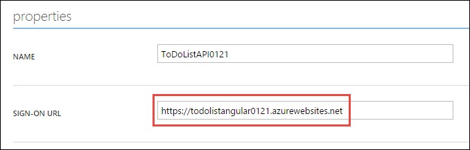
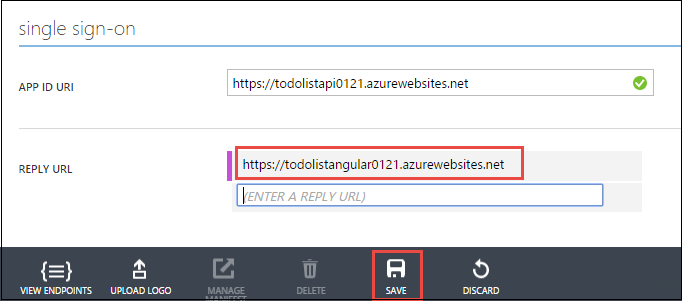

<properties
    pageTitle="使用者驗證的 API Azure 應用程式服務中的應用程式 |Microsoft Azure"
    description="瞭解如何保護 API 應用程式中 Azure 應用程式服務允許已驗證的使用者存取。"
    services="app-service\api"
    documentationCenter=".net"
    authors="tdykstra"
    manager="wpickett"
    editor=""/>

<tags
    ms.service="app-service-api"
    ms.workload="na"
    ms.tgt_pltfrm="dotnet"
    ms.devlang="na"
    ms.topic="article"
    ms.date="06/30/2016"
    ms.author="rachelap"/>

# 使用者驗證的 API Azure 應用程式服務中的應用程式

## 概觀

本文將示範如何保護 Azure API 應用程式，以便僅限通過驗證的使用者可以呼叫。 本文假設您已閱讀[Azure 應用程式服務驗證概觀](../app-service/app-service-authentication-overview.md)。

您將學習︰

* 如何設定驗證提供者，與 Azure Active Directory (Azure AD) 的詳細資料。
* 如何使用[Active Directory 驗證文件庫 (ADAL) 的 JavaScript](https://github.com/AzureAD/azure-activedirectory-library-for-js)取用受保護的 API 應用程式。

本文包含兩個區段︰

* [如何設定 Azure 應用程式服務中的使用者驗證](#authconfig)] 區段的一般說明如何設定使用者驗證的任何 API 應用程式，然後也同樣適用於所有應用程式服務，包括.NET、 Node.js，以及 Java 支援的架構。

* 您透過使用.NET 設定範例應用程式開始著手[繼續.NET API 應用程式教學課程](#tutorialstart)] 區段中，將文件輔助線後端和 AngularJS 正面結束，讓它使用 Azure Active Directory 針對使用者進行驗證。 

## 如何設定 Azure 應用程式服務中的 [使用者驗證

本節提供適用於任何 API 應用程式的一般指示。 步驟特定執行清單.NET 範例應用程式，請移至[繼續.NET 快速入門教學課程](#tutorialstart)。

1. 在[Azure 入口網站](https://portal.azure.com/)，瀏覽至您想要保護，尋找 [**功能**] 區段中，然後再按一下的 API 應用程式**設定**刀**驗證 / 授權**。

    

3. 在 [**驗證 / 授權**刀，按一下 [**上**。

4. 從**要求未經驗證時採取的動作**下拉式清單中選取其中一個選項。

    * 若要僅經過驗證的來電至達到 API 應用程式，請選擇其中一個**...登入**選項。 這個選項可讓您無須撰寫執行的程式碼保護 API 應用程式。

    * 如果您希望所有來電連絡您的 API 應用程式，請選擇 [**允許要求 （沒有巨集指令）**]。 您可以使用這個選項，將未經驗證的來電者驗證提供者的選擇。 使用此選項，您必須撰寫程式碼來處理授權。

    如需詳細資訊，請參閱[驗證和 Azure 應用程式服務中的 API 應用程式授權](app-service-api-authentication.md#multiple-protection-options)。

5. 選取一或多個**驗證提供者**。

    顯示要求所有 Azure AD 驗證的來電者的選項。
 
    

    當您選擇的驗證提供者時，入口網站設定刀中顯示的提供者。 

    說明如何設定驗證提供者設定刀的詳細指示，請參閱[如何設定您的應用程式服務應用程式，來使用 Azure Active Directory 登入](../app-service-mobile/app-service-mobile-how-to-configure-active-directory-authentication.md)。 （移至 Azure AD，相關文件的連結，但本身的文件包含連結至文件的其他驗證提供者的索引標籤）。

7. 當您完成驗證提供者設定刀時，按一下**[確定]**。

7. 在 [**驗證 / 授權**刀，按一下 [**儲存**]。

完成之後，應用程式服務會驗證所有 API 呼叫之前達到 API 應用程式。 驗證服務運作方式與支援服務應用程式，包括.NET、 Node.js，以及 Java 的所有語言相同。 

若要讓經過驗證的 API 呼叫，來電者會包含驗證提供者的 OAuth 2.0 承載者權杖 HTTP 要求授權標題中。 可以使用 [驗證提供者的 SDK 取得權杖。

## 繼續.NET API 應用程式教學課程

如果您追蹤的 API 應用程式的 Node.js 或 Java 教學課程，跳至下一個文章[service API 應用程式的本金驗證](app-service-api-dotnet-service-principal-auth.md)。 

如果您追蹤.NET 教學課程系列的 API 應用程式，並已部署範例應用程式時的[第一個](app-service-api-dotnet-get-started.md)和[第二個](app-service-api-cors-consume-javascript.md)教學課程中的指示，請跳至 [[設定應用程式服務和 Azure AD 驗證](#azureauth)] 區段。

如果您想要遵循此教學課程，不透過的第一個和第二個教學課程，請執行下列步驟說明如何開始使用自動化程序部署範例應用程式。

>[AZURE.NOTE] 下列步驟存取您的相同的起點為您所做的前兩個教學課程中，有一個例外狀況︰ Visual Studio 不會知道哪一個 web app 或每個專案取得部署到的 API 應用程式。 這表示您不能在本教學課程說明如何將部署到正確的目標的確切指示。 如果您不熟悉如何執行您自己的部署步驟，最好追蹤教學課程系列比若要開始進行此自動的部署程序的[第一個教學課程](app-service-api-dotnet-get-started.md)。

1. 請確定您有所有的[第一個教學課程](app-service-api-dotnet-get-started.md)中所列的先決條件。 除了所列的先決條件，這些驗證教學課程假設您曾使用應用程式服務 web 應用程式和 Visual Studio 和 Azure 入口網站的 API 應用程式。

2. 按一下 [**部署至 Azure** ] 按鈕，在要部署的 API 應用程式和 web 應用程式的[待辦事項清單範例存放庫讀我檔案](https://github.com/azure-samples/app-service-api-dotnet-todo-list/blob/master/readme.md)。 記下 Azure 資源取得所建立的群組，當您可以使用此更新查詢 web 應用程式和 API 應用程式名稱。
 
3. 下載或複製[的待辦事項清單範例存放庫](https://github.com/Azure-Samples/app-service-api-dotnet-todo-list)，以取得您將使用本機 Visual Studio 中的程式碼。

## 設定應用程式服務和 Azure AD 驗證

現在，您會有 Azure 應用程式服務中執行，而不需要驗證的使用者的應用程式。 在此區段中，您可以新增驗證來執行下列工作︰

* 設定為需要 Azure Active Directory (Azure AD) 驗證呼叫的中間層 API 應用程式的應用程式服務。
* 建立 Azure AD 應用程式。
* 若要傳送 AngularJS 前端登入後承載者權杖 Azure AD 應用程式設定。 

如果您追蹤的教學課程的指示時遇到問題，請參閱[疑難排解](#troubleshooting)在本教學課程結尾處。 
 
### 設定驗證的中間層 API 應用程式

1. 在[Azure 入口網站](https://portal.azure.com/)，瀏覽至您建立的 API 應用程式**設定**刀 ToDoListAPI 專案，尋找 [**功能**] 區段中，然後再按一下**驗證 / 授權**。

    

3. 在 [**驗證 / 授權**刀，按一下 [**上**。

4. 在**執行時要求未經驗證的動作**下拉式清單中，選取 [**登入 Azure Active Directory**。

    這個選項可確保沒有 unauathenticated 要求會達到 API 應用程式。 

5. 按一下 [**驗證提供者**， **Azure Active Directory**。

    

6. 在 [ **Azure Active Directory 設定**刀中，按一下 [ **Express**

    

    **Express**選項時，應用程式服務可以自動建立 Azure AD 應用程式，您 Azure AD[租用戶](https://msdn.microsoft.com/en-us/library/azure/jj573650.aspx#BKMK_WhatIsAnAzureADTenant)。 

    您不需要建立租用戶，因為每個 Azure 帳戶自動有的話。

7. 在 [**管理模式**，如果尚未選取，請按一下 [**建立新的 AD 應用程式**，並注意值的是 [**應用程式建立**文字] 方塊中。您會看到這個 AAD 應用程式在 Azure 傳統入口網站更新版本設定。

    

    Azure 會自動建立 Azure AD 應用程式與您 Azure AD 租用戶中指定的名稱。 根據預設，Azure AD 應用程式名稱為相同的 API 應用程式。 如果您想要的話，您可以輸入不同的名稱。
 
7. 按一下**[確定]**。

7. 在 [**驗證 / 授權**刀，按一下 [**儲存**]。

    ![按一下 [儲存]](./media/app-service-api-dotnet-user-principal-auth/authsave.png)

現在只有您 Azure AD 租用戶的使用者，才可以呼叫 API 應用程式。

### 可省略︰ 測試 API 應用程式

1. 在瀏覽器中移至 API 應用程式的 URL︰ 在**API 應用程式**會刀 Azure 入口網站中，按一下 [ **URL**] 下的 [連結。  

    您會重新導向至登入畫面因為達到 API 應用程式不允許未經驗證的要求。

    如果您的瀏覽器前往 「 已成功建立 」 的頁面，在瀏覽器可能已登上-在這種情況下，開啟 InPrivate 或 Incognito 視窗並移至 API 應用程式的 URL。

2. Azure AD 租用戶中的使用者使用的認證登入。

    當您登入時，「 已成功建立 」 頁面會顯示在瀏覽器中。

9. 關閉瀏覽器。

### Azure AD 應用程式設定

當您設定 Azure AD 驗證時，應用程式服務會為您建立 Azure AD 應用程式。 依預設新 Azure AD 已設定應用程式提供承載者權杖 API 應用程式的 URL。 本節中您要設定 Azure AD 應用程式提供承載者權杖 AngularJS 前端而不是直接至中間層 API 應用程式。 AngularJS 前端在呼叫 API 應用程式時，會傳送權杖 API 應用程式。

>[AZURE.NOTE] 若要保留程序，以盡可能簡單、 單一 Azure AD 此教學課程使用前端和中間兩者均適用的應用程式層 API 應用程式。 另一個選項是使用兩個 Azure AD 應用程式。 在此情況下，您必須授予前端的 Azure AD 應用程式權限呼叫中間層 Azure AD 應用程式。 此多重應用程式的方法可以讓您微調控制每一個層級的權限。

11. 在[Azure 傳統入口網站](https://manage.windowsazure.com/)中，移至**Azure Active Directory**。

    您必須使用 [傳統] 入口網站，因為您需要的存取權的 Azure Active Directory 設定目前尚不提供在目前的 Azure 入口網站。

12. 在 [**目錄**] 索引標籤中，按一下 [AAD 租用戶。

    

14. 按一下 [**應用程式 > 應用程式的公司擁有**，然後按一下 [核取記號。

    您也可能會重新整理頁面，才能看到新的應用程式。

15. 在應用程式清單中，按一下 [當您啟用驗證您的 API 應用程式為您建立 Azure 的項目名稱。

    ![Azure AD 應用程式] 索引標籤](./media/app-service-api-dotnet-user-principal-auth/appstab.png)

16. 按一下 [**設定**]。

    ![Azure AD 設定] 索引標籤](./media/app-service-api-dotnet-user-principal-auth/configure.png)

17. 設定**登入 URL** AngularJS web 應用程式，沒有斜線的 url。

    例如︰ https://todolistangular.azurewebsites.net

    

17. 設定**回覆 URL**到您的 web 應用程式，沒有斜線的 URL。

    例如︰ https://todolistsangular.azurewebsites.net

16. 按一下 [**儲存**]。

    

15. 在頁面底部，按一下 [**管理資訊清單 > 下載資訊清單**。

    

17. 將檔案下載到，您可以編輯的位置。

16. 在下載資訊清單的檔案，搜尋`oauth2AllowImplicitFlow`屬性。 從這個屬性的值變更`false`至`true`，然後儲存檔案。

    這項設定，才能從 JavaScript 單一頁面應用程式的存取權。 讓 URL 片段中傳回 Oauth 2.0 承載者權杖。

16. 按一下 [**管理資訊清單 > 上傳資訊清單**，然後上傳的檔案，您在上述步驟中的更新。

    

17. 複製**用戶端識別碼**值並將其儲存位置，就可以將它從更新版本。

## 設定為使用驗證 ToDoListAngular 專案

本節中您變更 AngularJS 前端，讓它使用 Active Directory 驗證文件庫 (ADAL) 的 JS 取得承載者權杖 Azure AD 的登入的使用者。 程式碼將包含權杖 HTTP 要求傳送給介，如下圖所示。 

請進行下列變更 ToDoListAngular 專案中的檔案。

1. 開啟*index.html*檔案。

2. 取消註解參照 Active Directory 驗證文件庫 (ADAL) JS 指令碼的線條。

        
        

1. 開啟*app/scripts/app.js*檔案。

2. 註解標示為 「 不驗證 」 的程式碼的區塊，並取消註解標示為 「 使用驗證 」 的程式碼的區塊。

    這項變更參照 ADAL JS 驗證提供者，並提供的設定值。 您可以在下列步驟設定您的 API 應用程式和 Azure AD 應用程式的設定值。

8. 在設定的程式碼`endpoints`變數，會設定為 API 應用程式的 URL API URL 您建立 ToDoListAPI 專案，並設定 Azure AD 應用程式識別碼至您從 Azure 傳統入口網站複製的用戶端識別碼。

    程式碼現在類似下面的範例。

        var endpoints = {
            "https://todolistapi0121.azurewebsites.net/": "1cf55bc9-9ed8-4df31cf55bc9-9ed8-4df3"
        };

9. 在通話中`adalProvider.init`、 設定`tenant`至您的租用戶的名稱和`clientId`您在上一個步驟中使用相同的值。

    程式碼現在類似下面的範例。

        adalProvider.init(
            {
                instance: 'https://login.microsoftonline.com/', 
                tenant: 'contoso.onmicrosoft.com',
                clientId: '1cf55bc9-9ed8-4df31cf55bc9-9ed8-4df3',
                extraQueryParameter: 'nux=1',
                endpoints: endpoints
            },
            $httpProvider
            );

    這些變更為`app.js`指定呼叫的程式碼，稱為的 API 位於相同的 Azure AD 應用程式。

1. 開啟*app/scripts/homeCtrl.js*檔案。

2. 註解標示為 「 不驗證 」 的程式碼的區塊，並取消註解標示為 「 使用驗證 」 的程式碼的區塊。

1. 開啟*app/scripts/indexCtrl.js*檔案。

2. 註解標示為 「 不驗證 」 的程式碼的區塊，並取消註解標示為 「 使用驗證 」 的程式碼的區塊。

### 部署 ToDoListAngular 專案至 Azure

8. 在**方案總管]**中，ToDoListAngular 專案，以滑鼠右鍵按一下，然後再按一下 [**發佈**]。

9. 按一下 [**發佈**]。

    Visual Studio 中部署專案，並開啟 web 應用程式的基本 url 瀏覽器。 這會顯示 403 錯誤頁面，這是標準的 [嘗試從瀏覽器移至 [網路 API 基底 URL。

    您仍然有中間層 API 應用程式進行變更，才能測試應用程式。

10. 關閉瀏覽器。

## 設定為使用驗證 ToDoListAPI 專案

目前 ToDoListAPI 專案傳送 「 * 」 為`owner`ToDoListDataAPI 值。 此區段中，您會變更程式碼，傳送登入的使用者識別碼。

請進行下列變更 ToDoListAPI 專案中。

1. 開啟*Controllers/ToDoListController.cs*檔案，並取消註解中設定的每個動作方法行`owner`Azure ad`NameIdentifier`宣告值。 例如︰

        owner = ((ClaimsIdentity)User.Identity).FindFirst(ClaimTypes.NameIdentifier).Value;

    **重要事項**︰ 不取消註解中的程式碼`ToDoListDataAPI`方法。您必須執行的更新版本服務本金驗證教學課程。

### 部署 ToDoListAPI 專案至 Azure

8. 在**方案總管]**中，ToDoListAPI 專案，以滑鼠右鍵按一下，然後再按一下 [**發佈**]。

9. 按一下 [**發佈**]。

    Visual Studio 中部署專案，並開啟瀏覽器的 API 應用程式的基本 url。

10. 關閉瀏覽器。

### 測試應用程式

9. 移至 web 應用程式，**使用不 HTTP HTTPS**的 URL。

8. 按一下 [**待辦事項清單**] 索引標籤。

    系統會提示您登入。

9. 認證登入您的 AAD 租用戶中的使用者。

10. **待辦事項清單]**頁面隨即出現。

    ![待辦事項清單] 頁面](./media/app-service-api-dotnet-user-principal-auth/webappindex.png)

    沒有任何待辦事項項目會顯示，因為到目前為止，所有已擁有者 」 * 」。 介現在要求登入的使用者，項目並無有尚未建立。

11. 加入新的待辦事項項目，以驗證應用程式正常運作。

12. 在另一個瀏覽器視窗中，移至 Swagger UI URL ToDoListDataAPI API 應用程式，然後按一下**ToDoList > 取得**。 輸入的星號`owner`參數，然後按一下 [**試試看出**。

    回覆會顯示新的待辦事項項目有實際 Azure AD [擁有人] 屬性中的使用者識別碼。

    

## 建置中從頭開始專案

兩個 Web API 專案所建立的範本**Azure API 應用程式**的專案，並以 ToDoList 控制器取代預設值控制站。 

如需有關如何建立 Web API 2 的後端 AngularJS 單一頁面應用程式的資訊，請參閱[手上實驗室︰ 建立單一頁面應用程式] 選項與 ASP.NET Web API 及 Angular.js](http://www.asp.net/web-api/overview/getting-started-with-aspnet-web-api/build-a-single-page-application-spa-with-aspnet-web-api-and-angularjs)。 瞭解如何新增 Azure AD 驗證碼的資訊，請參閱下列資源︰

* [保護 AngularJS 單一頁面應用程式搭配使用 Azure AD](../active-directory/active-directory-devquickstarts-angular.md)。
* [介紹 ADAL JS v1](http://www.cloudidentity.com/blog/2015/02/19/introducing-adal-js-v1/)

## 疑難排解

[AZURE.INCLUDE [troubleshooting](../../includes/app-service-api-auth-troubleshooting.md)]

* 請確定您請勿混淆 ToDoListAPI （中間層） 和 ToDoListDataAPI （資料層）。 例如，確認您新增中間層 API 應用程式時，不在資料層驗證。 
* 請確定 AngularJS 原始程式碼參考 （ToDoListAPI、 不 ToDoListDataAPI） 時，中間層 API 應用程式 URL] 與 [正確 Azure AD 用戶端識別碼 

## 後續步驟

在本教學課程您將學會如何使用應用程式服務驗證 API 應用程式，以及如何使用 ADAL JS 文件庫呼叫 API 應用程式。 在下一個教學課程中，您將學習如何[安全地存取您的服務-案例的 API 應用程式](app-service-api-dotnet-service-principal-auth.md)。

