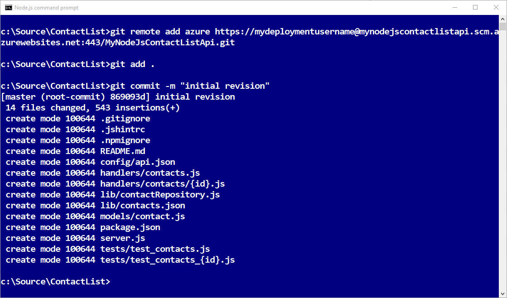
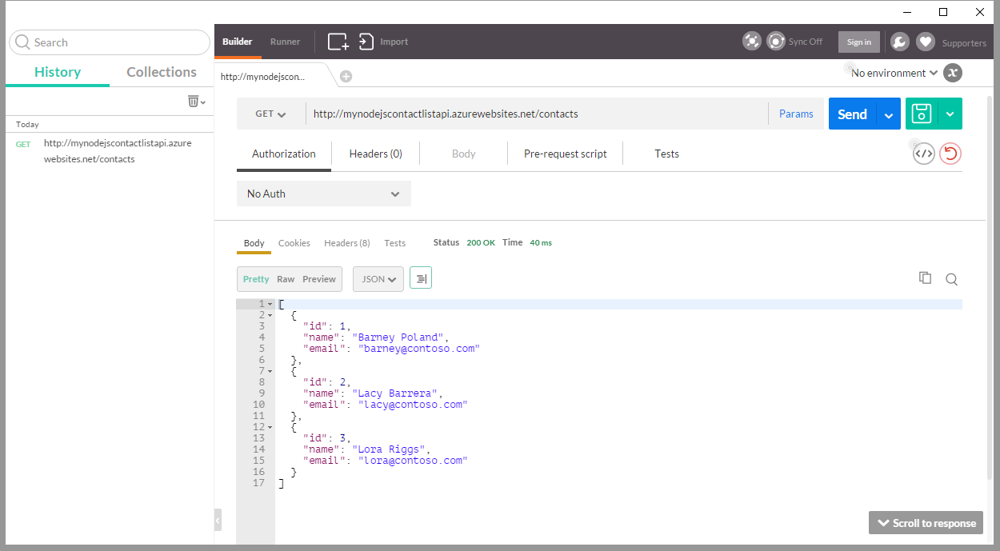

<properties
    pageTitle="Azure 應用程式服務中的 Node.js API 應用程式 |Microsoft Azure"
    description="瞭解如何建立 Node.js RESTful API，並將其部署至 API 應用程式中 Azure 應用程式服務。"
    services="app-service\api"
    documentationCenter="node"
    authors="bradygaster"
    manager="wpickett"
    editor=""/>

<tags
    ms.service="app-service-api"
    ms.workload="web"
    ms.tgt_pltfrm="na"
    ms.devlang="node"
    ms.topic="get-started-article"
    ms.date="05/26/2016"
    ms.author="rachelap"/>

# 建立 Node.js RESTful API，並將其部署至 Azure 中 API 應用程式

[AZURE.INCLUDE [app-service-api-get-started-selector](../../includes/app-service-api-get-started-selector.md)]

本教學課程中會顯示如何建立簡單[Node.js](http://nodejs.org) API，並將其部署到[Azure 應用程式服務](../app-service/app-service-value-prop-what-is.md)中的[API 應用程式](app-service-api-apps-why-best-platform.md)中，使用[給](http://git-scm.com)。 您可以使用任何作業系統，可執行 Node.js，而且您會使用命令列工具，例如 cmd.exe 所有工作或被。

## 必要條件

1. Microsoft Azure 帳戶 （[開啟免費的帳戶](https://azure.microsoft.com/pricing/free-trial/)）
1. 安裝[Node.js](http://nodejs.org) （此範例會假設您有 Node.js 版本 4.2.2）
2. [給](https://git-scm.com/)安裝
1. [GitHub](https://github.com/)帳戶

雖然應用程式服務支援多種方式將您的程式碼部署 API 應用程式，請本教學課程中顯示給方法，並假設您有如何使用給基本知識。 其他部署方法的相關資訊，請參閱[部署至 Azure 應用程式服務應用程式](../app-service-web/web-sites-deploy.md)。

## 取得程式碼範例

1. 開啟命令列介面，可以執行 Node.js] 及 [給] 命令。

1. 瀏覽至您可以使用本機給存放庫，及複製[GitHub 存放庫包含範例程式碼](https://github.com/Azure-Samples/app-service-api-node-contact-list)的資料夾。

        git clone https://github.com/Azure-Samples/app-service-api-node-contact-list.git

    範例 API 提供兩個端點︰ Get 要求`/contacts`JSON 格式會傳回的名稱和電子郵件地址清單時`/contacts/{id}`傳回選取的連絡人。

## Scaffold （自動產生） Node.js 程式碼會根據 Swagger 中繼資料

[Swagger](http://swagger.io/)是描述 RESTful 的 API 中繼資料的檔案格式。 Azure 應用程式服務有[內建支援 Swagger 中繼資料](app-service-api-metadata.md)。 教學課程的此區段模型 API 開發工作流程的方法，您可以先建立 Swagger 中繼資料，並使用的 scaffold （自動產生） 伺服器 api 的程式碼。 

>[AZURE.NOTE] 如果您不想要瞭解如何將 scaffold Node.js 從 Swagger 中繼資料檔案的程式碼，您可以略過此節。 如果您想要只部署至新的 API 應用程式的 [程式碼範例，直接移至 [[建立 Azure 中 API 應用程式](#createapiapp)] 區段。

### 安裝及執行 Swaggerize

1. 執行下列命令以全域安裝**yo**和**產生器 swaggerize** NPM 模組。

        npm install -g yo
        npm install -g generator-swaggerize

    Swaggerize 是產生伺服器的程式碼的 API Swagger 中繼資料檔案中所描述的工具。 將會用到的 Swagger 檔案名稱為*api.json* ，，位於您複製存放庫的 [*啟動*] 資料夾。

2. 瀏覽至 [*開始*] 資料夾，然後執行`yo swaggerize`] 命令。 Swaggerize 會詢問一系列的問題。  **什麼呼叫此專案**，輸入 「 ContactList 」，路徑**swagger 文件**、 輸入 「 api.json 」，及**Express，滿意或 Restify**，輸入 「 快速 」。

        yo swaggerize

    
    
    **注意**︰ 如果發生錯誤，在此步驟中下, 一個步驟會說明如何修正此問題。

    Swaggerize 建立應用程式] 資料夾、 scaffolds 處理常式和設定檔案，並產生**package.json**檔案。 快速檢視引擎用來產生 Swagger 說明頁面。  

3. 如果`swaggerize`命令失敗，並在 「 非預期的權杖 」 或 「 無效的逸出序列 」 錯誤，來編輯產生的*package.json*檔案修正錯誤的原因。 在 [`regenerate`行底下`scripts`，變更之前*api.json*斜線，以反斜線，使線條看起來像下列範例︰

        "regenerate": "yo swaggerize --only=handlers,models,tests --framework express --apiPath config/api.json"

1. 瀏覽至含有 scaffolded 的程式碼，（在此例中*/start/ContactList*子資料夾） 的資料夾。

1. 執行`npm install`。
    
        npm install
        
2. 安裝**jsonpath** NPM 模組。 

        npm install --save jsonpath
        
    

1. 安裝**swaggerize ui** NPM 模組。 

        npm install --save swaggerize-ui
        
    

### 自訂 scaffolded 的程式碼

1. [**啟動**] 資料夾**的文件庫**資料夾複製到 scaffolder 所建立的**ContactList**資料夾。 

1. 下列程式碼取代**handlers/contacts.js**檔案中的程式碼。 

    將此程式碼會使用 JSON 資料由**lib/contactRepository.js** **lib/contacts.json**檔案中儲存。 新的 contacts.js 程式碼回應 HTTP 要求取得的所有連絡人，然後將這些為 JSON 內容。 

        'use strict';
        
        var repository = require('../lib/contactRepository');
        
        module.exports = {
            get: function contacts_get(req, res) {
                res.json(repository.all())
            }
        };

1. 取代 fofllowing 程式碼中**handlers/contacts/{id}.js**檔案的程式碼。 

        'use strict';

        var repository = require('../../lib/contactRepository');
        
        module.exports = {
            get: function contacts_get(req, res) {
                res.json(repository.get(req.params['id']));
            }    
        };

1. 下列程式碼取代**server.js**中的程式碼。 

    使用註解，即可查看所做的變更，稱為 server.js 檔案所做的變更。 

        'use strict';

        var port = process.env.PORT || 8000; // first change

        var http = require('http');
        var express = require('express');
        var bodyParser = require('body-parser');
        var swaggerize = require('swaggerize-express');
        var swaggerUi = require('swaggerize-ui'); // second change
        var path = require('path');

        var app = express();

        var server = http.createServer(app);

        app.use(bodyParser.json());

        app.use(swaggerize({
            api: path.resolve('./config/api.json'), // third change
            handlers: path.resolve('./handlers'),
            docspath: '/swagger' // fourth change
        }));

        // change four
        app.use('/docs', swaggerUi({
          docs: '/swagger'  
        }));

        server.listen(port, function () { // fifth and final change
        });

### 使用本機執行 API 測試

1. 啟動和使用 Node.js 命令列可執行檔的伺服器。 

        node server.js

1. 當您瀏覽至**http://localhost:8000/連絡人**時，您會看到 JSON 輸出的連絡人清單 （或您系統提示您下載，視您的瀏覽器而定）。 

    

1. 當您瀏覽至**http://localhost:8000/連絡人 2**時，您會看到該識別碼值表示該連絡人。

    

1. **透過/swagger**端點提供 Swagger JSON 資料︰

    

1. 透過**/docs**端點提供在 Swagger ui。 在 Swagger ui 上，您可以使用以測試您的 API 的豐富的 HTML 用戶端功能。

    

## 建立新的 API 應用程式

在此區段中，您可以使用 Azure 入口網站 Azure 中建立新的 API 應用程式。 此 API 應用程式代表計算資源的 Azure 會提供給執行程式碼。 在稍後您會將您的程式碼部署到新的 API 應用程式。

1. 瀏覽至[Azure 入口網站](https://portal.azure.com/)。 

1. 按一下 [**新 > Web + Mobile > API 應用程式**。 

    

4. 輸入*azurewebsites.net*網域，例如 NodejsAPIApp 加上數字，使其具唯一性中是唯一的**應用程式的名稱**。 

    例如，如果名稱`NodejsAPIApp`，URL 會`nodejsapiapp.azurewebsites.net`。

    如果您輸入其他人已使用的名稱，您會看到紅色驚嘆號右邊。

6. 在**資源群組**] 下拉式清單，按一下 [**新增**]，然後在**新的資源群組名稱**輸入 「 NodejsAPIAppGroup 」 或其他名稱如果您想。 

    [資源群組](../azure-resource-manager/resource-group-overview.md)是 Azure 的資源，例如 API 應用程式、 資料庫及 Vm 的集合。 本教學課程，最好建立新的資源群組，因為，方便您將一次刪除所有 Azure 資源您建立的教學課程。

4. 按一下 [**應用程式服務方案/位置**]，然後按一下 [**建立新檔案**。

    

    在下列步驟，您可以建立新的資源群組的應用程式服務方案。 應用程式服務方案指定 API 應用程式會在執行計算資源。 例如，如果您選擇的免費層，API 應用程式上執行共用 Vm，某些付費層執行專用 Vm 上時。 應用程式服務方案的相關資訊，請參閱[應用程式服務方案概觀](../app-service/azure-web-sites-web-hosting-plans-in-depth-overview.md)。

5. 在**應用程式服務方案**刀中，輸入 「 NodejsAPIAppPlan 」 或另一個名稱如果您想要的話。

5. 在 [**位置**] 下拉式清單中，選擇您最接近的位置。

    此設定可以指定您的應用程式會以執行哪些 Azure 資料中心。 在此教學課程中，您可以選取任何區域，而且它顯著差異。 但生產應用程式，您想要盡可能接近用戶端存取其最小化[延遲](http://www.bing.com/search?q=web%20latency%20introduction&qs=n&form=QBRE&pq=web%20latency%20introduction&sc=1-24&sp=-1&sk=&cvid=eefff99dfc864d25a75a83740f1e0090)伺服器。

5. 按一下 [**價格層 > 檢視所有 > F1 免費**。

    在此教學課程，免費的價格層會提供足夠的效能。

    

6. 在**應用程式服務方案**刀中，按一下**[確定]**。

7. 在**API 應用程式**刀中，按一下 [**建立**。

## 設定給部署新的 API 應用程式

您會將認可發送給存放庫中 Azure 應用程式服務到 API 應用程式部署您的程式碼。 在本教學課程此區段中，您可以建立的認證及給存放庫，您可以使用部署 Azure 中。  

1. 建立您的 API 應用程式之後，按一下 [**應用程式服務 > {API 應用程式}**入口網站的首頁。 

    入口網站顯示**API 應用程式**和**設定**刀。

    

1. **設定**刀中，[**發佈**] 區段中，往下捲動，然後按一下**部署認證**。
 
3. 在**設定部署認證**刀中，輸入使用者名稱和密碼，然後再按一下 [**儲存**。

    您會使用這些認證發佈 Node.js 程式碼至您的 API 應用程式。 

    

1. 在 [**設定**刀中，按一下 [**部署來源 > 選擇來源 > 本機給存放庫**，然後按一下**[確定]**。

    

1. 一旦您就可以給存放庫建立刀變更，以顯示您作用中的部署。 存放庫為新項目，您會有在清單中沒有作用中的部署。 

    

1. 複製給存放庫 URL。 若要這麼做，導覽至刀新的 API 應用程式，查看刀 [**基本資訊**] 區段。 請注意 [**基本資訊**] 區段中的**給複製 URL** 。 當您將游標停留在此 URL 時，您會看到的圖示會將 URL 複製到剪貼簿右側。 按一下這個圖示，以複製 URL。

    

    **注意**︰ 您必須在下一節中的 URL，因此請務必儲存位置的時間就可以給複製。

現在，您有備份給存放庫的 API 應用程式，可以將程式碼推入到儲存機制 API 應用程式部署程式碼。 

## 將您的 API 程式碼部署至 Azure

此區段中，您建立的 API，包含您的伺服器程式碼的本機給存放庫，然後再您推程式碼從該存放庫至您先前建立的 Azure 中存放庫。

1. 複製`ContactList`資料夾，您可以使用新的本機給存放庫的位置。 如果您並未教學課程的第一個部分，複製`ContactList`從`start`資料夾。否則，請複製`ContactList`從`end`資料夾。

1. 在命令列工具中，瀏覽至新的資料夾，然後執行下列命令以建立新的本機給存放庫。 

        git init

     

1. 執行下列命令以新增給遠端的 API 應用程式的存放庫。 

        git remote add azure YOUR_GIT_CLONE_URL_HERE

    **附註**︰ 字串 「 YOUR_GIT_CLONE_URL_HERE 」 換成您自己您先前複製的給複製 URL。 

1. 執行下列命令以建立認可，其中包含所有的程式碼。 

        git add .
        git commit -m "initial revision"

    

1. 執行 [推入 Azure 的 [程式碼] 命令。 當您收到提示時輸入密碼時，請輸入您之前在 Azure 入口網站中建立的項目。

        git push azure master

    這樣會觸發的部署至您的 API 應用程式。  

1. 在瀏覽器中瀏覽回**部署**刀 API 應用程式，而您看到正在進行部署。 

    

    同時，命令列介面會反映您的部署中的狀態時，會發生。 

    

    完成部署後，**部署**刀會反映您的程式碼變更您的 API 應用程式的成功部署。 

## Azure 中執行的 API 使用測試
 
3. 在您的 API 應用程式刀**基本版**節中複製**URL** 。 

    

1. 使用 REST API 用戶端，例如郵差或 Fiddler （或網頁瀏覽器），提供 API 通話，這是您的連絡人的 URL `/contacts` API 應用程式的結束點。 Url`https://{your API app name}.azurewebsites.net/contacts`

    當您指向此端點發出 GET 要求時，您會收到 JSON 輸出 API 應用程式。

    

2. 在瀏覽器中，移至 [ `/docs` Azure 中執行時，嘗試 Swagger 使用者介面的結束點。

現在，您有固定的連續傳遞，您可以變更程式碼，然後將其部署到 Azure 中，只要將認可推入到您 Azure 給儲存機制。

## 後續步驟

現在您已成功建立 API 應用程式，並部署 Node.js API 程式碼。 下一個教學課程會顯示如何[使用 JavaScript 用戶端，使用 CORS API 應用程式](app-service-api-cors-consume-javascript.md)。
