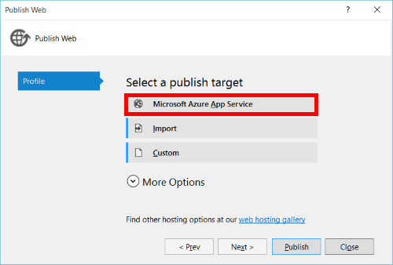

<properties
    pageTitle="變更內容的應用程式服務 API 應用程式-|Microsoft Azure"
    description="了解 Azure 應用程式服務中的 API 應用程式的新功能。"
    services="app-service\api"
    documentationCenter=".net"
    authors="mohitsriv"
    manager="wpickett"
    editor="tdykstra"/>

<tags
    ms.service="app-service-api"
    ms.workload="na"
    ms.tgt_pltfrm="na"
    ms.devlang="na"
    ms.topic="article"
    ms.date="06/29/2016"
    ms.author="rachelap"/>

# 變更內容的應用程式服務應用程式-API

在 2015 年 11 月中 Connect() 事件，Azure 應用程式服務的改良功能的數字的[宣告](https://azure.microsoft.com/blog/azure-app-service-updates-november-2015/)。 下列改良功能包括基礎變更更有效地對齊行動和 Web 應用程式、 減少概念計數及改善部署及執行階段效能的 API 應用程式。 啟動 2015 年 11 月 30 日，新的 API 應用程式，您可以建立使用 Azure 管理入口網站，或最新工具會反映這些變更。 本文將說明這些變更，以及如何重新部署以利用其功能的現有的應用程式。

## 功能變更
重要功能的 API 應用程式 – [驗證]、 [CORS 和 API 中繼資料 – 已移動直接將應用程式服務。 此變更，功能都可透過網頁、 行動電話及 API 應用程式。 事實上，三個共用相同的**Microsoft.Web/sites**資源類型資源管理員] 中。 不再需要或 API 應用程式提供的 API 應用程式閘道器。 這也可讓您更輕鬆地使用 Azure API 管理，因為會只單一的 API 管理閘道器。

主要設計原則 API 應用程式的更新後使用是，您可以將您的 API 之後，您所選擇的語言。  如果您的 API 已經部署為 Web App 或行動應用程式中，您不必重新部署您的應用程式，以善用新的功能。 如果您目前是在 API 應用程式的 preview，下列被詳細說明移轉指南。

### 驗證
現有監管 API 應用程式、 Mobile 服務應用程式和 Web 應用程式驗證功能有已整合以及可在管理入口網站中的單一 Azure 應用程式服務驗證刀。 在應用程式服務中的驗證服務簡介資訊，請參閱[展開應用程式服務驗證 / 授權](https://azure.microsoft.com/blog/announcing-app-service-authentication-authorization/)。

API 情況下，有幾個相關的新功能︰

- **使用直接 Azure Active Directory 的支援**，而不需要 exchange 工作階段權杖 AAD 權杖的用戶端程式碼︰ 您的用戶端可以只包含 AAD 權杖授權標頭中，根據承載者權杖規格。 這也表示沒有應用程式服務特定 SDK 需要用戶端或伺服器端。 
- **服務-服務或 「 內部 」 存取**︰ 如果您有精靈程序或不含介面 Api 的存取其他用戶端，您可以要求使用 AAD 服務主要的權杖，並將它傳遞給應用程式服務驗證您的應用程式。
- **延期授權**︰ 許多應用程式有限制存取不同的應用程式的不同部分。 也許您想一些 Api 可供公開，而有些則需要登入。 原始的驗證和授權功能是全，需要登入整個網站。 這個選項，仍然存在，，但您也可以讓應用程式碼之後應用程式服務已驗證的使用者轉譯存取決策。
 
如需有關新的 「 驗證 」 功能的詳細資訊，請參閱[驗證和 Azure 應用程式服務中的 API 應用程式授權](app-service-api-authentication.md)。 瞭解如何移轉現有 API 應用程式從先前的 API 應用程式模型新項目，請參閱[移轉現有 API 應用程式](#migrating-existing-api-apps)本文稍後的。
 
### CORS
而不是逗點分隔**MS_CrossDomainOrigins**應用程式設定，現在刀中沒有設定 CORS Azure 管理入口網站。 或者，可以將它設定使用 PowerShell 的 Azure、 CLI 或[資源檔案總管](https://resources.azure.com/)等工具的資源管理員。 設定的**Microsoft.Web/sites/config**資源類型**cors**屬性您**&lt;網站名稱&gt;/網頁**資源。 例如︰

    {
        "cors": {
            "allowedOrigins": [
                "https://localhost:44300"
            ]
        }
    } 

### API 中繼資料
API 定義刀現在已可使用跨網站、 行動電話及 API 應用程式中。 在 [管理] 入口網站中，您可以指定相對 url 或絕對 url 指向您的 API 該主機 Swagger 2.0 表示端點。 或者，可以將它設定使用資源管理員工具。 設定的**Microsoft.Web/sites/config**資源類型**apiDefinition**屬性您**&lt;網站名稱&gt;/網頁**資源。 例如︰

    {
        "apiDefinition":
        {
            "url": "https://myStorageAccount.blob.core.windows.net/swagger/apiDefinition.json"
        }
    }

此時的中繼資料端點必須驗證許多下游用戶端 （例如 Visual Studio REST API 用戶端產生及 PowerApps 」 新增 API 」 流程） 使用它不可以公開存取。 這表示如果您使用的應用程式服務驗證，並想要在您的應用程式本身的 API 定義的方式公開，您必須使用延後的驗證選項以便傳送至您 Swagger 中繼資料是公用稍早所述。

## 管理入口網站
選取**新增 > Web + 行動 > API 應用程式**入口網站中會建立反映本文所述的新功能的 API 應用程式。 **瀏覽 > API 應用程式**將只顯示這些新的 API 應用程式。 一旦您瀏覽至 API 應用程式，刀共用相同的版面配置和 Web 及行動應用程式的功能。 僅限差異是快速入門內容，並設定的順序。

現有的 API 應用程式 （或從邏輯應用程式建立的服務商場 API 應用程式） 上一個預覽功能仍會顯示在設計工具中的邏輯應用程式時瀏覽 [資源] 群組中的所有資源。

## Visual Studio

大部分工具的 Web 應用程式會使用新的 API 應用程式，因為他們共用相同的基礎**Microsoft.Web/sites**資源類型。 Azure Visual Studio 工具，不過，應該升級至新版 2.8.1 或更新版本因為它公開 Api 的特定功能的數字。 下載 SDK 從[Azure 下載頁面](https://azure.microsoft.com/downloads/)。

使用的應用程式服務類型使其合理化發佈也會在下整合**發佈 > Microsoft Azure 應用程式服務**:

若要進一步瞭解 SDK 2.8.1，閱讀[部落格文章](https://azure.microsoft.com/blog/announcing-azure-sdk-2-8-1-for-net/)的公告。

或者，您可以手動從匯入發佈設定檔若要啟用發佈的 [管理] 入口網站。 不過，雲端的檔案總管、 程式碼的產生及選取範圍建立方式 API 應用程式會要求 SDK 2.8.1 或更新版本。

## 移轉現有的 API 應用程式
如果您自訂的 API 部署至預覽舊版的 API 應用程式，我們會要求您將移轉至新的模型的 API 應用程式 2015 年 12 月 31 日前。 由於舊和新的模型都依據 Web Api 裝載於應用程式服務，大部分的現有的程式碼可重複使用。

### 管理並重新部署
重新部署的步驟並部署至應用程式服務的任何現有的 Web API 一樣。 步驟︰

1. 建立空白的 API 應用程式。 這可以在入口網站中的 [新增] > API 應用程式，在 Visual Studio 中從 [發佈]，或資源管理員工具。 如果使用的資源管理員工具或範本，**類型**值設定為**api**有導向根據 API 案例管理入口網站中的 [快速入門] 與 [設定**Microsoft.Web/sites**資源類型。
2. 連線，或使用任何支援的應用程式服務的部署機制的空白的 API 應用程式部署您的專案。 若要深入瞭解[Azure 應用程式服務部署文件](../app-service-web/web-sites-deploy.md)，請閱讀。 
  
### 驗證
應用程式服務驗證服務支援可供使用前一個 API 應用程式模型的相同功能。 如果您使用的工作階段權杖，需要 Sdk，請使用下列的用戶端和伺服器 Sdk:

- 用戶端︰ [Azure 行動用戶端 SDK](http://www.nuget.org/packages/Microsoft.Azure.Mobile.Client/)
- 伺服器︰ [Microsoft Azure 行動應用程式.NET 驗證副檔名](http://www.nuget.org/packages/Microsoft.Azure.Mobile.Server.Authentication/) 

如果您使用應用程式服務 alpha Sdk，這些是現在已遭取代︰

- 用戶端︰ [Microsoft Azure AppService SDK](http://www.nuget.org/packages/Microsoft.Azure.AppService)
- 伺服器︰ [Microsoft.Azure.AppService.ApiApps.Service](http://www.nuget.org/packages/Microsoft.Azure.AppService.ApiApps.Service)

特別與 Azure Active Directory，不過，沒有應用程式服務的需要。 如果您直接使用 AAD 權杖

### 內部存取
先前的 API 應用程式模型包含的內建的內部存取層級。 此所需使用 SDK 的簽署要求。 先前所述，新的 API 應用程式模型，AAD 服務原則可用的替代服務-服務驗證而不需要應用程式服務特定 SDK。 瞭解更多的[服務 Azure 應用程式服務中的 API 應用程式的本金驗證](app-service-api-dotnet-service-principal-auth.md)。

### 探索
先前的 API 應用程式模型必須 Api 探索在執行階段前相同閘道相同的 [資源] 群組中的其他 API 應用程式。 這是實作 microservice 模式的架構尤其有用。 雖然這不直接支援，為可用的幾個選項︰

1. 探索使用 Azure 資源管理員 API。
2. 將您的應用程式服務裝載 Api 前面 Azure API 管理。 Azure API 管理做為外觀，並可以提供穩定外部面對 url，即使您內部拓撲變更。
3. 建立您自己的探索 API 應用程式，並登錄探索上的應用程式啟動其他 API 應用程式。
4. 部署時，請將所有的 API 應用程式 （和用戶端） 的應用程式設定填入其他 API 應用程式的結束點。 這是可行範本部署中，因為 API 應用程式現在讓您控制的 url。

## 使用邏輯應用程式的 API 應用程式

新的 API 應用程式模型也搭配[邏輯應用程式結構描述版本 2015年-08-01](../app-service-logic/app-service-logic-schema-2015-08-01.md)。

## 後續步驟

若要深入瞭解，閱讀[API 應用程式的文件] 區段](https://azure.microsoft.com/documentation/services/app-service/api/)中的文章。 已更新以反映新的模型的 API 應用程式。 此外，請連絡其他詳細資料] 或 [指引移轉論壇上︰

- [MSDN 論壇](https://social.msdn.microsoft.com/Forums/en-US/home?forum=AzureAPIApps)
- [堆疊溢位](http://stackoverflow.com/questions/tagged/azure-api-apps)
