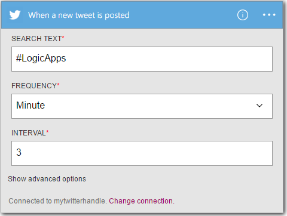

<properties
    pageTitle="建立邏輯應用程式 |Microsoft Azure"
    description="瞭解如何建立連線 SaaS 服務邏輯應用程式"
    authors="jeffhollan"
    manager="dwrede"
    editor=""
    services="logic-apps"
    documentationCenter=""/>

<tags
    ms.service="logic-apps"
    ms.workload="na"
    ms.tgt_pltfrm="na"
    ms.devlang="na"
    ms.topic="get-started-article"
    ms.date="10/18/2016"
    ms.author="jehollan"/>

# 建立新的邏輯應用程式連線 SaaS 服務

本主題會示範如何在幾分鐘，您可以快速入門[Azure 邏輯應用程式](app-service-logic-what-are-logic-apps.md)。 我們會逐步執行簡單的工作流程，可讓您感興趣的推文傳送電子郵件。

若要使用這個案例中，您需要︰

- Azure 的訂閱
- Twitter 帳戶
- 在 Outlook.com 或主控的 Office 365 信箱

## 建立新的邏輯應用程式以透過電子郵件傳送您推文

1. [Azure 入口網站的儀表板](https://portal.azure.com)上選取 [**新增**]。 
2. 在 [搜尋] 列中，搜尋 「 邏輯應用程式]，然後選取**邏輯應用程式**。 您也可以選取 [**新增****網頁 + 行動**]，然後選取**邏輯應用程式**。 
3. 輸入邏輯應用程式的名稱，選取位置]、 [資源] 群組中，然後選取 [**建立**]。  如果您選取 [**固定至儀表板**的邏輯應用程式會自動開啟一次部署。  
4. 第一次開啟邏輯應用程式之後您可以從範本開始選取。  現在按一下**空白的邏輯應用程式**中從頭開始建立此。 
1. 建立所需的第一個項目會觸發程序。  這是就會開始邏輯應用程式的事件。  搜尋 [觸發程序搜尋] 方塊中的 [ **twitter**並加以選取。
7. 現在您將輸入搜尋字詞來觸發上。  **頻率**與**間隔**會決定頻率邏輯應用程式會檢查新的推文 （和所有傳出 tweets 期間的時間範圍內的 return 鍵）。
    

5. 選取**新的步驟**] 按鈕，然後選擇 [**新增動作**] 或 [**新增條件**
6. 選取 [**新增動作**]，您可以搜尋從[可用的連接器](../connectors/apis-list.md)選擇的動作。 例如，您可以選取**Outlook.com-傳送電子郵件**從 outlook.com 地址傳送郵件︰  
    

7. 現在您可以填寫您想要的電子郵件的參數︰ 

8. 最後，您可以選取 [若要讓邏輯應用程式的 [**儲存**live。

## 管理您的邏輯應用程式建立後

現在您可以邏輯應用程式和使用。 它會定期檢查傳出 tweets 與輸入搜尋字詞。 當找到相符的推文時，它將傳送給您的電子郵件。 最後，您會看到如何停用應用程式，或它的進行方式。

1. 移至[Azure 入口網站](https://portal.azure.com)

1. 按一下 [在螢幕左側的 [**瀏覽**並選取**邏輯應用程式**。

2. 按一下您剛建立目前狀態和一般資訊，請參閱新增邏輯應用程式。

3. 若要編輯新的邏輯應用程式，請按一下 [**編輯**]。

5. 若要關閉應用程式，請按一下 [命令列中的 [**停用**]。

1. 檢視 [執行] 和 [觸發程序執行邏輯應用程式時要監視的歷程記錄]。  您可以按一下 [若要查看最新的資料的 [**重新整理**]。

5 分鐘內您就可以設定在雲端中執行簡單的邏輯應用程式。 若要進一步瞭解如何使用邏輯應用程式功能，請參閱[使用邏輯應用程式功能]。 若要瞭解的邏輯應用程式定義本身，請參閱[作者邏輯應用程式定義](app-service-logic-author-definitions.md)。

<!-- Shared links -->
[Azure portal]: https://portal.azure.com
[使用邏輯應用程式功能]: app-service-logic-create-a-logic-app.md
