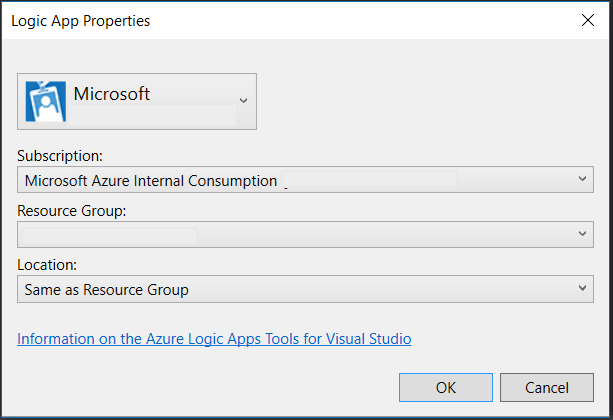

<properties 
    pageTitle="建立在 Visual Studio 中的邏輯應用程式 |Microsoft Azure" 
    description="在 Visual Studio 建立並部署邏輯應用程式中建立專案。" 
    authors="jeffhollan" 
    manager="erikre" 
    editor="" 
    services="logic-apps" 
    documentationCenter=""/>

<tags
    ms.service="logic-apps"
    ms.workload="integration"
    ms.tgt_pltfrm="na"
    ms.devlang="na"
    ms.topic="article"
    ms.date="10/18/2016"
    ms.author="jehollan"/> 
    
# 建立並部署 Visual Studio 中的邏輯應用程式

雖然[Azure 入口網站](https://portal.azure.com/)可讓您的絕佳方式來設計和管理您的邏輯應用程式，您也可以設計和改為部署從 Visual Studio 邏輯應用程式。  利用豐富的 Visual Studio 工具組可讓您使用設計工具邏輯應用程式，來設定任何部署和自動化的範本，及部署至任何環境，就會隨附邏輯應用程式。  

## 安裝步驟

以下是安裝及設定 Visual Studio 工具邏輯應用程式的步驟。

### 必要條件

- [Visual Studio 2015](https://www.visualstudio.com/downloads/download-visual-studio-vs.aspx)
- [最新的 Azure SDK](https://azure.microsoft.com/downloads/)（2.9.1 或更大）
- [Azure PowerShell](https://github.com/Azure/azure-powershell#installation)
- Web 時使用內嵌的設計工具的權限

### 邏輯應用程式安裝 Visual Studio 工具

一次您有安裝的先決條件 

1. 開啟 Visual Studio 2015 [**工具**] 功能表，然後選取**副檔名與更新**
1. 選取 [線上搜尋的 [**線上**] 類別
1. 若要顯示**的 Visual Studio Azure 邏輯應用程式工具****邏輯應用程式**中搜尋
1. 按一下 [**下載**] 按鈕下載並安裝副檔名
1. 安裝後重新啟動 Visual Studio

> [AZURE.NOTE] 您也可以直接從[這個連結](https://visualstudiogallery.msdn.microsoft.com/e25ad307-46cf-412e-8ba5-5b555d53d2d9)下載副檔名

一次安裝的是您可以使用邏輯應用程式設計工具中的 Azure 資源群組專案。

## 建立專案

1. 移至 [**檔案**] 功能表，然後選取 [**新增** >  **專案**（或者，您可以移至 [**新增]** ，然後選取 [將其新增至現有的方案的**新的專案**）︰ ![檔案] 功能表](./media/app-service-logic-deploy-from-vs/filemenu.png)

1. 在對話方塊中，尋找**雲端**，然後按一下**Azure 資源群組**。 輸入**名稱**，然後按一下**[確定]**。
    

1. 選取的**邏輯應用程式**範本。 這會建立空白的邏輯應用程式部署範本開始使用。
    

1. 一旦您已選取您的**範本**，請按**[確定]**。

    現在您邏輯應用程式的專案會新增至您的方案。 您應該會看到部署檔案總管] 中︰  

    

## 使用邏輯應用程式設計工具

一旦您有包含邏輯應用程式的 Azure 資源群組專案時，您可以開啟在 Visual Studio 可協助您建立工作流程設計工具。  設計工具才能查詢可用的屬性和資料連接器需要使用網際網路連線 （例如，如果使用 Dynamics CRM Online 連接器，設計工具會查詢 CRM 執行個體清單可用的自訂及預設內容）。

1. 以滑鼠右鍵按一下`<template>.json`檔案，並選取**邏輯應用程式的設計工具中開啟**(或`Ctrl+L`)
1. 選擇訂閱、 資源] 群組中及部署範本的位置
    - 請務必注意設計邏輯應用程式將會建立**API 連線**資源，在設計查詢的屬性。  選取資源群組會用來建立這些連線在設計階段資源群組。  您可以檢視或修改任何 API 連線移至 [Azure 入口網站，並瀏覽的**API 連線**。
    
1. 轉譯設計工具中的定義所根據`<template>.json`檔案。
1. 您現在可以建立及設計邏輯應用程式，然後變更將會更新部署範本中。
    

您也會看到`Microsoft.Web/connections`資源新增到資源檔案的任何函數將邏輯應用程式所需的連線。  可以部署時，設定與管理部署 Azure 入口網站中的**API 連線**之後這些連線屬性。

### 切換到 JSON 程式碼檢視

您可以選取切換 JSON 表示邏輯應用程式的設計工具] 的下方的 [**程式碼檢視**] 索引標籤。  若要切換回完整資源 JSON，以滑鼠右鍵按一下`<template>.json`檔案，然後選取 [**開啟**]。

### 儲存邏輯應用程式

您可以將儲存在任何時候透過 [**儲存**] 按鈕的邏輯應用程式或`Ctrl+S`。  如果您儲存次邏輯應用程式使用任何錯誤，其會顯示在 Visual Studio 的**輸出**視窗中。

## 部署邏輯應用程式

最後，設定您的應用程式之後，您可以直接從幾個步驟的 Visual Studio 部署。 

1. 在 [專案總管] 中以滑鼠右鍵按一下，然後移至**部署** > **新部署...**
    

2. 系統會提示您登入您的 Azure 訂閱。 

3. 現在，您需要選擇您想要部署邏輯應用程式的 [資源] 群組的詳細資料。 
    

     > [AZURE.NOTE]    請務必選取正確的範本和參數檔案資源群組 （例如如果您部署至生產環境您需要選擇生產參數檔案）。 
4. 選取 [部署] 按鈕
 
    
6. 部署的狀態會出現在 [**輸出**] 視窗 （您可能需要選擇**Azure 佈建**。 
    

在未來，您可以修改您在來源控制項中的邏輯應用程式，並使用 Visual Studio 中部署新的版本。 

> [AZURE.NOTE] 如果您直接修改 Azure 入口網站中的定義，則會覆寫下一次從 Visual Studio 中部署這些變更。

## 後續步驟

- 若要開始使用邏輯應用程式，請依照[建立邏輯應用程式](app-service-logic-create-a-logic-app.md)的教學課程。  
- [檢視一般範例與案例](app-service-logic-examples-and-scenarios.md)
- [您可以自動化商務程序，以邏輯應用程式](http://channel9.msdn.com/Events/Build/2016/T694) 
- [瞭解如何將您的系統整合邏輯應用程式](http://channel9.msdn.com/Events/Build/2016/P462)