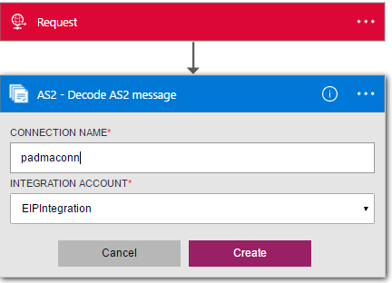

<properties 
    pageTitle="瞭解企業整合套件解碼 AS2 訊息 Connctor |Microsoft Azure 應用程式服務 |Microsoft Azure" 
    description="瞭解如何使用企業整合套件與邏輯應用程式合作夥伴" 
    services="logic-apps" 
    documentationCenter=".net,nodejs,java"
    authors="padmavc" 
    manager="erikre" 
    editor=""/>

<tags 
    ms.service="logic-apps" 
    ms.workload="integration" 
    ms.tgt_pltfrm="na" 
    ms.devlang="na" 
    ms.topic="article" 
    ms.date="08/15/2016" 
    ms.author="padmavc"/>

# 快速入門解碼 AS2 訊息

連線至建立時傳送郵件的安全性和可靠性解碼 AS2 訊息。 會提供數位簽章、 解密和通知透過郵件處理通知 (MDN)。

## 建立連線

### 必要條件

* Azure 帳戶。您可以建立的[免費的帳戶](https://azure.microsoft.com/free)

* 整合帳戶，才能使用解碼 AS2 郵件連接器。 如何建立[整合帳戶](./app-service-logic-enterprise-integration-create-integration-account.md)、[合作夥伴](./app-service-logic-enterprise-integration-partners.md)和[AS2 合約](./app-service-logic-enterprise-integration-as2.md)，請參閱詳細資料

### 連線到解碼 AS2 郵件使用下列步驟︰

1. [建立邏輯應用程式](./app-service-logic-create-a-logic-app.md)提供的範例。

2. 此連接器沒有任何引動程序。 您可以使用其他引動程序來啟動邏輯應用程式，例如要求觸發程序。  邏輯應用程式設計工具] 中新增觸發程序，並新增巨集指令。  選取 [顯示 Microsoft 受管理的 Api 在下拉式清單，然後在 [搜尋] 方塊中輸入 「 AS2 」。  選取 AS2 – 解碼 AS2 訊息

    

3. 如果您還沒有先前建立的任何整合帳戶的連線，系統會提示您連線詳細資料

    

4. 輸入整合帳戶的詳細資訊。  星號屬性所需

  	| 屬性   | 詳細資料 |
  	| --------   | ------- |
  	| 連線名稱 *    | 輸入您的連線任何名稱 |
  	| 整合帳戶 * | 輸入整合帳戶名稱。 請確定您的整合帳戶和邏輯應用程式會在相同的 Azure 位置 |

    完成之後，您連線的詳細資料看起來類似下列

    

5. 選取 [**建立**
    
6. 請注意，在建立連線。  現在，繼續邏輯應用程式中的其他步驟

     

7. 從要求輸出中選取本文和標題

     

## AS2 解碼執行下列動作

* 處理 AS2/HTTP 標頭
* 驗證簽章 （如果有設定）
* 解密郵件 （如果有設定）
* 解壓縮郵件 （如果有設定）
* 協調收到的 MDN 與原始的外寄郵件
* 更新，並產生關聯非拒絕資料庫中的記錄
* 將記錄 AS2 狀態報告
* 輸出裝載內容是 base64 編碼
* 決定是否 MDN 資格，是否應該同步 MDN 或非同步根據設定 AS2 合約
* 產生同步或非同步 MDN （根據合約設定）
* 設定 MDN 相互關聯權杖和屬性

##試試看您自己

為何不嘗試一下。 按一下[這裡](https://azure.microsoft.com/documentation/templates/201-logic-app-as2-send-receive/)部署自己使用邏輯應用程式 AS2 功能的完整作業邏輯應用程式 

## 後續步驟

[深入瞭解企業整合套件](./app-service-logic-enterprise-integration-overview.md "瞭解企業整合套件") 