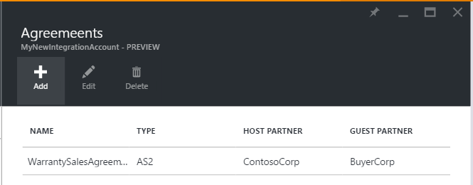
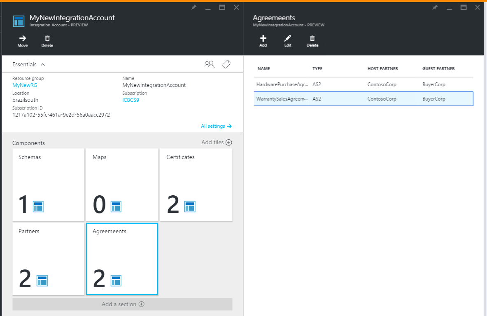

<properties 
    pageTitle="瞭解如何建立企業整合套件 AS2 合約" 
    description="瞭解如何建立企業整合套件 AS2 合約 |Microsoft Azure 應用程式服務" 
    services="logic-apps" 
    documentationCenter=".net,nodejs,java"
    authors="msftman" 
    manager="erikre" 
    editor="cgronlun"/>

<tags 
    ms.service="logic-apps" 
    ms.workload="integration" 
    ms.tgt_pltfrm="na" 
    ms.devlang="na" 
    ms.topic="article" 
    ms.date="06/29/2016" 
    ms.author="deonhe"/>

# AS2 企業整合

## 建立 AS2 合約
若要使用的企業功能邏輯應用程式中，您必須先建立合約。 

### 以下是您需要在您開始之前
- Azure 訂閱中定義的[整合帳戶](./app-service-logic-enterprise-integration-accounts.md)  
- 已經定義整合帳戶中的兩個以上[合作夥伴](./app-service-logic-enterprise-integration-partners.md)  

>[AZURE.NOTE]在建立合約時，合約檔案中的內容，必須符合合約類型。    

您已[建立整合帳戶](./app-service-logic-enterprise-integration-accounts.md)，並[新增合作夥伴](./app-service-logic-enterprise-integration-partners.md)之後，您可以建立協議，遵循下列步驟︰  

### 從 Azure 入口網站的首頁。

之後您登入[Azure 入口網站](http://portal.azure.com "Azure 入口網站")︰  
1. 選取 [**瀏覽**從左邊的功能表。  

>[AZURE.TIP]如果您沒有看到**瀏覽**] 連結，您可能需要先展開的功能表。 請執行下列動作，選取 [**顯示功能表**連結的位置在左上方的 [摺疊] 功能表。  

    
2. [篩選] 搜尋方塊中輸入*整合*，然後從結果清單中選取 [**整合帳戶**]。       
   
3. 在開啟的**整合帳戶**刀，選取您要在其中建立合約的整合帳戶。 如果您沒有看到任何整合帳戶清單，[建立第一個](./app-service-logic-enterprise-integration-accounts.md "All about integration accounts")。  
  
4.  選取 [**合約**磚。 如果您沒有看到 [合約] 方塊中，將其新增到第一次。   
   
5. 隨即會開啟合約刀中選取 [**新增**] 按鈕。  
  
6. 輸入您的合約的**名稱**，然後選取 [開啟合約刀中的 [**主機合作夥伴**、**主機身分識別**、**來賓合作夥伴**、**來賓身分識別**，]。  
  

以下是一些您可能會發現有幫助時設定您的合約之設定的詳細資料︰ 
  
|屬性|描述|
|----|----|
|Host （主機） 合作夥伴|合約必須主機 」 和 「 來賓合作夥伴。 Host （主機） 合作夥伴代表正在設定合約的組織。|
|Host （主機） 的身分識別|Host （主機） 合作夥伴識別碼。 |
|來賓合作夥伴|合約必須主機 」 和 「 來賓合作夥伴。 來賓合作夥伴代表組織執行商務主機合作夥伴處。|
|來賓身分識別|來賓合作夥伴識別碼。|
|接收設定|這些屬性套用至所有協議收到的郵件|
|傳送設定|這些屬性套用至所有協議所傳送的郵件|  
請繼續執行︰  
7. 選取要設定透過本合約所收到郵件的處理方式**接收設定**]。  
 
 - 或者，您可以覆寫內送的郵件中的屬性。 若要這麼做，請選取 [**覆寫郵件內容**] 核取方塊。
  - 如果您想要需要簽署的所有內送郵件，請選取**應簽署郵件**] 核取方塊。 如果您選取此選項時，您也必須選取**憑證**，將會用於驗證簽章的郵件]。
  - 或者，您可以要求以及加密的郵件。 若要這麼做，請選取**應該加密的郵件**] 核取方塊。 然後，您會需要選取**憑證**，將會用於解碼內送郵件。
  - 您也可以要求壓縮的郵件。 若要這麼做，請選取**要壓縮的郵件**] 核取方塊。  
  

如果您想要進一步瞭解哪些接收設定設為啟用，請參閱下表。  

|屬性|描述|
|----|----|
|覆寫郵件內容|選取此選項表示可覆寫收到的郵件中的屬性 |
|應簽署的郵件|啟用此選項可要求進行數位簽章的郵件|
|應該加密郵件|啟用這需要加密的郵件。 將拒絕非加密的郵件。|
|要壓縮的訊息|啟用這需要將壓縮的郵件。 非壓縮訊息會被拒絕。|
|MDN 文字|這是預設 MDN 傳送郵件的寄件者|
|傳送 MDN|啟用此選項可允許 MDNs 傳送。|
|傳送簽章 MDN|啟用這需要 MDNs 簽署。|
|麥克風演算法||
|傳送非同步 MDN|啟用這需要非同步傳送的郵件。|
|URL|這是郵件傳送到其中的 URL。|
現在，請繼續執行︰  
8. 選取 [**傳送設定**來設定透過本合約所傳送的郵件的處理方式。  
  

如果您想要進一步瞭解哪些傳送設定，讓，請參閱下表。  

|屬性|描述|
|----|----|
|啟用 [訊息簽章|選取此核取方塊，以啟用 [寄件者簽署合約的所有郵件。|
|麥克風演算法|選取要使用的訊息簽章演算法|
|憑證|選取要使用的訊息簽章的憑證|
|啟用郵件加密|選取此核取方塊，為加密所有郵件的寄件者本合約。|
|加密演算法|選取要在郵件加密中使用的加密演算法|
|展開 HTTP 標頭|選取此核取方塊，以展開 HTTP 內容類型標頭的單一行。|
|要求 MDN|啟用要求 MDN 從本合約所傳送的所有郵件的此核取方塊|
|要求登入 MDN|啟用要求所有傳送至本合約的 MDNs 登入|
|要求非同步 MDN|啟用要求非同步 MDN 傳送到本合約|
|URL|將會傳送 MDNs URL|
|啟用 NRR|選取此核取方塊，以啟用性回條|
我們快要完成了 ！  
9. 選取 [整合帳戶刀**合約**磚，然後您會看到最近新增的合約列]。  

