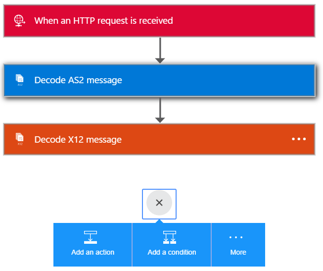

<properties 
    pageTitle="建立企業整合套件 B2B 解決方案 |Microsoft Azure 應用程式服務 |Microsoft Azure" 
    description="深入了解接收使用企業整合套件的 B2B 功能的資料" 
    services="logic-apps" 
    documentationCenter=".net,nodejs,java"
    authors="msftman" 
    manager="erikre" 
    editor="cgronlun"/>

<tags 
    ms.service="logic-apps" 
    ms.workload="integration" 
    ms.tgt_pltfrm="na" 
    ms.devlang="na" 
    ms.topic="article" 
    ms.date="07/08/2016" 
    ms.author="deonhe"/>

# 深入了解接收使用企業整合套件的 B2B 功能的資料#

## 概觀 ##

這份文件是邏輯應用程式企業整合套件的一部分。 請參閱若要深入瞭解[企業整合套件的功能](./app-service-logic-enterprise-integration-overview.md)概觀。

## 必要條件 ##

若要使用 AS2 及 X12 您將需要企業整合帳戶的動作

[如何建立企業整合帳戶](./app-service-logic-enterprise-integration-accounts.md)

## 如何使用邏輯應用程式 B2B 連接器 ##

一旦您已建立整合帳戶，並且加入合作夥伴和協議，以便您已準備好建立邏輯應用程式實作企業 (B2B) 工作流程。

在此 walkthru 中，您會看到如何使用 AS2 和 X12 建立企業邏輯應用程式貿易夥伴接收資料的動作。

1. 建立新邏輯應用程式並[連結至您的整合帳戶](./app-service-logic-enterprise-integration-accounts.md)。  
2. 將**收到要求-時 HTTP 要求**觸發程序新增至您的邏輯應用程式  
  
3. 新增**解碼 AS2**動作，以第一個選取**新增巨集指令**  
  
4. 在 [搜尋] 方塊中輸入 word **as2** ，才能篩選是您想要使用的所有動作  
  
6. 選取**AS2-解碼 AS2 郵件**動作  
  
7. 如下圖所示，將您帶**本文**做為輸入。 在此範例中，選取 [觸發邏輯應用程式 HTTP 邀請內文]。 或者，您可以輸入要輸入標題，在 [**標題**] 欄位中的運算式︰

    @triggerOutputs()['headers']

8. 新增**標題**所需的 AS2。 這些就會在 HTTP 要求的標頭。 在此範例中，選取 [HTTP 要求觸發邏輯應用程式的標題。
9. 現在新增解碼 X12 郵件動作，再次選取 [**新增動作**  
   
10. 在 [搜尋] 方塊中輸入 word **x12** ，才能篩選是您想要使用的所有動作  
  
11. 選取 [ **X12-解碼 X12 訊息**動作，將其新增至邏輯應用程式  
  
12. 您現在需要指定這個動作會是上述 AS2 巨集指令的輸出的輸入。 實際的郵件內容 JSON 物件中，而 base64 編碼。 因此，您需要輸入**X12 平面檔案訊息到解碼**輸入欄位中，輸入下列運算式，指定運算式  

    @base64ToString(body('Decode_AS2_message')?['AS2Message']?['Content'])  

13. 此步驟會解碼的 X12 資料收到來自交易夥伴，並且輸出 JSON 物件中的項目數目。 若要讓知道資料的回條的合作夥伴您可以傳送回包含 AS2 郵件處理通知 (MDN) HTTP 回應動作的回應  
14. 選取 [**新增動作**新增**回應**動作   
  
15. 在 [搜尋] 方塊中輸入 word**回應**，才能篩選是您想要使用的所有動作  
  
16. 選取所要新增**回應**動作  
  
17. 使用下列運算式從**解碼 X12 訊息**動作的輸出存取 MDN 設定回應**本文**欄位  

    @base64ToString(body('Decode_AS2_message')?['OutgoingMdn']?['Content'])  

  
18. 儲存您的工作  
  

此時，您已完成設定 B2B 邏輯應用程式。 實際的應用程式，您可能會想要儲存解碼的 X12 LOB 應用程式或資料儲存區中的資料。 您可以輕鬆地新增進一步的動作，請執行下列動作或寫入連線到您自己的 LOB 應用程式，並使用這些 Api 邏輯應用程式中的自訂 Api。

## 與使用案例 ##

- AS2 X12 解碼和編碼動作可讓您接收的資料，並傳送資料至交易合作夥伴使用業界標準通訊協定，使用邏輯應用程式  
- 您可以使用 AS2 和 X12 包含或不含彼此與交易的合作夥伴，視需要 exchange 資料
- B2B 動作輕鬆整合帳戶中建立夥伴與協議，及使用這些邏輯應用程式中  
- 延長您的邏輯應用程式的其他動作，您可以傳送和接收資料與其他應用程式和服務，例如 SalesForce  

## 深入瞭解 ##

[深入瞭解企業整合套件](./app-service-logic-enterprise-integration-overview.md)  