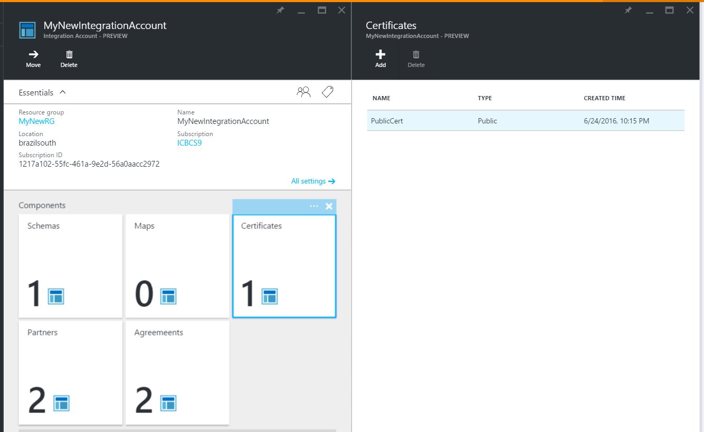
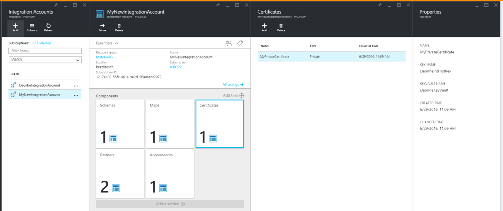

<properties
    pageTitle="使用憑證企業整合 pack |Microsoft Azure"
    description="瞭解如何使用企業整合套件與邏輯應用程式的憑證"
    services="logic-apps"
    documentationCenter=".net,nodejs,java"
    authors="msftman"
    manager="erikre"
    editor="cgronlun"/>

<tags
    ms.service="logic-apps"
    ms.workload="integration"
    ms.tgt_pltfrm="na"
    ms.devlang="na"
    ms.topic="article"
    ms.date="09/06/2016"
    ms.author="deonhe"/>

# 進一步瞭解憑證和企業整合套件

## 概觀
企業整合會使用憑證來保護 B2B 通訊。 在您的企業整合應用程式中，您可以使用兩種類型的憑證︰

- 公用憑證，必須先購買憑證授權單位 (CA)。
- 私人憑證，您也可以將自己發行。 這些憑證有時也稱為自我簽署憑證。

## 什麼是憑證？
憑證是數位文件的確認電子通訊中的參與者的身分識別，及，也會保護電子通訊。

## 為什麼要使用的憑證？
有時候您必須 B2B 通訊保持為機密。 企業整合會使用這些通訊兩種方法的安全性憑證︰

- 加密郵件的內容
- 以數位方式簽署的郵件  

## 您要如何上傳的憑證？

### 公用憑證
若要使用*公用憑證*B2B 功能邏輯應用程式中，您需要上傳至您的整合帳戶的憑證。 若要使用*自我簽署的憑證*，另一方面，您必須先上傳至[Azure 金鑰保存庫](../key-vault/key-vault-get-started.md "瞭解鍵保存庫")。

您上傳的憑證之後，則可協助您保護 B2B 郵件，您建立[合約](./app-service-logic-enterprise-integration-agreements.md)定義及其屬性時使用。  

以下是 Azure 入口網站登入之後，將您的公用憑證上傳至您的整合帳戶的詳細的步驟︰

1. 選取 [**瀏覽**]。  
      

2. 篩選搜尋方塊中，輸入**整合**，然後從 [結果] 清單中選取 [**整合帳戶**。     
    

3. 選取您要新增憑證的整合帳戶。  
      

4.  選取 [**憑證**] 方塊。  
    ![選取 [憑證] 方塊](./media/app-service-logic-enterprise-integration-certificates/certificate-1.png)

5. 在開啟的**憑證**刀，選取 [**新增**] 按鈕。
    ![選取 [新增] 按鈕](./media/app-service-logic-enterprise-integration-certificates/certificate-2.png)

6. 輸入您的憑證**名稱**，然後選取 [憑證類型。 （在此範例中，我們使用公用憑證類型）。按一下右側的 [**憑證**] 文字方塊中的 [資料夾] 圖示。

7. 檔案選擇器開啟時，尋找並選取您要上傳至您的整合帳戶的憑證檔案。

8. 選取憑證，，然後在檔案選擇器中選取**[確定]** 。 這會驗證並上傳至您的整合帳戶的憑證。

8. 最後，回到上**新增憑證**刀中，選取**[確定**] 按鈕。  
    ![選取 [確定] 按鈕](./media/app-service-logic-enterprise-integration-certificates/certificate-3.png)  

9. 在大約一分鐘，您會看到通知，表示憑證上傳已完成。

10. 選取 [**憑證**] 方塊。 您應該會看到最近新增的憑證。  
      

### 私人的憑證
您上傳私人憑證至您的整合帳戶採取下列步驟︰  

1. [上傳您私人的金鑰以鍵保存庫](../key-vault/key-vault-get-started.md "深入了解金鑰保存庫")。  

    > [AZURE.TIP] 您必須授權邏輯應用程式的功能鍵保存庫上執行作業的 Azure 應用程式服務。 您可以使用下列 PowerShell 命令授與存取邏輯應用程式服務主體︰`Set-AzureRmKeyVaultAccessPolicy -VaultName 'TestcertKeyVault' -ServicePrincipalName '7cd684f4-8a78-49b0-91ec-6a35d38739ba' -PermissionsToKeys decrypt, sign, get, list`  

2. 建立私人的憑證。  

3. 上傳至您的整合帳戶的私人憑證。

您已進行上述步驟之後，您可以使用私人憑證建立合約。

以下是 Azure 入口網站登入之後，將您私人的憑證上傳至您的整合帳戶的詳細的步驟︰  

1. 選取 [**瀏覽**]。  
        

2. 篩選搜尋方塊中，輸入**整合**，然後從 [結果] 清單中選取 [**整合帳戶**。     
      

3. 選取您要新增憑證的整合帳戶。  
      

4. 選取 [**憑證**] 方塊。  
    ![選取 [憑證] 方塊](./media/app-service-logic-enterprise-integration-certificates/certificate-1.png)  

5. 在開啟的**憑證**刀，選取 [**新增**] 按鈕。
    ![選取 [新增] 按鈕](./media/app-service-logic-enterprise-integration-certificates/certificate-2.png)

6. 輸入您的憑證**名稱**，然後選取 [憑證類型。 （在此範例中，我們使用公用憑證類型）。按一下右側的 [**憑證**] 文字方塊中的 [資料夾] 圖示。

7. 檔案選擇器開啟時，尋找並選取您要上傳至您的整合帳戶的憑證檔案。

8. 選取憑證後，請在檔案選擇器中選取**[確定]** 。 這個動作會驗證憑證，並將它上載整合帳戶。

9. 最後，回到上**新增憑證**刀中，選取**[確定**] 按鈕。  
      

10. 在大約一分鐘，您會看到通知，表示憑證上傳已完成。

11. 選取 [**憑證**] 方塊。 您應該會看到最近新增的憑證。
      

您上傳的憑證之後，則可協助您保護 B2B 郵件當您在[合約](./app-service-logic-enterprise-integration-agreements.md)定義及其屬性時使用。  

## 後續步驟
- [建立使用 B2B 功能邏輯應用程式](./app-service-logic-enterprise-integration-b2b.md)  
- [建立 B2B 合約](./app-service-logic-enterprise-integration-agreements.md)  
- [深入瞭解鍵保存庫](../key-vault/key-vault-get-started.md "深入了解金鑰保存庫")  
