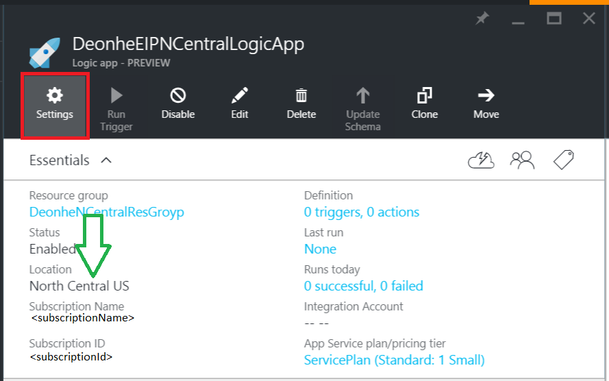
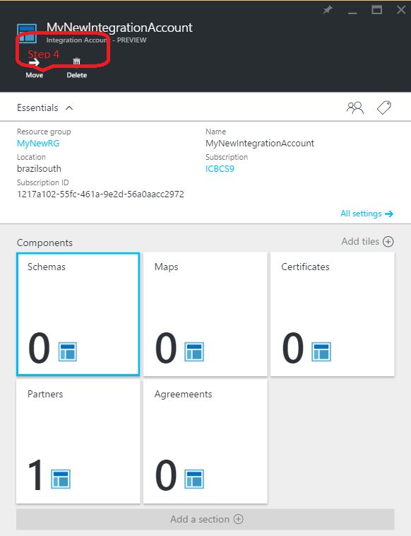

<properties 
    pageTitle="整合帳戶與企業整合套件概觀 |Microsoft Azure 應用程式服務 |Microsoft Azure" 
    description="瞭解關於整合帳戶所有、 企業整合套件及邏輯應用程式" 
    services="logic-apps" 
    documentationCenter=".net,nodejs,java"
    authors="msftman" 
    manager="erikre" 
    editor="cgronlun"/>

<tags 
    ms.service="logic-apps" 
    ms.workload="integration" 
    ms.tgt_pltfrm="na" 
    ms.devlang="na" 
    ms.topic="article" 
    ms.date="07/08/2016" 
    ms.author="deonhe"/>

# 整合帳戶的概觀

## 什麼是整合帳戶？
整合帳戶是 Azure 帳戶，讓企業整合應用程式來管理包含結構描述、 地圖、 憑證、 合作夥伴和合約的成品。 您建立的任何整合應用程式必須使用整合帳戶，才能存取的結構描述、 地圖或憑證，例如。

## 建立整合帳戶 
1. 選取 [**瀏覽**   
  
2. 在 [篩選] 搜尋方塊中輸入**整合**，然後從結果清單中選取 [**整合帳戶**     
   
3. 從在頁面頂端的功能表選取 [*新增*] 按鈕      
  
4. 輸入**名稱**，請選取您要使用**訂閱**[建立新的**資源群組**或選取現有的資源群組，選取一個**位置**整合帳戶會裝載於，選取 [**價格層**，然後選取 [**建立**] 按鈕的位置。   

  此時整合帳戶會提供您所選取的位置。 這樣就完成 1 分鐘內。    
  
5. 重新整理頁面。 您會看到您所列的新整合帳戶。 恭喜您 ！  
 

## 如何將整合客戶連結至邏輯應用程式
為了讓您存取地圖、 結構描述、 合約和位於整合帳戶中的其他成品的邏輯應用程式，您必須先連結整合帳戶邏輯應用程式。

### 以下是將整合客戶連結至邏輯應用程式的步驟 

#### 必要條件
- 整合帳戶
- 邏輯應用程式

>[AZURE.NOTE]確定您的整合帳戶和邏輯應用程式是在**同一個 Azure 位置**開始之前

1. 從邏輯應用程式功能表選取 [**設定**] 連結  
   
2. 從設定刀選取**整合帳戶**項目  
   
3. 選取您想要連結至您從 [**選取整合帳戶**的應用程式的下拉式清單方塊中的邏輯的整合帳戶  
   
4. 儲存您的工作  
   
5. 您會看到通知，指出整合帳戶有已連結至您的邏輯應用程式，以及整合帳戶中的所有成品都現在才能邏輯應用程式。  
   

現在，您整合的帳戶已連結至您的邏輯應用程式，您可以移至您的邏輯應用程式，並使用 XML 驗證、 一般檔案編碼/解碼或轉換等 B2B 連接器 B2B 功能與建立應用程式。  
    
## 如何刪除整合帳戶？
1. 選取 [**瀏覽**  
    
2. 在 [篩選] 搜尋方塊中輸入**整合**，然後從結果清單中選取 [**整合帳戶**     
   
3. 選取您想要刪除的**整合帳戶**  
  
4. 選取位於 [] 功能表上的 [**刪除**] 連結   
  
5. 確認您的選擇    

## 如何移動整合帳戶？
您可以輕鬆地移動整合帳戶，新的訂閱和新的資源群組。 如果您要移動整合帳戶，請遵循下列步驟︰

>[AZURE.IMPORTANT] 您需要更新所有指令碼，以移動整合帳戶之後，請使用新的資源識別碼。

1. 選取 [**瀏覽**  
    
2. 在 [篩選] 搜尋方塊中輸入**整合**，然後從結果清單中選取 [**整合帳戶**     
   
3. 選取您想要刪除的**整合帳戶**  
  
4. 選取] 功能表的**移動**的連結   
  
5. 確認您的選擇    

## 後續步驟
- [深入瞭解合約](./app-service-logic-enterprise-integration-agreements.md "瞭解企業整合合約")  

 