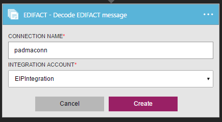
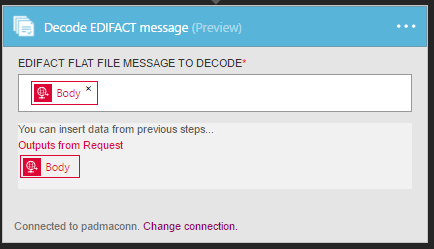

<properties 
    pageTitle="瞭解企業整合套件解碼 EDIFACT 訊息連接器 |Microsoft Azure 應用程式服務 |Microsoft Azure" 
    description="瞭解如何使用企業整合套件與邏輯應用程式合作夥伴" 
    services="logic-apps" 
    documentationCenter=".net,nodejs,java"
    authors="padmavc" 
    manager="erikre" 
    editor=""/>

<tags 
    ms.service="logic-apps" 
    ms.workload="integration" 
    ms.tgt_pltfrm="na" 
    ms.devlang="na" 
    ms.topic="article" 
    ms.date="08/15/2016" 
    ms.author="padmavc"/>

# 快速入門解碼 EDIFACT 訊息

驗證 EDI 及合作夥伴的特定屬性，產生每次交易組 XML 文件，並產生處理次交易的通知。

## 建立連線

### 必要條件

* Azure 帳戶。您可以建立的[免費的帳戶](https://azure.microsoft.com/free)

* 整合帳戶，才能使用解碼 EDIFACT 郵件連接器。 請參閱瞭解如何建立[整合帳戶](./app-service-logic-enterprise-integration-create-integration-account.md)、[合作夥伴](./app-service-logic-enterprise-integration-partners.md)和[EDIFACT 合約](./app-service-logic-enterprise-integration-edifact.md)詳細資料

### 連線到解碼 EDIFACT 郵件使用下列步驟︰

1. [建立邏輯應用程式](./app-service-logic-create-a-logic-app.md)提供的範例。

2. 此連接器沒有任何引動程序。 您可以使用其他引動程序來啟動邏輯應用程式，例如要求觸發程序。  邏輯應用程式設計工具] 中新增觸發程序，並新增巨集指令。  選取 [顯示 Microsoft 受管理的 Api 在下拉式清單，然後在 [搜尋] 方塊中輸入 「 EDIFACT 」。  選取解碼 EDIFACT 訊息

    
    
3. 如果您還沒有先前建立的任何整合帳戶的連線，系統會提示您連線詳細資料

      

4. 輸入整合帳戶的詳細資訊。  星號屬性所需

  	| 屬性 | 詳細資料 |
  	| -------- | ------- |
  	| 連線名稱 * | 輸入您的連線任何名稱 |
  	| 整合帳戶 * | 輸入整合帳戶名稱。 請確定您的整合帳戶和邏輯應用程式會在相同的 Azure 位置 |

    完成之後，您連線的詳細資料看起來類似下列

      

5. 選取 [**建立**

6. 請注意已建立連線

      

7. 選取要解碼 EDIFACT 一般檔案訊息

      

## EDIFACT 解碼會追蹤

* 解決合約相符的寄件者辨識符號與識別碼和接收者辨識符號與識別碼
* 分割到不同的單一郵件的多個交換。
* 驗證針對交易夥伴協議信封
* 分解交換。
* 驗證 EDI 及合作夥伴的特定屬性包括
    * 驗證的交換信封的結構。
    * 針對控制項結構描述信封的結構描述驗證。
    * 結構描述驗證訊息結構描述的交易設定資料項目。
    * 交易設定資料的項目上執行 EDI 驗證
* 確認交換] 群組中，與交易設定控制項數字不重複的項目 （如果有設定） 
    * 檢查先前收到交換針對交換控制項數字。 
    * 檢查針對交換中其他群組控制項數字的群組控制項編號。 
    * 檢查交易針對其他交易設定控制項中的數字該群組設定控制項的數字。
* 產生 XML 文件的每次交易組。
* 將整個交換轉換為 XML 
    * 為交易集-分割交換暫停交易集錯誤︰ 剖析交換到另一個 XML 文件中設定每次交易。 如果一或多個交易設定中交換失敗驗證]，然後 EDIFACT 解碼暫停只有這些交易集。 
    * 為交易集-分割交換暫停交換錯誤︰ 剖析交換到另一個 XML 文件中設定每次交易。  如果一或多個交易設定中交換失敗驗證]，然後 EDIFACT 解碼暫停整個交換。
    * 保留交換-暫停交易集錯誤︰ 建立 XML 文件的整批次交換。 EDIFACT 解碼暫停失敗驗證]，繼續處理所有其他的交易集時的交易集
    * 保留交換-暫停交換錯誤︰ 建立 XML 文件的整批次交換。 如果一或多個交易設定交換中無法驗證]，然後 EDIFACT 解碼暫停整個交換， 
* （如果有設定），會產生技術 （控制項） 及/或應答功能。
    * 技術的通知或 CONTRL ACK 報表完成收到交換語法檢查的結果。
    * 應答功能確認接受或拒絕收到的交換或群組

## 後續步驟

[深入瞭解企業整合套件](./app-service-logic-enterprise-integration-overview.md "瞭解企業整合套件") 