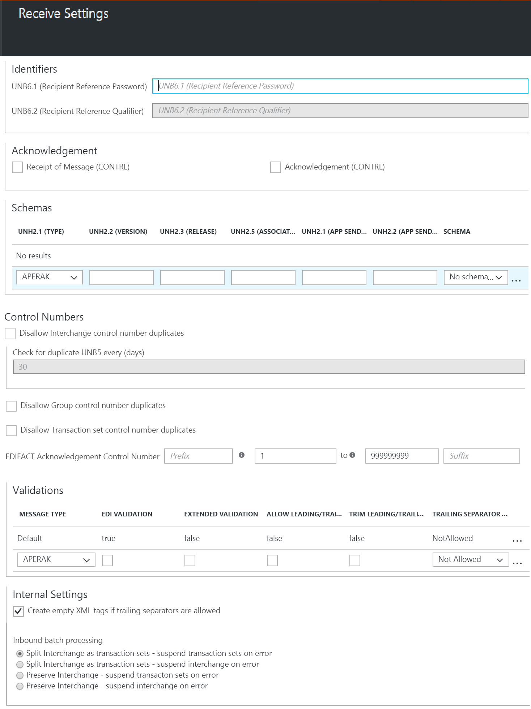

<properties 
    pageTitle="企業整合 EDIFACT |Microsoft Azure" 
    description="瞭解如何使用 EDIFACT 合約建立邏輯應用程式" 
    services="logic-apps" 
    documentationCenter=".net,nodejs,java"
    authors="jeffhollan" 
    manager="erikre" 
    editor="cgronlun"/>

<tags 
    ms.service="app-service-logic" 
    ms.workload="integration" 
    ms.tgt_pltfrm="na" 
    ms.devlang="na" 
    ms.topic="article" 
    ms.date="07/26/2016" 
    ms.author="jonfan"/>

# EDIFACT 企業整合 

> [AZURE.NOTE] 本頁面說明 EDIFACT 功能邏輯應用程式。 如需 X12 按一下[這裡](app-service-logic-enterprise-integration-x12.md)。

## 建立 EDIFACT 合約 
您可以交換 EDIFACT 郵件之前，必須先建立 EDIFACT 合約，並將其儲存在您的整合帳戶。 下列步驟會引導您完成建立 EDIFACT 合約的程序。

### 以下是您需要在您開始之前
- Azure 訂閱中定義的[整合帳戶](./app-service-logic-enterprise-integration-accounts.md)  
- 已經定義整合帳戶中的兩個以上[合作夥伴](./app-service-logic-enterprise-integration-partners.md)  

>[AZURE.NOTE]在建立合約時，郵件您會收到/傳送與合作夥伴內容必須符合合約類型。    

您已[建立整合帳戶](./app-service-logic-enterprise-integration-accounts.md)，並[新增合作夥伴](./app-service-logic-enterprise-integration-partners.md)之後，您可以建立 EDIFACT 合約遵循下列步驟︰  

### 從 Azure 入口網站的首頁。

之後您登入[Azure 入口網站](http://portal.azure.com "Azure 入口網站")︰  
1. 選取 [**瀏覽**從左邊的功能表。  

>[AZURE.TIP]如果您沒有看到**瀏覽**] 連結，您可能需要先展開的功能表。 請執行下列動作，選取 [**顯示功能表**連結的位置在左上方的 [摺疊] 功能表。  

    
2. [篩選] 搜尋方塊中輸入*整合*，然後從結果清單中選取 [**整合帳戶**]。       
    
3. 在開啟的**整合帳戶**刀，選取您要在其中建立合約的整合帳戶。 如果您沒有看到任何整合帳戶清單，[建立第一個](./app-service-logic-enterprise-integration-accounts.md "All about integration accounts")。  
  
4.  選取 [**合約**磚。 如果您沒有看到 [合約] 方塊中，將其新增到第一次。   
     
5. 隨即會開啟合約刀中選取 [**新增**] 按鈕。  
  
6. 輸入您的合約**名稱**然後選取**合約類型**EDIFACT、**主機合作夥伴**、**主機身分識別**、**來賓合作夥伴**、**來賓身分識別**，隨即會開啟合約刀。  
  
7. 您已設定合約內容後，請選取 [**接收設定**]，來設定透過本合約所收到郵件的處理方式。  
8. 下列各節，包括識別項、 通知、 結構、 控制項數字、 驗證、 內部設定和批次處理分成接收設定控制項。 設定根據您的合約，合作夥伴與您的郵件會將交換這些屬性。 以下是這些控制項的檢視，根據您想要找出並處理內送郵件本合約移轉的方式來設定︰  
  
9. 選取 [**確定**] 按鈕，儲存您的設定]。  

### 識別項

|屬性|描述 |
|---|---|
|UNB6.1 （收件者的參考密碼）|輸入範圍 1 和 14 的字元之間英數字元數值。|
|UNB6.2 （收件者的參考辨識符號）|輸入一個字元的最小值與最大值的兩個字元的英數字元的值。|

### 通知 

|屬性|描述 |
|----|----|
|接收訊息 (CONTRL)|選取此核取方塊，以傳回技術的 (CONTRL) 認可交換寄件者。 根據合約傳送設定交換寄件者傳送通知。|
|通知 (CONTRL)|選取此核取方塊，以返回 (CONTRL) 應答功能交換寄件者確認會傳送至根據合約傳送設定交換寄件者]。|

### 結構描述

|屬性|描述 |
|----|----|
|UNH2.1 （類型）|選取交易設定類型。|
|UNH2.2 （版本）|輸入訊息版本號碼。 （最小值、 一個字元; 最大值，三個字元）。|
|UNH2.3 （發行版本）|輸入訊息版本號碼。 （最小值、 一個字元; 最大值，三個字元）。|
|UNH2.5 （相關聯指派程式碼）|輸入已指派的程式碼。 （最大值] 六個字元。 必須是英數字元）。|
|UNG2.1 (應用程式寄件者 ID)|輸入一個字元的最小值與最大值 35 字元的英數字元的值。|
|UNG2.2 （應用程式寄件者的程式碼辨識符號）|輸入英數字元的值，以四個字元的最大值。|
|結構描述|選取您想要使用整合帳戶相關聯的先前上傳的結構描述。|

### 控制項的數字

|屬性|描述 |
|----|----|
|不允許交換控制號碼重複項目|選取此核取方塊，以封鎖重複交換。 如果選取，EDIFACT 解碼動作會檢查有收到交換交換控制項編號 (UNB5) 不相符先前處理的交換控制項數字。 如果偵測到相符項目，然後在交換不會處理。
|檢查重複 UNB5 每個 （天）|如果您選擇不允許重複交換控制項數字，您可以指定的天數，檢查**重複 UNB5 每個 （天） 的核取**選項提供適當的值。|
|不允許群組控制項的數字重複項目|選取此核取方塊，以封鎖交換重複群組控制項數字 (UNG5)。|
|不允許交易設定控制項數字重複項目|選取此核取方塊，以封鎖交換重複的交易設定控制項數字 (UNH1)。|
|EDIFACT 認可控制項編號|若要指定交易設定參照數字，用於通知中，輸入值前置詞、 範圍參照數字，以及尾碼。|

### 驗證

|屬性|描述 |
|----|----|
|訊息類型|指定的郵件類型。 完成每個驗證資料列，另一個就會自動新增。 如果指定的規則，然後列標示為預設會用於驗證。|
|EDI 驗證|選取此核取方塊，以執行 EDI 驗證所定義的結構描述、 長度限制、 空白資料元素，以及結尾分隔符號 EDI 屬性的資料類型。|
|延伸的驗證|選取此核取方塊，以啟用接收交換寄件者傳來之交換的延伸 (XSD) 驗證。 這包含驗證欄位長度]、 [選擇性，以及 [除了 XSD 資料型別驗證重複次數。|
|允許前置/結尾的零|選取 [**允許**]，允許前置/結尾的零。不允許前置/結尾的零或**修剪**修剪前置及結尾**NotAllowed**歸零。|
|修剪前置/結尾的零|選取此核取方塊，以修剪任何前置或結尾的零|
|結尾的分隔符號原則|如果您不想在從交換寄件者收到交換允許結尾的分隔符號和分隔符號，請選取 [**不允許**]。 如果交換包含結尾的分隔符號和分隔符號，宣告無效。 選取 [**選擇性**接受交換包含或不含結尾的分隔符號和分隔符號]。 如果收到的交換必須包含結尾的分隔符號和分隔符號，請選取 [**強制**]。|

### 內部設定

|屬性|描述 |
|----|----|
|如果結尾的分隔符號允許，建立空白的 XML 標記|選取此核取方塊，以包含空白的 XML 標記的結尾的分隔符號交換寄件者。|
|輸入批次處理|選項包括︰  **為交易集-分割交換暫停上錯誤的交易集**︰ 剖析套用交易設定適當的信封設定交換到另一個 XML 文件中的每次交易。 使用此選項時，如果交換中的一或多個交易集無法驗證]，然後只這些交易集會暫停。 為交易集-分割交換暫停交換錯誤︰ 剖析套用適當的信封設定交換到另一個 XML 文件中的每次交易。 使用此選項時，如果一或多個交易設定中交換無法驗證]，然後將擱置整個交換。  **保留交換-暫停上錯誤的交易集**︰ 保留交換，建立 XML 文件的整批次交換。 使用此選項，如果交換中的一或多個交易集無法驗證]，然後只有這些交易集會暫停時的處理所有其他的交易組。  **保留交換-暫停交換錯誤**︰ 保留交換，建立 XML 文件的整批次交換。 這個選項，如果一或多個交易設定中交換無法驗證]，然後整個交換會暫停。|

您的合約已準備好處理內送的郵件符合您所選取的設定。

若要設定的設定，處理您的合作夥伴，才能傳送的郵件︰  
10. 選取 [**傳送設定**來設定透過本合約所傳送的郵件的處理方式。  

傳送設定控制項分為以下各節，包括識別項、 通知、 結構、 信封、 字元集和分隔符號、 控制項數字和驗證。 

以下是這些控制項的檢視。 請根據您要如何處理您的合作夥伴，才能透過本合約所傳送的郵件的選項︰   
    
11. 選取 [**確定**] 按鈕，儲存您的設定]。  

### 識別項
|屬性|描述 |
|----|----|
|UNB1.2 （語法版本）|選取 [介於**1**到**4**的值]。|
|UNB2.3 （寄件者反向路由地址）|輸入一個字元的最小值與最大值 14 的字元的英數字元的值。|
|UNB3.3 （收件者反向路由地址）|輸入一個字元的最小值與最大值 14 的字元的英數字元的值。|
|UNB6.1 （收件者的參考密碼）|輸入至少有一個與最大值 14 的字元的英數字元的值。|
|UNB6.2 （收件者的參考辨識符號）|輸入一個字元的最小值與最大值的兩個字元的英數字元的值。|
|UNB7 (應用程式參考 ID)|輸入一個字元的最小值與最大值 14 的字元的英數字元的值|

### 通知
|屬性|描述 |
|----|----|
|接收訊息 (CONTRL)|如果裝載的合作夥伴預期會收到接收技術的 (CONTRL) 通知，請選取此核取方塊。 此設定會指定的裝載的合作夥伴，對傳送郵件，會從來賓合作夥伴要求通知。|
|通知 (CONTRL)|如果裝載的合作夥伴預期會收到 (CONTRL) 應答功能，請選取此核取方塊。 此設定會指定的裝載的合作夥伴，對傳送郵件，會從來賓合作夥伴要求通知。|
|產生 SG1/SG4 循環播放已接受的交易集|如果您選擇要求應答功能，請選取 [強制產生 SG1/SG4 迴圈 CONTRL 應答功能已接受的交易組中的此核取方塊。|

### 結構描述
|屬性|描述 |
|----|----|
|UNH2.1 （類型）|選取交易設定類型。|
|UNH2.2 （版本）|輸入訊息版本號碼。|
|UNH2.3 （發行版本）|輸入訊息版本號碼。|
|結構描述|選取要使用的結構描述。 結構描述位於您整合的帳戶。 若要存取您的結構描述，第一次連結至邏輯應用程式的整合帳戶。|

### 信封
|屬性|描述 |
|----|----|
|UNB8 （處理優先順序程式碼）|輸入一個字母的值不超過一個字元。|
|UNB10 （通訊協定）|輸入一個字元的最小值與最大值 40 個字元的英數字元的值。|
|UNB11 （測試標記）|選取此核取方塊，以表示產生交換是測試資料|
|套用 UNA 區段 （服務字串建議）|選取此核取方塊，以產生傳送交換 UNA 區段。|
|套用 UNG 區段 （函數群組頁首）|選取此核取方塊，以建立分組區段的功能群組首中傳送至來賓協力廠商的訊息。 下列的值用來建立 UNG 區段︰  **UNG1**，輸入一個字元的最小值與最大值的六個字元的英數字元的值。  **UNG2.1**，輸入一個字元的最小值與最大值 35 字元的英數字元的值。  **UNG2.2**，輸入英數字元的值，以四個字元的最大值。  **UNG3.1**，輸入一個字元的最小值與最大值 35 字元的英數字元的值。  **UNG3.2**，輸入英數字元的值，以四個字元的最大值。  輸入**UNG6**，至少有一個與最大值的三個字元的英數字元的值。  **UNG7.1**，輸入一個字元的最小值與最大值的三個字元的英數字元的值。  **UNG7.2**，輸入一個字元的最小值與最大值的三個字元的英數字元的值。  **UNG7.3**，輸入 1 個字元的最小值與最大值 6 個字元的英數字元的值。  **UNG8**，輸入一個字元的最小值與最大值 14 的字元的英數字元的值。|

### 字元集和分隔符號
除了字元集，您可以輸入一組不同的分隔符號，用於每一個郵件類型。 如果未指定的字元組指定的訊息結構描述，則會使用預設的字元集。

|屬性|描述 |
|----|----|
|UNB1.1 （系統識別碼）|選取設定外寄交換上套用 EDIFACT 字元。|
|結構描述|從下拉式清單中選取的結構描述。 完成每個資料列時，便會新增新的資料列。 所選的結構描述中，選取 [設定為使用的分隔符號︰  **元件項目分隔符號**– Enter 單一字元來分隔複合資料的項目。  **資料項目分隔符號**– Enter 單一字元來分隔簡單資料複合資料的項目中的項目。    **取代字元**-選取此核取方塊，如果資料所包含的內容字元，也會使用為資料、 區段中或元件分隔符號。 然後，您可以輸入取代字元。 產生時輸出 EDIFACT 訊息，所有執行個體中內容資料的分隔符號字元會取代指定的字元。  **區段終端子**– Enter 單一字元表示 EDI 區段結尾。  **尾碼**– 選取的區段識別碼搭配使用的字元。 如果您指定的後置字元，區段終端子資料的項目可以是空的。 如果空白的區段結束點，您就必須指定尾碼。|

### 控制項的數字
|屬性|描述 |
|----|----|
|UNB5 （交換控制編號）|輸入前置詞，交換控制項數字、] 及 [尾碼值的範圍。 這些值用來產生外寄的交換。 前置詞與後置字元是選擇性;需要控制項數字。 控制數就會增加的每個新的郵件。前置詞與後置字元維持不變。|
|UNG5 （群組控制編號）|輸入的前置詞交換控制項數字與後置字元值的範圍。 這些值用來產生群組控制項數字。 前置詞與後置字元是選擇性;需要控制項數字。 控制數就會增加每個新郵件的最大值為止。前置詞與後置字元維持不變。|
|UNH1 （郵件標頭參照編號）|輸入前置詞，交換控制項數字、] 及 [尾碼值的範圍。 這些值用來產生郵件標頭參照號碼。 前置詞與後置字元是選擇性;需要參考編號。 參照編號就會增加的每個新的郵件。前置詞與後置字元維持不變。|

### 驗證
|屬性|描述 |
|----|----|
|訊息類型|選取這個選項可讓交換接收器上的驗證。 此驗證執行交易設定資料元素，驗證資料類型、 長度限制和空的資料的項目和訓練分隔符號 EDI 驗證。|
|EDI 驗證|選取此核取方塊，以執行 EDI 驗證所定義的結構描述、 長度限制、 空白資料元素，以及結尾分隔符號 EDI 屬性的資料類型。|
|延伸的驗證|選取這個選項可讓接收交換寄件者傳來之交換的延伸的驗證。 這包含驗證欄位長度]、 [選擇性，以及 [除了 XSD 資料型別驗證重複次數。 您可以啟用副檔名驗證沒有啟用 EDI 驗證]，或反向操作。|
|允許前置/結尾的零|選取此選項，指定，從一方收到 EDI 交換不會失敗驗證是否資料中的項目 EDI 交換不符合長度要求，因為或結尾空格，但沒有符合其長度需求時它們會移除。|
|修剪前置/結尾的零|選取這個選項會修剪的開頭和結尾的零。|
|結尾的分隔符號|選取此選項，指定自廠商 EDI 交換不會失敗驗證，是否資料中的項目 EDI 交換不符合其長度要求 （前後） 零或結尾空格，但沒有符合其長度需求時它們會移除。  如果您不想在從交換寄件者收到交換允許結尾的分隔符號和分隔符號，請選取 [**不允許**]。 如果交換包含結尾的分隔符號和分隔符號，宣告無效。  選取 [**選擇性**接受交換包含或不含結尾的分隔符號和分隔符號]。  如果收到的交換必須包含結尾的分隔符號和分隔符號，請選取 [**強制**]。|

選取後的**[確定]**開啟刀上︰  
12. 選取 [整合帳戶刀**合約**磚，然後您會看到最近新增的合約列]。  
   

## 深入瞭解
- [深入瞭解企業整合套件](./app-service-logic-enterprise-integration-overview.md "瞭解企業整合套件")  
