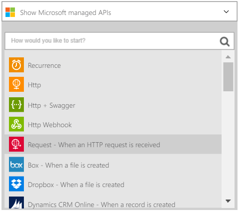

<properties
    pageTitle="瞭解如何編碼或解碼使用企業整合套件與邏輯的應用程式的一般檔案 |Microsoft Azure 應用程式服務 |Microsoft Azure"
    description="使用企業整合套件與邏輯應用程式的功能來編碼或解碼一般檔案"
    services="app-service\logic"
    documentationCenter=".net,nodejs,java"
    authors="msftman"
    manager="erikre"
    editor="cgronlun"/>

<tags 
    ms.service="logic-apps" 
    ms.workload="integration" 
    ms.tgt_pltfrm="na" 
    ms.devlang="na" 
    ms.topic="article" 
    ms.date="07/08/2016" 
    ms.author="deonhe"/>

# 企業整合一般檔案

## 概觀

您可能會想要編碼的 XML 內容，才能傳送至協力廠商企業對企業 B2B 情境中。 邏輯應用程式中所做的 Azure 應用程式服務的邏輯應用程式功能，您可以使用一般檔案編碼連接器執行此動作。 您建立的邏輯應用程式可以取得其 XML 內容從各種不同的來源，包括從 HTTP 要求的觸發程序、 從其他應用程式，或甚至其中許多的[連接器](../connectors/apis-list.md)。 如需有關邏輯應用程式的詳細資訊，請參閱[邏輯應用程式的文件](./app-service-logic-what-are-logic-apps.md "詳細了解邏輯應用程式")。  

## 如何建立編碼連接器一般檔案

請遵循這些步驟以新增一般檔案編碼邏輯應用程式的連接器。

1. 建立邏輯應用程式並[將其整合帳戶連結](./app-service-logic-enterprise-integration-accounts.md "學習連結整合帳戶邏輯應用程式")。 此帳戶包含您要用來編碼 XML 資料的結構描述。  
2. 將**收到要求-時 HTTP 要求**觸發程序新增至 [邏輯應用程式。  
    
3. 新增一般檔案編碼動作]，如下所示︰

    。 選取**加上**註冊。

    b。 選取 [**新增動作**] 連結 （會顯示在您選取加號後）。

    c。 在 [搜尋] 方塊中，輸入*一般*篩選是您想要使用的所有動作。

    d。 從清單中選取 [**一般檔案編碼方式**] 選項。   
![螢幕擷取畫面的一般檔案的編碼方式] 選項](./media/app-service-logic-enterprise-integration-flatfile/flatfile-2.png)   
4. 在 [**一般檔案編碼方式**] 對話方塊中，選取 [**內容**] 文字方塊。  
![內容的螢幕擷取畫面的 [文字] 方塊](./media/app-service-logic-enterprise-integration-flatfile/flatfile-3.png)  
5. 選取您想要編碼的內容 [本文] 標籤。 本文標記會填入內容的欄位。     
  
6. 選取 [**結構描述名稱**] 清單方塊中，然後選擇您想要使用編碼輸入的內容的結構描述。    
![螢幕擷取畫面的結構描述名稱] 清單方塊](./media/app-service-logic-enterprise-integration-flatfile/flatfile-5.png)  
7. 儲存您的工作。   
![儲存螢幕擷取畫面] 圖示](./media/app-service-logic-enterprise-integration-flatfile/flatfile-6.png)  

此時，您已完成設定您的一般檔案編碼連接器。 在真實世界應用程式中，您可能要編碼的資料儲存的線條的商務應用程式，例如 Salesforce。 或者您可以傳送編碼的資料交易合作夥伴。 您可以輕鬆地新增 Salesforce，或您的交易夥伴傳送編碼的巨集指令的輸出使用所提供的任何的連接器一個動作。

您現在可以測試您的連接器，以要求給 HTTP 端點，包括在邀請內文中的 XML 內容。  

## 如何建立解碼連接器一般檔案

>[AZURE.NOTE] 若要完成這些步驟，必須具備結構描述檔案上傳至您的整合帳戶。

1. 將**收到要求-時 HTTP 要求**觸發程序新增至 [邏輯應用程式。  
    
2. 新增一般檔案解碼動作]，如下所示︰

    。 選取**加上**註冊。

    b。 選取 [**新增動作**] 連結 （會顯示在您選取加號後）。

    c。 在 [搜尋] 方塊中，輸入*一般*篩選是您想要使用的所有動作。

    d。 從清單中選取 [**一般檔案解碼**] 選項。   
   
- 選取**內容**控制項。 這會產生從舊的步驟，您可以使用內容作為解碼內容的清單。 請注意，*本文*內送的 HTTP 要求從可用作為解碼內容。 您也可以輸入解碼直接將**內容**控制項的內容。     
- 選取 [*內文*] 標籤。 請注意，本文標籤現在**內容**控制項中。
- 選取您想要使用解碼內容的結構描述名稱。 以下螢幕擷取畫面顯示*OrderFile*所選的結構描述名稱。 此結構描述名稱必須已上傳到整合帳戶先前。

 ![螢幕擷取畫面的一般檔案解碼] 對話方塊](./media/app-service-logic-enterprise-integration-flatfile/flatfile-decode-1.png)    
- 儲存您的工作。  
![儲存螢幕擷取畫面] 圖示](./media/app-service-logic-enterprise-integration-flatfile/flatfile-6.png)    

此時，您已完成設定解碼連接器您一般檔案。 在真實世界應用程式中，您可能要解碼的資料儲存的線條的商務應用程式，例如 Salesforce。 您可以輕鬆地新增到 Salesforce 傳送解碼巨集指令的輸出動作。

您現在可以測試您的連接器的要求 HTTP 端點，包括您想要解碼邀請內文中的 XML 內容。  

## 後續步驟
- [深入瞭解企業整合套件](./app-service-logic-enterprise-integration-overview.md "瞭解企業整合套件")。  
