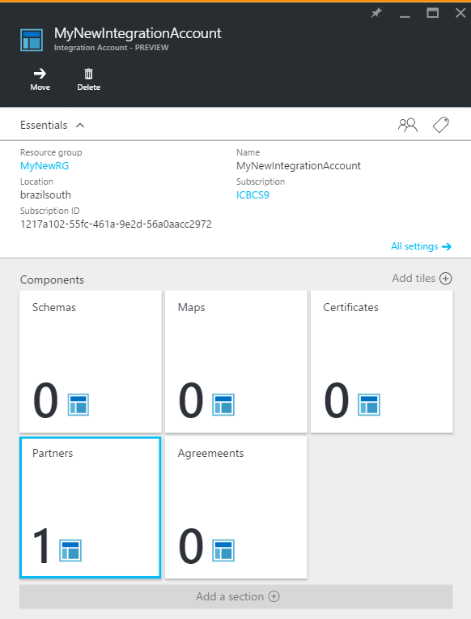

<properties 
    pageTitle="深入了解合作夥伴與企業整合套件 |Microsoft Azure 應用程式服務 |Microsoft Azure" 
    description="瞭解如何使用企業整合套件與邏輯應用程式合作夥伴" 
    services="logic-apps" 
    documentationCenter=".net,nodejs,java"
    authors="msftman" 
    manager="erikre" 
    editor="cgronlun"/>

<tags 
    ms.service="logic-apps" 
    ms.workload="integration" 
    ms.tgt_pltfrm="na" 
    ms.devlang="na" 
    ms.topic="article" 
    ms.date="07/08/2016" 
    ms.author="deonhe"/>

# 深入了解合作夥伴與企業整合套件

## 概觀
您可以建立合作夥伴之前，您和您想要執行的組織必須共用資訊可協助您識別與驗證彼此所傳送的訊息。 您有下列討論區，並準備好要開始您的業務關係之後，您可以整合帳戶中建立*合作夥伴*。

## 什麼是合作夥伴？
合作夥伴是參與企業對企業 (B2B) 訊息與交易的實體。 

## 如何使用合作夥伴？
合作夥伴用來建立合約。 合約定義的詳細資訊會合作夥伴之間交換的訊息。 

您可以建立協議之前，必須至少為兩個合作夥伴新增至您整合的帳戶。 其中一個合約夥伴必須是您的組織。 合作夥伴，表示您的組織被指**主機合作夥伴**。 第二個合作夥伴代表其他組織與您的組織交換的訊息。 第二個合作夥伴稱為**來賓合作夥伴**。 來賓合作夥伴可以是另一家公司或甚至您自己的組織內的部門。  

您已新增合作夥伴之後，您會使用這些合作夥伴來建立協議。 

收發設定方向會從裝載合作夥伴的觀點。 例如，合約接收設定會決定裝載的合作夥伴收到來賓合作夥伴傳送郵件的方式。 同樣地，合約的傳送設定會指出裝載的合作夥伴以來賓合作夥伴所傳送的訊息。

## 如何建立合作夥伴？
從 Azure 入口網站︰  
1. 選取 [**瀏覽**  
    
2. 在 [篩選] 搜尋方塊中輸入**整合**，然後從結果清單中選取 [**整合帳戶**     
   
3. 在選取**整合帳戶**，您將會新增合作夥伴  
  
4.  選取 [**合作夥伴**] 磚  
  
5. 在開啟的合作夥伴刀中選取 [**新增**] 按鈕  
  
6. 輸入您的合作夥伴的**名稱**，然後選取 [**辨識符號**，最後，然後輸入**值**。 值會用來協助您識別進入您的應用程式的文件。  
  
7. 選取*鐘型*通知圖示，以查看進度的合作夥伴建立程序。  
  
8. 選取 [**合作夥伴**] 磚。 這會重新整理] 磚，您應該會看到的合作夥伴增加數，反映新的合作夥伴已新增成功。    
  
10. 選取 [合作夥伴] 方塊之後，您也會看到最近新增的合作夥伴合作夥伴刀中顯示。    
  

## 如何編輯合作夥伴

請遵循這些步驟來編輯已存在整合帳戶中的合作夥伴︰  
1. 選取 [**合作夥伴**] 磚  
2. 選取您想要編輯合作夥伴刀開啟時的合作夥伴  
3. 在 [**合作夥伴更新**] 方塊中，進行您需要的變更  
4. 如果您滿意所做的變更，請選取 [**儲存**] 連結，還，請選取**放棄**連結丟棄您的變更。  
  

## 如何刪除合作夥伴
1. 選取 [**合作夥伴**] 磚  
2. 選取您想要編輯合作夥伴刀開啟時的合作夥伴  
3. 選取 [**刪除**] 連結    
   

## 後續步驟
- [深入瞭解合約](./app-service-logic-enterprise-integration-agreements.md "瞭解企業整合合約")  

