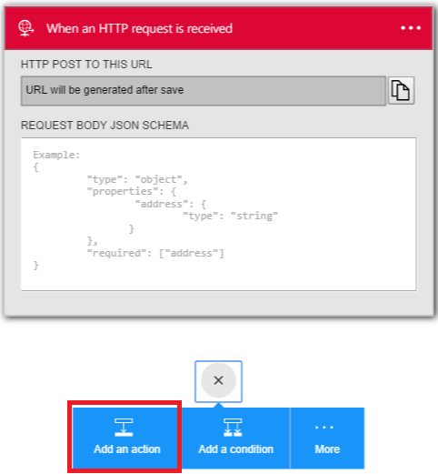

<properties 
    pageTitle="企業整合套件概觀 |Microsoft Azure 應用程式服務 |Microsoft Azure" 
    description="若要啟用商務程序 」 和 「 整合案例使用 Microsoft Azure 應用程式服務使用企業整合套件的功能" 
    services="logic-apps" 
    documentationCenter=".net,nodejs,java"
    authors="msftman" 
    manager="erikre" 
    editor="cgronlun"/>

<tags 
    ms.service="logic-apps" 
    ms.workload="integration" 
    ms.tgt_pltfrm="na" 
    ms.devlang="na" 
    ms.topic="article" 
    ms.date="07/08/2016" 
    ms.author="deonhe"/>

# XML 轉換企業整合

## 概觀
企業整合轉換連接線會將資料格式轉換成另一種格式。 例如，您可能必須包含 YearMonthDay 格式的目前日期的內送郵件。 您可以使用轉換重新格式化 MonthDayYear 格式的日期。

## 轉換做什麼？
轉換，也就是也稱為 「 地圖 」，包括來源 XML 結構描述 （輸入） 和目標 XML 結構描述 （輸出）。 您可以使用不同的內建函數來協助管理或控制資料，包括字串操作、 條件的工作分派、 算術運算式、 日期時間格式器，並甚至迴圈建構。

## 如何建立轉換？
使用 Visual Studio[企業整合 SDK](https://aka.ms/vsmapsandschemas)，您可以建立轉換/地圖。 當您完成建立並測試轉換時，您上傳至您的整合帳戶轉換。 

## 如何使用轉換
上傳至您的整合帳戶轉換之後，您可以使用其建立邏輯應用程式。 邏輯應用程式便會執行轉換時，就會觸發邏輯應用程式 （和必須轉換的輸入內容）。

**若要使用轉換的步驟如下**︰

### 必要條件 
在預覽中，您將需要︰  

-  [建立 Azure 函數容器](https://ms.portal.azure.com/#create/Microsoft.FunctionApp "建立 Azure 函數容器")  
-  [新增至 Azure 函數容器函數](https://portal.azure.com/#create/Microsoft.Template/uri/https%3A%2F%2Fraw.githubusercontent.com%2FAzure%2Fazure-quickstart-templates%2Fmaster%2F201-logic-app-transform-function%2Fazuredeploy.json "此範本建立 webhook 基礎 C# azure 函數與使用中的邏輯應用程式整合案例的轉換功能")    
-  建立整合帳戶，並為其新增地圖  

>[AZURE.TIP] 請記下 Azure 函數容器和 Azure 函數的名稱，您需要這些中下一個步驟。  

現在您已處理的必要條件，就可以建立邏輯應用程式︰  

1. 建立邏輯應用程式和[連結至您的整合帳戶](./app-service-logic-enterprise-integration-accounts.md "學習連結至邏輯應用程式整合帳戶")包含地圖。
2. 將**收到要求-時 HTTP 要求**觸發程序新增至您的邏輯應用程式  
    
3. 新增**轉換 XML**動作，以第一個選取**新增巨集指令**   
   
4. Word*轉換*搜尋方塊中輸入才能篩選是您想要使用的所有動作  
  
5. 選取 [**轉換 XML**動作   
  
6. 選取包含您要用的函數的**函數容器**。 這是您在步驟建立 Azure 函數容器的名稱。
7. 選取您想要使用的**函數**。 這是您先前建立 Azure 函數名稱。
8. 新增 XML**內容**，將其轉換。 請注意，您可以使用任何您收到 HTTP 要求為**內容**中的 XML 資料。 在此範例中，選取 [觸發邏輯應用程式 HTTP 邀請內文]。
9. 選取您要用來執行轉換**地圖**的名稱。 在您的整合帳戶，必須已先地圖。 在先前的步驟中，您已經給您邏輯應用程式存取您的整合帳戶包含地圖。
10. 儲存您的工作  
 

此時，您已完成設定您的地圖。 在真實世界應用程式中，您可能要儲存已轉換的資料，例如 SalesForce LOB 應用程式中。 您可以輕鬆地為要轉換的輸出傳送到 Salesforce 的動作。 

您現在可以藉由 HTTP 端點要求測試您的轉換。  

## 與使用案例

- 在地圖上建立的轉換可以很簡單，例如的名稱和地址，複製到另一個文件。 或者，您可以建立更複雜的轉換使用的方塊出地圖作業。  
- 多個對應作業或功能都能，包括字串、 日期時間函數，依此類推。  
- 您可以直接資料結構描述之間複製。 在包含 SDK 中的對應程式，這是非常簡單，繪製一條線連接來源結構描述中的項目與目的結構描述中對應項目。  
- 建立地圖，當您檢視地圖，以圖形顯示顯示所有關聯與您所建立的連結。
- 若要新增 XML 的郵件範例使用測試對應功能。 簡單的按一下，您可以測試您建立了，對應，並查看所產生的輸出。  
- 上傳現有的地圖  
- 包含支援的 XML 格式。

## 深入瞭解
- [深入瞭解企業整合套件](./app-service-logic-enterprise-integration-overview.md "瞭解企業整合套件")  
- [深入瞭解地圖](./app-service-logic-enterprise-integration-maps.md "瞭解企業整合地圖")  
 