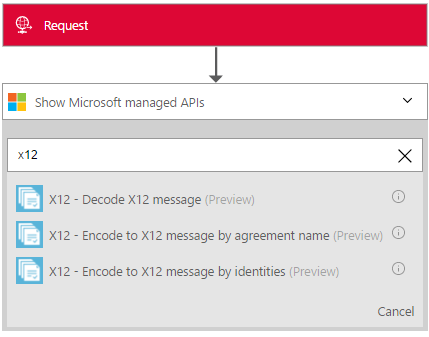

<properties 
    pageTitle="瞭解企業整合套件解碼 X12 訊息 Connctor |Microsoft Azure 應用程式服務 |Microsoft Azure" 
    description="瞭解如何使用企業整合套件與邏輯應用程式合作夥伴" 
    services="logic-apps" 
    documentationCenter=".net,nodejs,java"
    authors="padmavc" 
    manager="erikre" 
    editor=""/>

<tags 
    ms.service="logic-apps" 
    ms.workload="integration" 
    ms.tgt_pltfrm="na" 
    ms.devlang="na" 
    ms.topic="article" 
    ms.date="08/15/2016" 
    ms.author="padmavc"/>

# 快速入門解碼 X12 訊息

驗證 EDI 及合作夥伴的特定屬性，產生每次交易組 XML 文件，並產生處理次交易的通知。

## 建立連線

### 必要條件

* Azure 帳戶。您可以建立的[免費的帳戶](https://azure.microsoft.com/free)

* 整合帳戶，才能使用解碼 X12 郵件連接器。 請參閱如何建立[整合帳戶](./app-service-logic-enterprise-integration-create-integration-account.md)，[合作夥伴](./app-service-logic-enterprise-integration-partners.md)的詳細資料和[X12 合約](./app-service-logic-enterprise-integration-x12.md)

### 連線到解碼 X12 郵件使用下列步驟︰

1. [建立邏輯應用程式](./app-service-logic-create-a-logic-app.md)提供的範例

2. 此連接器沒有任何引動程序。 您可以使用其他引動程序來啟動邏輯應用程式，例如要求觸發程序。  邏輯應用程式設計工具] 中新增觸發程序，並新增巨集指令。  在 [搜尋] 方塊中選取顯示 Microsoft 受管理的 Api 在下拉式清單]，然後輸入 「 x12 」。  選取 X12 – 解碼 X12 訊息

      

3. 如果您還沒有先前建立的任何整合帳戶的連線，系統會提示您連線詳細資料

        

4. 輸入整合帳戶的詳細資訊。  星號屬性所需

  	| 屬性 | 詳細資料 |
  	| -------- | ------- |
  	| 連線名稱 * | 輸入您的連線任何名稱 |
  	| 整合帳戶 * | 輸入整合帳戶名稱。 請確定您的整合帳戶和邏輯應用程式會在相同的 Azure 位置 |

    完成之後，您連線的詳細資料看起來類似下列
    
     

5. 選取 [**建立**
    
6. 請注意，在建立連線。

     

7. 選取 X12 平面解碼檔案的訊息

     

## X12 解碼追蹤的用途

* 驗證針對交易夥伴協議信封
* 產生 XML 文件的每次交易組。
* 驗證 EDI 及合作夥伴的特定屬性
    * EDI 結構驗證及擴充的結構描述驗證
    * 驗證的交換信封的結構。
    * 針對控制項結構描述信封的結構描述驗證。
    * 結構描述驗證訊息結構描述的交易設定資料項目。
    * 交易設定資料的項目上執行 EDI 驗證 
* 確認交換] 群組中，與交易設定控制項數字不重複的項目
    * 檢查先前收到交換針對交換控制項數字。
    * 檢查針對交換中其他群組控制項數字的群組控制項編號。
    * 檢查交易針對其他交易設定控制項中的數字該群組設定控制項的數字。
* 將整個交換轉換為 XML 
    * 為交易集-分割交換暫停交易集錯誤︰ 剖析交換到另一個 XML 文件中設定每次交易。 如果一或多個交易設定交換中無法驗證]，[X12 解碼暫停只有這些交易集。
    * 為交易集-分割交換暫停交換錯誤︰ 剖析交換到另一個 XML 文件中設定每次交易。  如果一或多個交易設定交換中無法驗證]，[X12 解碼暫停整個交換。
    * 保留交換-暫停交易集錯誤︰ 建立 XML 文件的整批次交換。 X12 解碼暫停驗證失敗的交易集、 時繼續處理所有其他的交易設定
    * 保留交換-暫停交換錯誤︰ 建立 XML 文件的整批次交換。 如果一或多個交易設定交換中無法驗證]，[X12 解碼暫停整個交換， 
* （如果有設定），則會產生技術及/或功能的通知。
    * 技術的認可產生頁首驗證。 技術認可報表交換標題和地址接收者的後端處理的狀態。
    * 本文驗證，產生應答功能。 應答功能報表每個處理收到的文件時發生的錯誤

## 後續步驟

[深入瞭解企業整合套件](./app-service-logic-enterprise-integration-overview.md "瞭解企業整合套件") 

