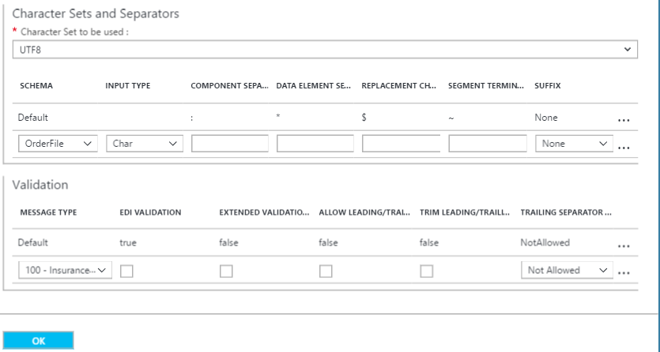

<properties 
    pageTitle="X12 與企業整合套件概觀 |Microsoft Azure 應用程式服務 |Microsoft Azure" 
    description="瞭解如何使用 X12 合約來建立邏輯應用程式" 
    services="logic-apps" 
    documentationCenter=".net,nodejs,java"
    authors="msftman" 
    manager="erikre" 
    editor="cgronlun"/>

<tags 
    ms.service="app-service-logic" 
    ms.workload="integration" 
    ms.tgt_pltfrm="na" 
    ms.devlang="na" 
    ms.topic="article" 
    ms.date="07/08/2016" 
    ms.author="deonhe"/>

# X12 企業整合 

>[AZURE.NOTE]此頁面涵蓋 X12 的功能邏輯應用程式。 如需 EDIFACT 按一下[這裡](app-service-logic-enterprise-integration-edifact.md)。

## 建立 X12 合約 
您可以交換 X12 之前的郵件，您需要建立 X12 合約，將其儲存在您的整合帳戶。 下列步驟會引導您執行的程序建立 X12 合約。

### 以下是您需要在您開始之前
- Azure 訂閱中定義的[整合帳戶](./app-service-logic-enterprise-integration-accounts.md)  
- 已經定義整合帳戶中的兩個以上[合作夥伴](./app-service-logic-enterprise-integration-partners.md)  

>[AZURE.NOTE]在建立合約時，合約檔案中的內容，必須符合合約類型。    

您已[建立整合帳戶](./app-service-logic-enterprise-integration-accounts.md)，並[新增合作夥伴](./app-service-logic-enterprise-integration-partners.md)之後，您可以建立 X12 合約遵循下列步驟︰  

### 從 Azure 入口網站的首頁。

之後您登入[Azure 入口網站](http://portal.azure.com "Azure 入口網站")︰  
1. 選取 [**瀏覽**從左邊的功能表。  

>[AZURE.TIP]如果您沒有看到**瀏覽**] 連結，您可能需要先展開的功能表。 請執行下列動作，選取 [**顯示功能表**連結的位置在左上方的 [摺疊] 功能表。  

    
2. [篩選] 搜尋方塊中輸入*整合*，然後從結果清單中選取 [**整合帳戶**]。       
    
3. 在開啟的**整合帳戶**刀，選取您要在其中建立合約的整合帳戶。 如果您沒有看到任何整合帳戶清單，[建立第一個](./app-service-logic-enterprise-integration-accounts.md "All about integration accounts")。  
  
4.  選取 [**合約**磚。 如果您沒有看到 [合約] 方塊中，將其新增到第一次。   
     
5. 隨即會開啟合約刀中選取 [**新增**] 按鈕。  
  
6. 輸入您的合約的**名稱**，然後選取 [開啟合約刀中的 [**合約類型**、**主機合作夥伴**、**主機身分識別**、**來賓合作夥伴**、**來賓身分識別**，]。  
  
7. 您已設定接收設定內容之後，請選取**[確定**] 按鈕  
請繼續執行︰  
8. 選取要設定透過本合約所收到郵件的處理方式**接收設定**]。  
9. 接收設定控制項分為以下各節，包括識別項、 通知、 結構、 信封、 控制項數字、 驗證及內部設定。 設定根據您的合約，合作夥伴與您的郵件會將交換這些屬性。 以下是這些控制項的檢視，根據您想要找出並處理內送郵件本合約移轉的方式來設定︰  
  

  
10. 選取 [**確定**] 按鈕，儲存您的設定]。  

### 識別項

|屬性|描述 |
|---|---|
|ISA1 （授權辨識符號）|從下拉式清單中選取授權辨識符號值。|
|ISA2|選用。 請輸入授權資訊值。 如果您輸入的 ISA1 值是 00 以外，輸入一個英數字元的最小值和最大值 10。|
|ISA3 （安全性辨識符號）|從下拉式清單中選取安全性辨識符號值。|
|ISA4|選用。 輸入安全性資訊值。 如果您輸入的 ISA3 值是 00 以外，輸入一個英數字元的最小值和最大值 10。|

### 通知 

|屬性|描述 |
|----|----|
|預期的 TA1|選取此核取方塊，以傳回技術的 (TA1) 認可交換寄件者。 這些通知會根據合約傳送設定交換寄件者傳送。|
|預期 fa 須相符|選取此核取方塊，以返回交換寄件者 (FA) 應答功能。 然後選取您想要 997 或 999 通知，根據您正在使用的結構描述版本。 這些通知會根據合約傳送設定交換寄件者傳送。|
|包含 AK2/IK2 循環播放|選取此核取方塊，以便產生 AK2 迴圈中已接受的交易組應答功能。注意︰ 此核取方塊會啟用只有在您選取預期 fa 須相符] 核取方塊。|

### 結構描述

選擇 [每次交易類型 (ST1) 及寄件者的應用程式 (GS2) 的結構描述]。 接收管線分解藉由 ST1 和 GS2 符合的值，在這裡設定內送郵件，在這裡設定的值與內送郵件的結構描述與結構描述中的內送郵件。

|屬性|描述 |
|----|----|
|版本|選取 X12 版本|
|交易類型 (ST01)|選取 [交易類型|
|寄件者的應用程式 (GS02)|選取寄件者的應用程式|
|結構描述|選取您想要我們的結構描述檔案。 結構描述檔案位於您整合的帳戶。|

### 信封

|屬性|描述 |
|----|----|
|ISA11 使用方式|使用此欄位來指定分隔符號在交易設定︰  選取要使用的小數位數的標記法的標準識別碼 」。 」 而不是在 EDI 內送的文件的小數位數的標記法收到管道的郵件。  選取 [重複分隔符號來指定重複出現的簡單資料的項目或重複的資料結構分隔符號]。 例如，(^) 通常作為重複分隔符號。 對於 HIPAA 結構描述，您可以只使用 (^)。|

### 控制項的數字

|屬性|描述 |
|----|----|
|不允許交換控制號碼重複項目|核取此選項即可封鎖重複交換。 如果選取，BizTalk Services 入口網站檢查收到交換交換控制項編號 (ISA13) 不相符的交換控制項編號。 如果偵測相符，則接收管線並不會處理交換。 如果您選擇不允許重複交換控制項數字，您可以指定用以提供適當的值的重複 ISA13 檢查每 x 天來執行檢查的天數。|
|不允許群組控制項的數字重複項目|核取此選項即可封鎖交換重複群組控制項數字。|
|不允許交易設定控制項數字重複項目|核取此選項即可封鎖交換重複的交易設定控制項的數字。|

### 驗證

|屬性|描述 |
|----|----|
|訊息類型|EDI 訊息類型，例如 850 採購單或 999 實作通知。|
|EDI 驗證|執行資料類型所定義的結構描述、 長度限制、 空白資料元素，以及結尾分隔符號 EDI 屬性 EDI 驗證。|
|延伸的驗證|如果不是 EDI 資料類型，驗證資料的項目需求，允許重複項目、 列舉和資料的項目長度驗證 （最小/最大）。|
|允許前置/結尾的零|保留任何額外的空間和前置或結尾的零字元。 他們不會移除。|
|結尾的分隔符號原則|會產生上收到交換結尾的分隔符號。 選項包括 [NotAllowed、 [列席者] 和 [強制]。|

### 內部設定

|屬性|描述 |
|----|----|
|轉換暗示十進位格式 Nn 基底 10 個數值|將指定底數為 10 數值中繼 XML 在 BizTalk Services 入口網站中的格式 Nn EDI 數字。|
|如果結尾的分隔符號允許，建立空白的 XML 標記|選取此核取方塊，以包含空白的 XML 標記的結尾的分隔符號交換寄件者。|
|輸入批次處理|為交易集-分割交換暫停交易集錯誤︰ 剖析套用交易設定適當的信封設定交換到另一個 XML 文件中的每次交易。 使用此選項時，如果一或多個交易設定中交換失敗驗證]，然後 Biztalk 暫停只有這些交易集。   為交易集-分割交換暫停交換錯誤︰ 剖析套用適當的信封設定交換到另一個 XML 文件中的每次交易。 使用此選項時，如果一或多個交易設定交換中無法驗證]，然後 Biztalk 暫停整個交換。  保留交換-暫停交易集錯誤︰ 保留交換，建立 XML 文件的整批次交換。 使用此選項時，如果 onAe 或更多的交易設定中交換無法驗證]，然後 Biztalk 暫停僅這些交易集]，繼續處理所有其他的交易集時。  保留交換-暫停交換錯誤︰ 保留交換，建立 XML 文件的整批次交換。 使用此選項時，如果一或多個交易設定中交換失敗驗證]，然後 BizTalk 服務會暫停整個交換。  |

您的合約已準備好處理符合您所選取的結構描述的內送郵件。

若要設定的設定，處理您的合作夥伴，才能傳送的郵件︰  
11. 選取 [**傳送設定**來設定透過本合約所傳送的郵件的處理方式。  

傳送設定控制項分為以下各節，包括識別項、 通知、 結構、 信封、 控制項數字、 字元集和分隔符號和驗證。 

以下是這些控制項的檢視。 請根據您要如何處理您的合作夥伴，才能透過本合約所傳送的郵件的選項︰   
  

  

  
12. 選取 [**確定**] 按鈕，儲存您的設定]。  

### 識別項
|屬性|描述 |
|----|----|
|授權辨識符號 (ISA1)|從下拉式清單中選取授權辨識符號值。|
|ISA2|請輸入授權資訊值。 如果此值是 00 以外，然後輸入一個英數字元的最小值和最大值 10。|
|安全性辨識符號 (ISA3)|從下拉式清單中選取安全性辨識符號值。|
|ISA4|輸入安全性資訊值。 如果此值以外 00，值 (ISA4) 的 [文字] 方塊，然後輸入一個英數字元的值的最小值和最大值 10。|

### 通知
|屬性|描述 |
|----|----|
|預期的 TA1|選取此核取方塊，以傳回技術的 (TA1) 認可交換寄件者。 此設定會指定的傳送訊息給主機夥伴會從來賓合作夥伴合約中要求通知。 這些通知都必須主機夥伴根據收到合約的設定。|
|預期 fa 須相符|選取此核取方塊，以返回交換寄件者 (FA) 應答功能，然後選取 [是否要 997 或 999 通知，根據您正在使用的結構描述版本。 這些通知都必須主機夥伴根據收到合約的設定。|
|FA 版本|選取 FA 版本|

### 結構描述
|屬性|描述 |
|----|----|
|版本|選取 X12 版本|
|交易類型 (ST01)|選取 [交易類型|
|結構描述|選取要使用的結構描述。 結構描述位於您整合的帳戶。 若要存取您的結構描述，第一次連結至邏輯應用程式的整合帳戶。|

### 信封
|屬性|描述 |
|----|----|
|ISA11 的使用方式|使用此欄位來指定分隔符號在交易設定︰  選取要使用的小數位數的標記法的標準識別碼 」。 」 而不是在 EDI 內送的文件的小數位數的標記法收到管道的郵件。  選取 [重複分隔符號來指定重複出現的簡單資料的項目或重複的資料結構分隔符號]。 例如，(^) 通常作為重複分隔符號。 對於 HIPAA 結構描述，您可以只使用 (^)。 |
|重複項目分隔符號|輸入的重複項目分隔符號|
|控制版本號碼 (ISA12)|選取所產生的外寄交換使用 BizTalk Services 入口網站的標準 X12 版本。|
|使用標記 (ISA15)|輸入交換的內容是否資訊 (I) 生產資料 (P)，或 [測試資料 (T)。 EDI 接收管線升階為此屬性的內容。|
|結構描述|您可以輸入 BizTalk Services 入口網站如何產生的 GS 和 ST 區段會傳送到傳送管線 X12 編碼交換。  您可以建立關聯 GS1、 GS2、 GS3、 GS4、 GS5、 GS7 和 GS8 資料項目與值的交易類型和發行版本/資料元素的值。 當 BizTalk Services 入口網站會決定的 XML 訊息含有設定交易類型] 和方格中，一列的發行版本/元素的值，然後就會填入 GS1、 GS2、 GS3、 GS4、 GS5、 GS7 及 GS8 資料中的元素的外寄交換格線的同一列中的值與信封。 交易類型和發行版本/元素的值必須是唯一的。  選用。 為 GS1，請從下拉式清單中選取功能的程式碼的值。  所需。 對於 GS2，輸入應用程式寄件者的兩個字元的最小值與最大值 15 個字元的英數字元的值。  所需。 對於 GS3，輸入應用程式接收者的兩個字元的最小值與最大值 15 個字元的英數字元的值。  選用。 GS4，選取 [CCYYMMDD 或 YYMMDD]。  選用。 GS5、 選取 HHMM、 HHMMSS，或 HHMMSSdd。  選用。 為 GS7，從下拉式清單中選取負責機構的值。  選用。 GS8，輸入文件識別的一個字元的最小值與最大值 12 個字元英數字元的值。  **附註**︰ 這些是 BizTalk Services 入口網站輸入的交易輸入，建立交換 GS 欄位中的值和發行版本/同一列中的項目與交換相關聯的相符項目。|

### 控制項的數字
|屬性|描述 |
|----|----|
|交換控制項數字 (ISA13)|所需。 輸入交換控制項數字，用於 BizTalk Services 入口網站中產生的外寄交換值的範圍。 輸入數字 1 的最小值與 999999999 最大值。|
|群組控制項數字 (GS06)|所需。 輸入 BizTalk Services 入口網站應該使用群組控制項數的數字的範圍。 輸入一個數字的值的一個字元的最小值與最大值九個字元。|
|交易設定控制項的數字 (ST02)|交易設定控制項的數字 (ST02)，輸入所需的中間名欄位，數值和英數字元的值的範圍選用的前置詞與後置字元。 所有的四個欄位的長度上限為九個字元。|
|加上字首|若要指定交易設定控制項數字範圍的認可中使用，請在 ACK 控制項的 [數字 (ST02)] 欄位中輸入值。 輸入數值的中間名的兩個欄位，以及英數字元的值 （如有需要） [首碼] 和 [尾碼] 欄位。 中間名的欄位所需，包含控制項數字; 的最小值和最大值前置詞與後置字元是選擇性的。 所有的三個欄位的長度上限為九個字元。|
|後置字元|若要指定交易設定控制項數字範圍的認可中使用，請在 ACK 控制項的 [數字 (ST02)] 欄位中輸入值。 輸入數值的中間名的兩個欄位，以及英數字元的值 （如有需要） [首碼] 和 [尾碼] 欄位。 中間名的欄位所需，包含控制項數字; 的最小值和最大值前置詞與後置字元是選擇性的。 所有的三個欄位的長度上限為九個字元。|

### 字元集和分隔符號
除了字元集，您可以輸入一組不同的分隔符號，用於每一個郵件類型。 如果未指定的字元組指定的訊息結構描述，則會使用預設的字元集。

|屬性|描述 |
|----|----|
|設定要使用的字元|選取 X12 字元集來驗證您的合約輸入的內容。  **附註**︰ BizTalk Services 入口網站僅使用此設定驗證輸入相關的合約屬性的值。 接收管線或傳送管道的郵件時，會忽略此字元集屬性執行執行時間處理。|
|結構描述|選取 （+） 符號]，選取下拉式清單中的結構描述。 所選的結構描述中，選取 [設定為使用的分隔符號︰  元件項目分隔符號 – Enter 單一字元來分隔複合資料的項目。  資料項目分隔符號 – Enter 單一字元來分隔簡單資料複合資料的項目中的項目。    取代字元-選取此核取方塊，如果資料所包含的內容字元，也會使用為資料、 區段中或元件分隔符號。 然後，您可以輸入取代字元。 產生輸出時 X12 訊息，以指定的字元取代資料內容中的分隔符號字元的所有例項。  區段終端子 – 輸入單一字元來表示 EDI 區段結尾。  後置詞 – 選取的區段識別碼搭配使用的字元。 如果您指定的後置字元，區段終端子資料的項目可以是空的。 如果空白的區段結束點，您就必須指定尾碼。|

### 驗證
|屬性|描述 |
|----|----|
|訊息類型|選取這個選項可讓交換接收器上的驗證。 此驗證執行交易設定資料元素，驗證資料類型、 長度限制和空的資料的項目及結尾分隔符號 EDI 驗證。|
|EDI 驗證||
|延伸的驗證|選取這個選項可讓接收交換寄件者傳來之交換的延伸的驗證。 這包含驗證欄位長度]、 [選擇性，以及 [除了 XSD 資料型別驗證重複次數。 您可以啟用副檔名驗證沒有啟用 EDI 驗證]，或反向操作。|
|允許前置 / 結尾的零|選取此選項，指定，從一方收到 EDI 交換不會失敗驗證是否資料中的項目 EDI 交換不符合長度要求，因為或結尾空格，但沒有符合其長度需求時它們會移除。|
|結尾的分隔符號|選取此選項，指定自廠商 EDI 交換不會失敗驗證，是否資料中的項目 EDI 交換不符合其長度要求 （前後） 零或結尾空格，但沒有符合其長度需求時它們會移除。  如果您不想在從交換寄件者收到交換允許結尾的分隔符號和分隔符號，請選取 [不允許]。 如果交換包含結尾的分隔符號和分隔符號，宣告無效。  選取 [選擇性若要接受交換包含或不含結尾的分隔符號和分隔符號]。  如果收到的交換必須包含結尾的分隔符號和分隔符號，請選取 [強制]。|

選取後的**[確定]**開啟刀上︰  
13. 選取 [整合帳戶刀**合約**磚，然後您會看到最近新增的合約列]。  
   

## 深入瞭解
- [深入瞭解企業整合套件](./app-service-logic-enterprise-integration-overview.md "瞭解企業整合套件")  
