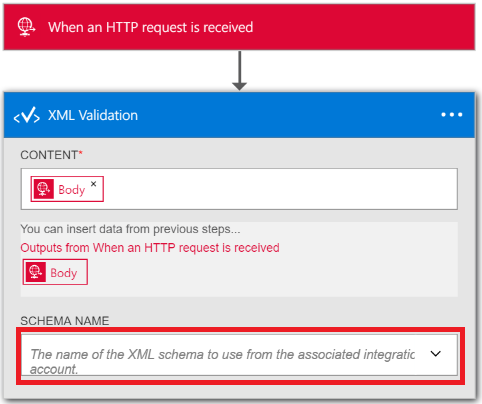

<properties 
    pageTitle="企業整合套件中的 XML 驗證概觀 |Microsoft Azure 應用程式服務 |Microsoft Azure" 
    description="瞭解驗證企業整合套件與邏輯應用程式中的運作方式" 
    services="logic-apps" 
    documentationCenter=".net,nodejs,java"
    authors="msftman" 
    manager="erikre" 
    editor="cgronlun"/>

<tags 
    ms.service="logic-apps" 
    ms.workload="integration" 
    ms.tgt_pltfrm="na" 
    ms.devlang="na" 
    ms.topic="article" 
    ms.date="07/08/2016" 
    ms.author="deonhe"/>

# 使用 XML 驗證企業整合

## 概觀
通常，在 B2B 案例中，合約合作夥伴需要驗證的郵件交換彼此之間有效資料處理開始前。 企業整合套件，您可以使用 XML 驗證連接器，以驗證預先定義的結構描述的文件。  

## 如何驗證文件的 XML 驗證連接器
1. 建立邏輯應用程式並[將其整合帳戶連結](./app-service-logic-enterprise-integration-accounts.md "瞭解邏輯應用程式將整合客戶連結至")包含您將會用於驗證 XML 資料的結構描述。
2. 將**收到要求-時 HTTP 要求**觸發程序新增至您的邏輯應用程式  
    
3. 新增**XML 驗證**動作，以第一個選取**新增巨集指令**  
4. 在 [搜尋] 方塊中輸入*xml* ，才能篩選是您想要使用的所有動作 
5. 選取 [ **XML 驗證**     
   
6. 選取 [**內容**的 [文字] 方塊  

7. 選取本文標籤將會驗證的內容。   
  
8. 選取 [**結構描述名稱**] 清單方塊中，選擇您要用來驗證輸入的*內容*上述的結構描述     
 
9. 儲存您的工作  
 

此時，您已完成設定您驗證的連接器。 在真實世界應用程式中，您可能要例如 SalesForce LOB 應用程式中儲存已驗證的資料。 您可以輕鬆地新增到 Salesforce 傳送輸出驗證的動作。 

您現在可以藉由 HTTP 端點要求測試驗證動作。  

## 後續步驟

[深入瞭解企業整合套件](./app-service-logic-enterprise-integration-overview.md "瞭解企業整合套件")   