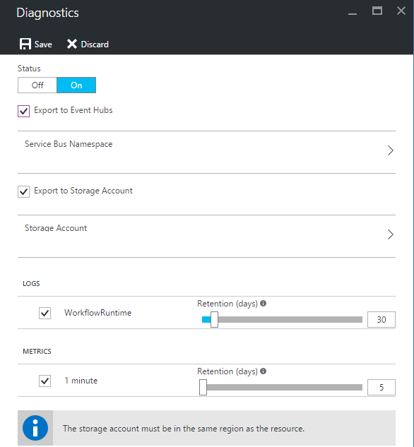
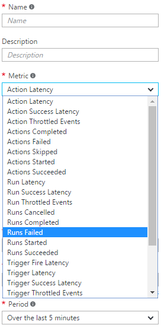

<properties 
    pageTitle="監控您 Azure 應用程式服務中的邏輯應用程式 |Microsoft Azure" 
    description="若要查看您的邏輯應用程式已完成的工作的方式" 
    authors="jeffhollan" 
    manager="erikre" 
    editor="" 
    services="logic-apps" 
    documentationCenter=""/>

<tags
    ms.service="logic-apps"
    ms.workload="integration"
    ms.tgt_pltfrm="na"
    ms.devlang="na"
    ms.topic="article"
    ms.date="10/18/2016"
    ms.author="jehollan"/>

# <a name="monitor-your-logic-apps"></a>監控您的邏輯應用程式

如果之後您[建立邏輯應用程式](app-service-logic-create-a-logic-app.md)，您可以看到 Azure 入口網站中執行的完整歷程記錄。  您也可以設定 Azure 診斷和 Azure 通知等服務監視即時的事件，且提醒的事件 」 時 5 個以上的執行失敗小時內。 」

## <a name="monitor-in-the-azure-portal"></a>Azure 入口網站中的 [監視器

若要檢視歷程記錄，請選取 [**瀏覽]**，然後選取**邏輯應用程式**。 顯示在您的訂閱中的所有邏輯應用程式的清單。  選取您想要監視邏輯應用程式。  您會看到所有動作和引動程序中發生此邏輯應用程式的清單。


有此刀上有用的幾個區段︰

- **摘要**列出**所有執行**和**觸發程序歷程記錄**
    - **所有執行**清單中的最新的邏輯應用程式執行。  您可以按一下 [執行]，詳細資料的任何列，或按一下清單更多段圖磚上。
    - **觸發程序歷程記錄**清單此邏輯應用程式的所有觸發程序活動。  觸發程序活動可能會為新的資料 （例如想要查看新檔案是否已新增至 FTP），「 已略過] 核取 「 成功 」 表示啟動邏輯應用程式中，傳回資料 」 或 「 」 失敗 」 對應的設定錯誤。
- **診斷**可讓您檢視執行階段的詳細資料] 與 [事件]，然後訂閱[Azure 提醒](#adding-azure-alerts)

>[AZURE.NOTE] 在邏輯應用程式服務中的其餘部分加密所有執行階段的詳細資料和事件。 就只會解密從使用者檢視要求。 存取這些事件可以也控制 Azure Role-Based 存取控制 (RBAC)。

### <a name="view-the-run-details"></a>檢視執行的詳細資料

執行此清單會顯示**狀態**、**開始時間**及**期間**的特定執行。 選取以查看詳細資料上執行的任何資料列。

監控檢視會顯示每個步驟執行，輸入和輸出的以及任何錯誤訊息，可能必須 occurre。


如果您需要執行**相互關聯識別碼**（也可以用來 REST API） 等任何其他詳細資料，您可以按一下 [**執行詳細資料**] 按鈕。  這包含所有步驟、 狀態及輸入/輸出的執行。

## <a name="azure-diagnostics-and-alerts"></a>Azure 診斷和通知

除了 Azure 入口網站和 REST API 上述所提供的詳細資料，您可以設定 Azure 診斷用於更豐富的詳細資料] 與 [偵錯邏輯應用程式。

1. 按一下 [**診斷**] 區段的邏輯應用程式刀
1. 按一下以設定**診斷設定**
1. 設定事件中心或儲存帳戶發出的資料

    

### <a name="adding-azure-alerts"></a>新增 Azure 提醒

診斷設定之後，您可以新增交叉特定閾值時要觸發 Azure 通知。  在 [**診斷**刀中，選取**通知**] 方塊並**新增提醒**。  這會逐步引導您完成設定通知，根據臨界值和指標的數字。



您可以視需要設定**條件**、**閥值**，並**期間**。  最後，您可以設定，通知電子郵件地址，或設定 webhook。  您可以使用邏輯應用程式中的[要求觸發程序](../connectors/connectors-native-reqres.md)，同時 （若要執行項目，例如[張貼到可寬延時間](https://github.com/Azure/azure-quickstart-templates/tree/master/201-alert-to-slack-with-logic-app)、[傳送簡訊給](https://github.com/Azure/azure-quickstart-templates/tree/master/201-alert-to-text-message-with-logic-app)，或[新增至佇列訊息](https://github.com/Azure/azure-quickstart-templates/tree/master/201-alert-to-queue-with-logic-app)） 通知上執行。

### <a name="azure-diagnostics-settings"></a>Azure 診斷程式設定

每個事件包含邏輯應用程式和事件，例如狀態的詳細資訊。  以下是*ActionCompleted*事件的範例︰

```javascript
{
            "time": "2016-07-09T17:09:54.4773148Z",
            "workflowId": "/SUBSCRIPTIONS/80D4FE69-ABCD-EFGH-A938-9250F1C8AB03/RESOURCEGROUPS/MYRESOURCEGROUP/PROVIDERS/MICROSOFT.LOGIC/WORKFLOWS/MYLOGICAPP",
            "resourceId": "/SUBSCRIPTIONS/80D4FE69-ABCD-EFGH-A938-9250F1C8AB03/RESOURCEGROUPS/MYRESOURCEGROUP/PROVIDERS/MICROSOFT.LOGIC/WORKFLOWS/MYLOGICAPP/RUNS/08587361146922712057/ACTIONS/HTTP",
            "category": "WorkflowRuntime",
            "level": "Information",
            "operationName": "Microsoft.Logic/workflows/workflowActionCompleted",
            "properties": {
                "$schema": "2016-06-01",
                "startTime": "2016-07-09T17:09:53.4336305Z",
                "endTime": "2016-07-09T17:09:53.5430281Z",
                "status": "Succeeded",
                "code": "OK",
                "resource": {
                    "subscriptionId": "80d4fe69-ABCD-EFGH-a938-9250f1c8ab03",
                    "resourceGroupName": "MyResourceGroup",
                    "workflowId": "cff00d5458f944d5a766f2f9ad142553",
                    "workflowName": "MyLogicApp",
                    "runId": "08587361146922712057",
                    "location": "eastus",
                    "actionName": "Http"
                },
                "correlation": {
                    "actionTrackingId": "e1931543-906d-4d1d-baed-dee72ddf1047",
                    "clientTrackingId": "my-custom-tracking-id"
                },
                "trackedProperties": {
                    "myProperty": "<value>"
                }
            }
        }
```

追蹤和監視特別有用的兩個屬性是*clientTrackingId*和*trackedProperties*。  

#### <a name="client-tracking-id"></a>用戶端追蹤識別碼

追蹤識別碼用戶端將值的關聯性建立事件跨邏輯應用程式執行，包括任何巢狀的工作流程呼叫為邏輯應用程式的一部分。  此識別碼會自動產生如果未會提供，但您可以手動指定追蹤觸發程序的識別碼，藉由傳送用戶端`x-ms-client-tracking-id`識別碼值的觸發程序要求 （要求觸發程序、 HTTP 觸發程序或 webhook 觸發程序） 中的標題。

#### <a name="tracked-properties"></a>追蹤的內容

追蹤的內容可以新增至動作中的工作流程定義，來追蹤輸入或輸出診斷資料。  這可能是如果您想要追蹤資料，例如在您遙測 「 訂單識別碼 」。  若要新增的追蹤的屬性，包括`trackedProperties`巨集指令的屬性。  追蹤的內容可以只追蹤單一動作輸入與輸出，但您可以使用`correlation`跨中執行的動作相互關聯事件的屬性。

```javascript
{
    "myAction": {
        "type": "http",
        "inputs": {
            "uri": "http://uri",
            "headers": {
                "Content-Type": "application/json"
            },
            "body": "@triggerBody()"
        },
        "trackedProperties":{
            "myActionHTTPStatusCode": "@action()['outputs']['statusCode']",
            "myActionHTTPValue": "@action()['outputs']['body']['foo']",
            "transactionId": "@action()['inputs']['body']['bar']"
        }
    }
}
```

### <a name="extending-your-solutions"></a>延伸方案

您可以利用此遙測 [事件] 中心] 或 [儲存到其他服務，例如[作業管理套件](https://www.microsoft.com/cloud-platform/operations-management-suite)、 [Azure 資料流分析](https://azure.microsoft.com/services/stream-analytics/)與[Power BI](https://powerbi.com)有即時監控整合工作流程。

## <a name="next-steps"></a>後續步驟
- [常見的範例與邏輯應用程式的案例](app-service-logic-examples-and-scenarios.md)
- [建立邏輯應用程式部署範本](app-service-logic-create-deploy-template.md)
- [企業整合功能](app-service-logic-enterprise-integration-overview.md)
