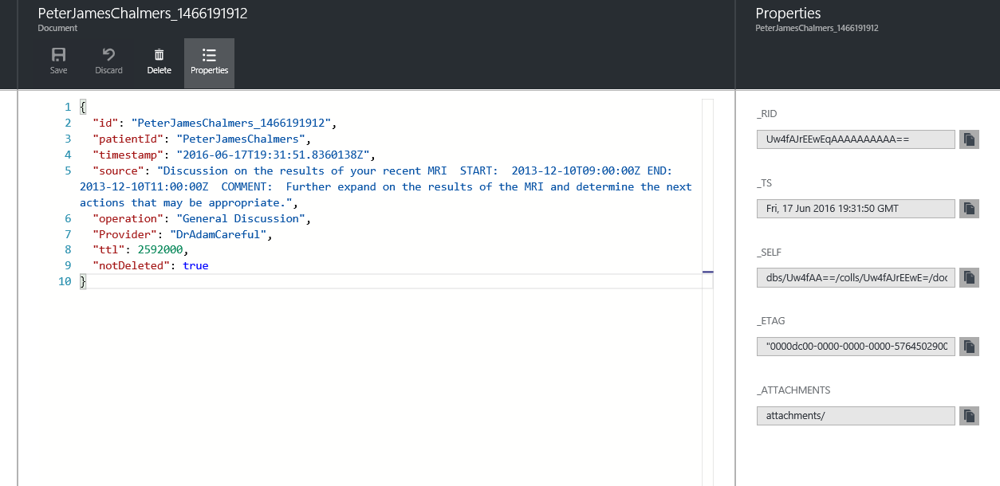

<properties
    pageTitle="記錄和邏輯應用程式中的錯誤處理 |Microsoft Azure"
    description="檢視實際使用的大小寫進階的錯誤處理和記錄邏輯應用程式"
    keywords=""
    services="logic-apps"
    authors="hedidin"
    manager="anneta"
    editor=""
    documentationCenter=""/>

<tags
    ms.service="logic-apps"
    ms.workload="na"
    ms.tgt_pltfrm="na"
    ms.devlang="na"
    ms.topic="article"
    ms.date="07/29/2016"
    ms.author="b-hoedid"/>

# <a name="logging-and-error-handling-in-logic-apps"></a>記錄和邏輯應用程式中的錯誤處理

本文將說明如何將延伸更有效地支援例外處理邏輯應用程式。 實際使用案例且我們的 answer 問題的 「 沒有邏輯應用程式支援的例外狀況和錯誤處理嗎？ 」

>[AZURE.NOTE]目前版本的 Microsoft Azure 應用程式服務的邏輯應用程式功能提供動作回應標準範本。
>這包含內部驗證和 API 應用程式所傳回的錯誤回應。

## <a name="overview-of-the-use-case-and-scenario"></a>使用案例及案例的概觀

下列本文是本文的使用情況。
已知的醫療組織從事我們開發 Azure 解決方案會使用 Microsoft Dynamics CRM Online 建立病患入口網站。 他們所需傳送 Dynamics CRM Online 病患入口網站和 Salesforce 之間的約會記錄。  我們已要求[HL7 FHIR](http://www.hl7.org/implement/standards/fhir/)標準用於病患的所有記錄。

專案會有兩個主要的需求︰  

 -  登入記錄寄件者 Dynamics CRM Online 入口網站的方法
 -  若要檢視工作流程中發生錯誤的方式


## <a name="how-we-solved-the-problem"></a>我們如何解決問題

>[AZURE.TIP] 您可以檢視專案的高層級視訊[整合使用者群組](http://www.integrationusergroup.com/do-logic-apps-support-error-handling/ "整合使用者群組")。

我們可以選擇[Azure DocumentDB](https://azure.microsoft.com/services/documentdb/ "Azure DocumentDB")為存放庫記錄和錯誤記錄 （DocumentDB 參照為文件的記錄）。 邏輯應用程式有標準範本的所有回覆，因為我們不需要建立自訂的結構描述。 我們可以建立 API 應用程式來**插入**和**查詢**的錯誤和記錄的記錄。 我們也可以針對各個 API 應用程式定義結構描述。  

其他需求是清除在特定日期之後的記錄。 DocumentDB 有稱為 [[存留時間](https://azure.microsoft.com/blog/documentdb-now-supports-time-to-live-ttl/ "存留時間")(TTL)，允許我們設定為每個記錄或集合**存留時間**值的屬性。 此排除不必手動刪除 DocumentDB 中的記錄。

### <a name="creation-of-the-logic-app"></a>建立的邏輯應用程式

第一步是建立邏輯應用程式，並將其載入設計工具中。 在此範例中，我們使用父項與子項邏輯應用程式。 假設我們已經建立父，並前往建立一個子邏輯應用程式。

因為我們將會記錄印出 Dynamics CRM Online 的記錄，現在就讓我們開始頂端。 我們需要使用要求觸發程序，因為上層邏輯應用程式會觸發孩子。

> [AZURE.IMPORTANT] 若要完成此教學課程中，您必須建立 DocumentDB 資料庫及兩個集合 （記錄和錯誤）。

### <a name="logic-app-trigger"></a>邏輯應用程式觸發程序

下列範例所示，我們使用要求觸發程序。

```` json
"triggers": {
        "request": {
          "type": "request",
          "kind": "http",
          "inputs": {
            "schema": {
              "properties": {
                "CRMid": {
                  "type": "string"
                },
                "recordType": {
                  "type": "string"
                },
                "salesforceID": {
                  "type": "string"
                },
                "update": {
                  "type": "boolean"
                }
              },
              "required": [
                "CRMid",
                "recordType",
                "salesforceID",
                "update"
              ],
              "type": "object"
            }
          }
        }
      },

````


### <a name="steps"></a>步驟

我們需要從 Dynamics CRM Online 入口網站登病患的記錄來源 （要求）。

1. 我們需要從 Dynamics CRM Online 取得新的約會記錄。
    來自 CRM 的觸發程序提供**CRM PatentId**，**記錄類型**，**新增或更新的記錄**(新或更新的布林值)，及**SalesforceId**。 **SalesforceId**可以 null，因為它只會用更新。
    我們會使用 CRM **PatientID**和**記錄類型**，以取得 CRM 記錄。
1. 接下來，我們需要加入我們 DocumentDB API 應用程式**InsertLogEntry**作業下, 圖所示。


#### <a name="insert-log-entry-designer-view"></a>插入記錄項目設計] 檢視


#### <a name="insert-error-entry-designer-view"></a>插入錯誤項目設計] 檢視


#### <a name="check-for-create-record-failure"></a>檢查建立記錄失敗


## <a name="logic-app-source-code"></a>邏輯應用程式原始程式碼

>[AZURE.NOTE]  以下是只範例。 本教學課程為基礎的實作目前在生產環境中，因為**來源節點**的值可能不會顯示排程約會與相關的內容。

### <a name="logging"></a>記錄
下列邏輯應用程式碼範例會示範如何處理記錄。

#### <a name="log-entry"></a>日誌項目
這是邏輯應用程式來源程式碼，插入記錄項目。

``` json
"InsertLogEntry": {
        "metadata": {
        "apiDefinitionUrl": "https://.../swagger/docs/v1",
        "swaggerSource": "website"
        },
        "type": "Http",
        "inputs": {
        "body": {
            "date": "@{outputs('Gets_NewPatientRecord')['headers']['Date']}",
            "operation": "New Patient",
            "patientId": "@{triggerBody()['CRMid']}",
            "providerId": "@{triggerBody()['providerID']}",
            "source": "@{outputs('Gets_NewPatientRecord')['headers']}"
        },
        "method": "post",
        "uri": "https://.../api/Log"
        },
        "runAfter":    {
            "Gets_NewPatientecord": ["Succeeded"]
        }
}
```

#### <a name="log-request"></a>記錄要求

這是張貼到 API 應用程式的記錄要求訊息。

``` json
    {
    "uri": "https://.../api/Log",
    "method": "post",
    "body": {
        "date": "Fri, 10 Jun 2016 22:31:56 GMT",
        "operation": "New Patient",
        "patientId": "6b115f6d-a7ee-e511-80f5-3863bb2eb2d0",
        "providerId": "",
        "source": "{\"Pragma\":\"no-cache\",\"x-ms-request-id\":\"e750c9a9-bd48-44c4-bbba-1688b6f8a132\",\"OData-Version\":\"4.0\",\"Cache-Control\":\"no-cache\",\"Date\":\"Fri, 10 Jun 2016 22:31:56 GMT\",\"Set-Cookie\":\"ARRAffinity=785f4334b5e64d2db0b84edcc1b84f1bf37319679aefce206b51510e56fd9770;Path=/;Domain=127.0.0.1\",\"Server\":\"Microsoft-IIS/8.0,Microsoft-HTTPAPI/2.0\",\"X-AspNet-Version\":\"4.0.30319\",\"X-Powered-By\":\"ASP.NET\",\"Content-Length\":\"1935\",\"Content-Type\":\"application/json; odata.metadata=minimal; odata.streaming=true\",\"Expires\":\"-1\"}"
        }
    }

```


#### <a name="log-response"></a>記錄的回應

這是從 API 應用程式中的記錄檔回應訊息。

``` json
{
    "statusCode": 200,
    "headers": {
        "Pragma": "no-cache",
        "Cache-Control": "no-cache",
        "Date": "Fri, 10 Jun 2016 22:32:17 GMT",
        "Server": "Microsoft-IIS/8.0",
        "X-AspNet-Version": "4.0.30319",
        "X-Powered-By": "ASP.NET",
        "Content-Length": "964",
        "Content-Type": "application/json; charset=utf-8",
        "Expires": "-1"
    },
    "body": {
        "ttl": 2592000,
        "id": "6b115f6d-a7ee-e511-80f5-3863bb2eb2d0_1465597937",
        "_rid": "XngRAOT6IQEHAAAAAAAAAA==",
        "_self": "dbs/XngRAA==/colls/XngRAOT6IQE=/docs/XngRAOT6IQEHAAAAAAAAAA==/",
        "_ts": 1465597936,
        "_etag": "\"0400fc2f-0000-0000-0000-575b3ff00000\"",
        "patientID": "6b115f6d-a7ee-e511-80f5-3863bb2eb2d0",
        "timestamp": "2016-06-10T22:31:56Z",
        "source": "{\"Pragma\":\"no-cache\",\"x-ms-request-id\":\"e750c9a9-bd48-44c4-bbba-1688b6f8a132\",\"OData-Version\":\"4.0\",\"Cache-Control\":\"no-cache\",\"Date\":\"Fri, 10 Jun 2016 22:31:56 GMT\",\"Set-Cookie\":\"ARRAffinity=785f4334b5e64d2db0b84edcc1b84f1bf37319679aefce206b51510e56fd9770;Path=/;Domain=127.0.0.1\",\"Server\":\"Microsoft-IIS/8.0,Microsoft-HTTPAPI/2.0\",\"X-AspNet-Version\":\"4.0.30319\",\"X-Powered-By\":\"ASP.NET\",\"Content-Length\":\"1935\",\"Content-Type\":\"application/json; odata.metadata=minimal; odata.streaming=true\",\"Expires\":\"-1\"}",
        "operation": "New Patient",
        "salesforceId": "",
        "expired": false
    }
}

```

現在讓我們來看看的錯誤處理步驟。


### <a name="error-handling"></a>錯誤處理

下列邏輯應用程式範本顯示方式，您可以執行的錯誤處理。

#### <a name="create-error-record"></a>建立錯誤記錄

這是建立錯誤記錄的邏輯應用程式程式碼。

``` json
"actions": {
    "CreateErrorRecord": {
        "metadata": {
        "apiDefinitionUrl": "https://.../swagger/docs/v1",
        "swaggerSource": "website"
        },
        "type": "Http",
        "inputs": {
        "body": {
            "action": "New_Patient",
            "isError": true,
            "crmId": "@{triggerBody()['CRMid']}",
            "patientID": "@{triggerBody()['CRMid']}",
            "message": "@{body('Create_NewPatientRecord')['message']}",
            "providerId": "@{triggerBody()['providerId']}",
            "severity": 4,
            "source": "@{actions('Create_NewPatientRecord')['inputs']['body']}",
            "statusCode": "@{int(outputs('Create_NewPatientRecord')['statusCode'])}",
            "salesforceId": "",
            "update": false
        },
        "method": "post",
        "uri": "https://.../api/CrMtoSfError"
        },
        "runAfter":
        {
            "Create_NewPatientRecord": ["Failed" ]
        }
    }
}          
```

#### <a name="insert-error-into-documentdb--request"></a>插入錯誤到 DocumentDB-要求

``` json

{
    "uri": "https://.../api/CrMtoSfError",
    "method": "post",
    "body": {
        "action": "New_Patient",
        "isError": true,
        "crmId": "6b115f6d-a7ee-e511-80f5-3863bb2eb2d0",
        "patientId": "6b115f6d-a7ee-e511-80f5-3863bb2eb2d0",
        "message": "Salesforce failed to complete task: Message: duplicate value found: Account_ID_MED__c duplicates value on record with id: 001U000001c83gK",
        "providerId": "",
        "severity": 4,
        "salesforceId": "",
        "update": false,
        "source": "{\"Account_Class_vod__c\":\"PRAC\",\"Account_Status_MED__c\":\"I\",\"CRM_HUB_ID__c\":\"6b115f6d-a7ee-e511-80f5-3863bb2eb2d0\",\"Credentials_vod__c\",\"DTC_ID_MED__c\":\"\",\"Fax\":\"\",\"FirstName\":\"A\",\"Gender_vod__c\":\"\",\"IMS_ID__c\":\"\",\"LastName\":\"BAILEY\",\"MasterID_mp__c\":\"\",\"C_ID_MED__c\":\"851588\",\"Middle_vod__c\":\"\",\"NPI_vod__c\":\"\",\"PDRP_MED__c\":false,\"PersonDoNotCall\":false,\"PersonEmail\":\"\",\"PersonHasOptedOutOfEmail\":false,\"PersonHasOptedOutOfFax\":false,\"PersonMobilePhone\":\"\",\"Phone\":\"\",\"Practicing_Specialty__c\":\"FM - FAMILY MEDICINE\",\"Primary_City__c\":\"\",\"Primary_State__c\":\"\",\"Primary_Street_Line2__c\":\"\",\"Primary_Street__c\":\"\",\"Primary_Zip__c\":\"\",\"RecordTypeId\":\"012U0000000JaPWIA0\",\"Request_Date__c\":\"2016-06-10T22:31:55.9647467Z\",\"ONY_ID__c\":\"\",\"Specialty_1_vod__c\":\"\",\"Suffix_vod__c\":\"\",\"Website\":\"\"}",
        "statusCode": "400"
    }
}
```

#### <a name="insert-error-into-documentdb--response"></a>插入 DocumentDB-回應的錯誤


``` json
{
    "statusCode": 200,
    "headers": {
        "Pragma": "no-cache",
        "Cache-Control": "no-cache",
        "Date": "Fri, 10 Jun 2016 22:31:57 GMT",
        "Server": "Microsoft-IIS/8.0",
        "X-AspNet-Version": "4.0.30319",
        "X-Powered-By": "ASP.NET",
        "Content-Length": "1561",
        "Content-Type": "application/json; charset=utf-8",
        "Expires": "-1"
    },
    "body": {
        "id": "6b115f6d-a7ee-e511-80f5-3863bb2eb2d0-1465597917",
        "_rid": "sQx2APhVzAA8AAAAAAAAAA==",
        "_self": "dbs/sQx2AA==/colls/sQx2APhVzAA=/docs/sQx2APhVzAA8AAAAAAAAAA==/",
        "_ts": 1465597912,
        "_etag": "\"0c00eaac-0000-0000-0000-575b3fdc0000\"",
        "prescriberId": "6b115f6d-a7ee-e511-80f5-3863bb2eb2d0",
        "timestamp": "2016-06-10T22:31:57.3651027Z",
        "action": "New_Patient",
        "salesforceId": "",
        "update": false,
        "body": "CRM failed to complete task: Message: duplicate value found: CRM_HUB_ID__c duplicates value on record with id: 001U000001c83gK",
        "source": "{\"Account_Class_vod__c\":\"PRAC\",\"Account_Status_MED__c\":\"I\",\"CRM_HUB_ID__c\":\"6b115f6d-a7ee-e511-80f5-3863bb2eb2d0\",\"Credentials_vod__c\":\"DO - Degree level is DO\",\"DTC_ID_MED__c\":\"\",\"Fax\":\"\",\"FirstName\":\"A\",\"Gender_vod__c\":\"\",\"IMS_ID__c\":\"\",\"LastName\":\"BAILEY\",\"MterID_mp__c\":\"\",\"Medicis_ID_MED__c\":\"851588\",\"Middle_vod__c\":\"\",\"NPI_vod__c\":\"\",\"PDRP_MED__c\":false,\"PersonDoNotCall\":false,\"PersonEmail\":\"\",\"PersonHasOptedOutOfEmail\":false,\"PersonHasOptedOutOfFax\":false,\"PersonMobilePhone\":\"\",\"Phone\":\"\",\"Practicing_Specialty__c\":\"FM - FAMILY MEDICINE\",\"Primary_City__c\":\"\",\"Primary_State__c\":\"\",\"Primary_Street_Line2__c\":\"\",\"Primary_Street__c\":\"\",\"Primary_Zip__c\":\"\",\"RecordTypeId\":\"012U0000000JaPWIA0\",\"Request_Date__c\":\"2016-06-10T22:31:55.9647467Z\",\"XXXXXXX\":\"\",\"Specialty_1_vod__c\":\"\",\"Suffix_vod__c\":\"\",\"Website\":\"\"}",
        "code": 400,
        "errors": null,
        "isError": true,
        "severity": 4,
        "notes": null,
        "resolved": 0
        }
}
```

#### <a name="salesforce-error-response"></a>Salesforce 錯誤回應

``` json
{
    "statusCode": 400,
    "headers": {
        "Pragma": "no-cache",
        "x-ms-request-id": "3e8e4884-288e-4633-972c-8271b2cc912c",
        "X-Content-Type-Options": "nosniff",
        "Cache-Control": "no-cache",
        "Date": "Fri, 10 Jun 2016 22:31:56 GMT",
        "Set-Cookie": "ARRAffinity=785f4334b5e64d2db0b84edcc1b84f1bf37319679aefce206b51510e56fd9770;Path=/;Domain=127.0.0.1",
        "Server": "Microsoft-IIS/8.0,Microsoft-HTTPAPI/2.0",
        "X-AspNet-Version": "4.0.30319",
        "X-Powered-By": "ASP.NET",
        "Content-Length": "205",
        "Content-Type": "application/json; charset=utf-8",
        "Expires": "-1"
    },
    "body": {
        "status": 400,
        "message": "Salesforce failed to complete task: Message: duplicate value found: Account_ID_MED__c duplicates value on record with id: 001U000001c83gK",
        "source": "Salesforce.Common",
        "errors": []
    }
}

```

### <a name="returning-the-response-back-to-the-parent-logic-app"></a>傳回上層邏輯應用程式的回應

回應之後，您可以將它傳回上層邏輯應用程式。

#### <a name="return-success-response-to-the-parent-logic-app"></a>傳回成功回應上層邏輯應用程式

``` json
"SuccessResponse": {
    "runAfter":
        {
            "UpdateNew_CRMPatientResponse": ["Succeeded"]
        },
    "inputs": {
        "body": {
            "status": "Success"
    },
    "headers": {
    "   Content-type": "application/json",
        "x-ms-date": "@utcnow()"
    },
    "statusCode": 200
    },
    "type": "Response"
}
```

#### <a name="return-error-response-to-the-parent-logic-app"></a>傳回錯誤回應上層邏輯應用程式

``` json
"ErrorResponse": {
    "runAfter":
        {
            "Create_NewPatientRecord": ["Failed"]
        },
    "inputs": {
        "body": {
            "status": "BadRequest"
        },
        "headers": {
            "Content-type": "application/json",
            "x-ms-date": "@utcnow()"
        },
        "statusCode": 400
    },
    "type": "Response"
}

```


## <a name="documentdb-repository-and-portal"></a>DocumentDB 存放庫與入口網站

我們的解決方案新增[DocumentDB](https://azure.microsoft.com/services/documentdb)與其他功能。

### <a name="error-management-portal"></a>錯誤管理入口網站

若要檢視錯誤，您可以建立 MVC web 應用程式顯示的 DocumentDB 錯誤記錄。 **清單**、**詳細資料**、**編輯**及**刪除**作業會包含目前的版本。

> [AZURE.NOTE]編輯作業︰ DocumentDB 會取代的整份文件。
> **清單**和**詳細資料**檢視中顯示的記錄是只範例。 並非實際病患約會記錄。

以下是使用先前所述的方法建立我們 MVC 應用程式詳細資料的範例。

#### <a name="error-management-list"></a>錯誤管理清單


#### <a name="error-management-detail-view"></a>管理詳細資料檢視時發生錯誤


### <a name="log-management-portal"></a>記錄管理入口網站

若要檢視的記錄，我們也會建立 MVC web 應用程式。  以下是使用先前所述的方法建立我們 MVC 應用程式詳細資料的範例。

#### <a name="sample-log-detail-view"></a>範例記錄詳細資料檢視



### <a name="api-app-details"></a>API 應用程式詳細資料

#### <a name="logic-apps-exception-management-api"></a>邏輯應用程式的例外狀況管理 API

我們開啟來源邏輯應用程式的例外狀況管理 API 應用程式提供下列功能。

有兩個控制器︰

- **ErrorController** DocumentDB 集合中插入的錯誤記錄 （文件）。
- **LogController**插入 DocumentDB 集合中的記錄 （文件）。

> [AZURE.TIP] 使用兩個控制站`async Task<dynamic>`作業。 這個選項可讓解決在執行階段，因此我們可以建立 DocumentDB 結構描述作業的內文中的作業。

每個文件中 DocumentDB 必須是唯一識別碼。 我們使用`PatientId`並新增會轉換為 Unix 時間戳記值 （點） 的時間戳記。 我們捨去，若要移除的小數的值。

您可以檢視 API[從 GitHub](https://github.com/HEDIDIN/LogicAppsExceptionManagementApi/blob/master/Logic App Exception Management API/Controllers/ErrorController.cs)我們錯誤控制站的來源程式碼。

我們呼叫 API，您可以從邏輯應用程式使用下列語法。

``` json
 "actions": {
        "CreateErrorRecord": {
          "metadata": {
            "apiDefinitionUrl": "https://.../swagger/docs/v1",
            "swaggerSource": "website"
          },
          "type": "Http",
          "inputs": {
            "body": {
              "action": "New_Patient",
              "isError": true,
              "crmId": "@{triggerBody()['CRMid']}",
              "prescriberId": "@{triggerBody()['CRMid']}",
              "message": "@{body('Create_NewPatientRecord')['message']}",
              "salesforceId": "@{triggerBody()['salesforceID']}",
              "severity": 4,
              "source": "@{actions('Create_NewPatientRecord')['inputs']['body']}",
              "statusCode": "@{int(outputs('Create_NewPatientRecord')['statusCode'])}",
              "update": false
            },
            "method": "post",
            "uri": "https://.../api/CrMtoSfError"
          },
          "runAfter": {
              "Create_NewPatientRecord": ["Failed"]
            }
        }
 }
```

上述的程式碼範例中的運算式會檢查**失敗**的*Create_NewPatientRecord*狀態。

## <a name="summary"></a>摘要

- 您可以輕鬆地實作記錄和邏輯應用程式中的錯誤處理。
- 您可以使用為將存放庫的 DocumentDB 記錄和錯誤記錄 （文件）。
- 您可以使用 MVC 建立入口網站，以顯示記錄與錯誤的記錄。

### <a name="source-code"></a>原始程式碼
使用這個[GitHub 存放庫](https://github.com/HEDIDIN/LogicAppsExceptionManagementApi "邏輯應用程式的例外狀況管理 API")中的邏輯應用程式的例外狀況管理 API 應用程式的程式碼。


## <a name="next-steps"></a>後續步驟
- [檢視更多範例邏輯應用程式與案例](app-service-logic-examples-and-scenarios.md)
- [深入了解監視工具的邏輯應用程式](app-service-logic-monitor-your-logic-apps.md)
- [建立自動的部署邏輯應用程式範本](app-service-logic-create-deploy-template.md)
