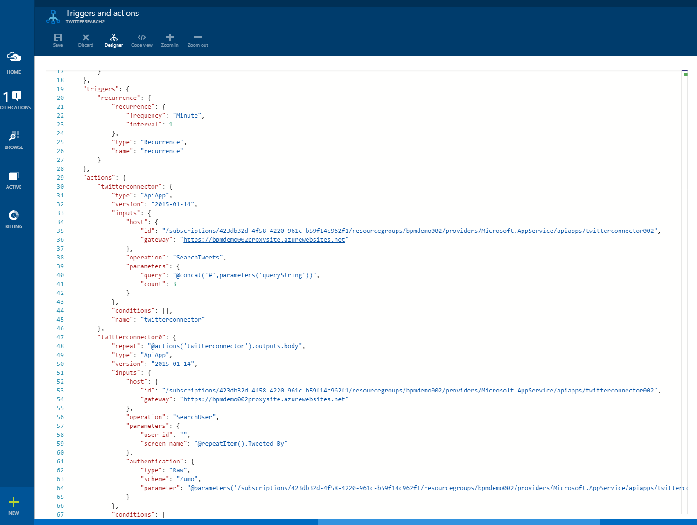

<properties 
    pageTitle="使用邏輯應用程式功能 |Microsoft Azure" 
    description="瞭解如何使用邏輯應用程式的進階的功能。" 
    authors="stepsic-microsoft-com" 
    manager="erikre" 
    editor="" 
    services="logic-apps" 
    documentationCenter=""/>

<tags
    ms.service="logic-apps"
    ms.workload="integration"
    ms.tgt_pltfrm="na"
    ms.devlang="na"
    ms.topic="article"
    ms.date="03/28/2016"
    ms.author="stepsic"/> 
    
# 使用邏輯應用程式功能

在[上一個主題](app-service-logic-create-a-logic-app.md)中，您可以建立您的第一個邏輯應用程式。 現在，我們會告訴您如何建立更完整的程序，使用應用程式服務邏輯應用程式。 本主題會介紹新的下列邏輯應用程式概念︰

- 條件邏輯，只有在特定條件符合時執行的動作。
- 若要編輯現有的邏輯應用程式的 [程式碼] 檢視。
- 啟動工作流程的選項。

完成本主題之前，您應該完成[建立新的邏輯應用程式](app-service-logic-create-a-logic-app.md)中的步驟進行。 在[Azure 入口網站]，瀏覽至您的邏輯應用程式，然後按一下 [編輯邏輯應用程式定義的摘要中的 [**觸發程序和動作**。

## 參考資料

您可能會發現下列文件有幫助︰

- [管理及執行階段 REST Api](https://msdn.microsoft.com/library/azure/mt643787.aspx) -包括如何直接叫用邏輯應用程式
- [語言參考](https://msdn.microsoft.com/library/azure/mt643789.aspx)函數運算式所有支援的完整清單
- [觸發程序和動作類型](https://msdn.microsoft.com/library/azure/mt643939.aspx)-不同類型的動作，並會顯示的輸入
- [應用程式概觀服務](../app-service/app-service-value-prop-what-is.md)描述的哪些元件，可選擇何時建立解決方案

## 新增條件邏輯

雖然原始流程運作，有一些可能可以改善的區域。 

### 條件
此邏輯應用程式可能會導致您收到大量電子郵件。 下列步驟中加入邏輯，以確定貼入 tweet 來自某人的追蹤者以特定數字時，才能接收電子郵件。 

1. 按一下加號，然後尋找 Twitter*取得使用者*的動作]。

2. 將**以 Tweeted**欄位中從觸發程序，以取得 Twitter 使用者的相關資訊。

    

3. 同樣地，按一下加號，但這次選取 [**新增條件**

4. 在第一個方塊中，按一下 [**取得使用者**若要尋找 [**粉絲次數**] 欄位下方的**...** ]。

5. 在下拉式清單中，選取 [**大於**

6. 在第二個方塊中輸入您想要讓使用者擁有的追蹤者的數目。

    

7.  最後，拖放電子郵件] 方塊到**如果是**] 方塊。 這表示您只會符合實行項目計數時收到電子郵件。

## 重複使用 forEach 清單

ForEach 循環播放指定重複執行動作，移至陣列。 如果不是陣列流程會失敗。 例如，如果您有 action1 輸出陣列的郵件，且您想要傳送每封郵件，您可以包含此 forEach 陳述式內容中的動作︰ forEach:"@action('action1').outputs.messages"
 

## 若要編輯之邏輯應用程式中使用的程式碼檢視

除了設計工具中，您可以直接編輯，如下所示定義邏輯應用程式的程式碼。 

1. 按一下命令列中的 [**程式碼檢視**] 按鈕。 

    隨即會顯示您剛建立的定義完整編輯器。

    

    藉由使用文字編輯器] 中，您可以複製並貼上相同的邏輯應用程式或邏輯應用程式之間的動作的任何數字。 您可以輕鬆從新增或移除整個區段在定義，您也可以與其他人共用定義。

2. 在 [程式碼] 檢視中進行變更之後，只要按一下 [**儲存**]。 

### 參數
有僅能在程式碼檢視中的邏輯應用程式的部分功能。 以下其中一個範例是參數。 參數讓您更輕鬆地重複使用的值，整個邏輯應用程式。 例如，如果您想要在多個動作中的使用的電子郵件地址，您應該做為參數進行定義。

下列更新現有的查詢字詞中使用參數邏輯應用程式。

1. 在 [程式碼] 檢視中，找出`parameters : {}`物件，然後插入下列主題物件︰

        "topic" : {
            "type" : "string",
            "defaultValue" : "MicrosoftAzure"
        }
    
2. 向下捲動至`twitterconnector`動作]，找出查詢值]，然後取代`#@{parameters('topic')}`。
    您也可以使用**concat**函數來結合在一起兩個或多個字串，例如︰`@concat('#',parameters('topic'))`與上面相同。 
 
參數是拉出值，您可能會變更常用的好方法。 當您需要在不同環境中的參數會覆寫時尤其有用。 如需有關如何根據環境的參數會覆寫的詳細資訊，請參閱我們[REST API 文件](https://msdn.microsoft.com/library/mt643787.aspx)。

現在，當您按一下 [**儲存**]，每小時您取得已傳遞至一個稱為**傳出 tweets**您 Dropbox 中資料夾的 5 個以上 retweets 任何新推文。

若要進一步瞭解邏輯應用程式定義，請參閱[作者邏輯應用程式定義](app-service-logic-author-definitions.md)。

## 啟動邏輯應用程式工作流程
有數種不同的選項，以開始在您邏輯應用程式中定義工作流程。 啟動工作流程可以隨時視需要在[Azure 入口網站]。

### 循環引動程序
循環觸發程序會在您指定的時間間隔執行。 如果觸發程序的條件邏輯，觸發程序會決定需要執行工作流程。 觸發程序會指出應該執行以傳回`200`狀態碼。 如果不需要執行，就會傳回`202`狀態碼。

### 使用 REST Api 的回撥
服務可以呼叫啟動工作流程的邏輯應用程式端點。 如需詳細資訊，請參閱[為可呼叫端點的邏輯應用程式](app-service-logic-connector-http.md)。 若要開始這種邏輯應用程式視需要，按一下 [**立即執行**] 按鈕上的命令列。 

<!-- Shared links -->
[Azure 入口網站]: https://portal.azure.com 