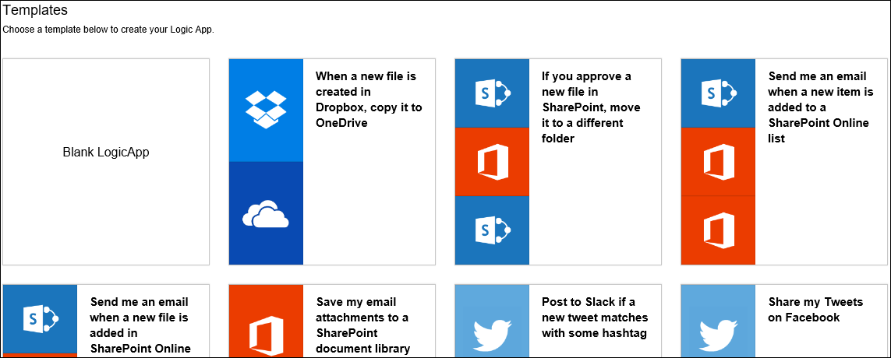
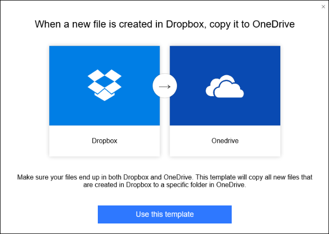
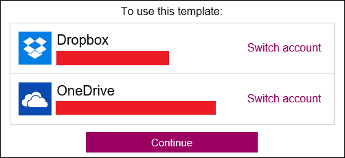
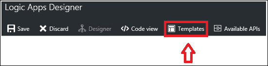

<properties
 pageTitle="邏輯應用程式範本 |Microsoft Azure"
 description="瞭解如何使用預先建立的邏輯應用程式範本可協助您快速入門"
 authors="kevinlam1"
 manager="dwrede"
 editor=""
 services="app-service\logic"
 documentationCenter=""/>

<tags
    ms.service="app-service-logic"
    ms.workload="integration"
    ms.tgt_pltfrm="na"
    ms.devlang="na"
    ms.topic="article"
    ms.date="08/24/2016"
    ms.author="klam"/>

# 邏輯應用程式範本

## 什麼是邏輯應用程式範本

邏輯應用程式範本是一種預先建立的邏輯應用程式，您可以使用快速開始建立您自己的工作流程。 

這些範本都可以使用邏輯應用程式內建的各種模式的好方法。 您可以使用這些範本為-或修改以符合您的狀況。

## 可用的範本的概觀

有許多目前已發佈邏輯應用程式平台的可用範本。 如下所示一些範例類別]，以及用於，連接器類型。

### 企業雲端範本
整合 Dynamics CRM、 Salesforce、 方塊、 Azure Blob 和其他連接器您企業的雲端需求的範本。 部分範例範本包含組織您的潛在客戶和備份您的公司檔案資料的可以使用這些做什麼。

### 企業整合套件範本
設定的 VETER 驗證、 擷取、 轉換、 豐富 (路由） 管線，接收 X12 EDI AS2 在文件和轉換為 XML，以及以 X12 和 AS2 郵件處理。

### 通訊協定圖樣範本
這些範本包含包含通訊協定模式，例如要求回應透過 HTTP，以及整合 FTP 以及 SFTP 邏輯應用程式。 使用這些存在於，或為基礎建立更複雜的通訊協定模式。  

### 個人生產力範本
協助改善個人生產力的圖樣包含範本，設定每日提醒、 變成待辦事項清單中的重要工作項目和自動化下單一使用者的 「 核准 」 步驟冗長的工作。

### 消費者雲端範本
簡單的整合與社交媒體服務，例如 Twitter、 可寬延時間，以及電子郵件，加強社交媒體行銷計劃最後能夠的範本。 這些也包含多雲複製，例如，可協助您在傳統上重複的工作儲存所花費的時間，以提高生產力的範本。 

## 如何建立使用範本的邏輯應用程式 

若要開始使用邏輯應用程式範本，請移至邏輯應用程式設計工具。 如果您開啟現有的邏輯應用程式輸入設計工具，邏輯應用程式會自動載入設計工具] 檢視中。 不過，如果您要建立新的邏輯應用程式，您會看到以下畫面。  
   

從這個畫面中，您可以選擇開頭的空白邏輯應用程式或預先建立的範本。 如果您選取其中一個範本，您所提供的其他資訊。 在此範例中，我們使用*Dropbox 中建立新的檔案時將它複製到 OneDrive*的範本。  
   

如果您選擇使用範本，只要選取 [*使用此範本*] 按鈕。 您會需要登入以您帳戶的連接器利用範本。 或者，如果您先前已建立這些連接器連線，您可以選取繼續如下所示。  
   

建立連線，並選取 [*繼續*之後, 邏輯應用程式會在 [設計] 檢視中開啟。  
   

在上述範例中，在此情況下，有許多範本，某些必要的屬性欄位可能填寫內連接器;不過，部分仍可能需要值才能正確部署邏輯應用程式。 如果您嘗試要部署而不需要輸入的某些欄位遺失時，您會顯示任何錯誤訊息通知。

如果您想要回到 [範本檢視器]，選取 [*範本*] 按鈕上方導覽列中。 切換回範本 viewer，您會遺失任何未儲存的進度。 之前切換回範本 viewer，您會看到通知您的警告訊息。  
   

## 如何部署從範本建立的邏輯應用程式

您有載入您的範本，並進行任何所需的變更，請選取儲存] 按鈕左上角。 這樣會儲存並發佈您的邏輯應用程式。  
   

如果您想要在上的詳細資訊，如何新增更多的步驟，將現有的邏輯應用程式範本，或進行編輯一般而言，了解更多在[建立邏輯應用程式](app-service-logic-create-a-logic-app.md)。