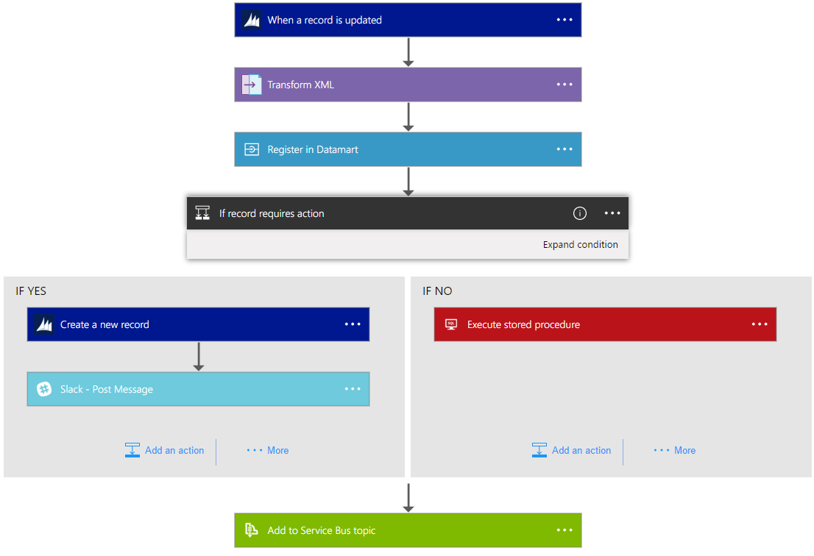

<properties 
    pageTitle="什麼是邏輯應用程式？" 
    description="深入瞭解應用程式服務邏輯應用程式" 
    authors="kevinlam1" 
    manager="dwrede" 
    editor="" 
    services="logic-apps" 
    documentationCenter=""/>

<tags
    ms.service="logic-apps"
    ms.workload="na"
    ms.tgt_pltfrm="na"
    ms.devlang="na"
    ms.topic="hero-article" 
    ms.date="10/12/2016"
    ms.author="klam"/>

# 什麼是邏輯應用程式？

邏輯應用程式提供簡化和雲端中實作可調整的整合與工作流程的方法。 它會提供視覺化的模型和自動化程序為一系列的步驟，稱為 [工作流程設計工具。  在雲端與內部部署至快速整合服務及通訊協定之間有[許多的連接器](../connectors/apis-list.md)。  邏輯應用程式會開始觸發程序 （類似 「 當帳戶新增到 Dynamics CRM 時 」） 及之後引發就可以開始許多組合的動作、 轉換及條件邏輯。

使用邏輯應用程式的優點包括下列各項︰  

- 設計複雜的程序使用容易理解的設計工具以節省時間
- 流暢地實作模式與工作流程，，否則很難實作程式碼
- 快速入門從範本
- 自訂您的邏輯應用程式，使用您自己自訂的 Api、 程式碼及動作
- 連線並在內部部署與雲端之間 g-mail 不同系統
- 與最高級整合支援 BizTalk 伺服器、 API 管理、 Azure 函數和 Azure 服務匯流排人員建立

邏輯應用程式是完全受管理的 iPaaS （整合平台的服務） 可讓不需要擔心建置主機服務、 延展性、 可用性和管理的開發人員。  邏輯應用程式會縮放會自動以符合需求。

如上所述，以邏輯應用程式，您可以自動化商務程序。 以下是幾個範例︰  
 
* 移動檔案到 FTP 伺服器上傳到 Azure 儲存體
* 程序與傳送訂單跨內部部署與雲端系統
* 監控有關特定主題的所有推文、 分析舉動中，並建立通知和項目需要補充資料的工作。

全部從視覺化設計工具，而不需要撰寫程式碼，您可以設定這些案例。 快速入門[建置邏輯應用程式現在][create]。  撰寫-之後邏輯應用程式可能會[快速部署及重新設定](app-service-logic-create-deploy-template.md)跨多個環境和區域。

## 為什麼邏輯應用程式？

邏輯應用程式將帶入企業整合空間的速度與延展性。  設計工具] 的使用簡易，各種不同的可用引動程序和動作和功能強大的管理工具進行集中管理您的 Api 比以前更容易。  為企業移往 digitalization 時，邏輯應用程式可讓您在一起連接舊版和尖端系統。

此外，與[企業整合帳戶]我們[biztalk]成熟化整合案例使用的[XML 訊息]，您可以擴充[xml]，[交易夥伴管理][tpm]，及其他內容。

- **使用簡單的設計工具**-邏輯應用程式可設計的端對端瀏覽器中，或使用 Visual Studio 工具。 當您建立的 GitHub 問題時，請啟動引動程序-從一個簡單的排程。 然後協調使用豐富型的連接器圖庫的動作的任何數字。

- **連線 Api 輕鬆**-很容易描述的偶數撰寫任務很難實作程式碼。 邏輯應用程式可讓您更容易連接不同的系統。 想要連接您的雲端行銷您的內部部署的解決方案帳單系統？ 想要集中管理的 Api 以及系統與企業版服務匯流排訊息？ 邏輯應用程式是最快的最可靠的方式進行這些問題的解決方案。

- **從範本的快速入門**-可協助您開始使用我們所提供[的範本藝廊][ templates] ，讓您快速建立一些常見的解決方案。 從進階 B2B 解決方案簡單 SaaS 連線能力，及甚至幾的是只 「 有趣 」-庫] 是最快的方法，瞭解如何開始使用邏輯應用程式的能力。

- **擴充培食物增益集**-沒有看到您所需要的連接器？ 邏輯應用程式是設計用來使用您自己的 Api 和程式碼。您可以輕鬆建立您自己的 API 應用程式，使用自訂的連接器，或撥入要執行的程式碼視需要的程式碼片段的[Azure 函數](https://functions.azure.com)。 

- **實數整合威力**-啟動輕鬆，並視需要放大。 邏輯應用程式可以輕鬆地利用 BizTalk，Microsoft 的產業前置整合解決方案啟用整合專業人員，以建立所需的解決方案。 瞭解更多有關[企業整合套件](./app-service-logic-enterprise-integration-overview.md)。

## 邏輯應用程式的概念

以下是部分組成的邏輯應用程式體驗的重要部分。 

- **工作流程**邏輯應用程式提供圖形的方式來建立您的商務程序為一系列的步驟，或是工作流程的模型。
- **受管理的連接器**-邏輯應用程式需要存取資料和服務。 受管理的連接器會建立來幫助您是連線到，然後使用您的資料。 請參閱提供立即[管理接點]的連接器的清單[managedapis]。
- **觸發程序**-某些受管理的連接器也可以將其做為引動程序。 觸發程序會啟動新根據特定的事件，例如所收到的電子郵件] 或 [Azure 儲存體帳戶中的變更工作流程的執行個體。
-  **動作**-每個工作流程中的觸發程序呼叫動作後的步驟。 每個動作通常是對應到您的受管理的連接器或自訂的 API 應用程式的運算。
- **企業整合套件**-更進階的整合案例，邏輯應用程式的包含 BizTalk 的能力。 BizTalk 是 Microsoft 產業前置整合平台。 企業整合套件連接器可讓您輕鬆地包含驗證、 轉換，及更多] 中的邏輯應用程式工作流程。

## 快速入門  

- 若要開始使用邏輯應用程式，請依照[建立邏輯應用程式]的[create]教學課程。  
- [檢視一般範例與案例](app-service-logic-examples-and-scenarios.md)
- [您可以自動化商務程序，以邏輯應用程式](http://channel9.msdn.com/Events/Build/2016/T694) 
- [瞭解如何將您的系統整合邏輯應用程式](http://channel9.msdn.com/Events/Build/2016/P462)

[biztalk]: app-service-logic-enterprise-integration-accounts.md
[appservice]: ../app-service/app-service-value-prop-what-is.md
[create]: app-service-logic-create-a-logic-app.md
[managedapis]: ../connectors/apis-list.md
[tpm]: app-service-logic-enterprise-integration-accounts.md
[xml]: app-service-logic-enterprise-integration-b2b.md
[templates]: app-service-logic-use-logic-app-templates.md
