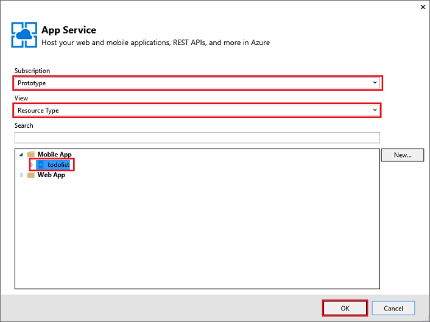

<properties
    pageTitle="如何使用.NET 後端伺服器 SDK 的行動應用程式 |Azure 應用程式服務"
    description="瞭解如何使用.NET 後端伺服器 SDK Azure 應用程式服務 Mobile 應用程式。"
    keywords="應用程式服務、 azure 應用程式服務、 行動應用程式、 行動訊息服務，縮放比例] 調整，應用程式部署，azure 應用程式部署"
    services="app-service\mobile"
    documentationCenter=""
    authors="adrianhall"
    manager="erikre"
    editor=""/>

<tags
    ms.service="app-service-mobile"
    ms.workload="mobile"
    ms.tgt_pltfrm="mobile-multiple"
    ms.devlang="dotnet"
    ms.topic="article"
    ms.date="10/01/2016"
    ms.author="adrianha"/>

# 使用.NET 後端伺服器 SDK Azure Mobile 應用程式

[AZURE.INCLUDE [app-service-mobile-selector-server-sdk](../../includes/app-service-mobile-selector-server-sdk.md)]

本主題說明如何使用金鑰 Azure 應用程式服務行動應用程式案例中的.NET 後端伺服器 SDK。 Azure 行動應用程式 SDK 可協助您使用行動用戶端從 ASP.NET 應用程式。

>[AZURE.TIP] [.NET server Azure Mobile 應用程式的 SDK] [ 2] GitHub 上開啟來源。 將存放庫包含包括整個伺服器 SDK 單位測試套件及一些範例專案的所有來源程式碼。

## 參照文件

伺服器 SDK 參照文件的位置︰ [Azure 行動應用程式.NET 參考][1]。

## 如何︰ 建立.NET Mobile 應用程式後端

如果您要開始新專案，您可以建立使用[Azure 入口網站]或 Visual Studio 應用程式服務應用程式。 您可以在本機上執行應用程式服務應用程式，或將專案發佈至雲端應用程式服務行動應用程式。  

如果您新增至現有的專案的行動裝置的功能，請參閱[下載並初始化 SDK](#install-sdk) ] 區段。

### 建立.NET 後端使用 Azure 入口網站

若要建立行動應用程式服務的後端，請依照[快速入門教學課程][3]或請遵循下列步驟︰

[AZURE.INCLUDE [app-service-mobile-dotnet-backend-create-new-service-classic](../../includes/app-service-mobile-dotnet-backend-create-new-service-classic.md)]

回_開始_刀，在 [**建立表格 API**，底下選擇**C#**做為您的**後端語言**。 按一下 [**下載**]，擷取壓縮的專案檔案至您的本機電腦，並開啟解決方案 Visual Studio 中。

### 建立使用 Visual Studio 2013 和 Visual Studio 2015.NET 後端

安裝[.NET Azure SDK] [ 4] (版本 2.9.0 或更新版本) 若要在 Visual Studio 建立 Azure Mobile 應用程式專案。 一旦您已安裝 SDK，建立 ASP.NET 應用程式使用下列步驟︰

1. 開啟**新的專案**] 對話方塊 (從*檔案* > **新增** > **專案...**)。
2. 展開**範本** > **Visual C#**和選取的**網頁**。
3. 選取 [ **ASP.NET Web 應用程式**]。
4. 填入的專案名稱。 然後按一下**[確定]**。
5. 在下_ASP.NET 4.5.2 範本_，選取**Azure 行動應用程式**。 核取 [ **host （主機） 在雲端**建立在雲端，您可以發佈此專案的行動裝置的後端]。
6. 按一下**[確定]**。

## 如何︰ 下載並初始化 SDK

使用上[NuGet.org]SDK。 此套件包含若要開始使用 SDK 所需的基本功能。 若要初始化 SDK，您需要**HttpConfiguration**物件上執行的動作。

### 安裝 SDK

若要安裝 SDK，以滑鼠右鍵按一下伺服器專案 Visual Studio 中，選取**管理 NuGet 封包**、 搜尋[Microsoft.Azure.Mobile.Server]套件，然後按一下 [**安裝**]。

###初始化伺服器專案

.NET 後端伺服器專案會類似於其他 ASP.NET 專案，包括 OWIN 啟動類別。 請確認您擁有參考 NuGet 套件`Microsoft.Owin.Host.SystemWeb`。 若要在 Visual Studio 中新增此課程，請以滑鼠右鍵按一下您的伺服器專案，然後選取 [**新增** > 
**新項目**，然後**Web** > **一般** > **OWIN 啟動類別**。  課程會產生下列屬性︰

    [assembly: OwinStartup(typeof(YourServiceName.YourStartupClassName))]

在 [ `Configuration()` OWIN 啟動類別的方法，使用**HttpConfiguration**物件設定 Azure Mobile 應用程式環境。
下列範例會初始化伺服器專案的新增功能︰

    // in OWIN startup class
    public void Configuration(IAppBuilder app)
    {
        HttpConfiguration config = new HttpConfiguration();

        new MobileAppConfiguration()
            // no added features
            .ApplyTo(config);

        app.UseWebApi(config);
    }

若要啟用個別的功能，您必須呼叫**規定**之前**MobileAppConfiguration**物件上呼叫延伸方法。 例如，下列程式碼會新增預設路由到所有的 API 控制站的屬性`[MobileAppController]`初始化時︰

    new MobileAppConfiguration()
        .MapApiControllers()
        .ApplyTo(config);

從 Azure portal server 快速入門通話**UseDefaultConfiguration()**。 此等於下列設定︰

        new MobileAppConfiguration()
            .AddMobileAppHomeController()             // from the Home package
            .MapApiControllers()
            .AddTables(                               // from the Tables package
                new MobileAppTableConfiguration()
                    .MapTableControllers()
                    .AddEntityFramework()             // from the Entity package
                )
            .AddPushNotifications()                   // from the Notifications package
            .MapLegacyCrossDomainController()         // from the CrossDomain package
            .ApplyTo(config);

使用副檔名方法如下︰

* `AddMobileAppHomeController()`提供預設 Azure Mobile 應用程式首頁。
* `MapApiControllers()`提供自訂的 API 功能，以裝飾 WebAPI 控制站的`[MobileAppController]`屬性。
* `AddTables()`提供的對應`/tables`表格控制站的結束點。
* `AddTablesWithEntityFramework()`已對應簡短手形`/tables`使用實體架構的結束點以控制站。
* `AddPushNotifications()`提供通知集線器註冊裝置的簡單的方法。
* `MapLegacyCrossDomainController()`提供本機開發標準 CORS 標題。

### SDK 副檔名

下列 NuGet 型擴充套件會提供各種行動裝置的功能可讓您的應用程式。 您啟用副檔名，您可以在初始化期間使用**MobileAppConfiguration**物件。

- [Microsoft.Azure.Mobile.Server.Quickstart]支援基本的行動應用程式設定。 加入初始化期間呼叫**UseDefaultConfiguration**擴充方法來設定。 這個延伸會包含下列副檔名︰ 通知、 驗證、 實體、 表格、 跨網域和常用套件。 行動應用程式快速入門提供 Azure 入口網站上使用此套件。

- [Microsoft.Azure.Mobile.Server.Home](http://www.nuget.org/packages/Microsoft.Azure.Mobile.Server.Home/) 
  實作預設*此行動應用程式會啟動並執行頁面*網站根目錄。 新增至設定，則可電話  **AddMobileAppHomeController**擴充方法。

- [Microsoft.Azure.Mobile.Server.Tables](http://www.nuget.org/packages/Microsoft.Azure.Mobile.Server.Tables/) 
  中包含的資料使用的類別和集向上資料管道的郵件。 新增至設定，則可電話**AddTables**擴充方法。

- [Microsoft.Azure.Mobile.Server.Entity](http://www.nuget.org/packages/Microsoft.Azure.Mobile.Server.Entity/) 
  啟用實體架構存取 SQL 資料庫中的資料。 新增至設定，則可電話**AddTablesWithEntityFramework**擴充方法。

- [Microsoft.Azure.Mobile.Server.Authentication]啟用驗證及設定向上用來驗證權杖 OWIN 介軟體。 新增至設定，則可電話**AddAppServiceAuthentication**  
  和**IAppBuilder**。**UseAppServiceAuthentication**擴充方法。

- [Microsoft.Azure.Mobile.Server.Notifications]可讓推播通知，並定義推入註冊結束點。 新增至設定，則可電話**AddPushNotifications**擴充方法。

- [Microsoft.Azure.Mobile.Server.CrossDomain](http://www.nuget.org/packages/Microsoft.Azure.Mobile.Server.CrossDomain/) 
  建立控制器所用舊版的網頁瀏覽器的資料，您的行動應用程式。 新增至設定，則可電話  **MapLegacyCrossDomainController**擴充方法。

- [Microsoft.Azure.Mobile.Server.Login]提供 AppServiceLoginHandler.CreateToken() 方法，也就是自訂驗證案例時所用的靜態方法。   

## 如何︰ 發佈伺服器專案

本節說明如何發佈從 Visual Studio.NET 後端專案。 您也可以部署後端專案使用給或任何涵蓋[Azure 應用程式服務部署文件](../app-service-web/web-sites-deploy.md)中的其他方法。

1. 在 Visual Studio 中，重新建立要還原 NuGet 套件的專案。

2. 在方案總管中，以滑鼠右鍵按一下專案，按一下 [**發佈**]。 第一次發佈，必須先定義發佈的設定檔。 如果您已經有定義的設定檔，您可以選取，然後按一下 [**發佈]**。

2. 如果選取 [發佈目標要求，請按一下 [ **Microsoft Azure 應用程式服務** > **下一步**，（如有需要），然後使用您的 Azure 認證登入。 
   Visual Studio 下載並安全地儲存您發佈直接從 Azure 的設定。

    

3. 選擇您的**訂閱**、 從**檢視**中選取 [**資源類型**、 展開**行動應用程式**，並按一下您的行動應用程式後端，然後按一下**[確定]**。

    

4. 確認發佈的設定檔資訊，然後按一下 [**發佈**]。

    

    已成功發佈您的行動應用程式後端，您會看到成功登陸頁面。

    

##如何︰ 定義表格控制器

定義表格控制器公開行動用戶端將 SQL 表格。  設定表格控制站需要三個步驟︰

1. 建立資料傳輸物件 (DTO) 的類別。
2. 設定行動 DbContext 類別中的表格參照。
3. 建立表格控制器。

資料傳輸物件 (DTO) 是純文字 C# 物件繼承自`EntityData`。  例如︰

    public class TodoItem : EntityData
    {
        public string Text { get; set; }
        public bool Complete {get; set;}
    }

DTO 用來定義中的 SQL 資料庫表格。  若要建立資料庫項目，請新增`DbSet<>`要使用的 DbContext 屬性。  Azure Mobile 應用程式的預設 project 範本，在稱為 DbContext `Models\MobileServiceContext.cs`:

    public class MobileServiceContext : DbContext
    {
        private const string connectionStringName = "Name=MS_TableConnectionString";

        public MobileServiceContext() : base(connectionStringName)
        {

        }

        public DbSet<TodoItem> TodoItems { get; set; }

        protected override void OnModelCreating(DbModelBuilder modelBuilder)
        {
            modelBuilder.Conventions.Add(
                new AttributeToColumnAnnotationConvention<TableColumnAttribute, string>(
                    "ServiceColumnTable", (property, attributes) => attributes.Single().ColumnType.ToString()));
        }
    }

如果您有安裝 Azure SDK，您現在可以建立的範本資料表控制站，如下所示︰

1. 以滑鼠右鍵按一下控制站資料夾，然後選取 [**新增** > **控制器...**。
2. 選取**Azure 行動應用程式表格控制器**選項，然後按一下 [**新增**]。
3. 在 [**新增控制器**] 對話方塊中︰
    * 在 [**模型類別**] 下拉式清單中，選取您新 DTO。
    * 在**DbContext**下拉式清單中，選取 [行動服務 DbContext 類別]。
    * 為您建立控制器名稱。
4. 按一下 [**新增**]。

快速入門伺服器專案的簡單的**TodoItemController**包含的範例。

### 如何︰ 調整表格分頁大小

根據預設，Azure Mobile 應用程式會傳回每個要求 50 記錄。  分頁可確保的用戶端不會不佔用其 UI 執行緒或伺服器的時間太長，確保良好的使用者體驗。 若要變更的表格分頁大小，增加 「 獲准查詢大小 」 的伺服器端和用戶端頁面大小的伺服器端 」 允許查詢大小] 使用調整`EnableQuery`屬性︰

    [EnableQuery(PageSize = 500)]

確保 PageSize 等於或大於用戶端要求的大小。  請參閱特定的用戶端如何文件，瞭解變更的用戶端頁面大小的詳細資訊。

## 如何︰ 定義自訂的 API 控制器

自訂的 API 控制器公開端點提供您的行動應用程式後端最基本功能。 您可以註冊 mobile 特定 API 的控制站，使用 [MobileAppController] 屬性。 `MobileAppController`屬性登錄路線、 設定行動應用程式 JSON 序列化程式，以及開啟[用戶端版本檢查](app-service-mobile-client-and-server-versioning.md)。

1. 在 Visual Studio 中，[控制站] 資料夾中，以滑鼠右鍵按一下，然後按一下 [**新增** > **控制器**，選取**Web API 2 控制器&mdash;空白**並按一下 [**新增**]。

2. 提供**控制器名稱**，例如`CustomController`，然後按一下 [**新增**]。

3. 在新的控制器類別檔案，新增下列使用陳述式︰

        using Microsoft.Azure.Mobile.Server.Config;

4. 將**[MobileAppController]**屬性套用至 API 控制器類別定義，如下列範例所示︰

        [MobileAppController]
        public class CustomController : ApiController
        {
              //...
        }

4. 在 App_Start/Startup.MobileApp.cs 檔案中加入通話**MapApiControllers**擴充的方法，如下列範例所示︰

        new MobileAppConfiguration()
            .MapApiControllers()
            .ApplyTo(config);

您也可以使用`UseDefaultConfiguration()`擴充方法，而不是`MapApiControllers()`。 沒有**MobileAppControllerAttribute**套用任何控制器仍然可以存取的用戶端，但它可能不正確地使用用戶端使用任何行動應用程式的用戶端 SDK。

## 如何︰ 使用 [驗證

Azure Mobile 應用程式使用應用程式服務驗證 / 來保護您的行動後端的授權。  本節說明如何在.NET 後端伺服器專案中執行下列驗證相關工作︰

+ [如何︰ 伺服器專案中新增驗證](#add-auth)
+ [如何︰ 使用您的應用程式的自訂驗證](#custom-auth)
+ [如何︰ 擷取驗證的使用者資訊](#user-info)
+ [如何︰ 限制授權的使用者的資料存取](#authorize)

### 如何︰ 伺服器專案中新增驗證

您可以新增至您的伺服器專案驗證延伸**MobileAppConfiguration**物件及設定 OWIN 介軟體。 當您安裝[Microsoft.Azure.Mobile.Server.Quickstart]套件，並呼叫**UseDefaultConfiguration**副檔名時，您可以直接跳到步驟 3。

1. 在 Visual Studio 中，安裝[Microsoft.Azure.Mobile.Server.Authentication]套件。

2. Startup.cs 專案檔案中新增的**設定**方法開頭的程式碼的下列行︰

        app.UseAppServiceAuthentication(config);

    此 OWIN 介軟體元件驗證的權杖發出的相關聯的應用程式服務閘道器。

3. 新增`[Authorize]`屬性的任何控制器或需要驗證的方法。 

若要瞭解如何以驗證您的行動應用程式後端的用戶端，請參閱[新增驗證您的應用程式](app-service-mobile-ios-get-started-users.md)。

### 如何︰ 使用您的應用程式的自訂驗證

如果您不想要使用其中一個驗證授權方式應用程式服務提供者，您可以實作您自己的登入系統。 安裝協助您驗證的權杖代[Microsoft.Azure.Mobile.Server.Login]套件。  提供您自己的程式碼驗證使用者認證。 例如，您可能會檢查對 salt 和雜湊資料庫中的密碼。 在下面的，範例`isValidAssertion()`方法 （其他地方定義） 負責這些檢查。

自訂驗證公開建立 ApiController 並公開`register`和`login`動作。 用戶端應該使用自訂 UI，以從使用者收集的資訊。  使用標準 HTTP 文章通話 api 然後提交資訊。 權杖伺服器驗證判斷提示之後, 會發出使用`AppServiceLoginHandler.CreateToken()`方法。  ApiController**不應**使用`[MobileAppController]`屬性。 

範例`login`動作︰

        public IHttpActionResult Post([FromBody] JObject assertion)
        {
            if (isValidAssertion(assertion)) // user-defined function, checks against a database
            {
                JwtSecurityToken token = AppServiceLoginHandler.CreateToken(new Claim[] { new Claim(JwtRegisteredClaimNames.Sub, assertion["username"]) },
                    mySigningKey,
                    myAppURL,
                    myAppURL,
                    TimeSpan.FromHours(24) );
                return Ok(new LoginResult()
                {
                    AuthenticationToken = token.RawData,
                    User = new LoginResultUser() { UserId = userName.ToString() }
                });
            }
            else // user assertion was not valid
            {
                return this.Request.CreateUnauthorizedResponse();
            }
        }

在上述範例中，LoginResult 和 LoginResultUser 是序列化公開必要的屬性的物件。 用戶端預期要傳回為表單的 JSON 物件的登入回覆︰

        {
            "authenticationToken": "<token>",
            "user": {
                "userId": "<userId>"
            }
        }

`AppServiceLoginHandler.CreateToken()`方法包含對_象_和_發行者_參數。 兩個參數設定為使用 HTTPS 配置應用程式根目錄的 URL。 同樣地，您應該將為您的應用程式的值的簽署金鑰_secretKey_ 。 請勿傳送用戶端中的簽章鍵，其可使用的薄荷澆鍵並模擬使用者。 您可以取得簽署金鑰裝載應用程式服務中的參照時_網站\_驗證\_簽署\_鍵_環境變數。 如有需要在本機的偵錯內容，請遵循擷取索引鍵，並將其儲存為應用程式設定為 [[本機偵錯時，使用 [驗證](#local-debug)] 區段中的指示進行。

其他宣告和到期日，也可能會包含發行的權杖。  最小，發行的權杖必須包含主旨 (**sub**) 宣告。

您可以在支援標準的用戶端`loginAsync()`超載驗證傳送的方法。  如果用戶端呼叫`client.loginAsync('custom');`登入，您將必須`/.auth/login/custom`。  您可以設定自訂驗證控制器使用的傳送`MapHttpRoute()`:

    config.Routes.MapHttpRoute("custom", ".auth/login/custom", new { controller = "CustomAuth" });

>[AZURE.TIP] 使用`loginAsync()`方法可確保驗證權杖會附加至每個服務的後續通話。

###如何︰ 擷取驗證的使用者資訊

當使用者已驗證的應用程式服務時，您可以存取.NET 後端程式碼指派的使用者識別碼及其他資訊。 使用者資訊可以用於後端決策授權。 下列程式碼會取得邀請相關聯的使用者識別碼︰

    // Get the SID of the current user.
    var claimsPrincipal = this.User as ClaimsPrincipal;
    string sid = claimsPrincipal.FindFirst(ClaimTypes.NameIdentifier).Value;

SID 衍生自的提供者專屬使用者識別碼，而是靜態指定的使用者] 和 [登入提供者。  SID 的是空值無效的驗證的權杖。

應用程式服務讓您可以從您的登入提供者要求特定宣告。 每個身分識別提供者可以提供使用身分識別提供者 SDK 的詳細資訊。  例如，您可以使用 Facebook 圖形 API 朋友資訊。  您可以指定在 Azure 入口網站提供者刀要求的宣告。 某些宣告需要身分識別提供者的其他設定。

下列程式碼呼叫以取得登入認證，包括所需的要求針對 Facebook 圖形 API 的存取權杖**GetAppServiceIdentityAsync**延伸方法︰

    // Get the credentials for the logged-in user.
    var credentials =
        await this.User
        .GetAppServiceIdentityAsync<FacebookCredentials>(this.Request);

    if (credentials.Provider == "Facebook")
    {
        // Create a query string with the Facebook access token.
        var fbRequestUrl = "https://graph.facebook.com/me/feed?access_token="
            + credentials.AccessToken;

        // Create an HttpClient request.
        var client = new System.Net.Http.HttpClient();

        // Request the current user info from Facebook.
        var resp = await client.GetAsync(fbRequestUrl);
        resp.EnsureSuccessStatusCode();

        // Do something here with the Facebook user information.
        var fbInfo = await resp.Content.ReadAsStringAsync();
    }

新增使用陳述式`System.Security.Principal`提供**GetAppServiceIdentityAsync**副檔名方法。

### 如何︰ 限制授權的使用者的資料存取

前一節中，我們會示範如何擷取已驗證的使用者的使用者識別碼。 您可以限制存取資料及其他資源根據這個值。 例如，將使用者識別碼欄新增至表格，並篩選查詢結果，您可以的使用者識別碼是一個簡單的方法，以限制傳回的資料，只是要授權的使用者。 只有在 SID 符合 TodoItem 表格中的 [使用者識別碼] 欄中的值時，下列程式碼會傳回資料列︰

    // Get the SID of the current user.
    var claimsPrincipal = this.User as ClaimsPrincipal;
    string sid = claimsPrincipal.FindFirst(ClaimTypes.NameIdentifier).Value;

    // Only return data rows that belong to the current user.
    return Query().Where(t => t.UserId == sid);

`Query()`方法會傳回`IQueryable`的可以管理 LINQ 處理篩選。

## 如何︰ 新增推入通知伺服器專案

新增至伺服器專案的推入通知來延伸**MobileAppConfiguration**物件和建立通知集線器用戶端。

1. 在 Visual Studio 中，以滑鼠右鍵按一下伺服器專案並按一下 [**管理 NuGet 套件**，搜尋`Microsoft.Azure.Mobile.Server.Notifications`，然後按一下 [**安裝**]。 

2. 重複此步驟，以安裝`Microsoft.Azure.NotificationHubs`套件，包括通知集線器用戶端文件庫。

3. 在 [App_Start/Startup.MobileApp.cs，並新增**AddPushNotifications()**擴充方法在通話期間初始化︰

        new MobileAppConfiguration()
            // other features...
            .AddPushNotifications()
            .ApplyTo(config);

4. 新增建立通知集線器用戶端的下列程式碼︰

        // Get the settings for the server project.
        HttpConfiguration config = this.Configuration;
        MobileAppSettingsDictionary settings =
            config.GetMobileAppSettingsProvider().GetMobileAppSettings();

        // Get the Notification Hubs credentials for the Mobile App.
        string notificationHubName = settings.NotificationHubName;
        string notificationHubConnection = settings
            .Connections[MobileAppSettingsKeys.NotificationHubConnectionString].ConnectionString;

        // Create a new Notification Hub client.
        NotificationHubClient hub = NotificationHubClient
            .CreateClientFromConnectionString(notificationHubConnection, notificationHubName);

您現在可以使用通知集線器用戶端推入通知傳送至 [已註冊的裝置。 如需詳細資訊，請參閱[新增推入通知您的應用程式](app-service-mobile-ios-get-started-push.md)。 若要進一步瞭解通知集線器，請參閱[通知集線器概觀](../notification-hubs/notification-hubs-push-notification-overview.md)。

##如何︰ 啟用目標推入使用標籤

通知集線器可讓您使用標記，傳送給特定的登錄的目標的通知。 會自動建立多個標籤︰

* 安裝識別碼識別特定的裝置。
* 根據 SID 經過驗證的使用者識別碼識別特定的使用者。

安裝識別碼可以從**MobileServiceClient**的**installationId**屬性存取。  下列範例會示範如何使用安裝識別碼新增標籤至特定的通知集線器安裝︰

    hub.PatchInstallation("my-installation-id", new[]
    {
        new PartialUpdateOperation
        {
            Operation = UpdateOperationType.Add,
            Path = "/tags",
            Value = "{my-tag}"
        }
    });

後端建立安裝時，會忽略用戶端推入通知註冊期間提供任何標籤。 若要啟用用戶端來新增標籤至安裝，您必須建立自訂的 API 可新增標籤使用的前一個模式。 

請參閱[用戶端新增的推入通知標記][5]在應用程式服務行動應用程式完成的快速入門範例中的範例。

##如何︰ 已驗證的使用者傳送推入通知

當已驗證的使用者註冊推入通知時，使用者識別碼標記會自動新增註冊。 藉由使用這個標記，您可以傳送推入通知登錄該人員的所有裝置。 下列程式碼會要求使用者的 SID，並會將範本推入通知傳送給每個裝置註冊，該人員的︰

    // Get the current user SID and create a tag for the current user.
    var claimsPrincipal = this.User as ClaimsPrincipal;
    string sid = claimsPrincipal.FindFirst(ClaimTypes.NameIdentifier).Value;
    string userTag = "_UserId:" + sid;

    // Build a dictionary for the template with the item message text.
    var notification = new Dictionary<string, string> { { "message", item.Text } };

    // Send a template notification to the user ID.
    await hub.SendTemplateNotificationAsync(notification, userTag);

當您註冊從經過驗證的用戶端的推入通知，請確定該驗證完成再嘗試登錄。 如需詳細資訊，請參閱[推入使用者][6]中.NET 後端的應用程式服務行動應用程式完成的快速入門範例。

## 如何︰ 偵錯和疑難排解.NET 伺服器 SDK

Azure 應用程式服務會提供幾個偵錯時，及疑難排解 ASP.NET 應用程式的方法︰

- [監視 Azure 的應用程式服務](../app-service-web/web-sites-monitor.md)
- [啟用診斷記錄在 Azure 應用程式服務](../app-service-web/web-sites-enable-diagnostic-log.md)
- [疑難排解在 Visual Studio 中 Azure 應用程式服務](../app-service-web/web-sites-dotnet-troubleshoot-visual-studio.md)

### 記錄

您可以使用標準 ASP.NET 追蹤撰寫寫入應用程式服務診斷記錄。 您可以將寫入記錄檔，您必須先啟用診斷在您的行動應用程式後端。

若要啟用診斷和寫入記錄檔︰

1. 遵循[如何啟用診斷](../app-service-web/web-sites-enable-diagnostic-log.md#enablediag)] 中的步驟。

2. 新增下列程式碼檔案中使用陳述式︰

        using System.Web.Http.Tracing;

3. 建立以下列方式撰寫.NET 後端診斷記錄，追蹤作者︰

        ITraceWriter traceWriter = this.Configuration.Services.GetTraceWriter();
        traceWriter.Info("Hello, World");

4. 重新發佈您的伺服器專案，並存取 Mobile 應用程式後端執行記錄功能的程式碼路徑。

5. 下載並評估中所述的記錄，[如何︰ 下載記錄](../app-service-web/web-sites-enable-diagnostic-log.md#download)。

### 本機驗證的偵錯

您可以執行您的應用程式本機測試變更之前先將它們發佈至雲端。 大部分的 Azure Mobile 應用程式 backends，請按*F5* Visual Studio 中。 然而，有一些其他考量時使用驗證。

您必須有雲端行動應用程式的應用程式服務驗證和授權設定，而且您的用戶端必須擁有雲端端點指定為替代的登入 host （主機）。 請參閱您所需的特定步驟的用戶端平台的文件。

請確定您行動裝置的後端[Microsoft.Azure.Mobile.Server.Authentication]安裝。 然後，在您的應用程式 OWIN 啟動類別中，新增下列之後`MobileAppConfiguration`，已經套用到您`HttpConfiguration`:

        app.UseAppServiceAuthentication(new AppServiceAuthenticationOptions()
        {
            SigningKey = ConfigurationManager.AppSettings["authSigningKey"],
            ValidAudiences = new[] { ConfigurationManager.AppSettings["authAudience"] },
            ValidIssuers = new[] { ConfigurationManager.AppSettings["authIssuer"] },
            TokenHandler = config.GetAppServiceTokenHandler()
        });

在上述範例中，您應該設定_authAudience_和_authIssuer_應用程式中每個 Web.config 檔案會使用 HTTPS 配置應用程式根目錄的 URL。 同樣地，您應該將為您的應用程式的值的簽署金鑰_authSigningKey_ 。 若要取得簽署機碼︰

1. 瀏覽至您的應用程式中[Azure 入口網站] 
2. 按一下 [**工具**] **Kudu**，可讓您**移**]。
3. 在 Kudu 管理網站上，按一下 [**環境**。
4. 尋找的值_網站\_驗證\_簽署\_鍵_。 

使用您在本機的應用程式 config _authSigningKey_參數的簽章鍵。  現在您行動裝置的後端配驗證權杖本機，在執行中時，用戶端取得權杖從雲端結束點。

[1]: https://msdn.microsoft.com/library/azure/dn961176.aspx
[2]: https://github.com/Azure/azure-mobile-apps-net-server
[3]: app-service-mobile-ios-get-started.md
[4]: https://azure.microsoft.com/downloads/
[5]: https://github.com/Azure-Samples/app-service-mobile-dotnet-backend-quickstart/blob/master/README.md#client-added-push-notification-tags
[6]: https://github.com/Azure-Samples/app-service-mobile-dotnet-backend-quickstart/blob/master/README.md#push-to-users
[Azure 入口網站]: https://portal.azure.com
[NuGet.org]: http://www.nuget.org/
[Microsoft.Azure.Mobile.Server]: http://www.nuget.org/packages/Microsoft.Azure.Mobile.Server/
[Microsoft.Azure.Mobile.Server.Quickstart]: http://www.nuget.org/packages/Microsoft.Azure.Mobile.Server.Quickstart/
[Microsoft.Azure.Mobile.Server.Authentication]: http://www.nuget.org/packages/Microsoft.Azure.Mobile.Server.Authentication/
[Microsoft.Azure.Mobile.Server.Login]: http://www.nuget.org/packages/Microsoft.Azure.Mobile.Server.Login/
[Microsoft.Azure.Mobile.Server.Notifications]: http://www.nuget.org/packages/Microsoft.Azure.Mobile.Server.Notifications/
[MapHttpAttributeRoutes]: https://msdn.microsoft.com/library/dn479134(v=vs.118).aspx

