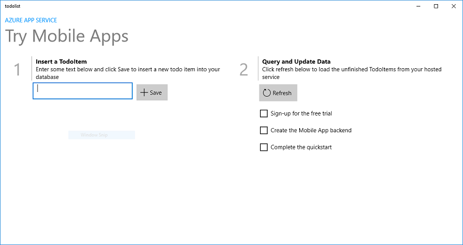
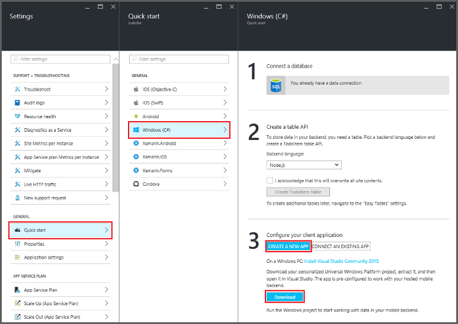

<properties
    pageTitle="建立通用 Windows 平台 (UWP)，使用行動應用程式 |Microsoft Azure"
    description="請遵循此教學課程以開始使用通用 Windows 平台 (UWP) 應用程式開發 C#、 Visual Basic 或 JavaScript backends Azure 行動應用程式。"
    services="app-service\mobile"
    documentationCenter="windows"
    authors="adrianhall"
    manager="erikre"
    editor=""/>

<tags
    ms.service="app-service-mobile"
    ms.workload="mobile"
    ms.tgt_pltfrm="mobile-windows"
    ms.devlang="dotnet"
    ms.topic="hero-article"
    ms.date="10/01/2016"
    ms.author="adrianha"/>

#建立 Windows 應用程式

[AZURE.INCLUDE [app-service-mobile-selector-get-started](../../includes/app-service-mobile-selector-get-started.md)]

##概觀

本教學課程教您如何將雲端後端服務新增至通用 Windows 平台 (UWP) 應用程式。 如需詳細資訊，請參閱[什麼是行動應用程式](app-service-mobile-value-prop.md)。 以下是完成應用程式的螢幕擷取畫面︰

   
在桌上型電腦上執行。 

  
在電話上執行

完成此教學課程是所有其他行動應用程式的教學課程 UWP 應用程式的必要條件。 

##必要條件

若要完成此教學課程中，您需要下列項目︰

* 使用中的 Azure 帳戶。 如果您沒有帳戶，您可以註冊 Azure 試用版，並取得最多 10 個可用的行動應用程式，您還是可以繼續使用您的試用期結束後，還是。 如需詳細資訊，請參閱[Azure 免費試用版](https://azure.microsoft.com/pricing/free-trial/)。

* [Visual Studio 社群 2015年]或更新版本。

>[AZURE.NOTE] 如果您想要快速入門 Azure 應用程式服務註冊 Azure 帳戶之前，請移至[嘗試應用程式服務](https://tryappservice.azure.com/?appServiceName=mobile)。 那里，您可以立即建立短暫入門行動應用程式的應用程式服務，必要時，沒有信用卡和沒有承諾。

##建立新的 Azure Mobile 應用程式後端

請遵循這些步驟來建立新的行動應用程式後端。

[AZURE.INCLUDE [app-service-mobile-dotnet-backend-create-new-service](../../includes/app-service-mobile-dotnet-backend-create-new-service.md)]

現在有佈建後可讓您的行動用戶端應用程式 Azure Mobile 應用程式後端。 接下來，您將下載伺服器專案進行簡單的 「 待辦清單 」 後端並將其發佈至 Azure。

## 設定伺服器專案

[AZURE.INCLUDE [app-service-mobile-configure-new-backend.md](../../includes/app-service-mobile-configure-new-backend.md)]

##下載並執行用戶端專案

一旦您已設定您的行動應用程式後端，您可以建立新的用戶端應用程式，或修改現有的應用程式連線至 Azure。 在此區段中，您可以下載 UWP 應用程式範本專案自訂連線到您的行動應用程式後端。

1. 回到您的行動應用程式後端的**快速入門**刀，按一下 [**建立新的應用程式** > **下載**，然後解壓縮壓縮的專案檔案至您的本機電腦。

    

3. （選用）加入和伺服器專案相同的方案 UWP 應用程式專案。 此容易偵錯和測試應用程式，然後後端在相同的 Visual Studio 方案，如果您選擇要執行此作業。 若要新增方案 UWP 應用程式專案，您必須使用 Visual Studio 2015 或更新版本。

4. UWP 應用程式為啟動專案之後，按 F5 鍵部署，並執行應用程式。

5. 在應用程式，在 [**插入 TodoItem**文字方塊中，輸入有意義的文字，*完成本教學課程*，例如，然後按一下**儲存**。

    

    這是新的行動應用程式後端裝載於 Azure 傳送文章要求。

6. （選用）停止應用程式，並在不同的裝置或行動模擬器上重新啟動它。

    

    請注意 UWP 應用程式啟動後，會從 Azure 載入的上一個步驟所儲存的資料。 

##後續步驟

* [將驗證新增至您的應用程式](app-service-mobile-windows-store-dotnet-get-started-users.md)  
  瞭解如何將項目會驗證您的應用程式與身分識別提供者的使用者。

* [新增至您的應用程式的 [推入通知](app-service-mobile-windows-store-dotnet-get-started-push.md)  
  瞭解如何新增推入通知支援新增至您的應用程式，並設定您的行動應用程式後端使用 Azure 通知集線器傳送推入通知。

* [啟用離線同步處理應用程式](app-service-mobile-windows-store-dotnet-get-started-offline-data.md)  
  瞭解如何新增離線支援您使用行動應用程式後端的應用程式。 離線同步處理可讓使用者能在行動應用程式與&mdash;檢視、 新增或修改資料&mdash;即使沒有網路連線。

<!-- Anchors. -->
<!-- Images. -->
<!-- URLs. -->
[Mobile App SDK]: http://go.microsoft.com/fwlink/?LinkId=257545
[Azure portal]: https://portal.azure.com/
[Visual Studio 社群 2015]: https://go.microsoft.com/fwLink/p/?LinkID=534203
