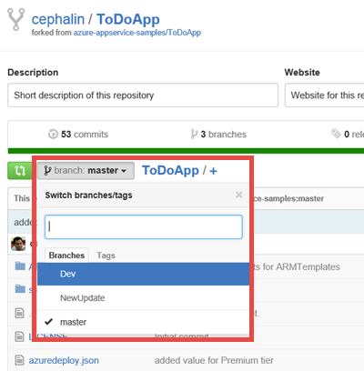

<properties
    pageTitle="敏捷式的軟體開發 Azure 應用程式服務"
    description="瞭解如何建立具有 Azure 應用程式服務的高階複雜的應用程式，以支援靈活的軟體開發的方式。"
    services="app-service"
    documentationCenter=""
    authors="cephalin"
    manager="wpickett"
    editor=""/>

<tags
    ms.service="app-service"
    ms.workload="na"
    ms.tgt_pltfrm="na"
    ms.devlang="na"
    ms.topic="article"
    ms.date="07/01/2016"
    ms.author="cephalin"/>

# 敏捷式的軟體開發 Azure 應用程式服務 #

在本教學課程中，您將學習如何建立具有[Azure 應用程式服務](/services/app-service/)的高階複雜的應用程式，以支援[靈活的軟體開發](https://en.wikipedia.org/wiki/Agile_software_development)的方式。 假設您已經知道如何[部署 Azure 中預測複雜的應用程式](app-service-deploy-complex-application-predictably.md)。

技術的程序中的限制通常可以妨礙成功實作敏捷式的方法。 Azure 功能，例如[連續發佈](app-service-continuous-deployment.md)、[臨時環境](web-sites-staged-publishing.md)（位置），及[監視](web-sites-monitor.md)時妥善搭配的協調流程及管理[Azure 資源管理員](../azure-resource-manager/resource-group-overview.md)] 中部署的應用程式服務可以是開發人員運用靈活的軟體開發的最佳解決方案的一部分。

下表是短清單的敏捷式開發，及如何 Azure 服務可讓每個這些相關聯的需求。

| 要求 | 如何讓 Azure |
|---------------------------------------------------------------|--------------------------------------------------------------------------------------------------------------------------------------------------------------------------------------------------------------------------|
| -建立的每個認可 -自動建立並快速 | 設定與連續的部署，Azure 應用程式服務可以作為開發分支的 live 執行組建。 每次分支推入程式碼，則會自動建立和執行即時 Azure 中。|
| -請建置自我測試 | 載入測試、 web 測試等，可以用來部署 Azure 資源管理員範本。|
| -在生產環境的複本中執行測試 | Azure 資源管理員範本可用來建立複製 Azure 生產環境 （包括應用程式設定、 連線字串範本、 縮放等） 來測試快速和預測。|
| -輕鬆地檢視最新版本的結果 | 從儲存機制連續部署 Azure 表示您可以新增程式碼測試即時應用程式中緊接在接受變更。 |
| -認可主要的分支每日 自動化的部署 | 連續整合生產應用程式存放庫的主要分支的自動部署每個認可/合併至主要的分支正式。 |

[AZURE.INCLUDE [app-service-web-to-api-and-mobile](../../includes/app-service-web-to-api-and-mobile.md)]

## 您將會執行的動作 ##

您會逐步執行一般的開發測試-階段生產工作流程，才能將新的變更發佈至[ToDoApp](https://github.com/azure-appservice-samples/ToDoApp)範例應用程式，其中包含兩個[web 應用程式](/services/app-service/web/)，一個是主選單 (FE) 和其他正在 Web API 後端 （相當），以及[SQL 資料庫](/services/sql-database/)。 您可以使用以下所示的部署架構︰

若要將圖片的文字︰

-   部署架構分成三個不同環境 （或 Azure 中的 [[資源群組](../azure-resource-manager/resource-group-overview.md)），都有自己的[應用程式服務計劃](../app-service/azure-web-sites-web-hosting-plans-in-depth-overview.md)、[縮放比例](web-sites-scale.md)設定] 及 SQL 資料庫。 
-   每個環境可以個別管理。 它們甚至可以存在於不同的訂閱。
-   執行與生產實作為相同的應用程式服務應用程式的兩個位置。 主版分支是連續整合和臨時位置的設定。
-   主版分支認可時驗證 （含生產資料） 的暫存的位置上，將生產位置[不中斷的](web-sites-staged-publishing.md)交換驗證暫存的應用程式。

生產和臨時環境所定義之範本[*&lt;repository_root >*/ARMTemplates/ProdandStage.json](https://github.com/azure-appservice-samples/ToDoApp/blob/master/ARMTemplates/ProdAndStage.json)。

開發和測試環境定義在範本[*&lt;repository_root >*/ARMTemplates/Dev.json](https://github.com/azure-appservice-samples/ToDoApp/blob/master/ARMTemplates/Dev.json)。

您也會使用一般的分支策略，從最測試分支開發分支然後移至 [母片 （向上移品質，所以） 的分支的程式碼。

 

## 您需要的項目 ##

-   Azure 帳戶
-   [GitHub](https://github.com/)帳戶
-   給命令介面 （安裝[Windows 版的 GitHub](https://windows.github.com/)）-這可讓您在相同的工作階段中執行給和 PowerShell 命令 
-   最新的[PowerShell 的 Azure](https://github.com/Azure/azure-powershell/releases/download/0.9.4-June2015/azure-powershell.0.9.4.msi)位元
-   了解基本操作︰
    -   [Azure 資源管理員](../azure-resource-manager/resource-group-overview.md)範本部署 （也，請參閱[Azure 中預測複雜的應用程式部署](app-service-deploy-complex-application-predictably.md)）
    -   [給](http://git-scm.com/documentation)
    -   [PowerShell](https://technet.microsoft.com/library/bb978526.aspx)

> [AZURE.NOTE] 您必須完成本教學課程 Azure 帳戶︰
> + 您可以[開啟 Azure 帳戶免費](/pricing/free-trial/)-取得貸項總計試用付費 Azure 服務，您可以使用，即使使用這些之後，您可以將該帳戶，並使用釋放 Azure 服務，例如 Web 應用程式。
> + 您可以[啟動 Visual Studio 訂閱者優點](/pricing/member-offers/msdn-benefits-details/)-您的 Visual Studio 訂閱可讓您貸項總計付費 Azure 服務，您可以使用每個月。
>
> 如果您想要開始使用 Azure 應用程式服務註冊 Azure 帳戶之前，請移至[嘗試應用程式服務](http://go.microsoft.com/fwlink/?LinkId=523751)，可以讓您立即建立短暫入門 web 應用程式在應用程式服務。 必要; 沒有信用卡沒有承諾。

## 設定生產環境 ##

>[AZURE.NOTE] 在本教學課程所用的指令碼將會從您 GitHub 存放庫連續發佈自動設定。 這需要的 Azure 中已儲存 GitHub 認證，否則指令碼的部署嘗試進行來源控制設定 web 應用程式時將會失敗。 
>
>若要儲存 GitHub 認證 Azure 中，建立 web 應用程式中的[Azure 入口網站](https://portal.azure.com/)及[設定 GitHub 部署](app-service-continuous-deployment.md)。 您只需要一次執行此動作。 

在一般 DevOps 案例中，您正在執行即時 Azure 中的應用程式並想要透過連續的發佈進行變更。 在此案例中，您有開發、 測試和部署生產環境中使用的範本。 您會將其設定此區段中。

1.  建立您自己的[ToDoApp](https://github.com/azure-appservice-samples/ToDoApp)存放庫分叉。 建立您分叉的資訊，請參閱[分叉 Repo](https://help.github.com/articles/fork-a-repo/)。 您分叉建立後，您可以在瀏覽器中看到它。
 
    

2.  開啟給殼層工作階段。 如果您沒有給命令介面，請立即安裝[GitHub for Windows](https://windows.github.com/) ]。

3.  建立您的分支的本機複本，藉由執行下列命令︰

        git clone https://github.com/<your_fork>/ToDoApp.git 

4.  一旦您有您的本機複本，請瀏覽至*&lt;repository_root >*\ARMTemplates，並執行 deploy.ps1 指令碼，如下所示︰

        .\deploy.ps1 –RepoUrl https://github.com/<your_fork>/todoapp.git

4.  出現提示時，輸入所要的使用者名稱與密碼來存取資料庫。

    您應該會看到各種 Azure 資源佈建的進度。 部署完成後，請指令碼會啟動瀏覽器中的應用程式，並讓您易記嗶聲。

    
 
    >[AZURE.TIP] 看看*&lt;repository_root >*\ARMTemplates\Deploy.ps1，若要查看如何會產生唯一識別碼與資源。 您可以使用相同的方式來建立相同的部署複製，而不需擔心衝突的資源名稱。
 
6.  返回您就可以給命令介面工作階段，請執行︰

        .\swap –Name ToDoApp<unique_string>master

    

7.  完成指令碼之後，請返回瀏覽至主選單的地址 (http://ToDoApp*&lt;unique_string >*master.azurewebsites.net/) 若要查看生產環境中執行的應用程式。
 
5.  登入[Azure 入口網站](https://portal.azure.com/)，請參閱建立的內容。

    您應該可以看到 [相同資源] 群組中的兩個 web 應用程式`Api`後置字元的名稱。 如果您看看 [資源群組] 檢視，您也會看到 SQL 資料庫與伺服器、 應用程式服務計劃和 web 應用程式的暫存的位置。 瀏覽不同的資源，並將其與比較*&lt;repository_root >*\ARMTemplates\ProdAndStage.json 若要查看範本中的設定方式。

    

您現在已設定生產環境。 接下來，您就會開始新的更新至應用程式。

## 建立開發和測試分支 ##

有生產 Azure 中執行複雜的應用程式之後，您會在根據敏捷式的方法的應用程式中進行更新。 在此區段中，您會建立開發並測試分支的您會需要進行必要的更新。

1.  第一次建立測試環境。 您就可以給命令介面工作階段，請執行下列命令來建立新的分支稱為**NewUpdate**環境。 

        git checkout -b NewUpdate
        git push origin NewUpdate 
        .\deploy.ps1 -TemplateFile .\Dev.json -RepoUrl https://github.com/<your_fork>/ToDoApp.git -Branch NewUpdate

1.  出現提示時，輸入所要的使用者名稱與密碼來存取資料庫。 

    部署完成後，請指令碼會啟動瀏覽器中的應用程式，並讓您易記嗶聲。 然後了，現在您已經有新的分支自己測試環境。 花點時間來檢閱此測試環境的相關的一些事項︰

    -   您可以建立任何 Azure 訂閱中。 這表示生產環境可以個別管理從測試環境。
    -   測試環境正在執行即時 Azure 中。
    -   測試環境是生產環境，除了暫存的位置和縮放比例設定相同。 您可以看到，這些是唯一和之間的差異 ProdandStage.json Dev.json。
    -   您可以在自己的應用程式服務方案，與 （例如**免費**） 不同價格層管理您的測試環境。
    -   刪除此測試環境中會和刪除資源群組一樣簡單。 您將瞭解如何執行此[更新版本](#delete)。

2.  請繼續執行下列命令來建立開發分支︰

        git checkout -b Dev
        git push origin Dev
        .\deploy.ps1 -TemplateFile .\Dev.json -RepoUrl https://github.com/<your_fork>/ToDoApp.git -Branch Dev

3.  出現提示時，輸入所要的使用者名稱與密碼來存取資料庫。 

    花點時間來檢閱此開發環境的相關的一些事項︰ 

    -   您的開發環境有相同的測試環境的設定，因為部署使用相同的範本。
    -   每個開發環境可以建立開發人員 Azure 訂閱，離開個別管理測試環境中。
    -   您的開發環境正在執行即時 Azure 中。
    -   刪除的開發環境是非常簡單，刪除 [資源] 群組。 您將瞭解如何執行此[更新版本](#delete)。

>[AZURE.NOTE] 如果您有多個的開發人員在新的更新，每個可輕鬆建立的分支和專用的開發環境執行下列動作︰
>
>1. GitHub 中建立自己的分叉存放庫 （請參閱[分叉 Repo](https://help.github.com/articles/fork-a-repo/)）。
>2. 複製其本機電腦上分叉
>3. 執行相同的命令來建立自己的開發分支和環境。

當您完成時，您 GitHub 分叉應該有三個分支︰

您應該有三個不同的資源群組六個 web 應用程式 （三組的兩個）︰

 
>[AZURE.NOTE] 請注意 ProdandStage.json 指定生產環境可以使用**標準**價格層] 適用於延展性生產應用程式。

## 建立並測試每個認可 ##

ProdAndStage.json 和 Dev.json 的範本檔案已指定的來源控制參數，依預設會設定連續發佈 web 應用程式。 因此，每個認可 GitHub 分支觸發程序的自動部署至 Azure 的分支。 我們來看看您的安裝程式現在運作的方式。

1.  請確定您在開發的分支本機存放庫。 若要這麼做，請在 [給命令介面中執行下列命令︰

        git checkout Dev

2.  應用程式的使用者介面層級進行簡單的變更，藉由變更程式碼，使用 [[啟動安裝程式](http://getbootstrap.com/components/)清單。 開啟*&lt;repository_root >*\src\MultiChannelToDo.Web\index.cshtml，並醒目提示的下列變更︰

    

    >[AZURE.NOTE] 如果您無法讀取上方的圖片︰ 
    >
    >- 在 [列 18 變更`check-list`至`list-group`。
    >- 在 [列 19 變更`class="check-list-item"`至`class="list-group-item"`。

3.  儲存變更。 返回給 Shell 中執行下列命令︰

        cd <repository_root>
        git add .
        git commit -m "changed to bootstrap style"
        git push origin Dev
 
    這些給命令類似 「 檢查您的程式碼 」 等 TFS 的其他來源控制系統中。 當您執行`git push`，新的認可觸發的自動程式碼推入至 Azure，然後重新建立應用程式，以反映的開發環境中的變更。

4.  若要確認您的開發環境此程式碼推入發生，請移至您的開發環境 web 應用程式刀並查看**部署**組件。 您應該能夠看到最新認可訊息有。

    

5.  從該位置，按一下 [**瀏覽]**以查看 Azure 中即時應用程式中的新變更]。

    

    這是很次要變更應用程式。 然而，有許多時間在複雜的 web 應用程式的新變更有非預期的意外側效果。 也可以輕鬆地在即時組建測試每個認可可讓您掌握這些問題，才能看到您的客戶。

現在，您應該瞭解到，為**NewUpdate**專案的開發人員，您都能輕鬆地建立，為您自己的開發環境，然後建立每個認可並測試每一個建立了。

## 合併測試環境中的程式碼 ##

當您準備好要從最 NewUpdate 分支開發分支發送程式碼時，它是標準的給程序︰

1.  將開發中的 [分支 GitHub，例如其他開發人員所建立的認可 NewUpdate 認可任何新的合併列印。 在 GitHub 任何新認可會觸發程式碼推入，並建立開發環境中。 您可以請確認您的程式碼開發分支中仍能運作 NewUpdate 分支的最新的位元。

2.  合併 GitHub NewUpdate 分支開發分支您新認可。 這個動作會觸發的程式碼推入和測試環境中的建立。 

請注意，再次連續部署已與這些給分支的設定，因為您不需要採取任何其他執行整合組建等。 您只需要執行標準來源控制作法使用給，和 Azure 會為您執行所有建立程序。

現在，我們推入**NewUpdate**分支的 [程式碼。 在給殼層中執行下列命令︰

    git checkout NewUpdate
    git pull origin NewUpdate
    git merge Dev
    git push origin NewUpdate

這樣就可以 ！ 

移至 web 應用程式刀測試環境中，若要查看您新認可] （合併至 NewUpdate 分支） 現在推入測試環境。 然後按一下 [若要查看樣式變更目前正在執行即時 Azure 中的 [**瀏覽**]。

## 生產部署更新 ##

將程式碼推入執行與生產環境應認為您已完成您按下程式碼測試環境時不不同。 就是真正簡易。 

於給命令介面，請執行下列命令︰

    git checkout master
    git pull origin master
    git merge NewUpdate
    git push origin master

請記住，根據執行與生產環境中 ProdandStage.json 設定的方式，新的程式碼推入到**暫存之**位置，並那里執行。 如果您瀏覽至暫存位置的 URL，您將看到新那里執行的程式碼。 若要這麼做，請執行`Show-AzureWebsite`於給命令介面指令程式。

    Show-AzureWebsite -Name ToDoApp<unique_string>master -Slot Staging
 
現在，您已驗證的暫存的位置中的更新後，請以唯一是生產交換它。 在給殼層，只要執行下列命令︰

    cd <repository_root>\ARMTemplates
    .\swap.ps1 -Name ToDoApp<unique_string>master

恭喜您 ！ 您已成功發佈新的更新，生產 web 應用程式。 是您完成的您可以輕鬆地建立開發及測試環境中，並建立及測試每個認可。 這些是敏捷式的軟體開發的重要建置組塊。

## 刪除開發和測試 enviroments ##

由於您刻意有架構開發和測試環境您能獨立的資源群組，因此很容易就能將它們刪除。 若要刪除您建立在本教學課程，GitHub 分支和 Azure 成品，只要在給命令介面中執行下列命令︰

    git branch -d Dev
    git push origin :Dev
    git branch -d NewUpdate
    git push origin :NewUpdate
    Remove-AzureRmResourceGroup -Name ToDoApp<unique_string>dev-group -Force -Verbose
    Remove-AzureRmResourceGroup -Name ToDoApp<unique_string>newupdate-group -Force -Verbose

## 摘要 ##

敏捷式的軟體開發是有許多公司想要採用 Azure 為其應用程式的平台必須已。 在本教學課程中，您已經學會如何建立和輕鬆，甚至複雜的應用程式中的分割完全複本或附近生產環境的複本。 您也學會如何運用此能夠建立可以建立並測試 Azure 中的每個單一認可的開發程序。 本教學課程希望顯示如何最適合使用 Azure 應用程式服務和 Azure 資源管理員放在一起以建立 caters 敏捷式的方法來 DevOps 方案。 接下來，您可以建立在這個案例中執行進階的 DevOps 技巧，例如[生產環境中測試](app-service-web-test-in-production-get-start.md)。 常見的測試-生產情況，請參閱[Flighting 部署 （測試） 中 Azure 應用程式服務](app-service-web-test-in-production-controlled-test-flight.md)。

## 更多資源 ##

-   [部署 Azure 中預測複雜的應用程式](app-service-deploy-complex-application-predictably.md)
-   [在練習中的敏捷式開發︰ 秘訣和竅門現代化的開發週期](http://channel9.msdn.com/Events/Ignite/2015/BRK3707)
-   [使用資源管理員範本 Azure Web 應用程式的進階的部署策略](http://channel9.msdn.com/Events/Build/2015/2-620)
-   [撰寫 Azure 資源管理員範本](../resource-group-authoring-templates.md)
-   [JSONLint-JSON 驗證程式](http://jsonlint.com/)
-   [ARMClient – 設定 GitHub 發佈至網站](https://github.com/projectKudu/ARMClient/wiki/Setup-GitHub-publishing-to-Site)
-   [給分支-基本的分支與合併](http://www.git-scm.com/book/en/v2/Git-Branching-Basic-Branching-and-Merging)
-   [David Ebbo 部落格](http://blog.davidebbo.com/)
-   [Azure PowerShell](../powershell-install-configure.md)
-   [Azure 跨平台的命令列工具](../xplat-cli-install.md)
-   [建立或編輯使用者 Azure AD 中](https://msdn.microsoft.com/library/azure/hh967632.aspx#BKMK_1)
-   [專案 Kudu Wiki](https://github.com/projectkudu/kudu/wiki)
