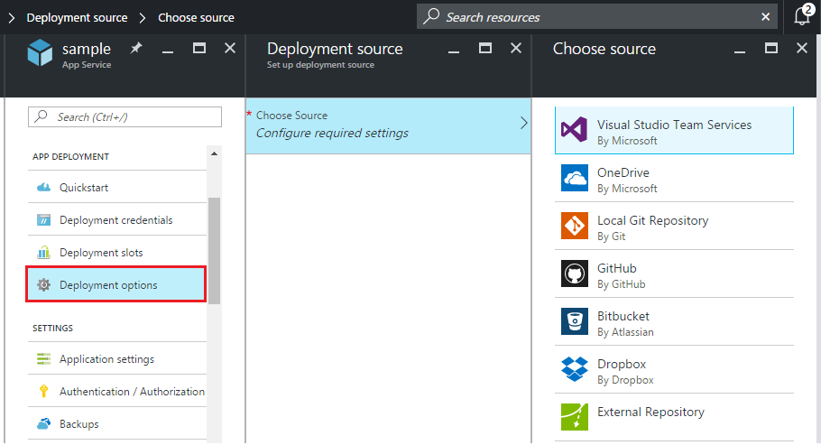

<properties
    pageTitle="Azure 應用程式服務的連續部署 |Microsoft Azure"
    description="瞭解如何啟用連續部署至 Azure 應用程式服務。"
    services="app-service"
    documentationCenter=""
    authors="dariagrigoriu"
    manager="wpickett"
    editor="mollybos"/>

<tags
    ms.service="app-service"
    ms.workload="na"
    ms.tgt_pltfrm="na"
    ms.devlang="na"
    ms.topic="article"
    ms.date="10/28/2016"
    ms.author="dariagrigoriu"/>
    
# 連續部署至 Azure 應用程式服務

本教學課程教您如何設定[Azure 應用程式服務]應用程式的連續部署工作流程。 應用程式服務整合 BitBucket、 GitHub，與 Visual Studio 小組服務 (VSTS) 可讓連續部署工作流程 Azure 提取最新的更新，從您的專案發佈至其中一個服務中的位置。 連續部署就非常有用的專案位置多個與經常捐贈會被整合。

## 啟用連續的部署

若要啟用連續部署中， 

1. 發佈至用於連續部署存放庫的 [應用程式內容]。  
    如需有關這些服務發佈專案的詳細資訊，請參閱[建立 repo (GitHub)]、[建立 repo (BitBucket)]，及[VSTS 快速入門]。

2. 在您的應用程式功能表刀[Azure 入口網站]中，按一下 [**應用程式部署 > 部署選項**。 按一下 [**選擇來源**]，然後選取部署來源。  

    
    
    > [AZURE.NOTE] 若要設定 VSTS 應用程式服務部署的帳戶，請參閱此[教學課程](https://github.com/projectkudu/kudu/wiki/Setting-up-a-VSTS-account-so-it-can-deploy-to-a-Web-App)。
    
3. 完成授權工作流程。 

4. 在**部署來源**刀中，選擇 [專案] 和 [從部署分支。 當您完成時，按一下**[確定]**。
  
    

    > [AZURE.NOTE] 當啟用 GitHub 或 BitBucket 連續部署時，將會顯示公開及私密金鑰的專案。

    應用程式服務會建立與所選的存放庫的關聯，指定分支中，從檔案中會提取並維護您存放庫應用程式服務應用程式的複本。 當您設定 VSTS 連續部署從 Azure 入口網站時，整合使用應用程式服務[Kudu 部署引擎](https://github.com/projectkudu/kudu/wiki)，其中已自動建立並部署工作每個`git push`。 您不需要個別設定 vsts 連續部署。 此程序完成之後，會顯示**的部署選項**應用程式刀，指出部署的 active 部署已成功。

5. 若要驗證成功部署應用程式，請按一下頂端的應用程式刀 Azure 入口網站中的**URL** 。 

6. 若要驗證從您選擇的存放庫發生的連續的部署，推入至存放庫的變更。 您的應用程式應該更新以反映所做的變更，到儲存機制推入完成後，引進了。 您可以驗證具有提取您的應用程式的**部署選項**刀中更新。

## 連續部署 Visual Studio 解決方案 

Azure 應用程式服務發送 Visual Studio 方案是很簡單一樣簡單 index.html 檔案。 在應用程式服務部署程序會簡化回傳所有詳細資料，包括還原 NuGet 相依性和建置應用程式的二進位檔案。 您可以遵循來源控制項的最佳作法的維護程式碼，只有在您就可以給存放庫中，並讓負責的其餘的應用程式服務部署。

推入應用程式服務的 Visual Studio 方案的步驟是與[上一節](#overview)中，相同，提供您設定您的方案或存放庫，如下所示︰

-   使用 Visual Studio 來源控制項選項來產生`.gitignore`檔案，例如圖像以下或手動新增`.gitignore`存放庫根目錄與內容類似此[.gitignore 範例](https://github.com/github/gitignore/blob/master/VisualStudio.gitignore)中的檔案。 

    
 
-   存放庫根目錄.sln 檔案至您的存放庫新增整個方案的樹狀目錄。

一旦您有設定所述，為您存放庫，並從線上給存放庫連續發佈 Azure 中設定您的應用程式，您可以開發本機的 Visual Studio ASP.NET 應用程式，並持續部署只要發送您變更至您的線上給存放庫的 [程式碼。

## 停用連續的部署

若要停用連續部署中， 

1. 在您的應用程式功能表刀[Azure 入口網站]中，按一下 [**應用程式部署 > 部署選項**。 然後按一下 [**中斷****的部署選項**刀中。

        

2. 之後回答**[]** ，以確認訊息，您可以返回您的應用程式刀，然後按一下 [**應用程式部署 > 部署選項**如果您想要設定 [從其他來源發佈。

## 其他資源

* [如何調查的連續部署的一般問題](https://github.com/projectkudu/kudu/wiki/Investigating-continuous-deployment)
* [如何使用 PowerShell 的 Azure]
* [如何使用 Azure 命令列工具 for Mac 和 Linux]
* [給文件]
* [專案 Kudu](https://github.com/projectkudu/kudu/wiki)

>[AZURE.NOTE] 如果您想要開始使用 Azure 應用程式服務註冊 Azure 帳戶之前，請移至[嘗試應用程式服務](http://go.microsoft.com/fwlink/?LinkId=523751)，可以讓您立即建立短暫入門 web 應用程式在應用程式服務。 必要; 沒有信用卡沒有承諾。

[Azure 應用程式服務]: https://azure.microsoft.com/en-us/documentation/articles/app-service-changes-existing-services/ 
[Azure 入口網站]: https://portal.azure.com
[VSTS Portal]: https://www.visualstudio.com/en-us/products/visual-studio-team-services-vs.aspx
[Installing Git]: http://git-scm.com/book/en/Getting-Started-Installing-Git
[如何使用 PowerShell 的 Azure]: ../articles/powershell-install-configure.md
[如何使用 Azure 命令列工具 for Mac 和 Linux]: ../articles/xplat-cli-install.md
[給文件]: http://git-scm.com/documentation

[建立 repo (GitHub)]: https://help.github.com/articles/create-a-repo
[建立 repo (BitBucket)]: https://confluence.atlassian.com/display/BITBUCKET/Create+an+Account+and+a+Git+Repo
[快速入門 VSTS]: https://www.visualstudio.com/get-started/overview-of-get-started-tasks-vs
[Continuous delivery to Azure using Visual Studio Team Services]: ../articles/cloud-services/cloud-services-continuous-delivery-use-vso.md
