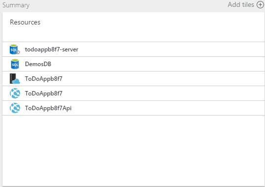

<properties
    pageTitle="佈建及部署 microservices Azure 中預測"
    description="瞭解如何部署組成 microservices 預期的方式，使用 JSON 資源群組範本和 PowerShell 指令碼和 Azure 作為單一單位的應用程式服務中的應用程式。"
    services="app-service"
    documentationCenter=""
    authors="cephalin"
    manager="wpickett"
    editor="jimbe"/>

<tags
    ms.service="app-service"
    ms.workload="na"
    ms.tgt_pltfrm="na"
    ms.devlang="na"
    ms.topic="article"
    ms.date="01/06/2016"
    ms.author="cephalin"/>

# 佈建及部署 microservices Azure 中預測 #

本教學課程中會顯示如何佈建和部署組成[microservices](https://en.wikipedia.org/wiki/Microservices) [Azure 應用程式服務](/services/app-service/)作為單一單位和預期的方式，使用 JSON 資源群組範本與 PowerShell 指令碼中的應用程式。 

佈建和部署高階組成的應用程式的高度分離時 microservices、 重複性和預測是成功的關鍵。 [Azure 應用程式服務](/services/app-service/)可讓您建立 microservices 包含 web 應用程式、 行動應用程式、 API 應用程式，以及邏輯應用程式。 [Azure 資源管理員](../azure-resource-manager/resource-group-overview.md)可讓您為單位，例如資料庫的資源相依性與管理所有 microservices 和來源控制項設定。 現在，您也可以部署這類應用程式使用 JSON 範本和簡單的 PowerShell 指令碼。 

[AZURE.INCLUDE [app-service-web-to-api-and-mobile](../../includes/app-service-web-to-api-and-mobile.md)] 

## 您將會執行的動作 ##

在教學課程中，您會部署的應用程式，包括︰

-   兩個 web 應用程式 (也就是兩個 microservices)
-   後端 SQL 資料庫
-   應用程式設定的連接字串，與來源控制
-   應用程式的深入見解、 通知、 自動縮放設定

## 您將使用的工具 ##

在本教學課程中，您會使用下列工具。 因為並不完整的討論區工具，我要將您的端對端案例，並只提供簡短附註每項目，而您可以在此找到詳細資訊。 

### Azure 資源管理員範本 (JSON) ###
 
每當您建立 web 應用程式中 Azure 應用程式服務，例如 Azure 資源管理員使用 JSON 範本，建立整個資源群組元件資源。 從[Azure Marketplace](/marketplace)等 MySQL 資料庫、 儲存帳戶、 web 應用程式本身，該應用程式服務方案，可以包含[可調整 WordPress](/marketplace/partners/wordpress/scalablewordpress/)應用程式的複雜範本通知規則、 應用程式設定、 自動調整大小的設定] 及 [其他]，然後所有這些範本可透過 PowerShell 提供給您。 如需如何下載及使用這些範本的資訊，請參閱[使用 PowerShell 的 Azure 與 Azure 資源管理員](../powershell-azure-resource-manager.md)。

Azure 資源管理員範本的詳細資訊，請參閱[撰寫 Azure 資源管理員範本](../resource-group-authoring-templates.md)

### Visual Studio azure SDK 2.6 ###

最新的 SDK 包含 JSON 編輯器] 中的資源管理員範本支援的改良功能。 您可以使用此選項快速從頭開始建立資源群組範本，或開啟現有的 JSON 範本 （例如，「 下載的庫範本） 要修改的、 填入參數檔案，並甚至部署 [直接從 Azure 資源群組解決方案的 [資源] 群組。

如需詳細資訊，請參閱[Azure SDK 2.6 Visual studio](/blog/2015/04/29/announcing-the-azure-sdk-2-6-for-net/)。

### Azure PowerShell 0.8.0 或更新版本 ###

從版本 0.8.0，PowerShell 的 Azure 安裝包含 Azure 資源管理員模組，除了 Azure 模組。 新的模組，可讓您指令碼部署資源群組。

如需詳細資訊，請參閱[使用 PowerShell 的 Azure 與 Azure 資源管理員](../powershell-azure-resource-manager.md)

### Azure 資源檔案總管 ###

這個[預覽工具](https://resources.azure.com)可讓您瀏覽您的訂閱和個別資源中的所有資源群組的 JSON 定義。 在工具]，可以編輯資源的 JSON 定義、 刪除整個階層的資源，並建立新的資源。  都可以使用這項工具的資訊是非常實用的範本製作，因為它會顯示您要設定的資源、 正確的值等特定類型的屬性。您甚至可以中[Azure 入口網站](https://portal.azure.com/)中，建立您的資源群組，然後檢查其 JSON 中定義可協助您能樣版化資源群組的 [檔案總管] 工具。

### 部署至 Azure] 按鈕 ###

如果您使用 GitHub 來源控制項時，您可以將[部署至 Azure] 按鈕](/blog/2014/11/13/deploy-to-azure-button-for-azure-websites-2/)，將您的讀我檔案。會員，可讓開啟鍵部署至 Azure 的使用者介面。 時的任何簡單的 web 應用程式，您可以執行這個動作，您可以擴充這個以啟用將 azuredeploy.json 檔案放在存放庫根目錄中部署整個資源群組。 [部署至 Azure] 按鈕，將用於此 JSON 檔案，其中包含資源] 群組中的範本，建立 [資源] 群組。 例如，請參閱[ToDoApp](https://github.com/azure-appservice-samples/ToDoApp)範例中，您會在此教學課程中使用。

## 取得範例資源群組範本 ##

現在就讓我們開始其權限。

1.  瀏覽至[ToDoApp](https://github.com/azure-appservice-samples/ToDoApp)應用程式服務範例。

2.   在 readme.md，按一下 [**部署至 Azure**]。
 
3.  您是移至[部署-至-azure](https://deploy.azure.com)網站，並要求輸入部署參數。 請注意，大部分的欄位會為您填入存放庫名稱與某些隨機字串。 如果想要的話，但您必須輸入唯一的項目是 SQL Server 管理登入和密碼]，然後按一下 [**下一步**，您可以變更所有欄位。
 
    

4.  接下來，按一下 [開始部署程序的**部署**。 一旦程序執行完成時，按一下 [http://todoapp*XXXX*。 azurewebsites.net 連結，瀏覽應用程式。 

    

    UI 想當您第一次瀏覽至該應用程式剛開始設定，因為會稍有變得很慢，但它是完整功能的應用程式，讓您自己。

5.  回到 [部署] 頁面上，按一下 [**管理**連結，請參閱 Azure 入口網站中新的應用程式。

6.  在 [**基本資訊**] 下拉式功能表中，按一下資源群組連結。 請注意，web 應用程式已連線到**外部專案**下 GitHub 存放庫。 

    
 
7.  在 [資源群組刀中，請注意，已經有兩個 web 應用程式與 [資源] 群組中的一個 SQL 資料庫。

    
 
所有項目，您只看到簡短的稍候幾分鐘的完整部署的兩個 microservice 應用程式，所有元件、 相依性、 設定、 資料庫及連續的發佈，設定由自動化協調流程 Azure 資源管理員] 中。 這是由兩個項目︰

-   [部署至 Azure] 按鈕
-   azuredeploy.json repo 根目錄中

您可以將此相同的應用程式部署百、 數百或數以千計的時間和有完全相同的設定每次。 重複性和預測這種方法可讓您輕鬆與信賴部署高階應用程式。

## 檢查 （或編輯） AZUREDEPLOY。JSON ##

現在讓我們來看看 GitHub 存放庫的設定方式。 您必須在 Azure.NET sdk，您可以使用 JSON 編輯器，因此如果您還沒有安裝[Azure.NET SDK 2.6](/downloads/)，請立即執行。

1.  複製使用您的最愛給工具[ToDoApp](https://github.com/azure-appservice-samples/ToDoApp)存放庫。 在以下的螢幕擷取畫面，我做這在 Visual Studio 2013 中的 [小組總管]。

    

2.  從存放庫根目錄，請在 [Visual Studio 中開啟 azuredeploy.json。 如果您沒有看到 [JSON 大綱] 窗格，您必須安裝 Azure.NET SDK。

    

我不會描述的 JSON 格式，每個詳細資料，但[更多資源](#resources)區段學習資源群組範本語言的連結。 在這裡，我只將以顯示您感興趣的功能，可協助您開始製作您自己的應用程式部署自訂的範本。

### 參數 ###

看看 [參數] 區段，請參閱大部分的參數是什麼**部署至 Azure** ] 按鈕會提示您輸入。 **部署至 Azure**按鈕之後的網站，填入 UI 使用 azuredeploy.json 中定義的參數的輸入。 下列參數使用整個資源定義，例如資源名稱、 屬性值等等。

### 資源 ###

在 [資源節點，您可以查看已定義 4 最上層的資源，包括 SQL Server 執行個體、 應用程式服務方案，以及兩個 web 應用程式。 

#### 應用程式服務計劃 ####

現在就讓我們開始 JSON 簡單的根層級資源。 在 JSON 外框]，按一下應用程式服務計劃名為**[hostingPlanName]**以醒目提示的相對應的 JSON 程式碼。 

請注意，`type`項目會指定的字串 （其稱為伺服器陣列之內長而長時間） 的應用程式服務方案，及其他項目] 和 [摘要資訊會填入使用 JSON 檔案中定義的參數此資源沒有任何巢狀的資源。

>[AZURE.NOTE] 另請注意的值`apiVersion`會告訴的 Azure 哪個版本的 REST API，若要使用 JSON 資源定義，並將其可能會影響該資源應如何格式化內`{}`。 

#### SQL Server ####

接下來，也可以按一下 [指定 SQL Server 的資源**SQLServer** JSON 大綱中。

 
請注意下列有關醒目提示 JSON 程式碼︰

-   建立的資源的命名及設定讓它們彼此一致的方式，可確保使用參數。
-   SQLServer 資源有兩個巢狀的資源，各有不同的值，如`type`。
-   巢狀的資源`“resources”: […]`、 定義資料庫及防火牆規則，必須`dependsOn`指定的根層級 SQLServer 資源的資源識別碼的項目。 這會告訴 Azure 資源管理員 」 建立此資源的其他資源，必須已存在; 之前如果在範本中定義的其他資源，然後建立一個第一次 」。

    >[AZURE.NOTE] 如需如何使用的詳細資訊`resourceId()`函數，請參閱[Azure 資源管理員範本函數](../resource-group-template-functions.md)。

-   效果`dependsOn`項目是 Azure 資源管理員，可以瞭解哪些資源可以建立平行，而且必須依序建立的資源。 

#### Web 應用程式 ####

現在，我們移到實際的 web 應用程式本身，會更複雜。 按一下 [在 JSON 大綱以醒目提示它 JSON 的程式碼中的 [variables('apiSiteName')] web 應用程式]。 您會看到的項目會取得更感興趣。 達到這個目的，我要將討論一個接一個] 的功能︰

##### 根資源 #####

Web 應用程式取決於兩個不同的資源。 這表示 Azure 資源管理員會建立 web 應用程式，才建立的應用程式服務計劃和 SQL Server 執行個體。

##### 應用程式設定 #####

巢狀資源也被定義的應用程式設定。

在 [`properties`的項目`config/appsettings`，您有兩種應用程式設定格式`“<name>” : “<value>”`。

-   `PROJECT`是[KUDU 設定](https://github.com/projectkudu/kudu/wiki/Customizing-deployments)，告訴 Azure 部署使用多個專案 Visual Studio 方案中的專案。 我會告訴您如何設定來源控制項，但由於 ToDoApp 程式碼是多專案 Visual Studio 方案中，我們需要這項設定。
-   `clientUrl`是直接設定的應用程式碼的應用程式使用。

##### 連接字串 #####

巢狀資源也被定義的連線字串。

在 [`properties`的項目`config/connectionstrings`，每個連接字串也定義為名稱︰ 值組，具有特定設定格式化的`“<name>” : {“value”: “…”, “type”: “…”}`。 針對`type`項目，可能的值是`MySql`， `SQLServer`， `SQLAzure`，及`Custom`。

>[AZURE.TIP] 明確的連接字串類型清單，請執行下列命令中 PowerShell 的 Azure: \[Enum]::GetNames("Microsoft.WindowsAzure.Commands.Utilities.Websites.Services.WebEntities.DatabaseType")
    
##### 來源控制 #####

巢狀資源也被定義來源控制的設定。 Azure 資源管理員會使用這項資源來設定連續的發佈 (請參閱要注意`IsManualIntegration`稍後)，並且啟動應用程式碼部署處理 JSON 檔案時自動。

`RepoUrl`與`branch`應為其實很好，指向給存放庫] 和 [要從發佈分支的名稱。 同樣地，這些是由輸入參數定義。 

附註在`dependsOn`元素的 web 應用程式資源本身，除了`sourcecontrols/web`也會根據`config/appsettings`和`config/connectionstrings`。 這是因為後`sourcecontrols/web`是設定，請在 Azure 部署程序將會自動嘗試部署、 建置和啟動應用程式碼。 因此，插入此相依性可協助您確定應用程式之前執行應用程式碼具有必要的應用程式設定和連線字串的存取權。 

>[AZURE.NOTE] 另請注意，`IsManualIntegration`設定為 [ `true`。 因為您不是擁有 GitHub 存放庫，因此無法實際授與權限 （亦即設定連續發佈[ToDoApp](https://github.com/azure-appservice-samples/ToDoApp)從 Azure，則需要在此教學課程此屬性 推播自動存放庫更新至 Azure）。 您可以使用預設值`false`指定存放庫只有當您在前[Azure 入口網站](https://portal.azure.com/)設定的擁有者 GitHub 認證。 換句話說，如果您先前已設定來源控制 GitHub 或 BitBucket [Azure 入口網站](https://portal.azure.com/)中的任何應用程式，使用您的使用者認證，然後 Azure 會記住認證，並用每當您在未來部署 GitHub 或 BitBucket 任何應用程式。 不過，如果您還沒有這樣做，請 JSON 範本的部署會失敗，當 Azure 資源管理員嘗試設定 web 應用程式的來源控制設定值，因為其無法登入 GitHub 或 BitBucket 存放庫擁有者的認證。

## 比較 JSON 範本與部署的資源群組 ##

在這裡，您可以瀏覽所有 web 應用程式的刀在[Azure 入口網站](https://portal.azure.com/)，但還有另一個不一樣，如果更多的工具。 移至 [ [Azure 資源檔案總管](https://resources.azure.com)] 預覽] 工具，讓您的所有資源群組 JSON 表示您的訂閱中實際 Azure 後端存在。 您也可以查看如何 Azure 中的 [資源] 群組的 JSON 階層對應用來建立的範本檔案中的階層。

例如，當我移至 [ [Azure 資源檔案總管](https://resources.azure.com)] 工具，並展開 [檔案總管] 中的節點，我可以看到 [資源] 群組以及收集在其個別的資源類型] 下的根層級資源。

如果您 [向下切入的 web 應用程式，您應該能夠看到 web 應用程式設定的詳細資訊與類似以下的螢幕擷取畫面︰

同樣地的巢狀的資源應該階層非常類似於您 JSON 範本的檔案，而且您應該會看到應用程式設定、 連接字串等等，反映在 JSON 窗格中正確。 設定以下沒有使用 JSON 檔案可能有問題，並可協助您排解 JSON 範本檔案。

## 部署資源群組範本自己 ##

[**部署至 Azure** ] 按鈕是很好，但其可讓您部署資源] 群組中的範本 azuredeploy.json，只有當您已到 GitHub 推入 azuredeploy.json。 Azure.NET SDK 也會提供您部署直接從您的本機電腦任何 JSON 範本檔案的工具。 若要這麼做，請遵循下列步驟︰

1.  在 Visual Studio 中，按一下 [**檔案** > **新增** > **專案**。

2.  按一下 [ **Visual C#** > **雲端** > **Azure 資源群組**]，然後按一下**[確定]**。

    

3.  在 [**選取 Azure 範本**中，選取**空白範本**，然後按一下**[確定]**。

4.  將 azuredeploy.json 拖曳至新的專案中的 [**範本**] 資料夾中。

    

5.  在方案總管中，開啟 [複製的 azuredeploy.json]。

6.  為了方便示範，讓我們來新增一些標準的應用程式充分資源我們 JSON 檔案，即可**新增資源**。 如果您只想在部署 JSON 檔案，請略過部署步驟。

    

7.  選取**應用程式獲得深入見解的 Web 應用程式**，然後確定現有的應用程式服務方案與 web 應用程式已選取，然後再按一下 [**新增**。

    

    您現在可根據資源的和功能，請參閱幾項新的資源，有相依性的應用程式服務方案或 web 應用程式。 這些資源不會啟用現有的定義和您要的變更。

    
 
8.  在 JSON 外框]，按一下 [**自動調整大小 appInsights**以醒目提示它 JSON 的程式碼]。 這是您的應用程式服務方案的縮放比例設定。

9.  醒目提示 JSON 程式碼，找出`location`和`enabled`屬性和設定它們，如下所示。

    

10. 在 JSON 外框]，按一下 [ **CPUHigh appInsights**以醒目提示它 JSON 的程式碼]。 這是通知。

11. 找出`location`和`isEnabled`屬性和設定它們，如下所示。 執行相同的其他三個通知 （紫色強大）。

    

12. 現在，您準備好要部署。 以滑鼠右鍵按一下專案，然後選取 [**部署** > **新部署**。

    

13. 如果您還沒有這麼做，請登入 Azure 帳戶。

14. 在您的訂閱中選取現有的資源群組或建立新的、 選取**azuredeploy.json**，，然後按一下**編輯參數**。

    

    您現在可以編輯部份表格中的範本檔案中所定義的所有參數。 定義預設值的參數會已經有預設值，並定義允許值清單的參數會顯示為下拉式清單。

    

15. 填寫所有空白的參數，並使用[ToDoApp GitHub repo 地址](https://github.com/azure-appservice-samples/ToDoApp.git)中**repoUrl**。 然後按一下 [**儲存**]。
 
    

    >[AZURE.NOTE] 自動縮放是在**標準**層或更新版本，所提供的功能且計劃層級通知功能提供**基本**層或更新版本，您必須設定為**標準**或**進階版**的**sku**參數，才能查看所有您新應用程式的深入見解資源亮起。
    
16. 按一下 [**部署**]。 如果您選取 [**儲存密碼**]，將密碼儲存在參數檔案**以純文字**。 否則，系統會要求您部署程序輸入資料庫密碼。

這樣就可以 ！ 現在您只需移至[Azure 入口網站](https://portal.azure.com/)和[Azure 資源檔案總管](https://resources.azure.com)] 工具，若要查看新的通知，並自動調整大小設定新增至您 JSON 部署應用程式。

您在此區段中的步驟主要完成下列步驟︰

1.  準備好將範本檔案
2.  建立參數檔案到使用的範本
3.  部署參數檔案範本檔案

PowerShell cmdlet，即可輕鬆地完成最後一個步驟。 若要查看哪些 Visual Studio 已將其部署您的應用程式時，開啟 Scripts\Deploy AzureResourceGroup.ps1。 有許多程式碼，但我只會醒目提示部署參數檔案範本檔案所需的所有相關程式碼。

最後一個 cmdlet， `New-AzureResourceGroup`，是實際執行的動作。 這個應該您示範，協助工具的是相當簡單，預測部署雲端應用程式。 每當您執行相同的範本上的 cmdlet 相同的參數檔案，則要取得相同的結果。

## 摘要 ##

在 DevOps，重複性和預測是任何部署成功組成 microservices 高階應用程式的按鍵。 在本教學課程中，您已經部署至 Azure 單一資源群組使用 Azure 資源管理員範本的兩個 microservice 應用程式。 希望將其有提供您開始將您的應用程式中 Azure 轉換成範本，可以佈建並將其部署到預測所需的知識。 

## 後續步驟 ##

瞭解如何[套用敏捷式的方法，並持續發佈輕鬆 microservices 應用程式](app-service-agile-software-development.md)和進階的部署技巧，例如[flighting 部署](app-service-web-test-in-production-controlled-test-flight.md)輕鬆。

## 更多資源 ##

-   [Azure 資源管理員範本語言](../resource-group-authoring-templates.md)
-   [撰寫 Azure 資源管理員範本](../resource-group-authoring-templates.md)
-   [Azure 資源管理員範本函數](../resource-group-template-functions.md)
-   [部署 Azure 資源管理員範本與應用程式](../resource-group-template-deploy.md)
-   [使用 Azure PowerShell 的 Azure 資源管理員](../powershell-azure-resource-manager.md)
-   [疑難排解 Azure 中的 [資源群組部署](../resource-manager-troubleshoot-deployments-portal.md)

 
