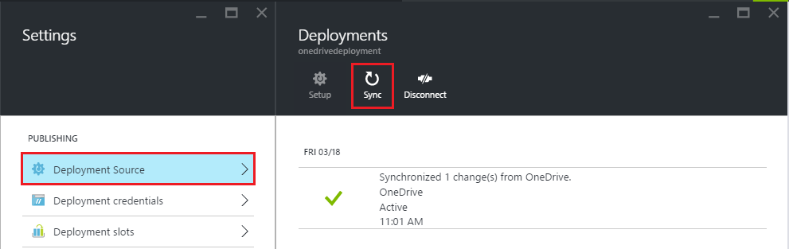

<properties
    pageTitle="將內容從雲端資料夾同步處理至 Azure 應用程式服務"
    description="瞭解如何從雲端資料夾內容的同步處理透過部署應用程式至 Azure 應用程式服務。"
    services="app-service"
    documentationCenter=""
    authors="dariagrigoriu"
    manager="wpickett"
    editor="mollybos"/>

<tags
    ms.service="app-service"
    ms.workload="na"
    ms.tgt_pltfrm="na"
    ms.devlang="na"
    ms.topic="article"
    ms.date="06/13/2016"
    ms.author="dariagrigoriu"/>
    
# 將內容從雲端資料夾同步處理至 Azure 應用程式服務

本教學課程介紹如何同步處理您的內容從常用的雲端儲存服務，例如 Dropbox 和 OneDrive 部署至[Azure 應用程式服務](http://go.microsoft.com/fwlink/?LinkId=529714)。 

## 內容的同步處理部署概觀

視需要內容的同步處理部署被可與應用程式服務整合[Kudu 部署引擎](https://github.com/projectkudu/kudu/wiki)。 [Azure 入口網站](https://portal.azure.com)中，可以指定在您的雲端儲存區中的資料夾，使用您的應用程式碼和內容的該資料夾，並按一下] 按鈕的同步處理應用程式服務。 內容的同步處理利用 Kudu 程序建立及部署。 
    
## 如何啟用同步處理內容部署
若要啟用從[Azure 入口網站](https://portal.azure.com)的內容同步處理，請遵循下列步驟︰

1. 在您的應用程式刀 Azure 入口網站中，按一下 [**設定** > **部署來源**。 **選擇 [來源**]，然後選取**OneDrive**或**Dropbox**部署的來源。 

    

    >[AZURE.NOTE] 基礎差異 Api，因為這次不支援**商務用 OneDrive** 。 

2. 完成授權工作流程，以啟用存取特定預先定義的指定的路徑的 OneDrive 或 Dropbox 應用程式服務內容的所有儲存的應用程式服務。  
    授權應用程式服務後的平台可讓您建立的內容的資料夾，在指定的內容路徑，或選擇 [此指定內容路徑] 底下的現有內容資料夾的選項。 您使用的應用程式服務同步處理的雲端儲存空間帳戶的指定內容路徑，如下所示︰  
    * **OneDrive**:`Apps\Azure Web Apps` 
    * **Dropbox**:`Dropbox\Apps\Azure`

3. 初始內容的同步處理後可以視需要從 Azure 入口網站初始內容的同步處理。 使用與**部署**刀部署歷程記錄。

    
 
在 [[從 Dropbox 的部署](http://blogs.msdn.com/b/windowsazure/archive/2013/03/19/new-deploy-to-windows-azure-web-sites-from-dropbox.aspx)使用 Dropbox 部署的詳細資訊。 

