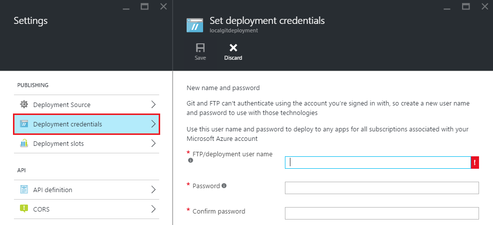

<properties
    pageTitle="本機給部署至 Azure 應用程式服務"
    description="瞭解如何啟用本機給部署至 Azure 應用程式服務。"
    services="app-service"
    documentationCenter=""
    authors="dariagrigoriu"
    manager="wpickett"
    editor="mollybos"/>

<tags
    ms.service="app-service"
    ms.workload="na"
    ms.tgt_pltfrm="na"
    ms.devlang="na"
    ms.topic="article"
    ms.date="06/13/2016"
    ms.author="dariagrigoriu"/>
    
# 本機給部署至 Azure 應用程式服務

本教學課程教您如何將您的應用程式部署在您的本機電腦上的給存放庫從[Azure 應用程式服務]。 應用程式服務[Azure 入口網站]中支援這種方式與**本機給**部署] 選項。  
建立使用[Azure 命令列介面]為所述[以下](app-service-web-get-started.md)應用程式服務應用程式時，許多本文所述的給命令會自動執行。

## 必要條件

若要完成此教學課程中，您需要︰

- 給。 您可以安裝二進位[以下](http://www.git-scm.com/downloads)下載。  
- 給基本知識。
- Microsoft Azure 帳戶。 如果您沒有帳戶，可以[免費試用版註冊](https://azure.microsoft.com/pricing/free-trial)] 或 [[啟動您的 Visual Studio 訂閱權益](https://azure.microsoft.com/pricing/member-offers/msdn-benefits-details)。

>[AZURE.NOTE] 如果您想要開始使用 Azure 應用程式服務註冊 Azure 帳戶之前，請移至[嘗試應用程式服務](http://go.microsoft.com/fwlink/?LinkId=523751)，可以讓您立即建立短暫入門應用程式在應用程式服務。 必要; 沒有信用卡沒有承諾。  

## 步驟 1︰ 建立本機存放庫

執行下列任務，以建立新的給存放庫。

1. 啟動命令列的工具，例如**GitBash** (Windows) 或**被**（Unix 殼層）。 在 OS X 系統上您可以存取命令列執行**終端機**應用程式。

2. 瀏覽至要部署的內容，就會位於的目錄。

3. 初始的新給存放庫中使用下列命令︰

        git init

## 步驟 2︰ 確認您的內容

應用程式服務支援各種不同的程式設計語言建立的應用程式。 

1. 如果您存放庫中已包含內容略過此點，然後移至指向下列 2。 如果您存放庫尚未包含內容只要填入靜態.html 檔案，如下所示︰ 

    - 使用文字編輯器，建立名為**index.html**給存放庫根目錄的新檔案
    - 新增下列文字 index.html 的內容檔案，然後將其儲存︰ *Hello 給 ！*
        
2. 從命令列，請確認您是在底下，您就可以給存放庫的根目錄。 將檔案新增到您存放庫，然後使用下列命令︰

        git add -A 

4. 接下來，認可變更到儲存機制，使用下列命令︰

        git commit -m "Hello Azure App Service"

## 步驟 3︰ 啟用應用程式服務應用程式存放庫

執行下列步驟，以啟用給存放庫應用程式服務應用程式。

1. [Azure 入口網站]登入。

2. 在您的應用程式服務應用程式刀按一下**設定 > 部署來源**。 按一下 [**選擇來源**]，然後按一下**本機給存放庫**，，然後按一下**[確定]**。  

    

3. 如果這是您第一次設定 Azure 中存放庫，您需要為其建立登入認證。 您會使用它們來從您的本機給存放庫請登入 Azure 存放庫及推入的變更。 按一下 [從您的應用程式刀**設定 > 部署認證**，然後設定您的部署使用者名稱和密碼。 當您完成時，請按一下 [**儲存**]。

    

## 步驟 4︰ 部署您的專案

使用下列步驟，將您的應用程式發佈到本機給應用程式服務。

1. 在您的應用程式刀 Azure 入口網站中，按一下 [**設定 > 屬性****給 URL**。

    

    **給 URL**是從您的本機存放庫部署至遠端參照。 下列步驟中，您會使用這個 URL。

2. 使用命令列，請確認您是在您的本機給存放庫的根目錄。

3. 使用`git remote`加入遠端參考中所列**給 URL**的步驟 1。 您的命令看起來如下︰

        git remote add azure https://<username>@localgitdeployment.scm.azurewebsites.net:443/localgitdeployment.git         
    > [AZURE.NOTE] **遠端**命令加入遠端存放庫命名的參考。 在此範例中，它會建立您的 web 應用程式存放庫名為 「 azure 」 的參照。

4. 推入您的內容，以使用新**azure**遠端您剛剛建立的應用程式服務。

        git push azure master

    系統會提示您先前建立時您重設您的部署認證 Azure 入口網站中的密碼。 輸入密碼 （請注意，Gitbash 不會回星號主控台輸入您的密碼時）。 
       
5. 回到您在 Azure 入口網站的應用程式。 您最近的推入的記錄項目應該會顯示在**部署**刀。 

    

6. 按一下 [**瀏覽**] 按鈕，頂端的應用程式的刀，確認已部署內容]。 
    
## 疑難排解

以下是錯誤或使用給發佈至 Azure 中的應用程式服務應用程式時常見的問題︰

****

**問題**︰ 無法存取 [siteURL]: 無法連線至 [scmAddress]

**原因**︰ 如果應用程式無法執行，會發生此錯誤。

**解決方法**︰ 啟動 Azure 入口網站中的應用程式。 除非執行應用程式，就可以給部署便無法運作。 

****

**問題**︰ 無法解析主機 '主機名稱]

**原因**︰ 如果建立 'azure' 遠端時所輸入的地址資訊不正確，就會發生此錯誤。

**解決方案**︰ 使用`git remote -v`命令可列出所有遙控器，以及相關的 URL。 請確認 'azure' 遠端 URL 正確無誤。 如有需要移除並重新建立此遠端使用正確的 URL。

****

**問題**︰ 一般和沒有指定; 沒有參照執行任何動作。 或許您應該指定分支，例如 「 母片]。

**原因**︰ 如果您沒有指定分支執行給推播作業，並沒有設定使用給 push.default 值時，會發生此錯誤。

**解析度**︰ 推入再次執行作業，指定主分支。 例如︰

    git push azure master

****

**症狀**︰ src refspec [branchname] 不符合任何。

**原因**︰ 如果您嘗試推入母片以外的分支 'azure' 在遠端，會發生此錯誤。

**解析度**︰ 推入再次執行作業，指定主分支。 例如︰

    git push azure master

****

**問題**︰ 錯誤-致力於遠端存放庫的變更，但不是會更新您的 web 應用程式。

**原因**︰ 如果您部署包含指定其他必要的模組 package.json 檔案的 Node.js 應用程式，就會發生此錯誤。

**解析度**︰ 其他郵件包含 「 npm 錯誤 ！ 」 應為此錯誤，登入的前，可提供發生錯誤的其他內容。 下面是已知此錯誤，對應 'npm 錯誤 ！ 」 的原因 訊息︰

* **不正確的 package.json 檔案**︰ npm 錯誤 ！ 無法讀取相依性。

* **原生模組，沒有在 Windows 版的二進位通訊群組**︰

    * npm 錯誤 ！ \`cmd 」 /c 」 「 節點 gyp 重建 「\` 1 失敗

        OR

    * npm 錯誤 ！ [modulename@version]預先安裝︰\`進行個管線gmake\`

## 其他資源

* [給文件](http://git-scm.com/documentation)
* [專案 Kudu 文件](https://github.com/projectkudu/kudu/wiki)
* [連續部署至 Azure 應用程式服務](app-service-continuous-deployment.md)
* [如何使用 PowerShell 的 Azure](../powershell-install-configure.md)
* [如何使用 Azure 命令列介面](../xplat-cli-install.md)

[Azure 應用程式服務]: https://azure.microsoft.com/documentation/articles/app-service-changes-existing-services/
[Azure Developer Center]: http://www.windowsazure.com/en-us/develop/overview/
[Azure 入口網站]: https://portal.azure.com
[Git website]: http://git-scm.com
[Installing Git]: http://git-scm.com/book/en/Getting-Started-Installing-Git
[Azure 命令列介面]: https://azure.microsoft.com/en-us/documentation/articles/xplat-cli-azure-resource-manager/

[Using Git with CodePlex]: http://codeplex.codeplex.com/wikipage?title=Using%20Git%20with%20CodePlex&referringTitle=Source%20control%20clients&ProjectName=codeplex
[Quick Start - Mercurial]: http://mercurial.selenic.com/wiki/QuickStart
