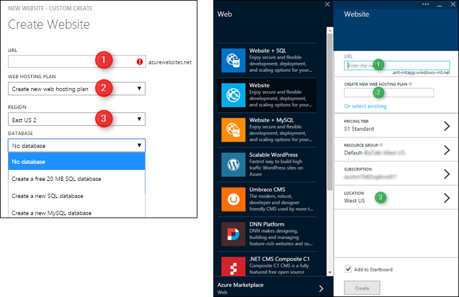
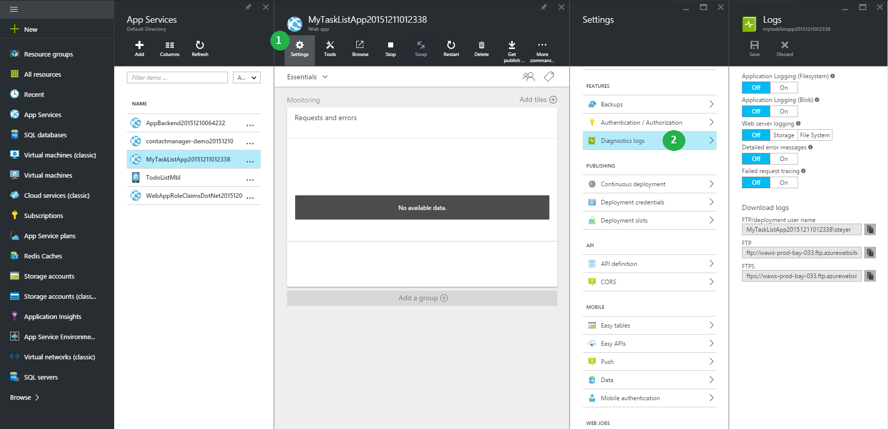
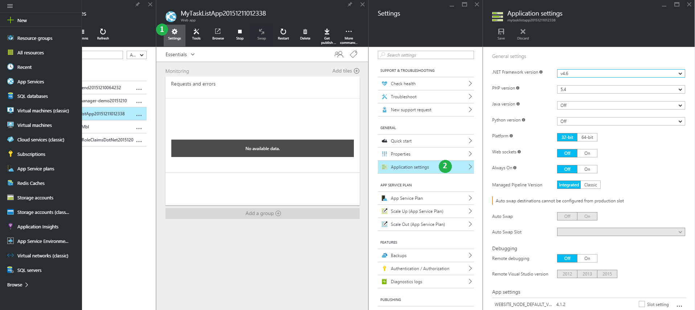

<properties
    pageTitle="瀏覽 Azure 入口網站的參照"
    description="管理入口網站和 Azure 入口網站之間，應用程式服務 web 瞭解不同的使用者體驗"
    services="app-service"
    documentationCenter=""
    authors="jaime-espinosa"
    manager="wpickett"
    editor="jimbe"/>

<tags
    ms.service="app-service"
    ms.workload="na"
    ms.tgt_pltfrm="na"
    ms.devlang="na"
    ms.topic="article"
    ms.date="02/26/2016"
    ms.author="jaime-espinosa"/>

# 瀏覽 Azure 入口網站的參照

Azure 的網站現在稱為[應用程式服務 Web 應用程式](http://go.microsoft.com/fwlink/?LinkId=529714)。 我們正在更新所有我們的說明文件以反映這項名稱變更，並提供指示給 Azure 入口網站。 直到完成該程序後，您可以使用 [作為輔助線此文件在 Azure 入口網站中使用的 Web 應用程式。

[AZURE.INCLUDE [app-service-web-to-api-and-mobile](../../includes/app-service-web-to-api-and-mobile.md)] 
 
## 未來的 Azure 傳統入口網站

您會注意到 Azure 傳統入口網站上的商標變更，而該入口網站是程序頂替 Azure 入口網站。 [傳統] 入口網站被淘汰，為新的開發的焦點會移位 Azure 入口網站。 Azure 入口網站中都將所有的 Web 應用程式即將來臨的新功能。 開始使用 Azure 入口網站，以利用其最新和最大的 Web 應用程式有提供。

## 版面配置 Azure 傳統入口網站和 Azure 入口網站之間的差異

在 [傳統] 入口網站中所有的 Azure 服務會列在左邊。 在 [傳統] 入口網站中的導覽遵循樹狀結構，，從服務開始，然後瀏覽至每個項目。 管理獨立的元件時，此結構會運作。 不過，內建在 Azure 的應用程式與互連式服務的集合，此樹狀結構不適合用於使用服務的集合。 

Azure 入口網站可讓您更輕鬆地建立應用程式結束端對端元件從多個服務。 *東西*被組織入口網站。 *路*是刀的一系列*刀*，也就是刀的不同元件的容器。 例如，設定自動調整大小的 web 應用程式是*路*採用您有幾個刀如下列範例所示︰**網站**防禦 （的刀標題具有尚未更新以使用新的術語），以**設定**防禦，以與**延展**。 在範例中，自動調整大小已被設定為取決於 CPU 使用率，使也是**CPU 百分比**刀。 內*刀*元件稱為*組件*，其看起來像磚。 

## 瀏覽範例︰ 建立 web 應用程式

建立新的 web 應用程式是仍只要簡單以 1-2-3。 下圖顯示 [傳統] 入口網站和入口網站，示範不多已變更的步驟，取得的 web 應用程式，並執行並排。 

在入口網站，您可以選擇從最常見的 web 應用程式，包括常用的圖庫應用程式，例如 WordPress 類型。 可用的應用程式的完整清單，請造訪[Azure Marketplace]。

當您建立 web 應用程式時，您指定的 URL，應用程式服務方案，就像您在 [傳統] 入口網站中執行入口網站中的位置。 

此外，入口網站可讓您定義其他常見的設定。 例如，[資源群組](../azure-resource-manager/resource-group-overview.md)進行簡單來查看和管理相關的 Azure 資源。 

## 瀏覽範例︰ 設定與功能

所有設定與功能會立即邏輯都群組單一防禦，您可以從導覽中。

例如，您可以建立的自訂網域，按一下 [**設定**刀中的 [ **SSL] 和自訂網域**。

若要設定的監控警示，按一下 [**要求與錯誤**]，然後**新增提醒**]。

若要啟用診斷，按一下 [**設定**刀中的 [**診斷記錄**]。

 
若要設定應用程式設定，請按一下 [**設定**刀中的 [**應用程式設定**]。 

以外的品牌名稱，在入口網站的一些事項已重新命名或以不同方式分組，使其更容易找到。 例如，以下是應用程式的 [對應] 頁面的螢幕擷取畫面中 [傳統] 入口網站設定] （**設定**）。

## 更多資源

[Azure Portal]: https://portal.azure.com
[Azure Marketplace]: /marketplace/

>[AZURE.NOTE] 如果您想要開始使用 Azure 應用程式服務註冊 Azure 帳戶之前，請移至[嘗試應用程式服務](http://go.microsoft.com/fwlink/?LinkId=523751)，可以讓您立即建立短暫入門 web 應用程式在應用程式服務。 必要; 沒有信用卡沒有承諾。

## 變更的項目
* 若要變更的指南，從網站應用程式服務請參閱︰ [Azure 應用程式服務與程式影響現有 Azure 服務](http://go.microsoft.com/fwlink/?LinkId=529714)
 
