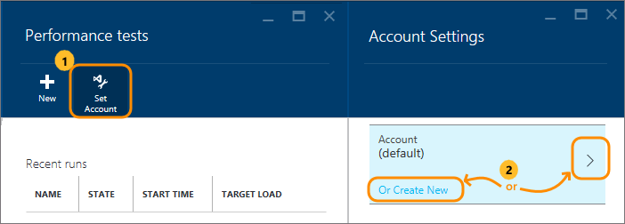
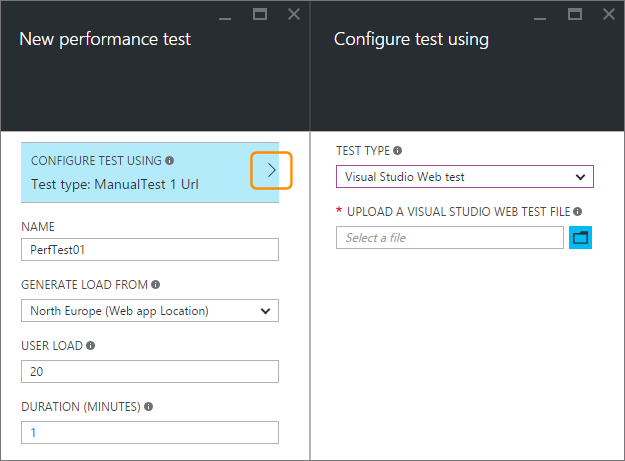
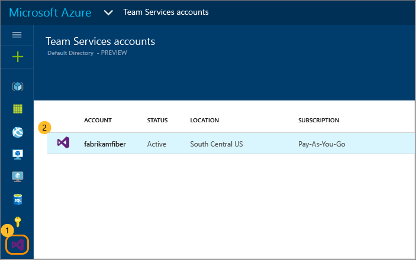

<properties
   pageTitle="測試您的 Azure web 應用程式的效能 |Microsoft Azure"
   description="執行 Azure web 應用程式效能測試，以檢查您的應用程式如何處理使用者載入。 測量回應時間，然後尋找錯誤的可能問題。"
   services="app-service\web"
   documentationCenter=""
   authors="ecfan"
   manager="douge"
   editor="jimbe"/>

<tags
   ms.service="app-service-web"
   ms.workload="web"
   ms.tgt_pltfrm="na"
   ms.devlang="na"
   ms.topic="article"
   ms.date="05/25/2016"
   ms.author="estfan; manasma; ahomer"/>

# <a name="performance-test-your-azure-web-app-under-load"></a>效能測試負載 Azure web 應用程式

啟動或更新部署到生產之前，請檢查您的 web 應用程式的效能。 如此一來，您可以更有效地評估無論您的應用程式是準備發行。 更多自信最大使用量使用期間，或在您下一步行銷推入您的應用程式可以處理流量的風格。

在公用預覽，您可以效能測試 Azure 入口網站中的免費應用程式。
這些測試模擬一段特定期間的應用程式使用者負載和測量您的應用程式回應。 例如，您的測試結果會顯示您的應用程式的使用者指定的數字的回應速度。 同時也會顯示多少要求失敗，這可能會指出您的應用程式的問題。      


## <a name="before-you-start"></a>在您開始之前

* 如果您沒有，您將需要[Azure 訂閱](https://account.windowsazure.com/subscriptions)。 瞭解如何[免費開啟 Azure 帳戶](https://azure.microsoft.com/pricing/free-trial/?WT.mc_id=A261C142F)。

* 您必須將您的效能測試歷程記錄的[Visual Studio 小組服務](https://www.visualstudio.com/products/what-is-visual-studio-online-vs)帳戶。 設定您的效能測試時，將會自動建立的適當的帳戶。 或者，您可以建立新的帳戶，或如果您是帳戶擁有者使用現有的帳戶。 

* 部署非生產環境中測試應用程式。 有應用程式使用生產所使用的方案以外的應用程式服務方案。 如此一來，您不會影響任何現有客戶或您的應用程式中生產變得緩慢。 

## <a name="set-up-and-run-your-performance-test"></a>設定並執行效能測試

0.  [Azure 入口網站](https://portal.azure.com)登入。 若要使用您自己的 Visual Studio 小組服務帳戶，而帳戶擁有者的身分登入。

0.  移至您的 web 應用程式。

    

0.  移至**效能測試**。

    ![移至 [工具] 的效能測試](./media/app-service-web-app-performance-test/azure-np-web-app-details-tools-expanded.png)
 
0. 現在，您會連結，讓您的效能測試歷程記錄的[Visual Studio 小組服務](https://www.visualstudio.com/products/what-is-visual-studio-online-vs)帳戶。

    如果您有要使用的小組服務帳戶，請選取該帳戶。 如果您沒有，建立新的帳戶。

    

0.  建立您的效能測試。 設定詳細資料，並執行。 

在測試執行時，您可以觀看即時結果。

例如，假設您有提供在最後一年的假日銷售的優待券查看相關應用程式。 此事件會持續與 100 同時客戶的最大使用量載入 15 分鐘。 我們想要今年按兩下客戶的數目。 我們也要改善來減少從 5 秒的頁面載入時間為 2 秒的客戶滿意度。 因此，我們會測試我們更新應用程式的效能與 250 個使用者 15 分鐘。

我們會在我們的應用程式上模擬負載產生虛擬使用者 （客戶） 來人員同時造訪我們的網站。 這會顯示多少要求已失敗，或回應速度緩慢。

  

   *  會自動新增您的 web 應用程式的預設 URL。 
   您可以變更測試 （僅限 HTTP GET 要求） 其他頁面的 URL。

   *  若要模擬本機條件並減少延遲，選取最接近您的使用者產生載入。

  以下是進行測試。 在第一分鐘，我們頁面載入，我們希望慢。

  

  測試完畢後，我們瞭解網頁載入速度後第一分鐘。 這可協助找出我們可能會想要開始位置疑難排解問題。

  

## <a name="test-multiple-urls"></a>測試多個 Url

您也可以執行效能測試合併多個上傳 Visual Studio Web 測試檔案來代表端對端使用者案例的 Url。 幾種方法您可以建立檔案的 Visual Studio Web 測試︰

* [擷取流量使用 Fiddler 及匯出為 Visual Studio Web 測試檔案](http://docs.telerik.com/fiddler/Save-And-Load-Traffic/Tasks/VSWebTest)
* [在 Visual Studio 建立載入測試檔案](https://www.visualstudio.com/docs/test/performance-testing/run-performance-tests-app-before-release)

若要上傳並執行 Visual Studio Web 測試檔案︰
 
0. 請遵循上述步驟，以開啟**新的效能測試**刀。
   在此刀中，選擇 [CONFIGFURE 測試使用的選項，即可開啟 [**設定使用測試**刀]。  

    

0. 核取 [測試類型] 已設定**Visual Studio Web**測試，然後選取您 HTTP 封存的檔案。
    您可以使用 「 資料夾 」 圖示來開啟檔案選擇器] 對話方塊。

    

    已上傳檔案後，您會看到 Url 測試 URL 詳細資料] 區段中的清單。
 
0. 指定使用者負載測試期間，然後選擇 [**執行測試**。

    

    在測試完成後，您會看到兩個窗格中的結果。 在左的窗格會顯示一系列的圖表 performnace 資訊。

    ![效能的 [結果] 窗格](./media/app-service-web-app-performance-test/multiple-01a-results.png)

    右窗格中顯示失敗的要求其發生次數與錯誤類型的清單。

    

0. 選擇 [**重新執行**] 圖示，在右窗格的頂端，重新執行測試。

    

##  <a name="q--a"></a>問與答

#### <a name="q-is-there-a-limit-on-how-long-i-can-run-a-test"></a>問︰ 有限制上多久我可以在其中執行測試嗎？ 

**A**︰ 是的您就可以執行達一小時測試 Azure 入口網站中。

#### <a name="q-how-much-time-do-i-get-to-run-performance-tests"></a>問︰ 多少時間才能執行效能測試嗎？ 

**A**︰ 公用預覽之後, 您取得 20000 虛擬使用者的通話分鐘 (VUMs) 免費每個月與您的 Visual Studio 小組服務帳戶。 VUM 是虛擬除以幾分鐘，在您的使用者數目。 如果您的需求超出可用的限制，您可以購買更多時間並支付僅適用於您的使用。

#### <a name="q-where-can-i-check-how-many-vums-ive-used-so-far"></a>問︰ 位置可以檢查我目前使用的多少 VUMs？

**A**︰ 您可以檢查 Azure 入口網站中的此量。




#### <a name="q-what-is-the-default-option-and-are-my-existing-tests-impacted"></a>問︰ 什麼是預設的選項，以及我現有的測試影響？

**A**︰ 效能載入測試的預設選項手動測試-與之前的多個 URL 測試選項的相同已新增至入口網站。
您現有的測試繼續使用設定的 URL，並為之前都將能夠運作。

#### <a name="q-what-features-not-supported-in-the-visual-studio-web-test-file"></a>問︰ 什麼功能不支援在 Visual Studio Web 測試檔案？

**A**︰ 目前這項功能不支援 Web 測試外掛程式、 資料來源和擷取規則。 您必須編輯 Web 測試檔案時，要移除這些。 希望將支援的這些功能在未來的更新。

#### <a name="q-does-it-support-any-other-web-test-file-formats"></a>問︰ 它支援任何其他 Web 測試檔案格式嗎？
  
**A**︰ 在簡報僅 Visual Studio Web 測試支援的檔案格式。
我們會對您的想法如果您需要的其他檔案格式的支援。 電子郵件與我們連絡[vsoloadtest@microsoft.com](mailto:vsoloadtest@microsoft.com)。

#### <a name="q-what-else-can-i-do-with-a-visual-studio-team-services-account"></a>問︰ 什麼做 Visual Studio 小組服務帳戶？

**A**︰ 若要尋找您的新帳戶，請移至```https://{accountname}.visualstudio.com```。 共用您的程式碼、 建立、 測試、 追蹤的工作並運送軟體 – 所有在雲端使用任何的工具或語言。 進一步瞭解[Visual Studio 小組 Services](https://www.visualstudio.com/products/what-is-visual-studio-online-vs)功能及服務如何協助您更輕鬆地進行共同作業，並持續部署的小組。

## <a name="see-also"></a>另請參閱

* [執行簡單的雲端效能測試](https://www.visualstudio.com/docs/test/performance-testing/getting-started/get-started-simple-cloud-load-test)
* [執行 Apache Jmeter 效能測試](https://www.visualstudio.com/docs/test/performance-testing/getting-started/get-started-jmeter-test)
* [錄製及重新執行雲端負載測試](https://www.visualstudio.com/docs/test/performance-testing/getting-started/record-and-replay-cloud-load-tests)
* [效能雲端中測試您的應用程式](https://www.visualstudio.com/docs/test/performance-testing/getting-started/getting-started-with-performance-testing)
