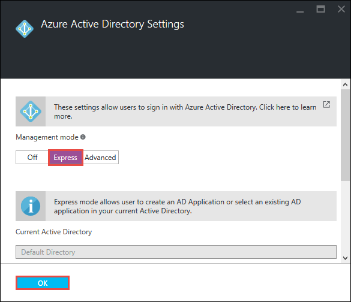
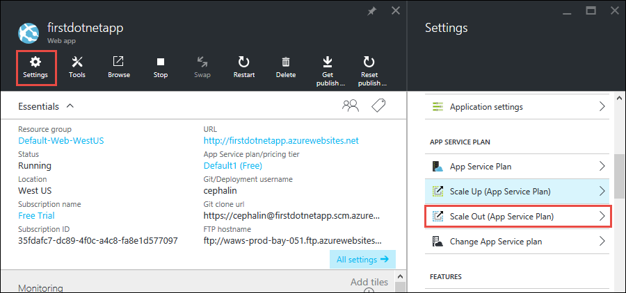

<properties
    pageTitle="將功能新增至您的第一個 web 應用程式"
    description="新增至您的第一個 web 應用程式的酷炫功能，在幾分鐘。"
    services="app-service\web"
    documentationCenter=""
    authors="cephalin"
    manager="wpickett"
    editor=""
/>

<tags
    ms.service="app-service-web"
    ms.workload="web"
    ms.tgt_pltfrm="na"
    ms.devlang="na"
    ms.topic="hero-article"
    ms.date="05/12/2016"
    ms.author="cephalin"
/>

# 將功能新增至您的第一個 web 應用程式

[部署至 Azure 5 分鐘內第一個 web 應用程式](app-service-web-get-started.md)，在您部署[Azure 應用程式服務](../app-service/app-service-value-prop-what-is.md)範例 web 應用程式。 本文中，您將快速新增一些很棒的功能已部署的 web 應用程式。 在幾分鐘，您將會︰

- 強制驗證的使用者
- 自動調整您的應用程式
- 收到通知您的應用程式的效能

無論您在前一篇文章中部署的範例應用程式，您可以遵循在教學課程。

在此教學課程中的三個活動是您放置 web 應用程式的應用程式服務時發生許多有用的功能幾個的範例。 許多功能可在**免費**層 （這是您第一份 web 應用程式執行），您可以使用您的試用信用額度試試需要較高價格層的功能。 保證除非明確到不同的價格層變更 web 應用程式將會保留在**免費**層。

>[AZURE.NOTE] 您使用 Azure CLI 建立 web 應用程式執行**免費**層，只允許一個共用的 VM 執行個體，具有資源配額。 如需有關您取得的**免費**層的詳細資訊，請參閱[應用程式服務限制](../azure-subscription-service-limits.md#app-service-limits)。

## 驗證您的使用者

現在讓我們來看看如何輕鬆將驗證新增至您的應用程式 （深入閱讀在[應用程式服務驗證和授權](https://azure.microsoft.com/blog/announcing-app-service-authentication-authorization/)）。

1. 在入口網站應用程式刀，其中您剛開啟，按一下 [**設定** > **驗證 / 授權**。  
    

2. 按一下 [**上**開啟 [驗證]。  

4. 在 [**驗證提供者中**，按一下 [ **Azure Active Directory**]。  
    

5. 在**Azure Active Directory 設定**刀中，按一下 [**快速**，然後按一下**[確定**。 建立新的預設設定預設目錄中的 Azure AD 應用程式。  
 

6. 按一下 [**儲存**]。  
    

    變更成功後，您會看到開啟為綠色，以及易記的訊息通知 bell。

7. 回到您的應用程式入口網站刀，按一下**URL**連結 （或功能表列中的 [**瀏覽**）。 連結是 HTTP 地址。  
      
    但是後，會在新索引標籤中開啟應用程式，URL 方塊重新導向數次，並完成您的應用程式 HTTPS 地址。 您看到的您已經登入到 Azure 訂閱，與應用程式中自動進行驗證。  
      
    因此，如果您現在會在不同的瀏覽器中開啟未經驗證的工作階段，您會看到登入畫面，當您瀏覽至相同的 URL。  
    <!--   -->
   如果您從未已完成與 Azure Active Directory 中的任何項目，請您的預設目錄可能沒有任何 Azure AD 使用者。 在此情況下，在那裡僅限的帳戶可能會是 Azure 訂閱的 Microsoft 帳戶。 會自動登入應用程式的舊版相同的瀏覽器。
   您可以使用該同一個 Microsoft 帳戶登入，在此登入] 頁面上。

恭喜您，您的驗證所有流量至您的 web 應用程式。

您可能已經注意到中**驗證 / 授權**刀您可以執行更多，例如︰

- 啟用社交登入
- 啟用多個登入選項
- 變更預設行為，當人員第一次瀏覽至您的應用程式

應用程式服務，提供開啟鍵解決方案一些常見的驗證的需求，因此您不需要自行提供驗證邏輯。
如需詳細資訊，請參閱[驗證授權方式應用程式服務](https://azure.microsoft.com/blog/announcing-app-service-authentication-authorization/)。

## 調整您的應用程式會自動根據需求

下一步] 現在就讓我們自動調整大小應用程式，以便它會自動調整其回應使用者 （深入閱讀，[設定您的應用程式中 Azure 時幅](web-sites-scale.md)] 和 [[手動] 或 [自動調整執行個體計數](../monitoring-and-diagnostics/insights-how-to-scale.md)） 的需求的容量。

簡要，您不按比例縮放 web 應用程式中的兩種方法︰

- [不按比例縮放](https://en.wikipedia.org/wiki/Scalability#Horizontal_and_vertical_scaling)︰ 取得更多的 CPU、 記憶體、 磁碟空間及額外功能專用的 Vm、 自訂網域等臨時位置、 自動縮放，及其他功能的憑證。 藉由變更您的應用程式所屬的應用程式服務方案的價格層縮放。
- [延展](https://en.wikipedia.org/wiki/Scalability#Horizontal_and_vertical_scaling)︰ 增加 VM 數執行個體的執行您的應用程式。
您可以調整出為 50 的執行個體，根據您的價格層。

進一步 ado，不讓我們來設定自動縮放。

1. 首先，我們不按比例縮放啟用自動縮放。 在您的應用程式入口網站刀，按一下 [**設定** > **縮放比例設定 （應用程式服務方案）**。  
    

2. 捲動並選取**S1 標準**層最低層支援自動縮放 （圈起來的螢幕擷取畫面中），然後按一下 [**選取**]。  
    

    完成設定縮放比例。

    >[AZURE.IMPORTANT] 這一層的安全性和您免費的試用貸項總計。 如果您有支付每次使用帳戶時，它必須支付費用至您的帳戶。

3. 接下來，讓我們來設定自動縮放。 在您的應用程式入口網站刀，按一下 [**設定** > **比例查看 （應用程式服務方案）**。  
    

4. 變更**CPU 百分比****小數位數**。 下拉式清單下方的滑桿適當地更新。 然後，定義介於**1**和**2**和**40**及**80**之間的**目標範圍**之間的**執行個體**。 請在方塊中輸入文字或移動滑桿。  
 

    根據這項設定，您的應用程式自動調整出時 CPU 使用率 80%上方和下方 40 %cpu 使用率時縮放中。

5. 在功能表列中，按一下 [**儲存**]。

恭喜您，您的應用程式會自動縮放。

您可能已經注意到，您可以執行更多，例如**縮放設定**刀中︰

- 手動調整成特定數目的執行個體
- 不按比例縮放的其他效能標準，例如記憶體百分比或磁碟佇列中
- 觸發效能規則時，自訂縮放比例行為
- 自動調整大小的排程
- 設定自動縮放行為，未來的事件

縮放比例設定您的應用程式的詳細資訊，請參閱[設定您的應用程式中 Azure 不按比例縮放](../app-service-web/web-sites-scale.md)。 擴展的詳細資訊，請參閱[手動] 或 [自動調整執行個體計數](../monitoring-and-diagnostics/insights-how-to-scale.md)。

## 收到您的應用程式的通知

現在，您的應用程式會自動縮放，到最大的執行個體計數 (2) 時，會發生什麼情況 CPU 是上方所要的使用狀況 （80%)？
通知您的這種情況下，您可以進一步不按比例縮放向上出您的應用程式，例如，您可以設定提醒 （深入閱讀在[接收提醒通知](../monitoring-and-diagnostics/insights-receive-alert-notifications.md)）。 讓我們來快速設定這種情況的提醒。

1. 在您的應用程式入口網站刀，按一下 [**工具** > **通知**。  
    

2. 按一下 [**新增提醒**]。 然後，在 [**資源**] 方塊中，選取 [ **(serverfarms)**最後一句的資源。 這是您的應用程式服務方案。  
    

3. 指定**名稱**為`CPU Maxed`，**公制** **CPU 百分比**，以及**閥值**為`90`，然後選取 [**電子郵件的擁有人、 參與者及助讀程式**，然後按一下**[確定]**。   
 

    Azure 完成建立提醒，您會在**通知**刀看到它。  
    ![通知-完成] 檢視](./media/app-service-web-get-started/alert-done.png)

恭喜您，您現在收到通知。

此通知設定檢查 CPU 使用率每隔五分鐘。 如果該數字 90%，您會收到電子郵件提醒，以及授權的任何人。 若要查看所有人都能獲得授權收到警示，返回入口網站的刀應用程式，然後按一下 [ **Access** ] 按鈕。  

您應該會看到**訂閱管理員**已**擁有者**的應用程式。 此群組便會包含您，如果您是帳戶管理員，您的 Azure 訂閱 （例如試用的訂閱）。 如需有關 Azure 角色型存取控制的詳細資訊，請參閱[Azure Role-Based Access 控制項](../active-directory/role-based-access-control-configure.md)。

> [AZURE.NOTE] 通知規則是 Azure 功能。 如需詳細資訊，請參閱[接收提醒通知](../monitoring-and-diagnostics/insights-receive-alert-notifications.md)。

## 後續步驟

在您設定提醒，您可能已經注意到豐富的**工具**刀中的工具。 您可以在這裡，疑難排解問題、 監控效能測試弱點、 管理資源、 互動 VM 主控台，以及新增有用延伸。 邀請您要探索的簡單而強大的工具，在您的手指秘訣這些工具的每一項。

了解如何執行更多與您部署的應用程式。 以下是部分清單︰

- [購買並設定自訂網域名稱](custom-dns-web-site-buydomains-web-app.md)-購買美觀的網域名稱用於您的 web 應用程式，而不是 *。 azurewebsites.net 網域。 或使用網域時，您已經有。
- [設定臨時環境](web-sites-staged-publishing.md)-之前將其放入生產部署至暫存的 URL 的應用程式。 放心更新即時 web 應用程式。 設定精緻的 DevOps 方案與多個部署位置。
- [設定 [接續本頁] 分部署](app-service-continuous-deployment.md)-將您的來源控制系統整合應用程式部署。 使用每個認可部署 Azure。
- [存取內部部署資源](web-sites-hybrid-connection-get-started.md)存取現有的內部部署的資料庫或 CRM 系統。
- [備份您的應用程式](web-sites-backup.md)的設定後設定與還原網頁應用程式。 準備未預期的錯誤和修復它們。
- [啟用診斷記錄](web-sites-enable-diagnostic-log.md)-從 Azure 或應用程式追蹤讀取 IIS 記錄檔。 閱讀這些資料流中、 下載，或連接到[應用程式的深入見解](../application-insights/app-insights-overview.md)這些埠開啟鍵分析。
- [掃描您的應用程式的弱點](https://azure.microsoft.com/blog/web-vulnerability-scanning-for-azure-app-service-powered-by-tinfoil-security/) -
掃描您的 web 應用程式，使用[Tinfoil 安全性](https://www.tinfoilsecurity.com/)所提供的服務的新式威脅。
- [執行背景工作](../azure-functions/functions-overview.md)-執行作業來處理資料，報告等。
- [瞭解應用程式 Service 的運作方式](../app-service/app-service-how-works-readme.md)
