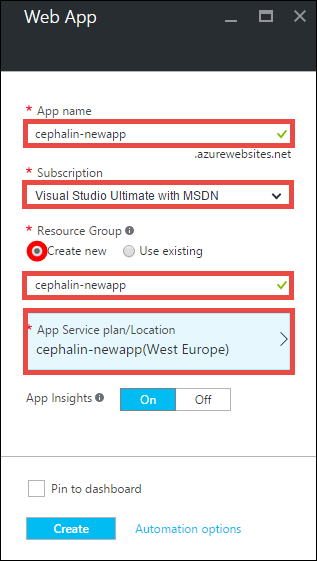
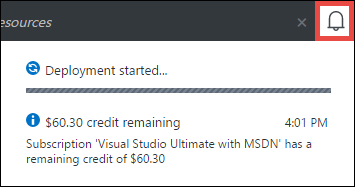

<properties 
    pageTitle="將您的第一個 Java web 應用程式部署 5 分鐘中的 [Azure |Microsoft Azure" 
    description="瞭解如何輕鬆部署範例應用程式，在應用程式服務中執行此 web 應用程式。 啟動 [快速執行真正的開發，並立即查看結果。" 
    services="app-service\web"
    documentationCenter=""
    authors="cephalin"
    manager="wpickett"
    editor=""
/>

<tags
    ms.service="app-service-web"
    ms.workload="web"
    ms.tgt_pltfrm="na"
    ms.devlang="na"
    ms.topic="hero-article"
    ms.date="10/13/2016" 
    ms.author="cephalin"
/>
    
# 將您的第一個 Java web 應用程式部署 5 分鐘中的 [Azure

本教學課程中，可協助您部署至[Azure 應用程式服務](../app-service/app-service-value-prop-what-is.md)的簡單 Java web 應用程式。
若要建立 web 應用程式、[行動應用程式返回結束](/documentation/learning-paths/appservice-mobileapps/)，及[API 應用程式](../app-service-api/app-service-api-apps-why-best-platform.md)，您可以使用應用程式服務。

您將會︰ 

- 建立 web 應用程式中 Azure 應用程式服務。
- 部署範例 Java 應用程式。
- 請參閱您執行的實際生產的程式碼。

## 必要條件

- 取得 FTP/FTP 用戶端，例如[FileZilla](https://filezilla-project.org/)。
- 取得 Microsoft Azure 帳戶。 如果您沒有帳戶，可以[免費試用版註冊](/pricing/free-trial/?WT.mc_id=A261C142F)] 或 [[啟動您的 Visual Studio 訂閱權益](/pricing/member-offers/msdn-benefits-details/?WT.mc_id=A261C142F)。

>[AZURE.NOTE] 您可以[嘗試應用程式服務](http://go.microsoft.com/fwlink/?LinkId=523751)不 Azure 帳戶。 建立入門應用程式，並不必要的信用卡，沒有承諾，其播放達一小時。

## 建立 web 應用程式

1. [Azure 入口網站](https://portal.azure.com)以 Azure 帳戶登入。

2. 從左側功能表中，按一下 [**新增** > **Web + 行動** > **Web 應用程式**。

    

3. 在應用程式建立刀中，針對新的應用程式中使用下列設定︰

    - **應用程式名稱**︰ 輸入唯一的名稱。
    - **資源群組**︰ 選取 [**建立新**，並為資源群組名稱。
    - **應用程式服務方案/位置**︰ 按一下以設定，然後按一下 [**建立新**設定的名稱、 位置和價格層的應用程式服務方案。 歡迎使用**免費**價格層。

    當您完成時，您的應用程式建立刀看起來應該像這樣︰

    

3. 按一下 [底部的 [**建立**]。 您可以按一下以查看進度頂端的 [**通知**] 圖示。

    

4. 部署完成時，您應該會看到此通知訊息。 按一下以開啟您的部署刀郵件。

    

5. 在**部署成功**刀中，按一下**資源**連結来開啟新的 web 應用程式的刀。

    

## 部署 Java 應用程式至您的 web 應用程式

現在，現在就讓我們來使用 FTP Azure 中部署 Java 應用程式。

5. 在 web 應用程式刀中，捲動至 [**應用程式設定**] 或 [搜尋]，然後按一下它。 

    

6. 在**Java 版本**中，選取**Java 8** ，然後按一下 [**儲存**]。

    

    當您收到**已成功更新 web app 設定**的通知時，請瀏覽至 http://*&lt;應用程式名稱 >*。 若要查看的實際操作預設 JSP servlet azurewebsites.net。

7. 回 web 應用程式刀中，向下**部署認證**或搜尋，捲動，然後按一下它。

8. 設定您的部署認證，然後按一下 [**儲存**]。

7. 在 web 應用程式刀中，按一下 [**概觀**]。 旁**FTP/部署使用者名稱**和**FTP 主機名稱**，按一下 [**複製**] 按鈕，將這些值，複製。

    

    現在，您準備好要部署與 FTP Java 應用程式。

8. 在您 FTP/FTP 用戶端，登入 Azure web 應用程式的 FTP 伺服器使用您在最後一個步驟中複製的值。 使用您先前建立的部署密碼。

    下圖顯示 [登入使用 FileZilla。

    

    您可能會看到安全性警告的 [從 Azure 無法辨識的 SSL 憑證。 請繼續並繼續。

9. 按一下[此連結](https://github.com/Azure-Samples/app-service-web-java-get-started/raw/master/webapps/ROOT.war)馬檔案下載到您的本機電腦。

9. 在您的 FTP/FTP 用戶端，瀏覽至**/site/wwwroot/webapps**在遠端網站中，然後將您的本機電腦上下載的馬檔案拖曳到該遠端目錄。

    

    按一下**[確定]**來覆寫 Azure 中的檔案。

    >[AZURE.NOTE] 根據 Tomcat 的預設行為的檔名**ROOT.war** /site/wwwroot/webapps 中的可讓您根 web 應用程式 (http://*&lt;應用程式名稱 >*。 azurewebsites.net)，和檔名***&lt;anyname >*.war**可讓您在命名的 web 應用程式 (http://*&lt;應用程式名稱 >*.azurewebsites.net/*&lt;anyname >*)。

這樣就可以 ！ Java 應用程式正在執行即時 Azure 中。 在瀏覽器中瀏覽至 http://*&lt;應用程式名稱 >*。 在動作中查看 azurewebsites.net。 

## 對您的應用程式的更新

每當您需要進行更新，只要檔案上傳新馬至您的 FTP/FTP 用戶端的相同遠端目錄。

## 後續步驟

[建立 Java web app 中 Azure Marketplace 的範本](web-sites-java-get-started.md#marketplace)。 您可以取得您自己的自訂 Tomcat 容器，並取得熟悉的管理員使用者介面。 

偵錯 Azure web 應用程式，直接在[IntelliJ](app-service-web-debug-java-web-app-in-intellij.md)或[蝕](app-service-web-debug-java-web-app-in-eclipse.md)中。

或執行更多第一個 web 應用程式。 例如︰

- 試試看[部署 Azure 程式碼的其他方法](../app-service-web/web-sites-deploy.md)。 
- 可讓您 Azure 應用程式到下一層級。 驗證您的使用者。 它會根據指定的小數位數。 如果需要設定的一些效能提醒。 只要按幾下滑鼠。 請參閱[新增至您的第一個 web 應用程式的功能](app-service-web-get-started-2.md)。

