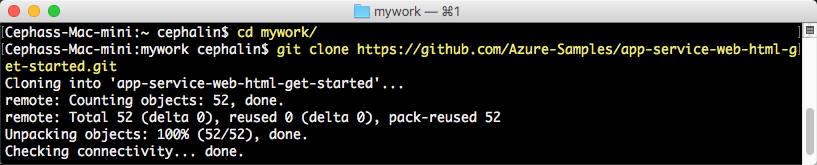

<properties 
    pageTitle="將您的第一個 web 應用程式部署 5 分鐘中的 [Azure |Microsoft Azure" 
    description="瞭解如何輕鬆部署範例應用程式，在應用程式服務中執行此 web 應用程式。 啟動 [快速執行真正的開發，並立即查看結果。" 
    services="app-service\web"
    documentationCenter=""
    authors="cephalin"
    manager="wpickett"
    editor=""
/>

<tags
    ms.service="app-service-web"
    ms.workload="web"
    ms.tgt_pltfrm="na"
    ms.devlang="na"
    ms.topic="hero-article"
    ms.date="10/13/2016" 
    ms.author="cephalin"
/>
    
# 將您的第一個 web 應用程式部署 5 分鐘中的 [Azure

本教學課程中，可協助您部署至[Azure 應用程式服務](../app-service/app-service-value-prop-what-is.md)的第一個 web 應用程式。
若要建立 web 應用程式、[行動應用程式返回結束](/documentation/learning-paths/appservice-mobileapps/)，及[API 應用程式](../app-service-api/app-service-api-apps-why-best-platform.md)，您可以使用應用程式服務。

您將會︰ 

- 建立 web 應用程式中 Azure 應用程式服務。
- 部署程式碼範例 （ASP.NET、 PHP、 Node.js、 Java 或 Python 之間選擇）。
- 請參閱您執行的實際生產的程式碼。
- 更新您的 web 應用程式即[的發送給認可](https://git-scm.com/docs/git-push)以相同的方式。

>[AZURE.INCLUDE [app-service-linux](../../includes/app-service-linux.md)] 

## 必要條件

- [給](http://www.git-scm.com/downloads)。
- [Azure CLI](../xplat-cli-install.md)。
- Microsoft Azure 帳戶。 如果您沒有帳戶，可以[免費試用版註冊](/pricing/free-trial/?WT.mc_id=A261C142F)] 或 [[啟動您的 Visual Studio 訂閱權益](/pricing/member-offers/msdn-benefits-details/?WT.mc_id=A261C142F)。

>[AZURE.NOTE] 您可以[嘗試應用程式服務](http://go.microsoft.com/fwlink/?LinkId=523751)不 Azure 帳戶。 建立入門應用程式，並不必要的信用卡，沒有承諾，其播放達一小時。

## 部署 web 應用程式

現在就讓我們將在 web 應用程式部署 Azure 應用程式服務。

1. 開啟新的 Windows 命令提示字元、 PowerShell 視窗、 Linux 殼層或 OS X 終端機。 執行`git --version`和`azure --version`以驗證您的電腦上已安裝給和 Azure CLI。

    

    如果您還沒有安裝工具，請參閱下載連結[的先決條件](#Prerequisites)。

3. 登入 Azure 像這樣︰

        azure login

    請遵循說明郵件繼續登入程序。

    

4. 變更 Azure CLI ASM 模式]，然後設定部署使用者應用程式服務。 您會部署稍後使用認證的程式碼。

        azure config mode asm
        azure site deployment user set --username <username> --pass <password>

1. 變更為使用目錄 (`CD`) 和複製範例應用程式，就像這樣︰

        git clone <github_sample_url>

    

    針對*&lt;github_sample_url >*，使用下列的 Url，根據您喜歡的架構的其中一個︰

    - HTML + CSS + JS: [https://github.com/Azure-Samples/app-service-web-html-get-started.git](https://github.com/Azure-Samples/app-service-web-html-get-started.git)
    - ASP.NET: [https://github.com/Azure-Samples/app-service-web-dotnet-get-started.git](https://github.com/Azure-Samples/app-service-web-dotnet-get-started.git)
    - PHP (CodeIgniter): [https://github.com/Azure-Samples/app-service-web-php-get-started.git](https://github.com/Azure-Samples/app-service-web-php-get-started.git)
    - Node.js (Express): [https://github.com/Azure-Samples/app-service-web-nodejs-get-started.git](https://github.com/Azure-Samples/app-service-web-nodejs-get-started.git)
    - Java: [https://github.com/Azure-Samples/app-service-web-java-get-started.git](https://github.com/Azure-Samples/app-service-web-java-get-started.git)
    - Python (Django): [https://github.com/Azure-Samples/app-service-web-python-get-started.git](https://github.com/Azure-Samples/app-service-web-python-get-started.git)

2. 變更您的範例應用程式存放庫。 例如︰

        cd app-service-web-html-get-started

4. 建立應用程式服務應用程式資源的 Azure 中的唯一的應用程式名稱與您先前設定的部署使用者。 當您收到提示時，指定所要的區域數目。

        azure site create <app_name> --git --gitusername <username>

    

    您的應用程式中建立 Azure 現在。 此外，您目前的目錄做為給初始化，並且連線到新的應用程式服務應用程式就可以給遠端。
    您可以瀏覽至應用程式的 URL (http://&lt;app_name >。 azurewebsites.net) 查看美觀的預設 HTML 頁面，但現在就讓我們實際取得現在您的程式碼。

4. 等您想要發送給任何程式碼，請將範例程式碼部署至 Azure 應用程式中。 出現提示時，使用您先前設定的密碼。

        git push azure master

    

    如果您使用的語言架構的其中一個，您會看到不同的輸出。 `git push`程式碼會置於 Azure，不僅也會觸發部署引擎中的部署工作。 如果您的專案 （存放庫） 根中有任何 package.json (Node.js) 或 requirements.txt (Python) 檔案，或 ASP.NET 專案中有 packages.config 檔案，部署指令碼會還原為您所需的封裝。 您也可以自動處理 composer.json 檔案 PHP 應用程式中的 [[啟用編輯器副檔名](web-sites-php-mysql-deploy-use-git.md#composer)。

恭喜您，您的應用程式部署 Azure 應用程式服務。

## 請參閱執行即時應用程式

若要查看您執行即時 Azure 中的應用程式，請從任何您存放庫中的目錄中執行此命令︰

    azure site browse

## 對您的應用程式的更新

您現在可以使用給若要從您的專案 （存放庫） 根隨時推 live 網站進行更新。 您執行的相同方式當您第一次部署您的程式碼。 例如，每當您想要從本機推播測試過的新變更，只要執行下列命令從您的專案 （存放庫） 根︰

    git add .
    git commit -m "<your_message>"
    git push azure master

## 後續步驟

尋找您的語言架構慣用的開發及部署步驟︰

> [AZURE.SELECTOR]
- [.NET](web-sites-dotnet-get-started.md)
- [PHP](app-service-web-php-get-started.md)
- [Node.js](app-service-web-nodejs-get-started.md)
- [Python](web-sites-python-ptvs-django-mysql.md)
- [Java](web-sites-java-get-started.md)

或執行更多第一個 web 應用程式。 例如︰

- 試試看[部署 Azure 程式碼的其他方法](../app-service-web/web-sites-deploy.md)。 例如，若要從您 GitHub 存放庫部署，只要選取**GitHub** ，而不是**本機給存放庫**中**部署選項**。
- 可讓您 Azure 應用程式到下一層級。 驗證您的使用者。 它會根據指定的小數位數。 如果需要設定的一些效能提醒。 只要按幾下滑鼠。 請參閱[新增至您的第一個 web 應用程式的功能](app-service-web-get-started-2.md)。

