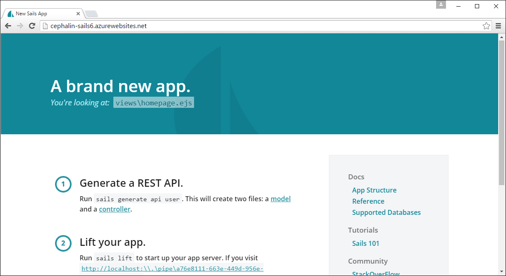

<properties
    pageTitle="Azure 應用程式服務部署 Sails.js 的 web 應用程式"
    description="瞭解如何部署 Node.js 應用程式 Azure 應用程式服務。 本教學課程教您如何部署 Sails.js web 應用程式。"
    services="app-service\web"
    documentationCenter="nodejs"
    authors="cephalin"
    manager="wpickett"
    editor=""/>

<tags
    ms.service="app-service-web"
    ms.workload="web"
    ms.tgt_pltfrm="na"
    ms.devlang="nodejs"
    ms.topic="article"
    ms.date="09/23/2016"
    ms.author="cephalin"/>

# Azure 應用程式服務部署 Sails.js 的 web 應用程式

本教學課程中會顯示如何將 Sails.js 應用程式部署 Azure 應用程式服務。 在 [程序，您可以搜集如何設定 Node.js 應用程式至應用程式服務中執行的一些一般知識。 

您應該已熟悉 Sails.js。 本教學課程中不是可協助您處理一般執行 Sail.js 的相關問題。

## 必要條件

- [Node.js](https://nodejs.org/)
- [Sails.js](http://sailsjs.org/get-started)
- [給](http://www.git-scm.com/downloads)
- [Azure CLI](../xplat-cli-install.md)
- Microsoft Azure 帳戶。 如果您沒有帳戶，可以[免費試用版註冊](/pricing/free-trial/?WT.mc_id=A261C142F)] 或 [[啟動您的 Visual Studio 訂閱權益](/pricing/member-offers/msdn-benefits-details/?WT.mc_id=A261C142F)。

>[AZURE.NOTE] 若要查看 Azure 應用程式服務的實際操作註冊 Azure 帳戶之前，請移至[嘗試應用程式服務](http://go.microsoft.com/fwlink/?LinkId=523751)。 您可以立即建立短暫入門應用程式的應用程式服務，沒有所需的信用卡，沒有承諾。

## 步驟 1︰ 建立本機 Sails.js 應用程式

首先，快速建立預設 Sails.js 應用程式在您的開發環境中遵循下列步驟︰

1. 開啟您所選擇的命令列終端機和`CD`工作目錄。

2. 建立 Sails.js 應用程式，並執行︰

        sails new <appname>
        cd <appname>
        sails lift

    請確定您可以瀏覽至預設的首頁，http://localhost:1377。

## 步驟 2︰ 建立 Azure 應用程式資源

接下來，Azure 中建立的應用程式服務資源。 您即將稍後將 Sails.js 應用程式部署到它。

1. 登入 Azure 類似，因此︰
1. 在同一個 terminal 中，變更 ASM 模式，然後登入 Azure:

        azure config mode asm
        azure login

    請依照提示您 Azure 訂閱的 Microsoft 帳戶在瀏覽器中，繼續登入。

2. 請確定您仍在 Sails.js 專案的根目錄。 使用 [下一步] 命令以唯一的應用程式名稱 Azure 中建立的應用程式服務應用程式資源。 您的 web 應用程式的 URL 是 http://&lt;應用程式名稱 >。 azurewebsites.net。

        azure site create --git <appname>

    請依照提示選取要部署至此 Azure 區域。 如果您從未已設定給/FTP 部署認證，Azure 訂閱，您也會提示您建立。

    一旦建立應用程式服務應用程式資源︰

    - Sails.js 應用程式是給初始化
    - 您本機給初始化存放庫已連線至新的應用程式服務應用程式就可以給遠端，為要適當名為 「 azure 」，並
    - 與您的根目錄中建立 iisnode.yml 檔案。 您可以使用此檔案，以設定[iisnode](https://github.com/tjanczuk/iisnode)，若要執行 Node.js 應用程式的應用程式服務使用。

## 步驟 3︰ 設定和部署 Sails.js 應用程式

 在應用程式服務的 Sails.js 應用程式使用包含三個主要步驟︰

 - 設定您的應用程式，在應用程式服務中執行
 - 將其部署到應用程式服務
 - 了解的 stderr 和 stdout 的記錄檔給任何部署問題進行疑難排解

請遵循下列步驟︰

1. 在您的根目錄中開啟新的 iisnode.yml 檔案，並新增下列兩行︰

        loggingEnabled: true
        logDirectory: iisnode

    現在啟用 iisnode 的記錄。 如需有關如何運作方式的詳細資訊，請參閱 [取得從 iisnode stdout 和 stderr 記錄](app-service-web-nodejs-get-started.md#iisnodelog)。

2. 開啟設定生產環境，以及設定 config/env/production.js`port`和`hookTimeout`:

        module.exports = {

            // Use process.env.port to handle web requests to the default HTTP port
            port: process.env.port,
            // Increase hooks timout to 30 seconds
            // This avoids the Sails.js error documented at https://github.com/balderdashy/sails/issues/2691
            hookTimeout: 30000,

            ...
        };

    您可以 [Sails.js 文件](http://sailsjs.org/documentation/reference/configuration/sails-config)中尋找文件，這些設定的設定。

    接下來，您需要確認[步兵](https://www.npmjs.com/package/grunt)相容於 Azure 的網路磁碟機。 小於 1.0.0 的步兵版本使用不支援的網路磁碟機過時的[glob](https://www.npmjs.com/package/glob)套件 (小於 5.0.14)。 

3. 開啟 package.json 並變更`grunt`版本，才能`1.0.0`並移除所有`grunt-*`套件。 您`dependencies`屬性看起來應該像這樣︰

        "dependencies": {
            "ejs": "<leave-as-is>",
            "grunt": "1.0.0",
            "include-all": "<leave-as-is>",
            "rc": "<leave-as-is>",
            "sails": "<leave-as-is>",
            "sails-disk": "<leave-as-is>",
            "sails-sqlserver": "<leave-as-is>"
        },

3. 在 package.json，新增下列`engines`Node.js 版本設我們所要的屬性。

        "engines": {
            "node": "6.6.0"
        },

6. 儲存變更並測試您的變更，請確定您的應用程式仍執行的本機。 若要這麼做，請刪除`node_modules`資料夾，然後執行︰

        npm install
        sails lift

4. 現在，您也可使用 [給將您的應用程式部署到 Azure:

        git add .
        git commit -m "<your commit message>"
        git push azure master

5. 最後，只要啟動瀏覽器中的即時 Azure 應用程式︰

        azure site browse

    您現在應該會看到相同的 Sails.js 首頁。
    
    

## 疑難排解您的部署

如果基於某種原因，在應用程式服務，失敗 Sails.js 應用程式，請尋找 stderr 記錄，協助其進行疑難排解。
如需詳細資訊，請參閱[取得從 iisnode stdout 和 stderr 記錄](app-service-web-nodejs-sails.md#iisnodelog)。
如果它已順利啟動，stdout 記錄應該會顯示您熟悉的訊息︰

                .-..-.

    Sails              <|    .-..-.
    v0.12.4             |\
                        /|.\
                        / || \
                    ,'  |'  \
                    .-'.-==|/_--'
                    `--'-------' 
    __---___--___---___--___---___--___
    ____---___--___---___--___---___--___-__

    Server lifted in `D:\home\site\wwwroot`
    To see your app, visit http://localhost:\\.\pipe\c775303c-0ebc-4854-8ddd-2e280aabccac
    To shut down Sails, press <CTRL> + C at any time.

您可以控制 stdout 記錄[config/log.js](http://sailsjs.org/#!/documentation/concepts/Logging)檔案中的資料粒度。 

## 連線至 Azure 中的資料庫

若要連線至資料庫中 Azure，您中 Azure，例如 Azure SQL 資料庫、 MySQL、 MongoDB、 Azure （意指） 快取等等，建立您所選擇的資料庫，然後使用對應的[資料存放區介面卡](https://github.com/balderdashy/sails#compatibility)連線到它。 本節中的步驟會顯示如何連線到 MySQL 資料庫 Azure 中。

1. 教學課程遵循[以下](../store-php-create-mysql-database.md)Azure 中建立 MySQL 資料庫。

2. 從您的命令列 terminal 中，安裝 MySQL 介面卡︰

        npm install sails-mysql --save

3. 開啟 config/connections.js，然後將下列連線物件新增至清單︰ 

        mySql: {
            adapter: 'sails-mysql',
            user: process.env.dbuser,
            password: process.env.dbpassword,
            host: process.env.dbhost, 
            database: process.env.dbname,
            options: {
                encrypt: true
            }
        },

4. 針對每個環境變數 (`process.env.*`)，您必須在應用程式服務進行設定。 若要這麼做，請從您 terminal 中執行下列命令。 您需要的所有連線資訊都位於 Azure 入口網站 （請參閱[連線到 MySQL 資料庫](../store-php-create-mysql-database.md#connect)）。

        azure site appsetting add dbuser="<database user>"
        azure site appsetting add dbpassword="<database password>"
        azure site appsetting add dbhost="<database hostname>"
        azure site appsetting add dbname="<database name>"
        
    將您的設定放入 Azure 應用程式設定就會保存機密資料不在您的來源控制 （給）。 接下來，您將會設定您的開發環境使用相同的連線資訊。

4. 開啟 config/local.js 並加入下列連線物件︰

        connections: {
            mySql: {
                user: "<database user>",
                password: "<database password>",
                host: "<database hostname>", 
                database: "<database name>",
            },
        },
    
    此設定會覆寫本機環境 config/connections.js 檔案中的設定。 此檔案是，將不會儲存在給排除在專案中，預設.gitignore。 現在，您就可以連線到 MySQL 資料庫，同時從 Azure web 應用程式和您的本機的開發環境。

4. 開啟 config/env/production.js 設定生產環境，然後將下列文字新增`models`物件︰

        models: {
            connection: 'mySql',
            migrate: 'safe'
        },

4. 開啟 config/env/development.js 來設定您的開發環境，然後新增下列`models`物件︰

        models: {
            connection: 'mySql',
            migrate: 'alter'
        },

    `migrate: 'alter'`可讓您使用資料庫移轉功能來建立並輕鬆更新中您 MySQL 資料庫資料表。 不過，`migrate: 'safe'`因為 Sails.js 不允許您將用於您 Azure （產品） 的環境`migrate: 'alter'`生產環境中 （請參閱 [Sails.js 文件](http://sailsjs.org/documentation/concepts/models-and-orm/model-settings)）。

4. 從終端機，[產生](http://sailsjs.org/documentation/reference/command-line-interface/sails-generate)像 Sails.js[藍圖 API](http://sailsjs.org/documentation/concepts/blueprints)以正常方式，然後執行`sails lift`建立進行 Sails.js 資料庫移轉的資料庫。 例如︰

         sails generate api mywidget
         sails lift

    `mywidget`模型產生的這個命令是空的但我們可以用來顯示我們有資料庫連線。
    當您執行`sails lift`，它會建立模型的資料表遺失您的應用程式使用。

6. 存取您在瀏覽器中建立的 API 藍圖。 例如︰

        http://localhost:1337/mywidget/create
    
    回到您在瀏覽器視窗中，這表示已成功建立您的資料庫，API 應傳回建立的項目。

        {"id":1,"createdAt":"2016-09-23T13:32:00.000Z","updatedAt":"2016-09-23T13:32:00.000Z"}

5. 現在，您的變更推入 Azure，並瀏覽至您的應用程式仍能運作。

        git add .
        git commit -m "<your commit message>"
        git push azure master
        azure site browse

6. 存取藍圖 API Azure web 應用程式。 例如︰

        http://<appname>.azurewebsites.net/mywidget/create

    如果 API 傳回另一個新的項目，然後 Azure web 應用程式交談 MySQL 資料庫。

## 更多資源

- [Azure 應用程式服務中的 Node.js web apps 快速入門](app-service-web-nodejs-get-started.md)
- [Azure 應用程式中使用 Node.js 模組](../nodejs-use-node-modules-azure-apps.md)
