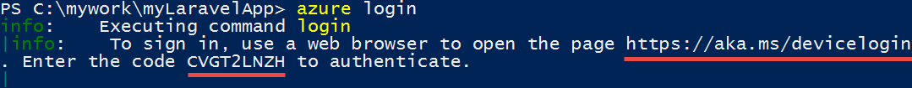
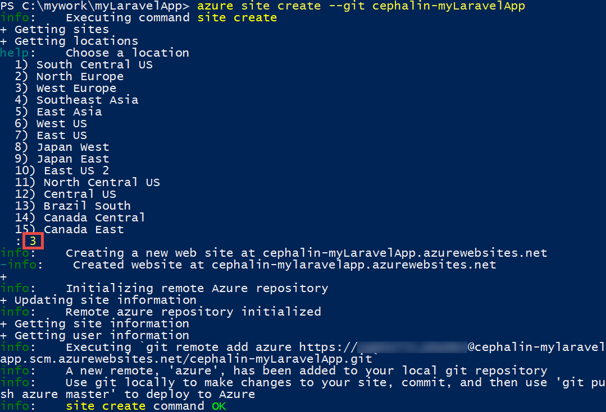
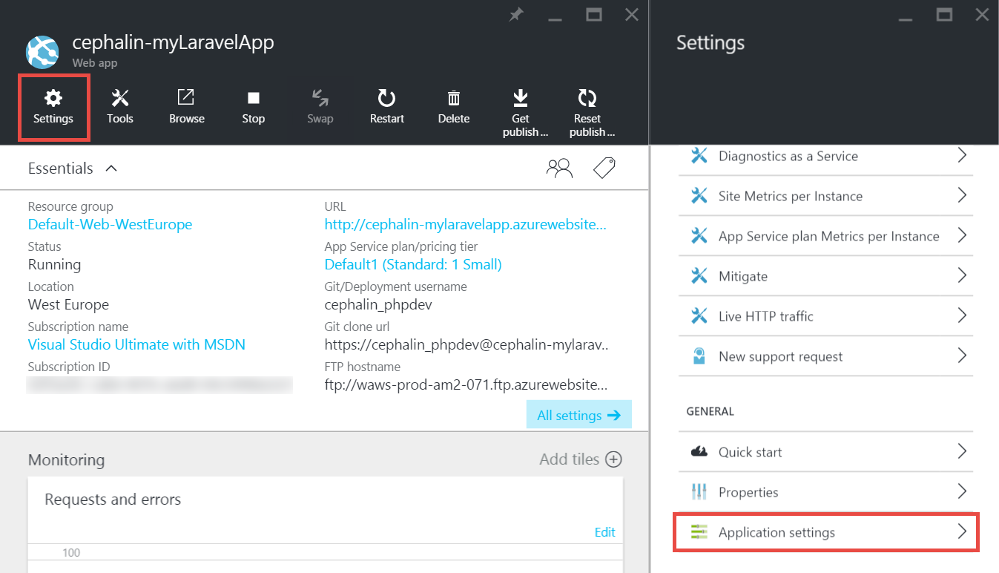
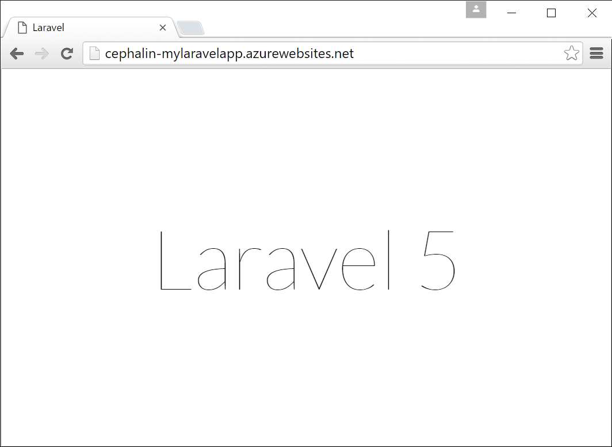

<properties
    pageTitle="建立、 設定和部署 Azure PHP web 應用程式"
    description="顯示如何讓 PHP (Laravel) web 應用程式執行 Azure 應用程式服務中的教學課程。 瞭解如何設定以符合您所選擇的 PHP 架構的需求 Azure 應用程式服務。"
    services="app-service\web"
    documentationCenter="php"
    authors="cephalin"
    manager="wpickett"
    editor=""
    tags="mysql"/>

<tags
    ms.service="app-service-web"
    ms.workload="web"
    ms.tgt_pltfrm="na"
    ms.devlang="PHP"
    ms.topic="article"
    ms.date="06/03/2016" 
    ms.author="cephalin"/>

# 建立、 設定和部署 Azure PHP web 應用程式

[AZURE.INCLUDE [tabs](../../includes/app-service-web-get-started-nav-tabs.md)]

本教學課程教您如何建立、 設定和部署 PHP 的 web 應用程式的 Azure，以及如何設定以符合 PHP web 應用程式的需求 Azure 應用程式服務。 教學課程結尾處，您會擁有[Laravel](https://www.laravel.com/) web 應用程式執行即時[Azure 應用程式服務](../app-service/app-service-value-prop-what-is.md)中使用。

為 PHP 開發人員] 中，您可以將您最愛的 PHP 架構 Azure。 本教學課程為具體的應用程式範例使用 Laravel。 您將瞭解︰ 

- 使用給部署
- 設定 PHP 版本
- 使用開始檔案的不是根應用程式目錄
- Access 環境特定的變數
- 更新您的應用程式中 Azure

您可以套用您學到什麼以下您部署至 Azure 其他 PHP web 應用程式。

>[AZURE.INCLUDE [app-service-linux](../../includes/app-service-linux.md)] 

## 必要條件

- 安裝[PHP 5.6.x](http://php.net/downloads.php) （PHP 7 支援是 beta 版）
- 安裝[編輯器](https://getcomposer.org/download/)
- 安裝[Azure CLI](../xplat-cli-install.md)
- 安裝[給](http://www.git-scm.com/downloads)
- 取得 Microsoft Azure 帳戶。 如果您沒有帳戶，可以[免費試用版註冊](/pricing/free-trial/?WT.mc_id=A261C142F)] 或 [[啟動您的 Visual Studio 訂閱權益](/pricing/member-offers/msdn-benefits-details/?WT.mc_id=A261C142F)。

>[AZURE.NOTE] 請參閱 web app 中的動作。 立即[嘗試應用程式服務](http://go.microsoft.com/fwlink/?LinkId=523751)及建立短暫入門應用程式，沒有所需的信用卡，沒有承諾。

## 您的裝置上建立 PHP (Laravel) 應用程式

1. 開啟新的 Windows 命令提示字元、 PowerShell 視窗、 Linux 殼層或 OS X 終端機。 執行下列命令，請確認您的電腦上的必要的工具會正確安裝。 

        php --version
        composer --version
        azure --version
        git --version

    

    如果您還沒有安裝工具，請參閱下載連結[的先決條件](#Prerequisites)。
    
2. 安裝 Laravel 就像這樣︰

        composer global require "laravel/installer

3. `CD`將工作目錄，並建立新的 Laravel 應用程式就像這樣︰

        cd <working_directory>
        laravel new <app_name>

4. `CD`將新建立`<app_name>`目錄和測試應用程式就像這樣︰

        cd <app_name>
        php artisan serve
        
    您應該可以立即瀏覽至 http://localhost:8000 在瀏覽器中，並查看 Laravel 啟動顯示畫面。
    
    
    
因此，最，只需一般 Laravel 工作流程，而且您可以不<a href="https://laravel.com/docs/5.2" rel="nofollow">瞭解 Laravel</a>。 現在讓我們來移動上。

## 建立 Azure web 應用程式，就可以給部署設定

>[AZURE.NOTE] 「 等候 ！ 如果我要使用 FTP 部署嗎？ 」 有您需求的[FTP 教學課程](web-sites-php-mysql-deploy-use-ftp.md)。 

使用 Azure CLI 中，您可以 Azure 應用程式服務中建立 web 應用程式，並將它設定為單行命令給部署。 讓我們來執行此動作。

1. 變更 ASM 模式並登入 Azure:

        azure config mode asm
        azure login
    
    請遵循說明郵件繼續登入程序。
    
    

4. 執行] 命令，就可以給部署建立 Azure web 應用程式。 出現提示時，指定所要的區域數目。

        azure site create --git <app_name>
    
    
    
    >[AZURE.NOTE] 如果您從未已設定部署認證，Azure 訂閱，系統會提示您建立。 應用程式服務會使用這些認證，不是您 Azure 帳戶認證，僅適用於給部署和 FTP 登入。 
    
    這個命令上目前目錄建立新的給存放庫 (使用`git init`) 並將它連接至存放庫為給遠端 Azure 中 (使用`git remote add`)。

<a name="configure"/>
## 設定 Azure web 應用程式

使用 Azure Laravel 應用程式，您需要注意幾個項目。 您必須執行這個類似的練習所選擇的您 PHP 架構。

- 設定 PHP 5.5.9 或上方。 伺服器需求的完整清單，請參閱[最新的 Laravel 5.2 伺服器需求](https://laravel.com/docs/5.2#server-requirements)。 清單上的其他是已啟用的 Azure 的 PHP 安裝的副檔名。 
- 您的應用程式中設定環境變數需求。 使用 Laravel`.env`環境變數輕鬆設定的檔案。 不過，因為它不會認可來源控制項 (請參閱[Laravel 環境設定](https://laravel.com/docs/5.2/configuration#environment-configuration)，您就會改為設定 Azure web 應用程式的應用程式設定。
- 請確定的 Laravel 應用程式的項目點， `public/index.php`，會載入的第一次。 請參閱[Laravel 生命週期概觀](https://laravel.com/docs/5.2/lifecycle#lifecycle-overview)。 換句話說，您必須設定 web 應用程式的根 URL 指向`public`目錄。
- 啟用編輯器延伸模組中 Azure，因為您有 composer.json。 如此一來，您可以讓編輯器擔心取得您所需的封裝，當您部署與`git push`。 是。 如果您未啟用編輯器自動化，您只需要移除`/vendor`從`.gitignore`檔案以便給包含 (「 取消-會忽略 」) 中的所有項目`vendor`先測試並部署的程式碼的目錄。

現在就讓我們循序設定這些工作。

4. 設定您的 Laravel 應用程式的需求 PHP 版本。

        azure site set --php-version 5.6

    完成設定 PHP 版本 ！ 
    
4. 產生新`APP_KEY`您 Azure 的 web 應用程式，並將其設為 Azure web 應用程式的應用程式設定。

        php artisan key:generate --show
        azure site appsetting add APP_KEY="<output_of_php_artisan_key:generate_--show>"

4. 此外，開啟 Laravel 偵錯時，若要取得任何怪異`Whoops, looks like something went wrong.`頁面。

        azure site appsetting add APP_DEBUG=true

    完成設定環境變數 ！
    
    >[AZURE.NOTE] 等候，現在就讓我們元變得緩慢，說明 Laravel 功能，以及做什麼 Azure 以下。 使用 Laravel`.env`檔案的根目錄，提供環境變數應用程式，您可以在此找到線條`APP_DEBUG=true`(以及`APP_KEY=...`)。 存取此變數`config/app.php`的程式碼    `'debug' => env('APP_DEBUG', false),`。 [env()](https://laravel.com/docs/5.2/helpers#method-env)是 Laravel 協助人員使用的方法，在幕後 PHP [getenv()](http://php.net/manual/en/function.getenv.php) 。
    >
    >不過，`.env`因為它圖說給會忽略`.gitignore`的根目錄中的檔案。 簡單來說， `.env`  
在您的本機給存放庫並不會送至 Azure 與其他的檔案。 當然，您可以移除該線條`.gitignore`，但我們已建立不建議將來源控制認可此檔案。 不過，您仍需要 Azure 中指定這些環境變數的方法。 
    >
    >好是 Azure 應用程式服務中的應用程式設定支援[getenv()](http://php.net/manual/en/function.getenv.php)  
 PHP 中。 雖然您可以使用 FTP 或其他方法，以手動方式上傳，因此`.env`檔案到 Azure，您可以只指定您想要的變數沒有 Azure 應用程式設定為`.env`中 Azure 等您剛才的動作。 此外，如果變數是在這兩`.env`檔案，然後在 Azure 應用程式設定贏得 Azure 應用程式設定。     

4. （設定虛擬目錄，並啟用編輯器） 的最後兩個工作需要[Azure 入口網站](https://portal.azure.com)，因此登入[入口網站](https://portal.azure.com)以 Azure 帳戶。

4. 從左側功能表中，按一下 [**應用程式服務** > **&lt;app_name >** > **工具**。

    
    
    >[AZURE.TIP] 如果您按一下 [**設定，而不是**工具**，**您可以存取**應用程式設定** 
刀，可讓您設定 PHP 版本，應用程式設定]，然後虛擬目錄，例如您剛才的動作。 
    
4. 按一下 [**延伸** > **新增**加入副檔名。

4. 選取 [**選擇副檔名**[刀](../azure-portal-overview.md)中的 [**編輯器**(*刀*︰ 入口網站的頁面會開啟 [水平)。

4. **接受法律條款**刀中，按一下**[確定]** 。 

5. **新增延伸**刀中，按一下**[確定]** 。

    完成 Azure 新增擴充功能，您應該會看到角易記的快顯訊息以及 **編輯器**列在**副檔名**刀。

    

    完成啟用編輯器 ！
    
4. 回到您的 web 應用程式刀按一下 [**設定** > **應用程式設定**。

    

    在 [**應用程式設定**刀中，請注意您先前設定的 PHP 版本︰

    

    與您所新增的應用程式設定︰
    
    

4. 向下捲動至底部的刀並變更為指向**site\wwwroot\public** ，而不是**site\wwwroot**根虛擬目錄。

    

4. 按一下 [刀頂端的 [**儲存**]。

    完成設定虛擬目錄 ！ 

## 部署 web 應用程式與給 （並設定環境變數）

您準備好要立即部署程式碼。 您必須執行這回在命令提示字元或終端機。

4. 接受所有變更，並將程式碼部署 Azure web 應用程式，如同任何給存放庫中︰

        git add .
        git commit -m "Hurray! My first commit for my Azure app!"
        git push azure master 

    當正在執行時`git push`，要求您提供給部署密碼。 如果系統要求您將建立在部署認證`azure site create`較舊版本中，輸入您所使用的密碼。
    
5. 讓我們來看執行瀏覽器中執行此命令︰

        azure site browse

    在瀏覽器應該會顯示 Laravel 啟動顯示畫面。
    
    
    
    恭喜您，您現在 Azure 中執行 Laravel web 應用程式。
             
## 疑難排解常見錯誤

以下是一些您可能會遇到遵循此教學課程時的錯誤︰

- [Azure CLI 會顯示 「 [網站] 不是 azure 命令 」](#clierror)
- [Web 應用程式顯示 HTTP 403 錯誤](#http403)
- [Web 應用程式顯示 「 Whoops，看起來像發生錯誤 」。](#whoops)
- [Web 應用程式顯示 「 不支援加密子發現。 」](#encryptor)

### Azure CLI 會顯示 「 [網站] 不是 azure 命令 」

當正在執行時`azure site *`在命令列 terminal 中，您會看到錯誤`error:   'site' is not an azure command. See 'azure help'.` 

這通常是為 「 ARM 」 （Azure 資源管理員） 模式中切換的結果。 若要解決這個問題，切換回 「 ASM 」 （Azure 服務管理） 模式執行`azure config mode asm`。

### Web 應用程式顯示 HTTP 403 錯誤

部署 web 應用程式 Azure 成功，但當您瀏覽至您的 Azure web 應用程式，您會收到`HTTP 403`或`You do not have permission to view this directory or page.`

這可能是因為 web 應用程式找不到 Laravel 應用程式的進入點。 請確定您已變更的虛擬根目錄指向`site\wwwroot\public`，其中 Laravel 的`index.php`是 （請參閱[設定 Azure web 應用程式](#configure)）。

### Web 應用程式顯示 「 Whoops，看起來像發生錯誤 」。

您的部署 web 應用程式 Azure 成功，但當您瀏覽至您的 Azure web 應用程式，您會收到怪異訊息`Whoops, looks like something went wrong.`

若要取得更多描述性的錯誤，來啟用 Laravel 偵錯設定`APP_DEBUG`環境變數`true`（請參閱[設定 Azure web 應用程式](#configure)）。

### Web 應用程式顯示 「 不支援加密子發現。 」

您的部署 web 應用程式 Azure 成功，但當您瀏覽至您的 Azure web 應用程式，您會收到下列錯誤訊息︰

    
這是棘手的錯誤，但至少不怪異因為您已開啟 Laravel 偵錯。 錯誤字串在 Laravel 論壇又快速搜尋會顯示您是因為不在中設定 APP_KEY `.env`，或在您的情況下，不需要`.env`所有 Azure 中。 您可以藉由設定修正此問題`APP_KEY`為 Azure 應用程式設定 （請參閱[設定 Azure web 應用程式](#configure)）。
    
## 後續步驟

瞭解如何[建立 MySQL 資料庫 Azure 中的](../store-php-create-mysql-database.md)，將資料新增至您的應用程式。 此外，請參閱更有幫助的連結 PHP 下列 Azure 中︰

- [PHP 開發人員中心](/develop/php/)]。
- [建立 web 應用程式從 Azure Marketplace](app-service-web-create-web-app-from-marketplace.md)
- [Azure 應用程式服務 Web 應用程式中設定 PHP](web-sites-php-configure.md)
- [將 WordPress 轉換成 Multisite Azure 應用程式服務](web-sites-php-convert-wordpress-multisite.md)
- [企業級 WordPress Azure 應用程式服務](web-sites-php-enterprise-wordpress.md)
