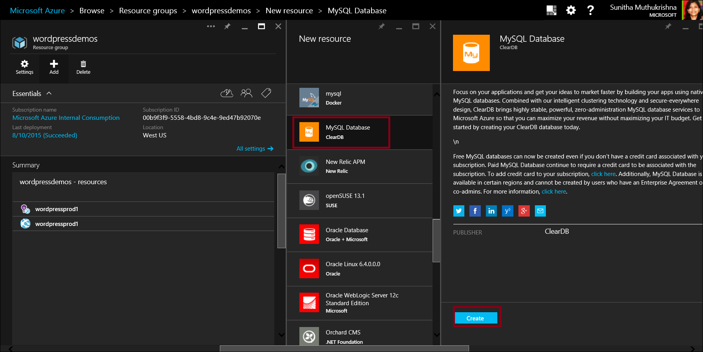
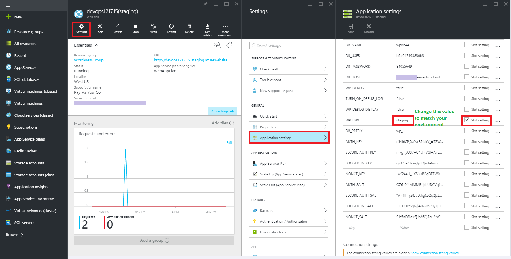
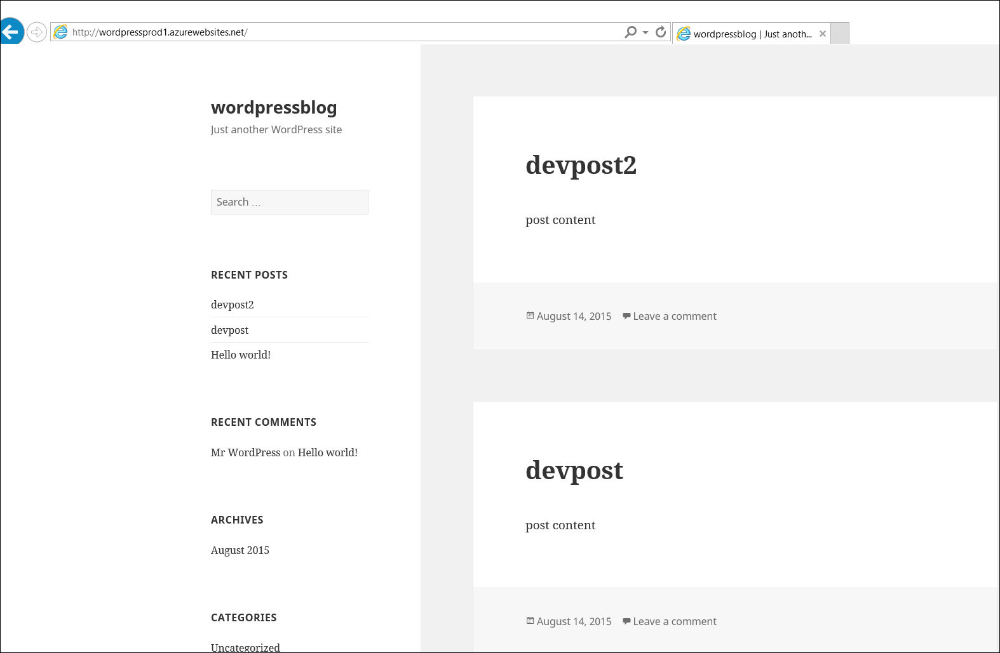
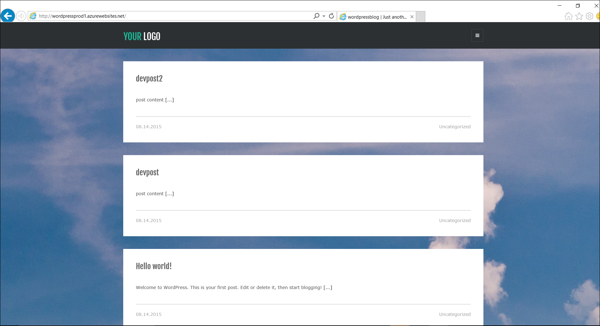
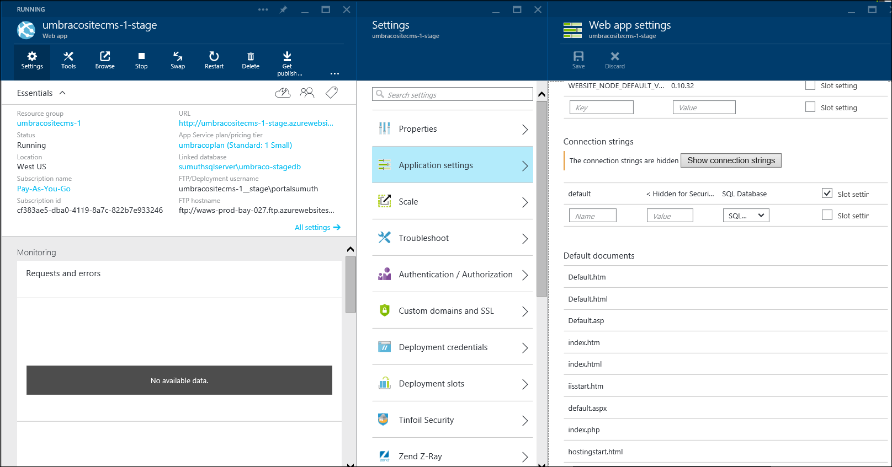
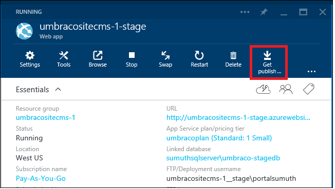

<properties
  pageTitle="Web 應用程式的有效地使用 DevOps 環境"
  description="瞭解如何使用部署位置設定及管理多個應用程式的開發環境"
  services="app-service\web"
  documentationCenter=""
  authors="sunbuild"
  manager="yochayk"
  editor=""/>

<tags
  ms.service="app-service"
  ms.devlang="na"
  ms.topic="article"
  ms.tgt_pltfrm="na"
  ms.workload="web"
  ms.date="10/24/2016"
  ms.author="sumuth"/>

# <a name="use-devops-environments-effectively-for-your-web-apps"></a>您的 web 應用程式的有效地使用 DevOps 環境

本文說明您設定及管理您的應用程式，例如開發、 臨時，問與答和實際的多個版本的 web 應用程式部署。 每個版本的應用程式可以視為特定需要您的部署程序中的開發環境。 例如問與答環境可讓您小組中的 [開發人員前您的變更推入生產測試應用程式的品質。
多個的開發環境設定可能會挑戰的工作，因為您需要追蹤與管理資源 （運算、 web 應用程式、 資料庫、 快取等） 環境中部署程式碼。

## <a name="setting-up-a-non-production-environment-stagedevqa"></a>設定非生產環境 （階段、 開發，問與答）
啟動和執行的實際執行 web 應用程式之後下, 一步是建立非生產環境。 使用部署位置確定您在 [**標準**] 或 [**進階版**應用程式服務方案模式執行。 部署位置是使用自己的 hostname 實際即時 web 應用程式。 可以兩個部署位置，包括生產位置之間交換 web 應用程式的內容和設定項目。 應用程式部署位置部署具有下列優點︰

1. 您可以驗證暫存的部署位置中變更 web 應用程式之前，交換和生產位置。
2. 第一次將 web 應用程式部署到位置與它交換生產可確保所有位置的執行個體都接手之前生產一起移動。 當您部署 web 應用程式時，如此停機時間。 流量重新導向順暢，而不要求會遭到捨棄因為交換作業。 此整個工作流程可以設定[自動交換](web-sites-staged-publishing.md#configure-auto-swap-for-your-web-app)時，不需要測試交換驗證來自動化。
3. 交換之後, 的位置使用先前分段的 web 應用程式現在有先前生產 web 應用程式。 如果交換生產位置將所做的變更是不是如您預期地的時候，您可以執行相同的交換立即上手您 「 最後一個已知良好的 web 應用程式 」 回。

若要設定的暫存的部署位置，請參閱[設定臨時環境中 Azure 應用程式服務的 web 應用程式](web-sites-staged-publishing.md)。 每個環境應該包含自己的資源集的範例如果 web 應用程式會使用資料庫然後生產和臨時 web 應用程式應該使用不同的資料庫。 新增暫存的開發環境資源，例如資料庫、 儲存或快取設定您的暫存的開發環境。

## <a name="examples-of-using-multiple-development-environments"></a>使用多個的開發環境的範例

任何專案應該追蹤原始程式碼管理至少兩種環境、 開發和生產環境，但使用內容管理系統等等我們可能會遇到的應用程式架構時問題應用程式不支援這種情況下，從] 方塊。 這是為 true，如下所示的常用架構的部分。 許多問題種使用 CMS/架構例如時

1. 如何將其縮小不同環境
2. 哪些檔案可以和變更不會影響架構版本更新
3. 如何管理每環境的設定
4. 如何管理模組/外掛程式版本更新，核心架構版本更新

有許多方法可以設定專案的多個環境且下面的範例只要這類方法個別的應用程式。

### <a name="wordpress"></a>WordPress
此區段中，您將學習如何設定位置用 WordPress 部署工作流程。 大部分的 CMS 解決方案等 WordPress 不支援使用多個預設的開發環境。 應用程式服務 Web 應用程式有幾個更容易儲存設定以外您的程式碼的功能。

建立之前的暫存的位置，請將應用程式碼設定為支援的多重環境。 若要在您要編輯的 WordPress 支援多重環境`wp-config.php`在您的本機開發 web 應用程式上新增下列程式碼之檔案的開頭。 這會可讓您選擇正確的設定，根據所選的環境的應用程式。

```
// Support multiple environments
// set the config file based on current environment
if (strpos($_SERVER['HTTP_HOST'],'localhost') !== false) {
// local development
 $config_file = 'config/wp-config.local.php';
}
elseif ((strpos(getenv('WP_ENV'),'stage') !== false) || (strpos(getenv('WP_ENV'),'prod' )!== false ))
//single file for all azure development environments
 $config_file = 'config/wp-config.azure.php';
}
$path = dirname(__FILE__). '/';
if (file_exists($path. $config_file)) {
// include the config file if it exists, otherwise WP is going to fail
require_once $path. $config_file;
```

建立 web 應用程式根目錄稱為下的資料夾`config`新增第二個檔案︰`wp-config.azure.php`和`wp-config.local.php`分別代表 azure 與本機環境。

複製下列`wp-config.local.php`:

```
<?php
// MySQL settings
/** The name of the database for WordPress */

define('DB_NAME', 'yourdatabasename');

/** MySQL database username */
define('DB_USER', 'yourdbuser');

/** MySQL database password */
define('DB_PASSWORD', 'yourpassword');

/** MySQL hostname */
define('DB_HOST', 'localhost');
/**
 * For developers: WordPress debugging mode.
 * * Change this to true to enable the display of notices during development.
 * It is strongly recommended that plugin and theme developers use WP_DEBUG
 * in their development environments.
 */
define('WP_DEBUG', true);

//Security key settings
define('AUTH_KEY', 'put your unique phrase here');
define('SECURE_AUTH_KEY','put your unique phrase here');
define('LOGGED_IN_KEY','put your unique phrase here');
define('NONCE_KEY', 'put your unique phrase here');
define('AUTH_SALT', 'put your unique phrase here');
define('SECURE_AUTH_SALT', 'put your unique phrase here');
define('LOGGED_IN_SALT', 'put your unique phrase here');
define('NONCE_SALT', 'put your unique phrase here');

/**
 * WordPress Database Table prefix.
 *
 * You can have multiple installations in one database if you give each a unique
 * prefix. Only numbers, letters, and underscores please!
 */
$table_prefix = 'wp_';
```

設定安全性按鍵上述可以協助防止 web 應用程式受到駭客攻擊，所以請使用唯一值。 如果您需要產生安全性金鑰前述的字串，您可以前往建立新索引鍵/值使用此 [連結] (https://api.wordpress.org/secret-key/1.1/salt) 自動產生器

複製下列程式碼中的`wp-config.azure.php`:


``` <?php
    // MySQL settings
    /** The name of the database for WordPress */
    
    define('DB_NAME', getenv('DB_NAME'));
    
    /** MySQL database username */
    define('DB_USER', getenv('DB_USER'));
    
    /** MySQL database password */
    define('DB_PASSWORD', getenv('DB_PASSWORD'));
    
    /** MySQL hostname */
    define('DB_HOST', getenv('DB_HOST'));
    
    /**
    * For developers: WordPress debugging mode.
    *
    * Change this to true to enable the display of notices during development.
    * It is strongly recommended that plugin and theme developers use WP_DEBUG
    * in their development environments.
    * Turn on debug logging to investigate issues without displaying to end user. For WP_DEBUG_LOG to
    * do anything, WP_DEBUG must be enabled (true). WP_DEBUG_DISPLAY should be used in conjunction
    * with WP_DEBUG_LOG so that errors are not displayed on the page */
    
    */
    define('WP_DEBUG', getenv('WP_DEBUG'));
    define('WP_DEBUG_LOG', getenv('TURN_ON_DEBUG_LOG'));
    define('WP_DEBUG_DISPLAY',false);
    
    //Security key settings
    /** If you need to generate the string for security keys mentioned above, you can go the automatic generator to create new keys/values: https://api.wordpress.org/secret-key/1.1/salt **/
    define('AUTH_KEY',getenv('DB_AUTH_KEY'));
    define('SECURE_AUTH_KEY', getenv('DB_SECURE_AUTH_KEY'));
    define('LOGGED_IN_KEY', getenv('DB_LOGGED_IN_KEY'));
    define('NONCE_KEY', getenv('DB_NONCE_KEY'));
    define('AUTH_SALT', getenv('DB_AUTH_SALT'));
    define('SECURE_AUTH_SALT', getenv('DB_SECURE_AUTH_SALT'));
    define('LOGGED_IN_SALT',  getenv('DB_LOGGED_IN_SALT'));
    define('NONCE_SALT',  getenv('DB_NONCE_SALT'));
    
    /**
    * WordPress Database Table prefix.
    *
    * You can have multiple installations in one database if you give each a unique
    * prefix. Only numbers, letters, and underscores please!
    */
    $table_prefix = getenv('DB_PREFIX');
```

#### <a name="use-relative-paths"></a>使用相對路徑
不過，最後一個是設定 WordPress 應用程式使用相對路徑。 WordPress 儲存資料庫中的 URL 的資訊。 如此可讓移動到另一個更加困難，當您需要更新資料庫，每當您從本機移到階段或階段生產環境內容從某個環境。 若要減少問題，可以使用部署資料庫，每當您另一個環境部署到另一個原因所造成的風險會使用[相對根連結外掛程式](https://wordpress.org/plugins/root-relative-urls/)可使用 WordPress 管理員儀表板安裝，或從[以下](https://downloads.wordpress.org/plugin/root-relative-urls.zip)手動下載。


新增下列項目到您`wp-config.php`檔案之後，再`That's all, stop editing!`註解︰

```

  define('WP_HOME', 'http://'. filter_input(INPUT_SERVER, 'HTTP_HOST', FILTER_SANITIZE_STRING));
    define('WP_SITEURL', 'http://'. filter_input(INPUT_SERVER, 'HTTP_HOST', FILTER_SANITIZE_STRING));
    define('WP_CONTENT_URL', '/wp-content');
    define('DOMAIN_CURRENT_SITE', filter_input(INPUT_SERVER, 'HTTP_HOST', FILTER_SANITIZE_STRING));
```

啟動透過外掛程式`Plugins`WordPress 管理員儀表板中的功能表。 儲存您的永久設定 WordPress 應用程式。

#### <a name="the-final-wp-configphp-file"></a>最終`wp-config.php`檔案
任何 WordPress 核心更新並不會影響您`wp-config.php`，`wp-config.azure.php`和`wp-config.local.php`檔案。 在 [結束這個如何`wp-config.php`檔案看起來像這樣

```
<?php
/**
 * The base configurations of the WordPress.
 *
 * This file has the following configurations: MySQL settings, Table Prefix,
 * Secret Keys, and ABSPATH. You can find more information by visiting
 *
 * Codex page. You can get the MySQL settings from your web host.
 *
 * This file is used by the wp-config.php creation script during the
 * installation. You don't have to use the web web app, you can just copy this file
 * to "wp-config.php" and fill in the values.
 *
 * @package WordPress
 */

// Support multiple environments
// set the config file based on current environment
if (strpos($_SERVER['HTTP_HOST'],'localhost') !== false) { // local development
  $config_file = 'config/wp-config.local.php';
}
elseif ((strpos(getenv('WP_ENV'),'stage') !== false) ||(strpos(getenv('WP_ENV'),'prod' )!== false )){
  $config_file = 'config/wp-config.azure.php';
}


$path = dirname(__FILE__). '/';
if (file_exists($path. $config_file)) {
  // include the config file if it exists, otherwise WP is going to fail
  require_once $path. $config_file;
}

/** Database Charset to use in creating database tables. */
define('DB_CHARSET', 'utf8');

/** The Database Collate type. Don't change this if in doubt. */
define('DB_COLLATE', '');


/* That's all, stop editing! Happy blogging. */

define('WP_HOME', 'http://'. $_SERVER['HTTP_HOST']);
define('WP_SITEURL', 'http://'. $_SERVER['HTTP_HOST']);
define('WP_CONTENT_URL', '/wp-content');
define('DOMAIN_CURRENT_SITE', $_SERVER['HTTP_HOST']);

/** Absolute path to the WordPress directory. */
if ( !defined('ABSPATH') )
    define('ABSPATH', dirname(__FILE__). '/');

/** Sets up WordPress vars and included files. */
require_once(ABSPATH. 'wp-settings.php');
```

#### <a name="set-up-a-staging-environment"></a>設定臨時環境
假設您已經有[Azure 管理預覽](http://portal.azure.com)入口網站登入 Azure 網路上執行的 WordPress web 應用程式，然後移至 WordPress web 應用程式。 如果應用程式不是您可以建立一個市集。 若要瞭解更多]，[按一下這裡](web-sites-php-web-site-gallery.md)。
按一下 [設定]-> [部署位置]-> [新增] 以建立部署位置與名稱階段。部署位置是另一個共用先前所建立的主要 web 應用程式的相同資源的 web 應用程式。


新增另一個 MySQL 資料庫，假設是`wordpress-stage-db`到您的資源群組`wordpressapp-group`。

 

更新為指向新建立的資料庫，您階段部署位置的連接字串`wordpress-stage-db`。 注意您生產 web 應用程式，`wordpressprodapp`和臨時 web app`wordpressprodapp-stage`必須指向不同的資料庫。

#### <a name="configure-environment-specific-app-settings"></a>設定特定環境的應用程式設定
開發人員可以儲存關鍵值字串組 Azure 屬於稱為應用程式設定 web 應用程式相關聯的設定資訊。 在執行階段，應用程式服務 Web 應用程式，自動為您擷取這些值，並可使用 web 應用程式中執行的程式碼。 從安全性是很好的側邊的觀點來看獲得好處自機密資訊例如資料庫密碼的連接字串永遠不會顯示為純文字檔案中例如`wp-config.php`。

當您執行時，包括變更檔案與資料庫 WordPress 應用程式的變更時，下列定義此程序很有用︰
- WordPress 版本升級
- 新增或編輯或升級外掛程式
- 新增或編輯或升級的佈景主題

設定應用程式的設定︰

- 資料庫資訊
- 開啟/關閉 WordPress 記錄
- WordPress 安全性設定



請確定您已新增下列應用程式設定的生產 web 應用程式和階段位置。 請注意生產 web 應用程式和臨時 web 應用程式使用不同的資料庫。
取消核取 WP_ENV 以外的所有設定參數的**位置設定**核取的方塊。 這將會交換 web 應用程式，以及檔案內容與資料庫的設定。 如果**已核取****位置設定**，web 應用程式的應用程式設定和連線字串設定不會移動環境進行交換作業時，因此如果資料庫中的任何變更這並不會中斷您生產 web 應用程式。

將本機的開發環境 web 應用程式部署到階段 web 應用程式和使用 WebMatrix 或工具，例如 FTP、 給或 PhpMyAdmin 您所選擇的資料庫。

![Web WordPress web 應用程式的發佈矩陣圖] 對話方塊](./media/app-service-web-staged-publishing-realworld-scenarios/4wmpublish.png)

瀏覽並測試您暫存的 web 應用程式。 因為 web 應用程式的佈景主題可更新的案例中，以下是暫存的 web 應用程式。


 如果所有看起來不錯，按一下您暫存的 web 應用程式，將內容移到生產環境上的 [**交換**] 按鈕。 在此情況下您交換 web 應用程式和資料庫環境每個**交換**作業期間。


 > [AZURE.NOTE]
 >如果您有的情況需要只推入檔案 （沒有資料庫更新），然後**核取**所有資料庫的**位置設定**相關*應用程式設定*與 web 應用程式設定刀內 Azure 預覽入口網站中的 [*連線字串設定*之前執行交換。 在此案例 DB_NAME、 DB_HOST、 DB_PASSWORD、 DB_USER 預設連接字串設定不會顯示在預覽變更時進行**切換**。 在這次，當您完成 WordPress web 應用程式的 [**交換**] 作業會有更新檔案**僅**。

交換之前，以下是實際執行 WordPress web 應用程式

交換作業之後，佈景主題已更新上生產 web 應用程式。



情況下時必須**復原**，您可以移至生產 web 應用程式設定並按一下 [**交換**] 按鈕，調換的 web 應用程式及生產暫存位置的資料庫。 記住重要的是，如果資料庫變更所包含任何時候**交換**作業的項目，然後重新部署到您暫存的 web 應用程式部署資料庫所需的下一次變更為 [目前的資料庫，這可能是先前生產資料庫或階段資料庫暫存 web 應用程式。

#### <a name="summary"></a>摘要
要將任何應用程式中使用資料庫的程序

1. 在您的本機環境中安裝的應用程式
2. 包含環境特定設定 (本機和 Azure Web 應用程式)
3. 設定您的應用程式服務 Web 應用程式 – 臨時，生產環境
4. 如果您已經在 Azure 上執行的實際執行應用程式，同步處理到本機和臨時環境您生產內容 （檔案/程式碼 + 資料庫）。
5. 開發本機環境的應用程式
6. 將生產 web 應用程式進行的維修作業或鎖定的模式與同步處理資料庫] 下的內容從生產執行與開發環境
7. 部署至臨時環境和測試
8. 部署到生產環境
9. 重複步驟 4 到 6

### <a name="umbraco"></a>Umbraco
此區段中，您將學習如何 Umbraco CMS 部署從跨多個 DevOps 環境中使用自訂模組。 此範例中為您提供不同的方式來管理多個的開發環境。

[Umbraco CMS](http://umbraco.com/)是一種 popular.NET CMS 解決方案使用許多開發人員提供部署從開發生產環境臨時[Courier2](http://umbraco.com/products/more-add-ons/courier-2)模組。 您可以輕鬆地建立本機的開發環境中使用 Visual Studio 或 WebMatrix Umbraco CMS web 應用程式。

1. 使用 Visual Studio 中，[按一下這裡](https://our.umbraco.org/documentation/Installation/install-umbraco-with-nuget)建立 Umbraco web 應用程式。
2. 若要建立 WebMatrix，[按一下這裡](http://umbraco.com/help-and-support/video-tutorials/getting-started/working-with-webmatrix)Umbraco web 應用程式。

若要移除記得`install`資料夾下您的應用程式，永遠不會上傳至階段或生產 web 應用程式。 在此教學課程中，將使用 WebMatrix

#### <a name="set-up-a-staging-environment"></a>設定暫存的環境
- 建立部署位置，如前述 Umbraco CMS web app，假設您已經有 Umbraco CMS web 應用程式，並執行。 如果不是您可以建立一個市集。

- 更新為指向新建立的資料庫， **umbraco 階段資料庫**您階段部署位置的連接字串。 您的生產 web 應用程式 (umbraositecms-1) 和臨時 web 應用程式 （umbracositecms 1-階段）**必須**指向不同的資料庫。



- 按一下 [**取得發佈設定**的部署位置**階段**。 這會下載發佈設定檔案儲存所需 Visual Studio 或 Web 矩陣發佈您的應用程式從本機開發 web app Azure web 應用程式的所有資訊。

 

- **WebMatrix**或**Visual Studio**中開啟您的本機開發 web 應用程式。 在本教學課程我使用的 Web 矩陣圖，首先您必須發佈暫存的 web 應用程式的設定檔匯入


- 檢閱] 對話方塊中的變更，並部署至 Azure web 應用程式， *umbracositecms 1-階段*本機 web 應用程式。 當您部署直接到您暫存的 web 應用程式的檔案時，您就會省略中的任何檔案`~/app_data/TEMP/`資料夾為這些將會重新產生第一個階段 web 應用程式時開始。 您也應該省略`~/app_data/umbraco.config`，為檔案，將會重新產生。


- 之後成功發佈 Umbraco 本機 web 應用程式至臨時 web 應用程式，請瀏覽到您暫存的 web 應用程式並執行幾個測試排除任何問題。

#### <a name="set-up-courier2-deployment-module"></a>設定 Courier2 部署模組
您可以與[Courier2](http://umbraco.com/products/more-add-ons/courier-2)模組推內容、 樣式表、 開發模組和更多用簡單以滑鼠右鍵按一下暫存的 web 應用程式從生產 web 應用程式的更多的麻煩免費的部署及來降低風險抗裂生產 web 應用程式部署更新時。
為 Courier2 購買授權，該網域的`*.azurewebsites.net`和您的自訂網域 (例如 http://abc.com) 當您已購買的授權時，請將下載的授權 (。LIC 檔案） 中`bin`資料夾。

![回收筒] 資料夾底下放授權檔案](./media/app-service-web-staged-publishing-realworld-scenarios/13droplic.png)

從[這裡](https://our.umbraco.org/projects/umbraco-pro/umbraco-courier-2/)下載 Courier2 套件。 登入您的階段 web 應用程式，假設 http://umbracocms-site-stage.azurewebsites.net/umbraco，按一下 [**開發人員**功能表，然後選取**套件**。 按一下 [**安裝**本機套件


上傳 courier2 套件使用安裝程式。


若要設定您需要更新**設定**web 應用程式] 資料夾底下的 courier.config 檔案。

```xml
<!-- Repository connection settings -->
 <!-- For each site, a custom repository must be configured, so Courier knows how to connect and authenticate-->
 <repositories>
    <!-- If a custom Umbraco Membership provider is used, specify login & password + set the passwordEncoding to clear: -->
    <repository name="production web app" alias="stage" type="CourierWebserviceRepositoryProvider" visible="true">
      <url>http://umbracositecms-1.azurewebsites.net</url>
      <user>0</user>
      <!--<login>user@email.com</login> -->
      <!-- <password>user_password</password>-->
      <!-- <passwordEncoding>Clear</passwordEncoding>-->
      </repository>
 </repositories>
 ```

在下`<repositories>`，輸入生產網站的 URL] 與 [使用者資訊。 如果您使用的預設 Umbraco 成員資格的提供者，然後新增中管理使用者識別碼<user>一節。 如果您使用自訂的 Umbraco 成員資格提供者，使用`<login>`，`<password>` Courier2 模組知道如何連線至生產網站。 如需詳細資訊，請檢閱 Courier 模組的[文件](http://umbraco.com/help-and-support/customer-area/courier-2-support-and-download/developer-documentation)。

同樣地，生產網站上安裝 Courier 模組並將它設定指向階段 web 應用程式在其個別 courier.config 檔案如下所示

```xml
 <!-- Repository connection settings -->
 <!-- For each site, a custom repository must be configured, so Courier knows how to connect and authenticate-->
 <repositories>
    <!-- If a custom Umbraco Membership provider is used, specify login & password + set the passwordEncoding to clear: -->
    <repository name="Stage web app" alias="stage" type="CourierWebserviceRepositoryProvider" visible="true">
      <url>http://umbracositecms-1-stage.azurewebsites.net</url>
      <user>0</user>
      </repository>
 </repositories>
```

在儀表板 web 應用程式 Umbraco CMS Courier2] 索引標籤上按一下，然後選取位置。 您應該會看到存放庫名稱，如所述`courier.config`。在您生產和臨時 web 應用程式上，執行此動作。


現在讓部署至生產網站部分內容從暫存的網站。 移至內容並選取 [現有的頁面或建立新頁面。 我會從我的頁面標題會變為**快速入門-新**的 web 應用程式中選取現有的頁面，接著按一下 [**儲存並發佈]**上。


現在，選取已修改的頁面，並*以滑鼠右鍵按一下*[檢視所有選項。 按一下 [上**細明體**檢視部署] 對話方塊。 按一下 [**部署**至啟動部署

![Courier 模組部署] 對話方塊](./media/app-service-web-staged-publishing-realworld-scenarios/18dialog1.png)

檢閱變更，然後按一下 [繼續]。


部署記錄顯示是否已成功部署。

 

瀏覽生產 web 應用程式，查看會反映的變更。

 

若要進一步瞭解如何使用電子報，檢閱文件。

#### <a name="how-to-upgrade-umbraco-cms-version"></a>如何升級 Umbraco CMS 版本

Courier 不會與升級版本 Umbraco CMS 部署幫助。 升級時 Umbraco CMS 版本，您必須檢查不相容的您自訂模組或協力廠商模組和 Umbraco 核心文件庫。 最佳作法

1. 永遠進行升級之前，先備份您的 web 應用程式和資料庫。 Azure Web app，您可以設定自動備份您的網站使用備份的功能，以及還原您的網站如果需要使用還原功能。 如需詳細資訊，請參閱[如何備份您的 web 應用程式](web-sites-backup.md)，以及[如何還原您的 web 應用程式](web-sites-restore.md)。

2. 核取 [是否您使用協力廠商套件是與您要升級至版本相容。 在套件的下載頁面，請檢閱 [專案與相容性 Umbraco CMS 版本。

如需如何升級至本機 web 應用程式的詳細資訊，請為提及[這裡](https://our.umbraco.org/documentation/getting-started/set up/upgrading/general)遵循的方針。

一旦您的本機開發網站升級時，請將所做的變更發佈至臨時 web 應用程式。 測試您的應用程式，並如果所有看起來不錯，使用**交換**暫存生產 web app 網站的 [**交換**] 按鈕。 執行**交換**作業時，您可以在 web 應用程式的設定來檢視將受影響的變更。 使用此 [**交換**] 作業中，我們會交換 web 應用程式，並資料庫。 這表示交換生產 web 應用程式現在會指向 umbraco 階段資料庫資料庫後暫存的 web 應用程式會指向 umbraco 產品 db 資料庫。


交換的 web 應用程式 」 和 「 資料庫的優點︰
1. 可讓您能夠復原上一個版本的 web 應用程式與其他**交換**如果有任何應用程式的問題。
2. 升級您需要部署檔案並從臨時生產 web app 及資料庫的 web 應用程式的資料庫。 有許多可能會發生部署檔案和資料庫時的動作。 藉由使用 [**交換**] 功能的位置，我們可以在升級期間減少停機時間並降低風險的部署變更時，可能發生的失敗次數。
3. 可讓您執行**A / B 測試**使用[生產環境中的測試](https://azure.microsoft.com/documentation/videos/introduction-to-azure-websites-testing-in-production-with-galin-iliev/)功能

此範例顯示您的彈性的平台您可以在其中建立 Umbraco Courier 模組，來管理部署環境類似的自訂模組。

## <a name="references"></a>參照
[敏捷式的軟體開發 Azure 應用程式服務](app-service-agile-software-development.md)

[設定臨時環境中 Azure 應用程式服務的 web 應用程式](web-sites-staged-publishing.md)

[如何封鎖對非生產部署位置的網站存取權](http://ruslany.net/2014/04/azure-web-sites-block-web-access-to-non-production-deployment-slots/)
