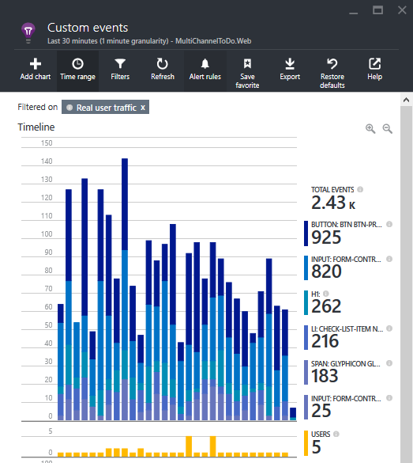
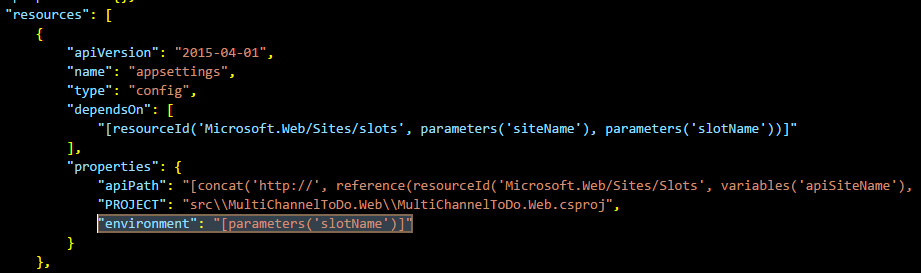
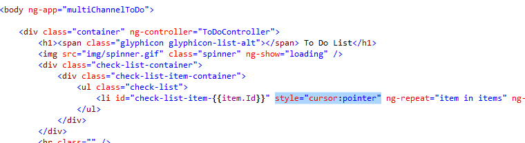

<properties
    pageTitle="Flighting （測試） Azure 應用程式服務中的部署"
    description="瞭解如何將分段應用程式中的新功能或 beta 版測試此端對端教學課程中的更新。 結合連續發佈、 位置、 流量路由]，及整合應用程式的深入見解等應用程式服務功能。"
    services="app-service\web"
    documentationCenter=""
    authors="cephalin"
    manager="wpickett"
    editor=""/>

<tags
    ms.service="app-service-web"
    ms.workload="web"
    ms.tgt_pltfrm="na"
    ms.devlang="na"
    ms.topic="article"
    ms.date="02/02/2016"
    ms.author="cephalin"/>
# Flighting （測試） Azure 應用程式服務中的部署

本教學課程教您如何進行*flighting 部署*整合[Azure 應用程式服務](http://go.microsoft.com/fwlink/?LinkId=529714)和[Azure 應用程式的深入見解](/services/application-insights/)的各種功能。 

*Flighting*驗證的新功能或使用有限的實際的客戶，變更的部署程序，而在生產環境中測試主要。 它類似於 beta 測試，有時也稱為 「 控制的測試飛行 」。 網頁的目前狀態的許多大型企業使用此方法在其應用程式中的更新其[敏捷式開發](https://en.wikipedia.org/wiki/Agile_software_development)的練習上取得最早的驗證。 Azure 應用程式服務可讓您持續發佈與應用程式實作相同 DevOps 案例的深入見解整合生產環境中的測試。 這個方法的優點包括︰

- **取得的正式發行實數的意見反應_之前_更新**唯一的更多獲得的意見反應，當您放開正獲得的意見反應之後，再放開。 您可以在您想要在產品生命週期早測試更新實際使用者流量與行為。
- **增強[連續的測試導向開發 (CTDD)](https://en.wikipedia.org/wiki/Continuous_test-driven_development) ** -連續的整合與儀器與應用程式的深入見解整合生產環境中的測試使用者驗證的情況最早及自動產品生命週期。 這可協助降低時間投資手動測試執行中。
- **最佳化測試工作流程**-自動化含連續的監控工具，生產環境中測試您可以潛在達成目標的各種中單一程序，例如[整合](https://en.wikipedia.org/wiki/Integration_testing)、[迴歸](https://en.wikipedia.org/wiki/Regression_testing)、[合用性](https://en.wikipedia.org/wiki/Usability_testing)、 協助工具、 已進行本地化、[效能](https://en.wikipedia.org/wiki/Software_performance_testing)、[安全性](https://en.wikipedia.org/wiki/Security_testing)和[接受](https://en.wikipedia.org/wiki/Acceptance_testing)測試。

在 flighting 部署幾乎不路由即時流量。 在這種部署中您想要深入了盡快，是否很意外的錯誤、 效能降低使用者體驗問題。 請記住，您正在處理實數的客戶。 在處理，您必須請確認已設定 flighting 部署收集充分的下一個步驟所需的所有資料。 本教學課程中會顯示如何收集資料與應用程式的深入見解，但您可以使用新的聖器或其他技術，適合您的狀況。 

## 您將會執行的動作

在此教學課程中，您將學習如何顯示在一起，以測試您的應用程式服務應用程式在下列情況︰

- [生產的路由流量](app-service-web-test-in-production-get-start.md)至您的測試版應用程式
- [樂器應用程式](../application-insights/app-insights-web-track-usage.md)，以取得實用的指標
- 持續部署測試版應用程式，並追蹤即時應用程式的指標
- 比較生產應用程式和測試版應用程式，查看 [程式碼變更如何翻譯結果之間的指標

## 您需要的項目

-   Azure 帳戶
-   [GitHub](https://github.com/)帳戶
- Visual Studio 2015-您可以下載[社群版本](https://www.visualstudio.com/en-us/products/visual-studio-express-vs.aspx)。
-   給命令介面 （安裝[Windows 版的 GitHub](https://windows.github.com/)）-這可讓您在相同的工作階段中執行給和 PowerShell 命令
-   最新的[PowerShell 的 Azure](https://github.com/Azure/azure-powershell/releases/download/v0.9.8-September2015/azure-powershell.0.9.8.msi)位元
-   了解基本操作︰
    -   [Azure 資源管理員](../azure-resource-manager/resource-group-overview.md)範本部署 （請參閱[Azure 中預測複雜的應用程式部署](app-service-deploy-complex-application-predictably.md)）
    -   [給](http://git-scm.com/documentation)
    -   [PowerShell](https://technet.microsoft.com/library/bb978526.aspx)

> [AZURE.NOTE] 您必須完成本教學課程 Azure 帳戶︰
> + 您可以[開啟 Azure 帳戶免費](/pricing/free-trial/)-取得貸項總計試用付費 Azure 服務，您可以使用，即使使用這些之後，您可以將該帳戶，並使用釋放 Azure 服務，例如 Web 應用程式。
> + 您可以[啟動 Visual Studio 訂閱者優點](/pricing/member-offers/msdn-benefits-details/)-您的 Visual Studio 訂閱可讓您貸項總計付費 Azure 服務，您可以使用每個月。
>
> 如果您想要開始使用 Azure 應用程式服務註冊 Azure 帳戶之前，請移至[嘗試應用程式服務](http://go.microsoft.com/fwlink/?LinkId=523751)，可以讓您立即建立短暫入門 web 應用程式在應用程式服務。 必要; 沒有信用卡沒有承諾。

## 設定您的生產 web 應用程式

>[AZURE.NOTE] 在本教學課程所用的指令碼將會從您 GitHub 存放庫連續發佈自動設定。 這需要的 Azure 中已儲存 GitHub 認證，否則指令碼的部署嘗試進行來源控制設定 web 應用程式時將會失敗。
>
>若要儲存 GitHub 認證 Azure 中，建立 web 應用程式中的[Azure 入口網站](https://portal.azure.com/)及[設定 GitHub 部署](app-service-continuous-deployment.md#Step7)。 您只需要一次執行此動作。

在一般 DevOps 案例中，您正在執行即時 Azure 中的應用程式並想要透過連續的發佈進行變更。 在此案例中，您會部署生產開發及測試您的範本。

1.  建立您自己的[ToDoApp](https://github.com/azure-appservice-samples/ToDoApp)存放庫分叉。 建立您分叉的資訊，請參閱[分叉 Repo](https://help.github.com/articles/fork-a-repo/)。 您分叉建立後，您可以在瀏覽器中看到它。

    

2.  開啟給殼層工作階段。 如果您沒有給命令介面，請立即安裝[GitHub for Windows](https://windows.github.com/) ]。
3.  建立您的分支的本機複本，藉由執行下列命令︰

        git clone https://github.com/<your_fork>/ToDoApp.git

4.  一旦您有您的本機複本，請瀏覽至*&lt;repository_root >*\ARMTemplates，] 和 [執行] 以唯一的後置字元，指令碼 deploy.ps1，如下所示︰

        .\deploy.ps1 –RepoUrl https://github.com/<your_fork>/todoapp.git -ResourceGroupSuffix <your_suffix>

4.  出現提示時，輸入所要的使用者名稱與密碼來存取資料庫。 因為您將需要一次指定它們，更新資源群組時，請記住您資料庫的認證。

    您應該會看到各種 Azure 資源佈建的進度。 部署完成後，請指令碼會啟動瀏覽器中的應用程式，並讓您易記嗶聲。
    

6.  返回您就可以給命令介面工作階段，請執行︰

        .\swap –Name ToDoApp<your_suffix>

    

7.  完成指令碼之後，請返回瀏覽至主選單的地址 (http://ToDoApp*&lt;your_suffix >*.azurewebsites.net/) 若要查看生產環境中執行的應用程式。
5.  登入[Azure 入口網站](https://portal.azure.com/)，請參閱建立的內容。

    您應該可以看到 [相同資源] 群組中的兩個 web 應用程式`Api`後置字元的名稱。 如果您看看 [資源群組] 檢視，您也會看到 SQL 資料庫與伺服器、 應用程式服務計劃和 web 應用程式的暫存的位置。 瀏覽不同的資源，並將其與比較*&lt;repository_root >*\ARMTemplates\ProdAndStage.json 若要查看範本中的設定方式。

    

您已設定生產應用程式。  現在，假設您接收合用性不佳的應用程式的意見反應。 讓您決定要調查。 您要追蹤記錄您的應用程式提供您的意見反應。

## 調查︰ 追蹤記錄指標監控用戶端應用的程式

5. 開啟*&lt;repository_root >*\src\MultiChannelToDo.sln Visual Studio 中的。
6. 以滑鼠右鍵按一下方案還原所有 Nuget 套件 >**管理解決方案的 NuGet 套件** > **都還原**。
6. 以滑鼠右鍵按一下**MultiChannelToDo.Web** > **新增應用程式的深入見解遙測** > **設定設定**> ToDoApp 變更資源群組*&lt;your_suffix >* > **新增至專案的應用程式深入資訊**。
7. 在 [Azure 入口網站中，開啟**MultiChannelToDo.Web**應用程式充分資源刀。 然後在**狀況應用程式**組件中，按一下 [**了解如何收集瀏覽器頁面載入資料**> 複製程式碼。
7. 新增複製的 JS 儀器程式碼， * &lt;repository_root >*\src\MultiChannelToDo.Web\app\Index.cshtml 的結束`<heading>`標籤。 包含您的應用程式充分資源的唯一儀器索引鍵。

        

11. 自訂事件應用程式獲得深入見解滑鼠按一下來傳送將下列程式碼新增至本文的底端︰

        

    此 JavaScript 程式碼片段應用程式獲得深入見解傳送自訂事件，每次使用者按一下 web 應用程式中的任何位置。

12. 在給命令介面，確認，然後推入您分叉 GitHub 中的 [變更]。 然後，等待重新整理瀏覽器的用戶端。

        git add -A :/
        git commit -m "add AI configuration for client app"
        git push origin master

6.  交換生產部署的應用程式的變更︰

        .\swap –Name ToDoApp<your_suffix>

13. 瀏覽至您已設定應用程式的深入見解資源。 按一下 [自訂事件]。

    

    如果您沒有看到自訂事件的度量，請稍候幾分鐘，然後按一下 [**重新整理**。

假設您看到圖表像下面︰

與事件格線其下︰

根據您 ToDoApp 應用程式的程式碼**按鈕**事件對應至 [送出] 按鈕，並**輸入**事件對應到文字方塊。 到目前為止，項目意義。 不過，它看起來有待辦事項項目 （**平**事件） 上的只要按下與少數幾份按一下建議量。

根據您的表單，這個部分使用者是您假設，後者 UI 的哪些部分是可點選，這是因為游標樣式的文字選取範圍時，將滑鼠指標停留在清單項目和其圖示上。

這可能是組件的範例。 不過，您要讓您的應用程式，來改進]，然後執行 [取得即時客戶合用性意見反應的 flighting 部署中。

### 追蹤記錄指標監控伺服器應用的程式
由於示範在本教學課程此案例僅處理用戶端應用程式，這是正切值。 不過的完整性您將會設定用戶端應用程式。

6. 以滑鼠右鍵按一下**MultiChannelToDo** > **新增應用程式的深入見解遙測** > **設定設定**> ToDoApp 變更資源群組*&lt;your_suffix >* > **新增至專案的應用程式深入資訊**。
12. 在給命令介面，確認，然後推入您分叉 GitHub 中的 [變更]。 然後，等待重新整理瀏覽器的用戶端。

        git add -A :/
        git commit -m "add AI configuration for server app"
        git push origin master

6.  交換生產部署的應用程式的變更︰

        .\swap –Name ToDoApp<your_suffix>

這樣就可以 ！

## 調查︰ 將特定位置的標籤新增至您的用戶端應用程式指標

在此區段中，您將設定傳送至相同的應用程式的深入見解資源的特定位置的遙測不同的部署的位置。 如此一來，您可以比較遙測資料，從不同的位置 （部署環境） 之間，輕鬆地查看您的應用程式變更的效果。 同時，您可以從其他分隔生產流量，讓您可以繼續監控視您生產應用程式。

由於您在用戶端行為來收集資料，您將會[新增至您的 JavaScript 程式碼的遙測初始設定](../application-insights/app-insights-api-custom-events-metrics.md#js-initializer)index.cshtml 中。 如果您想要測試伺服器端效能，例如，您也可以執行同樣在您的伺服器程式碼 （請參閱[自訂事件和指標的應用程式的深入見解 API](../application-insights/app-insights-api-custom-events-metrics.md)。

1. 首先，將新增程式碼 bewteen 兩個`//`JavaScript 中的註解下方封鎖您新增至`<heading>`標記較舊版本。

        window.appInsights = appInsights;

        // Begin new code
        appInsights.queue.push(function () {
            appInsights.context.addTelemetryInitializer(function (envelope) {
                var telemetryItem = envelope.data.baseData;
                telemetryItem.properties = telemetryItem.properties || {};
                telemetryItem.properties["Environment"] = "@System.Configuration.ConfigurationManager.AppSettings["environment"]";
            });
        });
        // End new code

        appInsights.trackPageView();

    此初始設定程式碼會造成`appInsights`要加入物件的自訂屬性稱為`Environment`到遙測會傳送的每一處。

2. 接下來，新增為[位置設定](web-sites-staged-publishing.md#AboutConfiguration)web 應用程式 Azure 中的此自訂屬性。 若要這麼做，請執行下列命令您就可以給殼層工作階段。

        $app = Get-AzureWebsite -Name todoapp<your_suffix> -Slot production
        $app.AppSettings.Add("environment", "Production")
        $app.SlotStickyAppSettingNames.Add("environment")
        $app | Set-AzureWebsite -Name todoapp<your_suffix> -Slot production

    在專案中的 Web.config 已經定義`environment`應用程式設定。 使用此設定，當您測試的應用程式，您的指標會使用來標記`VS Debugger`。 不過，當您變更推入 Azure 時，請 Azure 會找出並使用`environment`應用程式設定的 web 應用程式的設定，並將指標會使用標記`Production`。

3. 確認您的程式碼變更推入您分叉上 GitHub，並等待您的使用者使用新的應用程式 （需要重新整理瀏覽器），然後。 它會顯示在您的應用程式的觀點中新屬性 15 分鐘`MultiChannelToDo.Web`資源。

        git add -A :/
        git commit -m "add environment property to AI events for client app"
        git push origin master

4. 現在，再次移至 [**自訂事件**刀，篩選計量`Environment=Production`。 您現在應該能夠看到生產位置中的所有新自訂事件使用這個篩選器。

    

5. 按一下 [儲存目前的指標 Explorer 設定是 [**我的最愛**] 按鈕**自訂事件︰ 生產**。 您可以輕鬆地切換此檢視和部署位置檢視更新版本。

    > [AZURE.TIP] 更強大的分析，請考慮[整合使用 Power BI 應用程式的深入見解資源](../application-insights/app-insights-export-power-bi.md)。

### 將特定位置的標籤新增至您的伺服器應用程式指標
同樣地的完整性，您將設定伺服器端應用程式。 不同於用戶端應用程式中 JavaScript 檢測，伺服器應用程式的特定位置的標籤被控制.NET 程式碼。

1. 開啟*&lt;repository_root >*\src\MultiChannelToDo\Global.asax.cs。 新增以下的程式碼區塊的結束命名空間大括號。

        namespace MultiChannelToDo
        {
                ...

                // Begin new code
            public class ConfigInitializer
            : ITelemetryInitializer
            {
                void ITelemetryInitializer.Initialize(ITelemetry telemetry)
                {
                    telemetry.Context.Properties["Environment"] = System.Configuration.ConfigurationManager.AppSettings["environment"];
                }
            }
                // End new code
        }

2. 藉由新增修正錯誤名稱解析`using`陳述式下方以開頭的檔案︰

        using Microsoft.ApplicationInsights.Channel;
        using Microsoft.ApplicationInsights.Extensibility;

3. 下列程式碼新增至首`Application_Start()`方法︰

        TelemetryConfiguration.Active.TelemetryInitializers.Add(new ConfigInitializer());

3. 確認您的程式碼變更推入您分叉上 GitHub，並等待您的使用者使用新的應用程式 （需要重新整理瀏覽器），然後。 它會顯示在您的應用程式的觀點中新屬性 15 分鐘`MultiChannelToDo`資源。

        git add -A :/
        git commit -m "add environment property to AI events for server app"
        git push origin master

## 更新︰ 設定您的 beta 分支

2. 開啟*&lt;repository_root >*\ARMTemplates\ProdAndStagetest.json 和尋找`appsettings`資源 (搜尋`"name": "appsettings"`)。 有 4 這些，一個用於每一個位置。 

2. 每個`appsettings`資源新增`"environment": "[parameters('slotName')]"`結尾的應用程式設定`properties`陣列。 若要結束並以逗號的前一行別忘了。

    
    
    您剛才新增`environment`應用程式設定為 [在範本中的所有位置。
    
2. 在相同的檔案中，尋找`slotconfignames`資源 (搜尋`"name": "slotconfignames"`)。 有 2 這些，一個用於每一個應用程式。

2. 每個`slotconfignames`資源新增`"environment"`結尾`appSettingNames`陣列。 若要結束並以逗號的前一行別忘了。

    您剛才`environment`搖桿設為其個別的部署位置，這兩種應用程式的應用程式。  

3. 您就可以給殼層工作階段，執行下列命令以您之前使用相同資源群組尾碼。

        git checkout -b beta
        git push origin beta
        .\deploy.ps1 -RepoUrl https://github.com/<your_fork>/ToDoApp.git -ResourceGroupSuffix <your_suffix> -SlotName beta -Branch beta

4. 出現提示時，指定相同 SQL 資料庫認證，作為之前。 當詢問是否要更新的資源群組，然後輸入`Y`，然後`ENTER`。

    一旦完成指令碼，仍會保留您在原始的 [資源] 群組中的所有資源，但新的位置名為 「 beta 」 建立的相同設定與建立開頭 「 臨時 」 位置。

    >[AZURE.NOTE] 這個方法建立不同的部署環境的是不同的[敏捷式的軟體開發 Azure 應用程式服務](app-service-agile-software-development.md)中的方法。 在這裡，您建立部署位置上，其中那里為您建立部署環境資源群組部署環境。 資源群組管理部署環境可讓您將生產環境 off-limits 開發人員，但並不容易測試生產，您可以輕鬆地與位置。

如果您想要您也可以建立 alpha 應用程式執行

    git checkout -b alpha
    git push origin alpha
    .\deploy.ps1 -RepoUrl https://github.com/<your_fork>/ToDoApp.git -ResourceGroupSuffix <your_suffix> -SlotName beta -Branch alpha

在此教學課程中，您會只繼續使用您測試版應用程式。

## 更新︰ 推入測試版應用程式的更新

回到您想要改善您應用程式。

1. 請確定您現在位於您 beta 分支

        git checkout beta

2. 在 [ * &lt;repository_root >*\src\MultiChannelToDo.Web\app\Index.cshtml，尋找`<li>`標記及新增`style="cursor:pointer"`屬性，如下所示。

    

3. 認可和推入到 Azure。

4. 請確認您的變更會立即反映 beta 位置中瀏覽至 http://todoapp*&lt;your_suffix >*-beta.azurewebsites.net/。 如果沒有看到變更，重新整理您的瀏覽器，以取得新的 javascript 程式碼。

    

您已經有您執行的 beta 位置中的變更，就可以開始執行 flighting 的部署。

## 驗證︰ 路由流量至測試版應用程式

在此區段中，您會將流量路由至測試版應用程式。 為了避免混淆的示範，您即將路由傳送重要的部分使用者流量。 實際上，您要傳送的流量會取決於在特定情況。 例如，如果您的網站位於 microsoft.com 的小數位數]，然後您可能需要小於一個百分比的總傳輸以獲得有用的資料。

1. 您就可以給殼層工作階段中，執行下列命令，將一半的生產流量路由傳送至 beta 位置︰

        $siteName = "ToDoApp<your suffix>"
        $rule = New-Object Microsoft.WindowsAzure.Commands.Utilities.Websites.Services.WebEntities.RampUpRule
        $rule.ActionHostName = "$siteName-beta.azurewebsites.net"
        $rule.ReroutePercentage = 50
        $rule.Name = "beta"
        Set-AzureWebsite $siteName -Slot Production -RoutingRules $rule

  `ReroutePercentage=50`屬性會指定，將會 50%的生產流量路由至測試版應用程式的 URL (指定的`ActionHostName`屬性)。

2. 現在瀏覽至 http://ToDoApp*&lt;your_suffix >*。 azurewebsites.net。 50%的流量應該立即重新導向至 beta 位置。

3. 在您的應用程式的深入見解的資源，請依環境中篩選計量 = 」 beta 」。

    > [AZURE.NOTE] 如果您將此篩選的檢視儲存為另一個最愛項目時，您可以輕鬆地翻轉生產及 beta 檢視公制總管] 中檢視。

假設您在應用程式的深入見解您會看到類似以下內容︰

不只此顯示上有許多按`<li>`標記，但似乎的按鍵超載上`<li>`標籤。 您可以再推斷人員發現新`<li>`標記是可點選與現在清除所有先前已完成任務的應用程式中。

根據您 flighting 部署中的資料，決定您新的使用者介面已準備好進行生產。

## 移即時︰ 將您新增的程式碼移到生產

現在，您準備好要將您的更新移到產品。 什麼是很好是，現在您知道您的更新已驗證_前_推生產。 現在您可以充滿信心地將其部署。 因為您對 AngularJS 用戶端應用程式的更新，才會進行驗證的用戶端程式碼。 如果您要變更的後端 Web API 應用程式，您也可以輕鬆地同樣驗證您的變更。

1. 給 Shell 中移除流量路由規則執行下列命令︰

        Set-AzureWebsite $siteName -Slot Production -RoutingRules @()

2. 執行給命令︰

        git checkout master
        git pull origin master
        git merge beta
        git push origin master

2. 等待幾分鐘讓新的程式碼部署至暫存的位置，然後啟動 http://ToDoApp*&lt;your_suffix >*-staging.azurewebsites.net 驗證的暫存的位置中新的更新接手。 請記住，您分叉主分支已連結至您的應用程式的暫存的位置。

3. 現在，交換生產暫存的位置

        cd <ROOT>\ToDoApp\ARMTemplates
        .\swap.ps1 -Name todoapp<your_suffix>

## 摘要 ##

Azure 應用程式服務可輕鬆小型-以中型企業內容實際測試其客戶具應用程式的傳統已完成的大型企業中。 希望在此教學課程授予您必須先將一起，將可能的 flighting 部署，甚至其他測試中生產案例中，在您 DevOps 世界中的 [應用程式服務與應用程式的深入見解的知識。 

## 更多資源 ##

-   [敏捷式的軟體開發 Azure 應用程式服務](app-service-agile-software-development.md)
-   [設定臨時環境中 Azure 應用程式服務的 web 應用程式](web-sites-staged-publishing.md)
-   [部署 Azure 中預測複雜的應用程式](app-service-deploy-complex-application-predictably.md)
-   [撰寫 Azure 資源管理員範本](../resource-group-authoring-templates.md)
-   [JSONLint-JSON 驗證程式](http://jsonlint.com/)
-   [給分支-基本的分支與合併](http://www.git-scm.com/book/en/v2/Git-Branching-Basic-Branching-and-Merging)
-   [Azure PowerShell](../powershell-install-configure.md)
-   [專案 Kudu Wiki](https://github.com/projectkudu/kudu/wiki)
