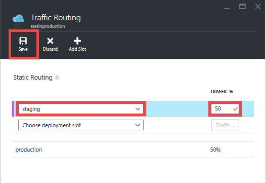
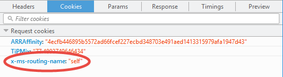

<properties
    pageTitle="在 Web 應用程式的生產環境中測試快速入門"
    description="深入了解生產 （秘訣） 功能 Azure 應用程式服務 Web 應用程式中的測試。"
    services="app-service\web"
    documentationCenter=""
    authors="cephalin"
    manager="wpickett"
    editor=""/>

<tags
    ms.service="app-service-web"
    ms.workload="web"
    ms.tgt_pltfrm="na"
    ms.devlang="na"
    ms.topic="article"
    ms.date="01/13/2016"
    ms.author="cephalin"/>

# 在 Web 應用程式的生產環境中測試快速入門

測試實際或 live 測試您的 web 應用程式，使用 [即時客戶流量是應用程式開發人員逐漸整合到他們的[敏捷式開發](https://en.wikipedia.org/wiki/Agile_software_development)方法的測試策略。 讓您生產環境，而非合成資料的測試環境中測試您的應用程式的即時使用者流量的品質。 藉由公開真實的使用者至新的應用程式，您可以通知在您的應用程式部署後，可能會面臨的實際問題。 您可以驗證功能、 效能及應用程式更新針對大量速度，與各種不同的實際使用者流量，您可以永不估算測試環境中的值。

## 流量路由應用程式服務 Web 應用程式中

[Azure 應用程式服務](http://go.microsoft.com/fwlink/?LinkId=529714)中的傳輸路由的功能，您可以將一個或多個[部署的位置](web-sites-staged-publishing.md)，即時使用者流量的部分與分析您的應用程式搭配[Azure 應用程式的深入見解](/services/application-insights/)或[Azure HDInsight](/services/hdinsight/)或協力廠商的工具，例如[新聖器](/marketplace/partners/newrelic/newrelic/)，以驗證您的變更。 例如，您可以執行下列情況應用程式服務︰

- 探索功能的錯誤，或找出效能瓶頸的整個網站的部署之前更新
- 執行 「 控制的測試班機 」 變更的測量 usibility 測試版應用程式上的指標
- 最新的更新，會逐漸增加和適當地向目前的版本如果發生錯誤 
- 藉由執行最佳化您的應用程式商務結果[A / B 測試](https://en.wikipedia.org/wiki/A/B_testing)或多個部署位置[multivariate 測試](https://en.wikipedia.org/wiki/Multivariate_testing_in_marketing)

### 使用 Web 應用程式中的傳輸路由的需求

- Web 應用程式必須執行在**標準**或**進階版**層，則需要多個部署位置。
- 才能正常運作，流量路由需要使用者的瀏覽器中啟用 cookie。 路由流量使用 cookie 釘選到生命週期的部署位置的用戶端瀏覽器的用戶端工作階段。
- 路由流量支援透過 Azure PowerShell 指令程式的進階的秘訣案例。

## 路由流量區段部署位置

在每個秘訣案例基本層級，您將預先定義的百分比的即時傳輸路由非生產部署位置。 若要這麼做，請遵循下列步驟︰

>[AZURE.NOTE] 這些步驟假設您已經有一個[非生產部署位置](web-sites-staged-publishing.md)，所要的 web app 內容是已[部署](web-sites-deploy.md)。

1. 登入[Azure 入口網站](https://portal.azure.com/)。
2. 在您的 web 應用程式刀，按一下 [**設定** > **路由流量**。
  
3. 選取您想要將流量至您想要然後按一下 [**儲存**] 的總流量的百分比的位置。

    

4. 移至部署位置的刀。 您現在應該會看到即時流量傳遞到它。

    

一旦經路由流量，指定的百分比的用戶端將隨機路由至您的非生產位置。 不過，很重要的一點的後的用戶端自動傳送到特定的位置，它會 「 固定 」 生命週期的用戶端工作階段的位置。 完成上述使用 cookie 釘選的使用者工作階段。 如果您檢查 HTTP 要求時，您會發現`TipMix`cookie 中每個要求。

## 強制用戶端要求的特定位置

除了自動流量路由]，應用程式服務是無法傳送要求的特定位置。 當您希望您的使用者，以選擇將的無法或退出集測試版應用程式時，這是很有用。 若要這麼做，您使用`x-ms-routing-name`查詢參數。

重設使用者的特定位置使用`x-ms-routing-name`，您必須確定至流量路由清單已新增的位置。 因為您想要將路由傳送至位置明確，不會影響您設定的實際路由百分比。 如果您想，您就可以建立 「 beta 」 按一下連結，使用者可以存取的測試版應用程式。

### 選擇 [登出測試版應用程式的使用者

若要讓使用者退出測試版應用程式，例如，您可以將此連結在網頁中︰

    <a href="<webappname>.azurewebsites.net/?x-ms-routing-name=self">Go back to production app</a>

字串`x-ms-routing-name=self`指定生產位置。 當用戶端瀏覽器存取連結時，不會將其重新導向至生產位置上，只包含每個要求`x-ms-routing-name=self`固定生產位置的工作階段的 cookie。

### 選擇 [測試版應用程式中的使用者

若要讓使用者選擇加入集測試版應用程式，將相同的查詢參數設為非生產位置的名稱，例如︰

        <webappname>.azurewebsites.net/?x-ms-routing-name=staging

## 更多資源 ##

-   [設定臨時環境中 Azure 應用程式服務的 web 應用程式](web-sites-staged-publishing.md)
-   [部署 Azure 中預測複雜的應用程式](app-service-deploy-complex-application-predictably.md)
-   [敏捷式的軟體開發 Azure 應用程式服務](app-service-agile-software-development.md)
-   [您的 web 應用程式的有效地使用 DevOps 環境](app-service-web-staged-publishing-realworld-scenarios.md)