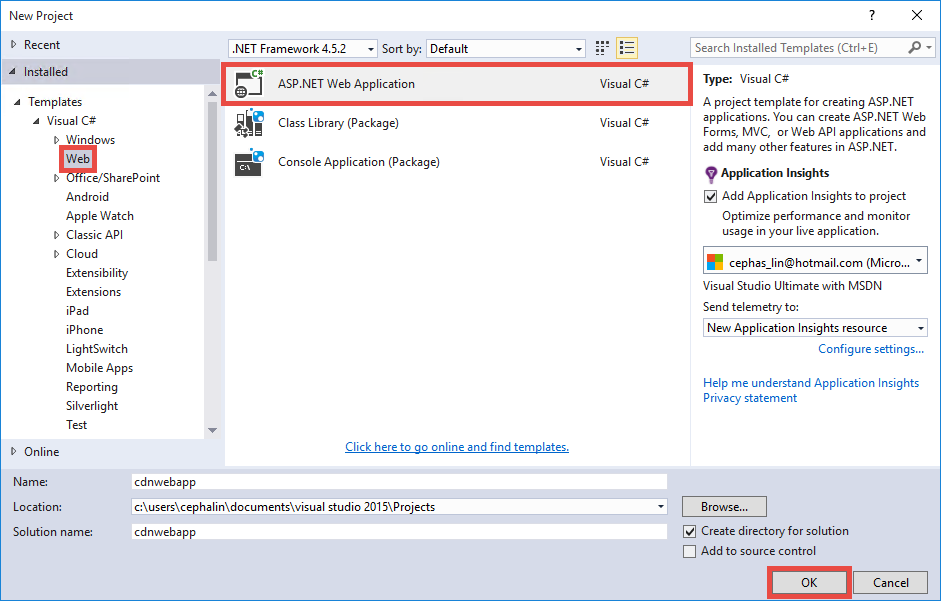
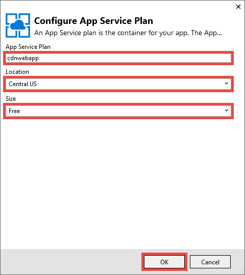

<properties 
    pageTitle="Azure 應用程式服務中使用 Azure 的 CDN" 
    description="教學課程會指導您如何將 web 應用程式部署到 Azure 應用程式服務，提供整合式 Azure CDN 端點的內容" 
    services="app-service\web,cdn" 
    documentationCenter=".net" 
    authors="cephalin" 
    manager="wpickett" 
    editor="jimbe"/>

<tags 
    ms.service="app-service" 
    ms.workload="tbd" 
    ms.tgt_pltfrm="na" 
    ms.devlang="dotnet" 
    ms.topic="article" 
    ms.date="07/01/2016" 
    ms.author="cephalin"/>


# <a name="use-azure-cdn-in-azure-app-service"></a>Azure 應用程式服務中使用 Azure 的 CDN

[應用程式服務](http://go.microsoft.com/fwlink/?LinkId=529714)可以與[Azure CDN](/services/cdn/)，全域從您的客戶附近的伺服器節點將 web 應用程式內容新增至[應用程式服務 Web 應用程式](http://go.microsoft.com/fwlink/?LinkId=529714)中的全域縮放功能整合 (您可以找到更新的所有目前的節點位置清單[以下](http://msdn.microsoft.com/library/azure/gg680302.aspx))。 在等服務靜態圖像的情況下，此整合大幅可以增加您 Azure 應用程式服務 Web 應用程式的效能和大幅改善全球的 web 應用程式的使用者體驗。 

Azure CDN 與整合 Web 應用程式可讓您下列優點︰

- 整合 （圖像、 指令碼和樣式表） 的內容部署 web 應用程式的[連續部署](app-service-continuous-deployment.md)程序的一部分
- 輕鬆升級 web 應用程式中 Azure 應用程式服務，例如 jQuery 或啟動安裝的版本中的 NuGet 套件 
- 管理 Web 應用程式和 CDN 提供內容相同的 Visual Studio 介面
- 與 Azure CDN 整合 ASP.NET 搭售和縮小

[AZURE.INCLUDE [app-service-web-to-api-and-mobile](../../includes/app-service-web-to-api-and-mobile.md)] 

## <a name="what-you-will-build"></a>您會建立 ##

您將 Azure 應用程式服務使用預設 ASP.NET MVC 範本在 Visual Studio 中部署 web 應用程式，將提供內容從整合式 Azure CDN，例如圖像、 控制器動作結果與預設 JavaScript 及 CSS 檔案的程式碼新增並也撰寫程式碼設定配搭 served 的 cdn 到底是離線的後援機制。

## <a name="what-you-will-need"></a>您需要的項目 ##

本教學課程中，您必須︰

-   使用中的[Microsoft Azure 帳戶](/account/)
-   使用[.net Azure SDK](http://go.microsoft.com/fwlink/p/?linkid=323510&clcid=0x409)的 visual Studio 2015。 如果您是使用 Visual Studio，步驟可能會不同。

> [AZURE.NOTE] 您必須完成本教學課程 Azure 帳戶︰
> + 您可以[開啟 Azure 帳戶免費](/pricing/free-trial/)-取得貸項總計試用付費 Azure 服務，您可以使用，即使使用這些之後，您可以將該帳戶，並使用釋放 Azure 服務，例如 Web 應用程式。
> + 您可以[啟動 Visual Studio 訂閱者優點](/pricing/member-offers/msdn-benefits-details/)-您的 Visual Studio 訂閱可讓您貸項總計付費 Azure 服務，您可以使用每個月。
>
> 如果您想要開始使用 Azure 應用程式服務註冊 Azure 帳戶之前，請移至[嘗試應用程式服務](http://go.microsoft.com/fwlink/?LinkId=523751)，可以讓您立即建立短暫入門 web 應用程式在應用程式服務。 必要; 沒有信用卡沒有承諾。

## <a name="deploy-a-web-app-to-azure-with-an-integrated-cdn-endpoint"></a>部署至 Azure 的 web 應用程式，使用整合式 CDN 端點 ##

在此區段中，預設 ASP.NET MVC 應用程式範本，在 Visual Studio 2015 中部署至應用程式服務，然後整合新的 CDN 結束點。 請遵循以下指示︰

1. 在 Visual Studio 2015，建立新的 ASP.NET web 應用程式功能表列中，移至**檔案 > 新增 > 專案 > Web > ASP.NET Web 應用程式**。 名稱，然後按一下**[確定**]。

    

3. 選取**MVC** ，然後按一下**[確定**]。

    

4. 如果您還沒有您尚未登入 Azure 帳戶，請按一下右上角的 [帳戶] 圖示，然後遵循登入您的 Azure 帳戶] 對話方塊。 一旦完成時，如下所示，設定您的應用程式，然後按一下 [**新增**]，建立新的應用程式服務方案應用程式。  

    

5. 在對話方塊中設定新的應用程式服務方案，如下所示，然後按一下**[確定**]。 

    

8. 按一下 [**建立**]，建立 web 應用程式]。

    

9. ASP.NET 應用程式建立後，將它發佈到 Azure Azure 應用程式服務活動] 窗格中，按一下 [**發佈`<app name>`此 Web 應用程式現在**。 按一下 [**發佈**至完成程序。

    

    發佈完成後，您會看到您在瀏覽器中的發佈的網頁應用程式。 

1. 若要建立的 CDN 端點，請登入[Azure 入口網站](https://portal.azure.com)。 
2. 按一下**[+ 新增** > **媒體 + CDN** > **cdn 到底**。

    

3. 指定**CDN**、**位置**、**資源群組**、**價格層**]，然後按一下 [**建立**

       

4. **Cdn 到底設定檔**中刀按一下**+ 結束點**] 按鈕。 名稱、**來源類型**] 下拉式清單和您的 web 應用程式，在**原始主機名稱**] 下拉式清單中，選取**Web 應用程式**，然後按一下 [**新增**]。  

    


    > [AZURE.NOTE] 您 CDN 端點建立後，**結束點**刀會顯示您 CDN URL 及與整合的原點網域。 不過，可能需要一些新的 CDN 端點設定完全傳播到所有的 CDN 節點位置。 

3. 回到**端點**刀中，按一下您剛才建立的 CDN 端點的名稱。

    

3. 按一下 [**設定**] 按鈕。 中**設定**刀中，選取 [**查詢字串快取行為**的下拉式清單中的 [**快取的每個唯一的 URL** ，然後按一下 [**儲存**] 按鈕。


    

當您啟動時，將會為另一個項目快取相同的連結，以不同的查詢字串存取。

>[AZURE.NOTE] 啟用查詢字串不需要此教學課程的章節，而您想要執行此動作最早的任何變更後的便利性盡可能以下即將花時間，才會傳播到所有的 CDN 節點，以及您不希望堵塞 （更新 CDN 內容稍後將討論） 的 CDN 快取的任何非查詢-字串-啟用的內容。

2. 現在，瀏覽至 CDN 端點位址。 如果端點是好的您應該會看到您顯示的 web 應用程式。 如果您收到**HTTP 404**錯誤，則不好 CDN 端點。 您可能需要等候傳播到所有的邊緣節點的 CDN 組態小時。 

    

1. 接下來，請嘗試存取 ASP.NET 專案中的**~/Content/bootstrap.css**檔案。 在瀏覽器視窗中，瀏覽至**http://*&lt;cdnName >*.azureedge.net/Content/bootstrap.css**。 在 [我的設定，此 URL 為︰

        http://az673227.azureedge.net/Content/bootstrap.css

    對應至下列來源 URL CDN 結束點︰

        http://cdnwebapp.azurewebsites.net/Content/bootstrap.css

    當您瀏覽至**http://*&lt;cdnName >*.azureedge.net/Content/bootstrap.css**，系統會提示您下載來自您的 web 應用程式中 Azure bootstrap.css。 

    

同樣地，您就可以存取任何公開存取 URL * *http://*&lt;serviceName >*.cloudapp.net/**，直接從您的 CDN 端點。 例如︰

-   從 /Script 路徑.js 檔案
-   從 /Content 任何內容檔案路徑
-   任何控制器/動作 
-   如果在您的 CDN 端點，任何具有查詢字串 URL 啟用查詢字串
-   整個 Azure web 應用程式時，如果為公用群組的所有內容

請注意，它可能不一定建議您先 （或通常建議您先） 可透過 Azure CDN 整個 Azure web 應用程式。 警告如下︰

-   這個方法需要您為公開]，因為 Azure CDN 無法做的任何私人內容的整個網站。
-   如果基於任何原因離線 CDN 端點，是否已排程進行的維修作業或使用者錯誤，整個 web 應用程式離線除非客戶，可以重新導向至來源 URL * *http://*&lt;站台名稱 >*.azurewebsites.net/**。 
-   即使使用自訂的快取控制項設定 （請參閱[設定快取 Azure web 應用程式中的靜態檔案的選項](#configure-caching-options-for-static-files-in-your-azure-web-app)），CDN 結束點並無法改善效能的高度動態內容。 如果您嘗試從您的 CDN 端點的 [首頁] 頁面載入為第一次，是相當簡單頁面載入預設首頁至少 5 秒所花費的上方，顯示通知。 假設就會發生什麼事的用戶端體驗如果此頁面包含必須更新每分鐘的動態內容。 提供從 CDN 端點的動態內容需要簡短的快取到期，將常用的快取遺漏 CDN 結束點。 這痛 Azure web 應用程式的效能和 cdn 到底的目的，就失去了。

替代方案是決定要從 Azure CDN 提供依案例為基礎 Azure web 應用程式中的內容。 若要這麼做，您已經看到如何從 CDN 端點存取個別內容檔案。 我會告訴您怎麼做透過 CDN 端點的特定控制器動作中[由控制器的動作，透過 Azure CDN 提供內容](#serve-content-from-controller-actions-through-azure-cdn)。

## <a name="configure-caching-options-for-static-files-in-your-azure-web-app"></a>Azure web 應用程式中設定靜態檔案的快取選項 ##

整合 Azure CDN Azure web 應用程式中，您可以指定您想要快取中的 CDN 端點的靜態內容的方式。 若要這麼做，請開啟*Web.config*從 ASP.NET 專案 (例如**cdnwebapp**) 並新增`<staticContent>`項目`<system.webServer>`。 下列 XML 會設定為在 3 天後過期的快取。  

    <system.webServer>
      <staticContent>
        <clientCache cacheControlMode="UseMaxAge" cacheControlMaxAge="3.00:00:00"/>
      </staticContent>
      ...
    </system.webServer>

一旦您這麼做，Azure web 應用程式中的所有靜態檔案就會看到您 CDN 快取中相同的規則。 微調快取設定的控制，請將*Web.config*檔案新增到資料夾，然後新增您的設定。 例如*\Content*資料夾新增*Web.config*檔案，並以下列 XML 取代內容︰

    <?xml version="1.0"?>
    <configuration>
      <system.webServer>
        <staticContent>
          <clientCache cacheControlMode="UseMaxAge" cacheControlMaxAge="15.00:00:00"/>
        </staticContent>
      </system.webServer>
    </configuration>

此設定會導致快取為 15 天*\Content*資料夾中的所有靜態檔案。

如需有關如何設定`<clientCache>`項目，請參閱[用戶端快取&lt;clientCache >](http://www.iis.net/configreference/system.webserver/staticcontent/clientcache)。

在下一個區段中，我將會顯示您如何 CDN 快取中設定的控制站動作結果的快取設定。

## <a name="serve-content-from-controller-actions-through-azure-cdn"></a>由控制器的動作，透過 Azure CDN 提供內容 ##

當您與 Azure CDN 整合 Web 應用程式時，您可以輕鬆以往可透過 Azure CDN 控制器動作的內容。 同樣地，如果您決定要做透過您的 CDN 的整個 Azure web 應用程式，您不需要執行此動作完全因為所有控制器的動作都已透過 cdn 到底。 但基於我已經指出[部署使用整合式 CDN 端點 Azure web 應用程式](#deploy-a-web-app-to-azure-with-an-integrated-cdn-endpoint)中，您可能會針對此決定和改為選擇 [以選取您想要從 Azure CDN 支援控制器動作。 [馬頓 Balliauw](https://twitter.com/maartenballiauw)示範如何處理有趣 MemeGenerator 控制器[減少與 Azure CDN 網頁上](http://channel9.msdn.com/events/TechDays/Techdays-2014-the-Netherlands/Reducing-latency-on-the-web-with-the-Windows-Azure-CDN)的延遲時間。 我會直接重現以下。

假設您想要產生 memes 根據像這樣的年輕 Chuck Norris 圖像 （依[Alan Light](http://www.flickr.com/photos/alan-light/218493788/)相片） web 應用程式中︰


您有一個簡單`Index`動作，讓客戶，若要指定高級圖像，然後產生 meme 後張貼至動作。 由於 Chuck Norris，您應該會變得 （implementation） 熱門全域此頁面。 這是與 Azure CDN 提供半動態內容的好範例。 

請遵循上述步驟，設定這個控制器動作︰

1. 在 [ *\Controllers* ] 資料夾中，建立新的.cs 檔案，稱為*MemeGeneratorController.cs*並取代內容下列程式碼。 取代您的檔案路徑`~/Content/chuck.bmp`和您 CDN 名稱`yourCDNName`。


        using System;
        using System.Collections.Generic;
        using System.Diagnostics;
        using System.Drawing;
        using System.IO;
        using System.Net;
        using System.Web.Hosting;
        using System.Web.Mvc;
        using System.Web.UI;

        namespace cdnwebapp.Controllers
        {
          public class MemeGeneratorController : Controller
          {
            static readonly Dictionary<string, Tuple<string ,string>> Memes = new Dictionary<string, Tuple<string, string>>();

            public ActionResult Index()
            {
              return View();
            }

            [HttpPost, ActionName("Index")]
            public ActionResult Index_Post(string top, string bottom)
            {
              var identifier = Guid.NewGuid().ToString();
              if (!Memes.ContainsKey(identifier))
              {
                Memes.Add(identifier, new Tuple<string, string>(top, bottom));
              }

              return Content("<a href=\"" + Url.Action("Show", new {id = identifier}) + "\">here's your meme</a>");
            }

            [OutputCache(VaryByParam = "*", Duration = 1, Location = OutputCacheLocation.Downstream)]
            public ActionResult Show(string id)
            {
              Tuple<string, string> data = null;
              if (!Memes.TryGetValue(id, out data))
              {
                return new HttpStatusCodeResult(HttpStatusCode.NotFound);
              }

              if (Debugger.IsAttached) // Preserve the debug experience
              {
                return Redirect(string.Format("/MemeGenerator/Generate?top={0}&bottom={1}", data.Item1, data.Item2));
              }
              else // Get content from Azure CDN
              {
                return Redirect(string.Format("http://<yourCDNName>.azureedge.net/MemeGenerator/Generate?top={0}&bottom={1}", data.Item1, data.Item2));
              }
            }

            [OutputCache(VaryByParam = "*", Duration = 3600, Location = OutputCacheLocation.Downstream)]
            public ActionResult Generate(string top, string bottom)
            {
              string imageFilePath = HostingEnvironment.MapPath("~/Content/chuck.bmp");
              Bitmap bitmap = (Bitmap)Image.FromFile(imageFilePath);

              using (Graphics graphics = Graphics.FromImage(bitmap))
              {
                SizeF size = new SizeF();
                using (Font arialFont = FindBestFitFont(bitmap, graphics, top.ToUpperInvariant(), new Font("Arial Narrow", 100), out size))
                {
                    graphics.DrawString(top.ToUpperInvariant(), arialFont, Brushes.White, new PointF(((bitmap.Width - size.Width) / 2), 10f));
                }
                using (Font arialFont = FindBestFitFont(bitmap, graphics, bottom.ToUpperInvariant(), new Font("Arial Narrow", 100), out size))
                {
                    graphics.DrawString(bottom.ToUpperInvariant(), arialFont, Brushes.White, new PointF(((bitmap.Width - size.Width) / 2), bitmap.Height - 10f - arialFont.Height));
                }
              }
              MemoryStream ms = new MemoryStream();
              bitmap.Save(ms, System.Drawing.Imaging.ImageFormat.Png);
              return File(ms.ToArray(), "image/png");
            }

            private Font FindBestFitFont(Image i, Graphics g, String text, Font font, out SizeF size)
            {
              // Compute actual size, shrink if needed
              while (true)
              {
                size = g.MeasureString(text, font);

                // It fits, back out
                if (size.Height < i.Height &&
                     size.Width < i.Width) { return font; }

                // Try a smaller font (90% of old size)
                Font oldFont = font;
                font = new Font(font.Name, (float)(font.Size * .9), font.Style);
                oldFont.Dispose();
              }
            }
          }
        }

2. 以滑鼠右鍵按一下預設`Index()`動作，並選取 [**新增檢視畫面**。

    

3.  接受下列設定值，然後按一下 [**新增**]。

    

4. 開啟新的*Views\MemeGenerator\Index.cshtml*並取代送出高級下列簡單的 HTML 內容︰

        <h2>Meme Generator</h2>
        
        <form action="" method="post">
            <input type="text" name="top" placeholder="Enter top text here" />
            <br />
            <input type="text" name="bottom" placeholder="Enter bottom text here" />
            <br />
            <input class="btn" type="submit" value="Generate meme" />
        </form>

5. 一次發佈至 Azure web 應用程式，並瀏覽至**http://*&lt;serviceName >*.cloudapp.net/MemeGenerator/Index** 在瀏覽器中的。 

當您送出表單值`/MemeGenerator/Index`、`Index_Post`動作方法會傳回連結`Show`動作方法分別輸入的識別碼。 當您按一下連結時，您到達下列程式碼︰  

    [OutputCache(VaryByParam = "*", Duration = 1, Location = OutputCacheLocation.Downstream)]
    public ActionResult Show(string id)
    {
      Tuple<string, string> data = null;
      if (!Memes.TryGetValue(id, out data))
      {
        return new HttpStatusCodeResult(HttpStatusCode.NotFound);
      }

      if (Debugger.IsAttached) // Preserve the debug experience
      {
        return Redirect(string.Format("/MemeGenerator/Generate?top={0}&bottom={1}", data.Item1, data.Item2));
      }
      else // Get content from Azure CDN
      {
        return Redirect(string.Format("http://<yourCDNName>.azureedge.net/MemeGenerator/Generate?top={0}&bottom={1}", data.Item1, data.Item2));
      }
    }

如果您的本機偵錯工具附加時，您會收到與本機重新導向的一般偵錯體驗。 如果 Azure web 應用程式中執行，它會重新導向至︰

    http://<yourCDNName>.azureedge.net/MemeGenerator/Generate?top=<formInput>&bottom=<formInput>

對應至下列來源 URL 您 CDN 結束點︰

    http://<yourSiteName>.azurewebsites.net/cdn/MemeGenerator/Generate?top=<formInput>&bottom=<formInput>

URL 重新寫入先前套用規則之後，取得快取至您的 CDN 端點的實際檔案就會是︰

    http://<yourSiteName>.azurewebsites.net/MemeGenerator/Generate?top=<formInput>&bottom=<formInput>

然後，您可以使用`OutputCacheAttribute`在`Generate`指定如何動作結果應該快取，其會受限於 Azure CDN 的方法。 下列程式碼指定快取的到期日 1 小時 （3600 秒）。

    [OutputCache(VaryByParam = "*", Duration = 3600, Location = OutputCacheLocation.Downstream)]

同樣地，您可以做任何控制器巨集指令的內容設定 Azure web 應用程式中透過您的 Azure CDN，使用快取所要的選項。

在下一個區段中，我會顯示您要做的搭售和 minified 指令碼及 CSS 透過 Azure CDN 的方式。 

## <a name="integrate-aspnet-bundling-and-minification-with-azure-cdn"></a>與 Azure CDN 整合 ASP.NET 搭售和縮小 ##

指令碼及 CSS 樣式表變更不常，主要適合 Azure CDN 快取。 提供整個 web 應用程式到您 Azure cdn 到底是最簡單的方法與 Azure CDN 整合搭售和縮小。 不過，當的[整合 Azure CDN 端點您 Azure web 應用程式和服務靜態內容從 Azure CDN 在網頁中](#deploy-a-web-app-to-azure-with-an-integrated-cdn-endpoint)所述的原因，您可以選擇針對這種方法，我會告訴您如何操作時保留所需的 develper 和的經驗 ASP.NET 搭售縮小，例如︰

-   好的偵錯模式體驗
-   精簡的部署
-   立即更新指令碼/CSS 版本升級的用戶端
-   當您 CDN 端點失敗後援機制
-   最小化程式碼修改

在您建立的[整合與 Azure web 應用程式和服務靜態內容從 Azure CDN 在網頁中 Azure CDN 端點](#deploy-a-web-app-to-azure-with-an-integrated-cdn-endpoint)ASP.NET project 中，開啟 [ *App_Start\BundleConfig.cs* ，看看`bundles.Add()`方法呼叫。

    public static void RegisterBundles(BundleCollection bundles)
    {
        bundles.Add(new ScriptBundle("~/bundles/jquery").Include(
                    "~/Scripts/jquery-{version}.js"));
        ...
    }

第一個`bundles.Add()`陳述式在虛擬目錄新增指令碼套件`~/bundles/jquery`。 然後，開啟*Views\Shared\_Layout.cshtml*若要查看的指令碼套件標記的呈現方式。 您可以尋找 Razor 程式碼的下列行︰

    @Scripts.Render("~/bundles/jquery")

Azure web 應用程式中執行此 Razor 程式碼時，它會呈現`<script>`類似以下的指令碼套件的標籤︰ 

    <script src="/bundles/jquery?v=FVs3ACwOLIVInrAl5sdzR2jrCDmVOWFbZMY6g6Q0ulE1"></script>

不過，當執行 Visual Studio 中輸入`F5`，它會呈現在套件中的每個指令碼檔個別 （上述情況，只有一個指令碼檔是在套件中）︰

    <script src="/Scripts/jquery-1.10.2.js"></script>

這可讓您偵錯 JavaScript 程式碼，在您的開發環境中時減少一個用戶端連線 （搭售） 和改善檔案下載生產效能 （縮放）。 若要保留 Azure CDN 整合很棒的功能則。 此外，呈現的套件已包含自動產生的版本的字串，因為您想要讓每當您更新透過 NuGet jQuery 版本，可在更新用戶端越快越複製該功能。

整合 ASP.NET 搭售和縮小與您的 CDN 端點，請遵循下列步驟。

1. 回*App_Start\BundleConfig.cs*，修改`bundles.Add()`，請使用不同[套件建構函式](http://msdn.microsoft.com/library/jj646464.aspx)，可指定 CDN 地址的其中一個方法。 若要這麼做，取代`RegisterBundles`方法定義下列程式碼︰  
    
        public static void RegisterBundles(BundleCollection bundles)
        {
          bundles.UseCdn = true;
          var version = System.Reflection.Assembly.GetAssembly(typeof(Controllers.HomeController))
            .GetName().Version.ToString();
          var cdnUrl = "http://<yourCDNName>.azureedge.net/{0}?" + version;

          bundles.Add(new ScriptBundle("~/bundles/jquery", string.Format(cdnUrl, "bundles/jquery")).Include(
                "~/Scripts/jquery-{version}.js"));

          bundles.Add(new ScriptBundle("~/bundles/jqueryval", string.Format(cdnUrl, "bundles/jqueryval")).Include(
                "~/Scripts/jquery.validate*"));

          // Use the development version of Modernizr to develop with and learn from. Then, when you're
          // ready for production, use the build tool at http://modernizr.com to pick only the tests you need.
          bundles.Add(new ScriptBundle("~/bundles/modernizr", string.Format(cdnUrl, "bundles/modernizr")).Include(
                "~/Scripts/modernizr-*"));

          bundles.Add(new ScriptBundle("~/bundles/bootstrap", string.Format(cdnUrl, "bundles/bootstrap")).Include(
                "~/Scripts/bootstrap.js",
                "~/Scripts/respond.js"));

          bundles.Add(new StyleBundle("~/Content/css", string.Format(cdnUrl, "Content/css")).Include(
                "~/Content/bootstrap.css",
                "~/Content/site.css"));
        }


    請務必取代`<yourCDNName>`您 Azure CDN 的名稱。

    以純文字，也就將`bundles.UseCdn = true`謹慎的 CDN URL 新增至每個套件。 例如，在程式碼中的第一個建構函式︰

        new ScriptBundle("~/bundles/jquery", string.Format(cdnUrl, "bundles/jquery"))

    為相同︰ 

        new ScriptBundle("~/bundles/jquery", string.Format(cdnUrl, "http://<yourCDNName>.azureedge.net/bundles/jquery?<W.X.Y.Z>"))

    ASP.NET 搭售和縮小轉譯個別的指令碼偵錯在本機的檔案，但若要存取有問題的指令碼使用指定的 CDN 地址，就是告訴這個建構函式。 不過，請注意此謹慎 CDN url 的兩個重要特性︰
    
    - 此 CDN URL 的原點`http://<yourSiteName>.azurewebsites.net/bundles/jquery?<W.X.Y.Z>`，這是實際的 Web 應用程式中的指令碼套件虛擬目錄。
    - 由於您使用 CDN 建構函式，套件的 CDN 指令碼標記不再包含自動產生的版本的字串的轉譯。 每次強制快取遺漏在您 Azure CDN 修改指令碼套件時，您必須以手動方式產生的唯一版本字串。 同時，此唯一版本字串必須保持不變透過生命週期的部署套件之後，最大化快取點擊，在您 Azure CDN 部署。

3. 查詢字串`<W.X.Y.Z>`從*Properties\AssemblyInfo.cs*擷取 ASP.NET 專案中。 您可以有包含遞增的組件版本，每次您發佈至 Azure 部署工作流程。 或者，您就可以自動遞增版本字串，每次建立，使用萬用字元的專案中修改*Properties\AssemblyInfo.cs* ' *'。 例如，變更`AssemblyVersion`如下所示︰
    
        [assembly: AssemblyVersion("1.0.0.*")]
    
    簡化產生的唯一的字串，部署的生命週期的任何其他策略運作以下所示。

3. 重新發佈 ASP.NET 應用程式，並存取 [首頁] 頁面。
 
4. 檢視頁面的 HTML 程式碼。 您應該能夠看到 CDN URL 是唯一的版本字串，每次您重新變更發佈至 Azure web 應用程式，以呈現。 例如︰  
    
        ...
        <link href="http://az673227.azureedge.net/Content/css?1.0.0.25449" rel="stylesheet"/>
        <script src="http://az673227.azureedge.net/bundles/modernizer?1.0.0.25449"></script>
        ...
        <script src="http://az673227.azureedge.net/bundles/jquery?1.0.0.25449"></script>
        <script src="http://az673227.azureedge.net/bundles/bootstrap?1.0.0.25449"></script>
        ...

5. 在 Visual Studio 中，為偵錯 ASP.NET 應用程式在 Visual Studio 中的輸入`F5`。， 

6. 檢視頁面的 HTML 程式碼。 您仍然會看到每個個別呈現，讓您可以讓一致偵錯體驗 Visual Studio 中的指令碼檔。  
    
        ...
        <link href="/Content/bootstrap.css" rel="stylesheet"/>
        <link href="/Content/site.css" rel="stylesheet"/>
        <script src="/Scripts/modernizr-2.6.2.js"></script>
        ...
        <script src="/Scripts/jquery-1.10.2.js"></script>
        <script src="/Scripts/bootstrap.js"></script>
        <script src="/Scripts/respond.js"></script>
        ...    

## <a name="fallback-mechanism-for-cdn-urls"></a>Cdn 到底 Url 後援機制 ##

當您 Azure CDN 端點失敗基於任何原因時，您想要聰明後援] 選項為載入 JavaScript 或啟動安裝程式存取您的原始網頁伺服器網頁。 這是嚴重遺失您的 web 應用程式，因為 CDN 無法使用，但更嚴重遺失提供的指令碼和樣式表的重要網頁功能上的圖像。

[套件](http://msdn.microsoft.com/library/system.web.optimization.bundle.aspx)包含稱為[CdnFallbackExpression](http://msdn.microsoft.com/library/system.web.optimization.bundle.cdnfallbackexpression.aspx)可讓您設定 CDN 失敗的後援機制的屬性。 若要使用此屬性，請遵循下列步驟︰

1. 在 ASP.NET 專案中，開啟 [ *App_Start\BundleConfig.cs*，您新增 CDN URL 中每個[套件建構函式](http://msdn.microsoft.com/library/jj646464.aspx)，並新增`CdnFallbackExpression`四個位置中程式碼，如下圖所示加入預設配搭後援機制。  
    
        public static void RegisterBundles(BundleCollection bundles)
        {
          var version = System.Reflection.Assembly.GetAssembly(typeof(BundleConfig))
            .GetName().Version.ToString();
          var cdnUrl = "http://cdnurl.azureedge.net/.../{0}?" + version;
          bundles.UseCdn = true;

          bundles.Add(new ScriptBundle("~/bundles/jquery", string.Format(cdnUrl, "bundles/jquery")) 
                { CdnFallbackExpression = "window.jquery" }
                .Include("~/Scripts/jquery-{version}.js"));

          bundles.Add(new ScriptBundle("~/bundles/jqueryval", string.Format(cdnUrl, "bundles/jqueryval")) 
                { CdnFallbackExpression = "$.validator" }
                .Include("~/Scripts/jquery.validate*"));

          // Use the development version of Modernizr to develop with and learn from. Then, when you're
          // ready for production, use the build tool at http://modernizr.com to pick only the tests you need.
          bundles.Add(new ScriptBundle("~/bundles/modernizr", string.Format(cdnUrl, "bundles/modernizer")) 
                { CdnFallbackExpression = "window.Modernizr" }
                .Include("~/Scripts/modernizr-*"));

          bundles.Add(new ScriptBundle("~/bundles/bootstrap", string.Format(cdnUrl, "bundles/bootstrap"))     
                { CdnFallbackExpression = "$.fn.modal" }
                .Include(
                        "~/Scripts/bootstrap.js",
                        "~/Scripts/respond.js"));

          bundles.Add(new StyleBundle("~/Content/css", string.Format(cdnUrl, "Content/css")).Include(
                "~/Content/bootstrap.css",
                "~/Content/site.css"));
        }

    當`CdnFallbackExpression`是不是 null，指令碼插入測試是否順利載入套件時，如果不是，存取套件，直接從原始網頁伺服器的 HTML。 此屬性必須設定為 [測試是否正確載入個別的 CDN 套件 JavaScript 運算式。 測試每個套件所需的運算式會根據內容而異。 為上述的預設配搭︰
    
    - `window.jquery`定義在 jquery-{版本}.js
    - `$.validator`定義在 jquery.validate.js
    - `window.Modernizr`定義在 modernizer-{版本}.js
    - `$.fn.modal`定義在 bootstrap.js
    
    您可能已經注意到我未設定為 CdnFallbackExpression`~/Cointent/css`套件。 這是因為目前會插入[錯誤 System.Web.Optimization](https://aspnetoptimization.codeplex.com/workitem/104) `<script>`後援 CSS，而不是預期的標籤`<link>`標籤。
    
    沒有，不過，建議[樣式套件後援](https://github.com/EmberConsultingGroup/StyleBundleFallback)所提供的[Ember 諮詢群組](https://github.com/EmberConsultingGroup)。 

2. 若要使用的因應措施的 CSS，稱為*StyleBundleExtensions.cs*，ASP.NET 專案的*App_Start*資料夾中建立新的.cs 檔案並取代其內容[GitHub 的程式碼](https://github.com/EmberConsultingGroup/StyleBundleFallback/blob/master/Website/App_Start/StyleBundleExtensions.cs)。 

4. 在*App_Start\StyleFundleExtensions.cs*，將命名 WEB 應用程式的命名空間 (例如**cdnwebapp**)。 

3. 返回`App_Start\BundleConfig.cs`及取代的最後一個`bundles.Add`陳述式下列程式碼︰  

        bundles.Add(new StyleBundle("~/Content/css", string.Format(cdnUrl, "Content/css"))
          .IncludeFallback("~/Content/css", "sr-only", "width", "1px")
          .Include(
            "~/Content/bootstrap.css",
            "~/Content/site.css"));

    這個新的副檔名方法將指令碼，若要檢查的 DOM HTML 中使用相同的概念相符的類別名稱、 規則命名，然後定義 CSS 套件和切換回原始網頁伺服器，如果找不相符的規則值。

4. 一次發佈至 Azure web 應用程式，存取 [首頁] 頁面。 
5. 檢視頁面的 HTML 程式碼。 您應該找到插入指令碼如下︰    
    
    ```
    ...
    <link href="http://az673227.azureedge.net/Content/css?1.0.0.25474" rel="stylesheet"/>
<script>(function() {
                var loadFallback,
                    len = document.styleSheets.length;
                for (var i = 0; i < len; i++) {
                    var sheet = document.styleSheets[i];
                    if (sheet.href.indexOf('http://az673227.azureedge.net/Content/css?1.0.0.25474') !== -1) {
                        var meta = document.createElement('meta');
                        meta.className = 'sr-only';
                        document.head.appendChild(meta);
                        var value = window.getComputedStyle(meta).getPropertyValue('width');
                        document.head.removeChild(meta);
                        if (value !== '1px') {
                            document.write('<link href="/Content/css" rel="stylesheet" type="text/css" />');
                        }
                    }
                }
                return true;
            }())||document.write('<script src="/Content/css"><\/script>');</script>

    <script src="http://az673227.azureedge.net/bundles/modernizer?1.0.0.25474"></script>
    <script>(window.Modernizr)||document.write('<script src="/bundles/modernizr"><\/script>');</script>
    ... 
    <script src="http://az673227.azureedge.net/bundles/jquery?1.0.0.25474"></script>
    <script>(window.jquery)||document.write('<script src="/bundles/jquery"><\/script>');</script>

    <script src="http://az673227.azureedge.net/bundles/bootstrap?1.0.0.25474"></script>
    <script>($.fn.modal)||document.write('<script src="/bundles/bootstrap"><\/script>');</script>
    ...
    ```

    請注意，插入的指令碼的 CSS 套件仍會包含從錯誤殘餘`CdnFallbackExpression`行中的屬性︰

        }())||document.write('<script src="/Content/css"><\/script>');</script>

    自的第一個部分，但個管線運算式一定會傳回 （在上面的虛線），則為 true，永遠不會執行 document.write() 函數。

6. 若要測試是否正在使用的後援指令碼，請返回 CDN 端點的刀並按一下 [**停止**]。

    

7. 重新整理瀏覽器視窗 Azure web 應用程式。 您現在應該會看到所有指令碼和樣式表正確載入。

## <a name="more-information"></a>詳細資訊 
- [Azure 內容傳遞網路 」 (CDN) 的概觀](../cdn/cdn-overview.md)
- [使用 Azure 的 CDN](../cdn/cdn-create-new-endpoint.md)
- [在雲端服務整合 Azure CDN](../cdn/cdn-cloud-service-with-cdn.md)
- [ASP.NET 搭售和縮小](http://www.asp.net/mvc/tutorials/mvc-4/bundling-and-minification)

