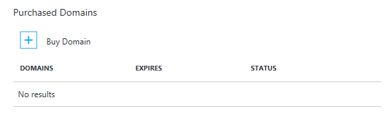
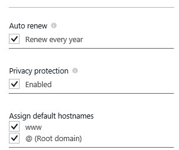

<properties
    pageTitle="如何購買 Azure 應用程式服務 Web 應用程式中的自訂網域名稱"
    description="瞭解如何購買 Azure 應用程式服務中的 web 應用程式的自訂網域名稱。"
    services="app-service\web"
    documentationCenter=""
    authors="rmcmurray"
    manager="wpickett"
    editor=""/>

<tags
    ms.service="app-service-web"
    ms.workload="web"
    ms.tgt_pltfrm="na"
    ms.devlang="na"
    ms.topic="article"
    ms.date="08/11/2016"
    ms.author="robmcm"/>

# 購買和 Azure 應用程式服務中設定自訂網域名稱

[AZURE.INCLUDE [web-selector](../../includes/websites-custom-domain-selector.md)]

當您建立 web 應用程式時，則 Azure 會將其指派給 azurewebsites.net 的子網域。 例如，如果您的 web 應用程式名稱為**contoso**的 URL 是**contoso.azurewebsites.net**。 Azure 也會指派虛擬的 IP 位址。

生產 web 應用程式，您可能會想使用者請參閱將自訂網域名稱。 本文說明如何購買並使用[應用程式服務 Web 應用程式](http://go.microsoft.com/fwlink/?LinkId=529714)中設定自訂網域。 

[AZURE.INCLUDE [introfooter](../../includes/custom-dns-web-site-intro-notes.md)]

## 概觀

如果您沒有將網域名稱用於您的 web 應用程式，您可以輕鬆地[Azure 入口網站](https://portal.azure.com/)上購買。 購買程序時，您可以選擇將會自動對應到您的 web 應用程式的 WWW 和根網域的 DNS 記錄。 您也可以管理您的網域向內 Azure 入口網站。

若要購買網域名稱，並指定 web 應用程式中使用下列步驟。

1. 在瀏覽器中開啟[Azure 入口網站](https://portal.azure.com/)。

2. 在**Web 應用程式**] 索引標籤上，按一下 [web 應用程式的名稱]，選取 [**設定**] 中，，然後選取 [**自訂網域**

    

3. 在**自訂網域**刀中，按一下 [**購買網域**。

    

4. 在**購買網域**刀中，使用 [文字] 方塊輸入您想要購買]，並按下 Enter 的網域名稱。 [文字] 方塊下方會顯示建議可用的網域。 選取您要購買的是哪個網域。 您可以選擇一次購買多個網域。 

  

5. 按一下 [**連絡資訊**及填滿網域的連絡人資訊表單。

  

    > [AZURE.NOTE] 請務必填寫所有必要的欄位，盡可能精確度越好，尤其是電子郵件地址。 若購買的網域不 」 的隱私權保護 」，可能會要求您的網域會變成作用中驗證您的電子郵件。 在某些情況下，不正確的資料的連絡人資訊會導致失敗購買網域。 

6. 現在您可以選擇，

    a) [自動更新] 您每年的網域
    
    b） 選擇加入集 」 的隱私權保護 」 所包含的購買價格免費 (除了 Tld 誰的登錄執行動作不支援的隱私權。 For example:。 co.in，。 co.uk 等等。)  
    
    c） 「 指派預設 hostname 「 WWW 和根網域至目前的 Web 應用程式。 

  
  
    > [AZURE.NOTE] 選項 C 設定 DNS 繫結和主機名稱會自動為您的繫結。  如此一來，您的 Web 應用程式可存取使用自訂網域，就會立即購買已完成 (baring DNS 傳播延遲，在一些情況下)。 萬一您的 Web 應用程式是前 Azure 流量管理員，您不會看到一個選項來指定根網域，如下 A 記錄，無法使用與流量管理員。 您可以隨時指定網域/子-domains 購買到另一個 Web App 和相反的其中一個 Web 應用程式。 步驟 8，如需詳細資訊，請參閱。 
    
7. 然後您會看到 [購買的資訊上**購買確認**刀，請按一下 [**選取**上的 [**購買網域**刀]。 如果您接受法律合約，然後按一下 [**購買**，會送出訂單，您可以監視**通知**的購買程序。 網域購買可能需要幾分鐘才能完成。 

  

  

8. 如果您已成功訂購網域，您可以管理網域，並指派給您的 web 應用程式。 按一下 [ **...]**您網域的右側。 然後您可以**取消購買**] 或 [**管理網域**。 按一下 [**管理網域]**，然後就可以連結**子網域**，在 [**管理網域**刀我們 web 應用程式。 如果您想要繫結至不同的 Web 應用程式的**子網域**，然後執行此步驟的個別的 Web 應用程式的內容中。 在這裡，您只要選取流量管理員指派流量管理員結束點的網域 （如果 Web App 前問題） 選擇命名從下拉式功能表。 執行此動作，網域/子網域會自動指派給該流量管理員端點後的所有 Web 應用程式。 

    

    > [AZURE.NOTE] 您可以 「 取消購買 」 的完整退款 5 天內。 您將會 5 天後無法 「 取消購買 」，請改為您會看到的選項，若要 「 刪除 」 網域]。 刪除網域就會導致釋放從您的訂閱，但不要求退款，並會變成可用的網域。 

完成設定後，自訂網域名稱會列在 web 應用程式的 [**主機名稱繫結**] 區段。

此時，您應該可以在瀏覽器中輸入自訂的網域名稱，並查看，其已成功會帶您到您的 web 應用程式。
 
## 自訂您購買的網域會發生什麼情況

您的**自訂網域和 SSL**刀購買的自訂網域連結至 Azure 訂閱。 Azure 的資源，為此自訂網域且個別獨立從您第一次購買的網域的應用程式服務應用程式。 這表示︰

- 內 Azure 入口網站中，您可以在一個以上的應用程式服務應用程式，以及不只是您第一次購買的自訂網域的應用程式使用您購買的自訂網域。 
- 您可以管理您購買 Azure 訂閱中，移至*任何*的**自訂網域和 SSL**刀該訂閱中的應用程式服務應用程式的自訂網域。
- 您可以將自訂網域中的子網域從相同的 Azure 訂閱指定任何應用程式服務應用程式。
- 如果您決定要刪除的應用程式服務應用程式，您可以選擇不若要刪除的自訂網域，如果您想要繼續使用其他應用程式的繫結。

## 如果您的自訂網域看您購買

如果您已購買的是從**自訂網域和 SSL**刀，內的自訂網域，但無法看到下的 [**受管理網域**的自訂網域，請檢查下列項目︰

- 自訂的網域建立可能沒有完全。 核取通知鐘型 Azure 入口網站頂端的進度。
- 基於某種原因，可能會失敗的自訂網域建立。 核取通知鐘型 Azure 入口網站頂端的進度。
- 自訂的網域可能已順利完成，但刀可能無法重新整理尚未。 請嘗試重新開啟**自訂網域和 SSL**刀。
- 您可能已經刪除的自訂網域，在某個時間點。 按一下 [**設定**]，核取 [稽核記錄 > 從您的應用程式主刀**稽核記錄**。 
- 您正在尋找的**自訂網域和 SSL**刀可能屬於不同的 Azure 訂閱中建立的應用程式。 切換至不同的訂閱中的另一個應用程式，並檢查 [ **SSL] 和自訂網域**刀。  
  在入口網站，您將無法檢視或管理在不同的 Azure 訂閱比應用程式中建立的自訂網域。 不過，如果您網域的 [**管理網域**刀中按一下 [**進階管理**]，您會被重新導向，您可以  [手動](web-sites-custom-domain-name.md)設定您的自訂網域，例如任何外部的自訂網域的網域提供者的網站 
  在不同的 Azure 訂閱中建立的應用程式。 

