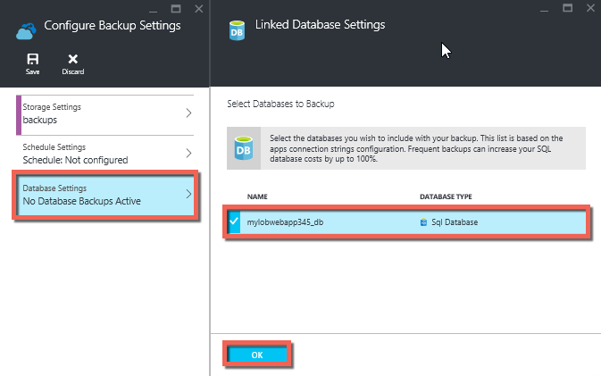
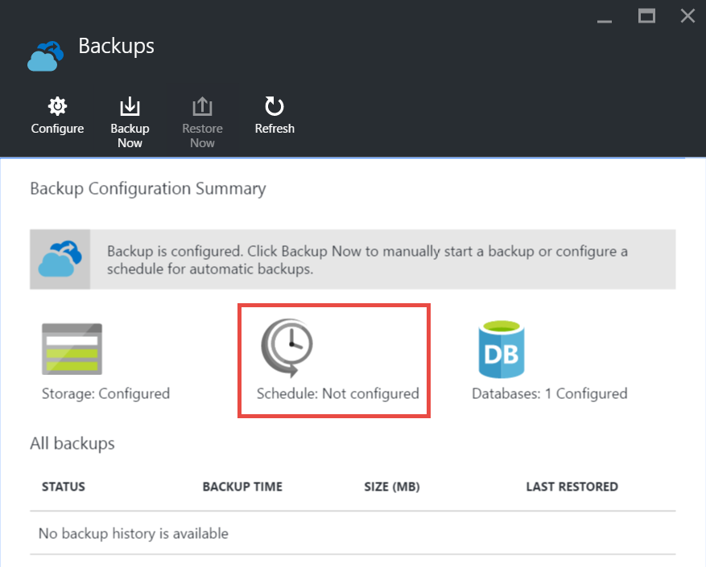

<properties 
    pageTitle="備份您的應用程式中 Azure" 
    description="瞭解如何建立備份您的應用程式中 Azure 應用程式服務。" 
    services="app-service" 
    documentationCenter="" 
    authors="cephalin" 
    manager="wpickett" 
    editor="jimbe"/>

<tags 
    ms.service="app-service" 
    ms.workload="na" 
    ms.tgt_pltfrm="na" 
    ms.devlang="na" 
    ms.topic="article" 
    ms.date="07/06/2016" 
    ms.author="cephalin"/>

# 備份您的應用程式中 Azure

[Azure 應用程式服務](../app-service/app-service-value-prop-what-is.md)的備份與還原功能可讓您輕鬆建立應用程式備份，以手動方式] 或 [自動。 您可以將您的應用程式還原至先前的狀態，或建立新的應用程式，根據原始應用程式的備份的其中一個。 

從備份還原應用程式的詳細資訊，請參閱[還原 Azure 中的應用程式](web-sites-restore.md)。

## 什麼會備份 
應用程式服務可以備份下列資訊︰

* 應用程式設定
* 檔案內容
* 任何 Azure SQL 資料庫或 Azure MySQL (ClearDB) 資料庫連線到您的應用程式 （您可以選擇要包含在備份哪些版本）

這項資訊備份 Azure 儲存體帳戶與您所指定的容器。 

> [AZURE.NOTE] 每個備份是完整的離線複本，您的應用程式，不累加更新。

## 需求及限制

* 備份與還原項功能需要在**標準**層或更高的應用程式服務方案。 如需有關如何調整您的應用程式服務方案，使用較高的層，請參閱[Azure 中的應用程式設定不按比例縮放](web-sites-scale.md)的詳細資訊。 請注意**進階版**層可讓更多的每日備份比**標準**層。
* 您需要的 Azure 儲存體帳戶和同一份訂閱作為您想要備份的應用程式中的容器。 如需有關 Azure 儲存體帳戶的詳細資訊，請參閱本文結尾的[連結](#moreaboutstorage)。
* 備份可 10 GB 的應用程式與資料庫的內容。 如果備份大小超過此限制，您會看到的錯誤。 

## 建立手動備份

2. 在[Azure 入口網站](https://portal.azure.com)中，瀏覽至您的應用程式刀，選取 [**設定**]，然後**備份**。 **備份**刀隨即出現。
    
    ![備份頁面][ChooseBackupsPage]

    >[AZURE.NOTE]如果您看到下列訊息，請按一下以升級您的應用程式服務方案，您可以繼續使用備份之前。
如需詳細資訊，請參閱[不按比例縮放設定 Azure 中的應用程式](web-sites-scale.md)。  
    >

3. 在 [**備份**刀中，按一下 [**儲存空間︰ 未設定**設定儲存帳戶。

    ![選擇 [儲存帳戶][ChooseStorageAccount]
    
4. 選取的**儲存空間帳戶**與**容器**，選擇您備份的目的地。 儲存帳戶必須屬於相同的訂閱，為您要備份的應用程式。 如果您想要您可以建立新的儲存空間帳戶或新的容器中個別刀。 當您完成時，請按一下 [**選取**]。
    
    
    
5. 在仍會保持開啟**設定備份設定**刀，按一下 [**資料庫設定**、 選取您想要包含在備份 （SQL 資料庫或 MySQL） 中的資料庫]，然後按一下**[確定**。  

    

    > [AZURE.NOTE]  此清單中顯示為資料庫，其連接字串必須存在的**應用程式設定**刀應用程式的 [**連線字串**] 區段中。

6. 在 [**設定備份設定**刀中，按一下 [**儲存**]。  

7. 命令列中的**備份**刀，按一下 [**備份立即**。
    
    ![BackUpNow] 按鈕][BackUpNow]
    
    備份的程序時，您會看到進度訊息。

您已設定的儲存空間帳戶與容器的備份後，您可以在任何時間，請手動備份。  

## 設定自動的備份

1. 在 [**備份**刀中，按一下 [**排程︰ 未設定**。 

    
    
1. **備份排程設定**防禦，以設定**備份排程**為**上**，然後視需要設定備份的排程與**[確定]**。
    
    ![啟用自動的備份][SetAutomatedBackupOn]
    
4. 在仍會保持開啟**設定備份設定**刀，按一下 [**儲存設定**]，然後選取的**儲存空間帳戶**與**容器**，選擇您備份的目的地。 儲存帳戶必須屬於相同的訂閱，為您要備份的應用程式。 如果您想要您可以建立新的儲存空間帳戶或新的容器中個別刀。 當您完成時，請按一下 [**選取**]。
    
    
    
5. 在**設定備份設定**刀中，按一下 [**資料庫設定**、 選取您想要包含在備份 （SQL 資料庫或 MySQL） 中的資料庫]，然後按一下**[確定**。  

    

    > [AZURE.NOTE]  此清單中顯示為資料庫，其連接字串必須存在的**應用程式設定**刀應用程式的 [**連線字串**] 區段中。

6. 在 [**設定備份設定**刀中，按一下 [**儲存**]。  

## 備份部分的應用程式

有時候您不想備份您的應用程式上的所有項目。 以下是一些範例︰

-   您[設定的每週備份](web-sites-backup.md#configure-automated-backups)包含永遠不會變更，例如舊的部落格文章或圖像的靜態內容的應用程式。
-   您的應用程式有超過 10 GB 的內容 （亦即您可以一次備份的最大數量）。
-   您不想要備份的記錄檔。

部分備份可讓您選擇完全您想要備份的檔案。

### 從備份排除檔案

若要從您的備份排除的檔案和資料夾，建立`_backup.filter`應用程式的 D:\home\site\wwwroot 資料夾中的檔案，並指定的檔案和您想要排除在該處的資料夾清單。 若要存取這個簡單的方法是透過[Kudu 主控台](https://github.com/projectkudu/kudu/wiki/Kudu-console)。 

假設您有包含記錄檔和從過去從未要變更的年數的靜態圖像的應用程式。 您已經有包含舊的圖像的應用程式的完整備份。 現在您想要備份的應用程式的每一天，但不要支付儲存記錄檔或永遠不會變更靜態圖像檔案。

![記錄] 資料夾][LogsFolder]
![圖像資料夾][ImagesFolder]
    
以下步驟顯示您從備份排除這些檔案的方式。

1. 移至 [`http://{yourapp}.scm.azurewebsites.net/DebugConsole`並找出您想要排除的備份資料夾。 在此範例中，您會想要排除的下列檔案與資料夾顯示在該使用者介面中︰

        D:\home\site\wwwroot\Logs
        D:\home\LogFiles
        D:\home\site\wwwroot\Images\2013
        D:\home\site\wwwroot\Images\2014
        D:\home\site\wwwroot\Images\brand.png

    [AZURE.NOTE] 最後一列會顯示您可以排除個人檔案與資料夾。

2. 建立檔案稱為`_backup.filter`並將上述清單放在檔案]，但移除`D:\home`。 清單項目目錄或每一行的檔案。 所以應該是檔案的內容︰

    \site\wwwroot\Logs \LogFiles \site\wwwroot\Images\2013 \site\wwwroot\Images\2014 \site\wwwroot\Images\brand.png

3. 上傳此檔案`D:\home\site\wwwroot\`網站使用[ftp](web-sites-deploy.md#ftp)或其他任何方法的目錄。 如果您想要您可以建立檔案直接在`http://{yourapp}.scm.azurewebsites.net/DebugConsole`插入那里的內容。

4. 請執行相同的方式通常會進行它，以[手動](#create-a-manual-backup)或[自動](#configure-automated-backups)備份。

現在，任何的檔案和資料夾中指定`_backup.filter`從備份中排除。 在此範例中，記錄檔與 2013年和 2014年圖像檔案將無法再備份，以及 brand.png。

>[AZURE.NOTE] 相同的方式[還原定期備份](web-sites-restore.md)還原部分備份您的網站。 還原程序會執行正確的事。
>
>完整的備份還原後，在網站上的所有內容會都取代為項目位於備份。 如果檔案是在網站上，而不是在備份，它會刪除。 但部分備份還原時，保留，位於黑名單的目錄，其中一項或任何黑名單的檔案中的任何內容。

## 如何儲存備份

您所做一或多個備份您的應用程式之後，請備份會顯示在您儲存的帳戶，以及您的應用程式**容器**刀。 在儲存帳戶，每個備份包含.zip 檔案中含有備份資料和.xml 檔案包含.zip 檔案內容的資訊清單。 您可以將它解壓縮並瀏覽這些檔案，如果您想要存取不實際執行應用程式還原的備份。

資料庫備份的應用程式會儲存於.zip 檔案的根目錄。 SQL 資料庫，這是 BACPAC 檔案 （沒有副檔名），而且可以匯入。 若要建立新的 SQL 資料庫，根據 BACPAC 匯出，請參閱[匯入 BACPAC 檔案，以建立新的使用者資料庫](http://technet.microsoft.com/library/hh710052.aspx)。

> [AZURE.WARNING] 變更您**websitebackups**容器中的檔案，可能會導致要成為無效，因此非還原的備份。

## 後續步驟
從備份檔案還原應用程式的詳細資訊，請參閱[還原 Azure 中的應用程式](web-sites-restore.md)。 您也可以備份及還原使用 REST API 的應用程式服務應用程式 （請參閱[使用其餘備份和還原應用程式服務應用程式](websites-csm-backup.md)）。

>[AZURE.NOTE] 如果您想要開始使用 Azure 應用程式服務註冊 Azure 帳戶之前，請移至[嘗試應用程式服務](http://go.microsoft.com/fwlink/?LinkId=523751)，可以讓您立即建立短暫入門 web 應用程式在應用程式服務。 必要; 沒有信用卡沒有承諾。

<!-- IMAGES -->
[ChooseBackupsPage]: ./media/web-sites-backup/01ChooseBackupsPage.png
[ChooseStorageAccount]: ./media/web-sites-backup/02ChooseStorageAccount.png
[IncludedDatabases]: ./media/web-sites-backup/03IncludedDatabases.png
[BackUpNow]: ./media/web-sites-backup/04BackUpNow.png
[BackupProgress]: ./media/web-sites-backup/05BackupProgress.png
[SetAutomatedBackupOn]: ./media/web-sites-backup/06SetAutomatedBackupOn.png
[Frequency]: ./media/web-sites-backup/07Frequency.png
[StartDate]: ./media/web-sites-backup/08StartDate.png
[StartTime]: ./media/web-sites-backup/09StartTime.png
[SaveIcon]: ./media/web-sites-backup/10SaveIcon.png
[ImagesFolder]: ./media/web-sites-backup/11Images.png
[LogsFolder]: ./media/web-sites-backup/12Logs.png
[GhostUpgradeWarning]: ./media/web-sites-backup/13GhostUpgradeWarning.png
 
