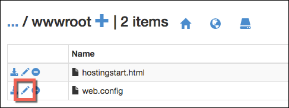

<properties
    pageTitle="保護您的應用程式的自訂網域 HTTPS |Microsoft Azure"
    description="瞭解如何安全自訂網域名稱用於您的應用程式中 Azure 應用程式服務所設定的 SSL 憑證繫結。 您也會學習如何從多個工具取得 SSL 憑證。"
    services="app-service"
    documentationCenter=".net"
    authors="cephalin"
    manager="wpickett"
    editor="jimbe"
    tags="top-support-issue"/>

<tags
    ms.service="app-service"
    ms.workload="na"
    ms.tgt_pltfrm="na"
    ms.devlang="na"
    ms.topic="article"
    ms.date="08/08/2016"
    ms.author="cephalin"/>

# 保護您的應用程式的自訂網域 HTTPS

> [AZURE.SELECTOR]
- [購買 Azure 中的 SSL 憑證](web-sites-purchase-ssl-web-site.md)
- [從其他地方使用 SSL 憑證](web-sites-configure-ssl-certificate.md)

本文將示範如何啟用 HTTPS 的 web 應用程式、 行動應用程式後端或 API 應用程式中使用自訂網域名稱的[Azure 應用程式服務](../app-service/app-service-value-prop-what-is.md)。 矩形-僅在伺服器上執行的驗證。 如果您需要相互驗證 （包括用戶端驗證），請參閱[如何以設定 TLS 相互驗證應用程式服務](app-service-web-configure-tls-mutual-auth.md)。

若要保護 https 應用程式的自訂網域名稱，您可以新增該網域名稱的憑證。 根據預設，保護 Azure ** \*。 azurewebsites.net**單一的 SSL 憑證，您的用戶端已經可以存取您的應用程式，使用萬用字元網域**https://*&lt;應用程式名稱 >*。 azurewebsites.net**。但如果您想要使用自訂網域，例如**contoso.com**， **www.contoso.com**，及** \*。 contoso.com**，預設的憑證不安全的。 此外，所有的[萬用字元憑證](https://casecurity.org/2014/02/26/pros-and-cons-of-single-domain-multi-domain-and-wildcard-certificates/)，例如的預設憑證不安全的自訂網域使用自訂網域和憑證。   

>[AZURE.NOTE] 您可以從 Azure 專家隨時在[Azure 論壇](https://azure.microsoft.com/support/forums/)上取得協助。 如需更多個人化的支援，請移至[Azure 支援](https://azure.microsoft.com/support/options/)，然後按一下 [**取得支援**。

## 您的需要
若要保護您的自訂網域名稱，以 HTTPS，您可以結合自訂的 SSL 憑證至 Azure 中的自訂網域。 之前繫結自訂的憑證，您必須執行下列動作︰

- **設定自訂網域**應用程式服務只允許新增您的應用程式中已設定的網域名稱的憑證。 如需相關指示，請參閱[對應至 Azure 應用程式的自訂網域名稱](web-sites-custom-domain-name.md)。 
- **不按比例縮放基本層或更新版本**在下層價格的應用程式服務方案不支援自訂的 SSL 憑證。 如需相關指示，請參閱[不按比例縮放設定 Azure 中的應用程式](web-sites-scale.md)。 
- 您需要取得從信任的[憑證授權單位](http://en.wikipedia.org/wiki/Certificate_authority)(CA)**取得 SSL 憑證**-如果您還沒有其中一個。 憑證必須符合下列所有需求︰

    - 已簽署的信任的 CA （沒有私人 CA 伺服器）。
    - 其中包含私人的識別碼。
    - 建立索引鍵的 exchange，並匯入至。PFX 檔案。
    - 它會使用 2048年位元加密的最小值。
    - 主旨名稱比對需要安全的自訂網域。 若要安全一個憑證的多個網域，您需要使用萬用字元的名稱 (例如**\*。 contoso.com**) 或指定 subjectAltName 值。
    - 與您的 CA 所用的所有**[中繼憑證](http://en.wikipedia.org/wiki/Intermediate_certificate_authorities)**合併。 否則，您可能會在某些用戶端上執行 irreproducible 互通性問題。

        >[AZURE.NOTE] 取得 SSL 憑證符合所有需求的最簡單的方法是        [購買一個直接 Azure 入口網站](web-sites-purchase-ssl-web-site.md)。 本文將示範如何手動操作，然後再將其連結至您的自訂網域，在應用程式服務。
        >   
        > 使用應用程式服務，但本文的範圍之外，就可以使用**橢圓曲線加密 (ECC) 憑證**。 使用 ca 建立 ECC 憑證的確切步驟。

## 步驟 1。 取得 SSL 憑證

由於 Ca 提供各種的 SSL 憑證類型不同價格點，您應該先決定哪些類型的 SSL 憑證購買。 若要保護單一的網域名稱 (**www.contoso.com**)，您只需要基本的憑證。 若要安全性多個網域名稱 (**contoso.com** *和* **www.contoso.com** 
*和* **mail.contoso.com**)，您需要[萬用字元憑證](http://en.wikipedia.org/wiki/Wildcard_certificate)或[主旨](http://en.wikipedia.org/wiki/SubjectAltName)的替代名稱的憑證 (`subjectAltName`)。

一旦您知道購買的 SSL 憑證，您送出憑證簽署要求 (CSR) ca。 當您返回要求的憑證 ca 時，然後會產生.pfx 檔從憑證。 您可以執行下列步驟使用您所選擇的工具。 以下是常見的工具的相關指示︰

- [Certreq.exe 步驟](#bkmk_certreq)-Windows 公用程式建立的憑證要求。 從 Windows XP/Windows Server 2000 已經 Windows 的一部分。
- [IIS 管理員步驟](#bkmk_iismgr)-如果您已經熟悉它所選擇的工具。
- [OpenSSL 步驟](#bkmk_openssl)-[開啟來源、 跨平台的工具](https://www.openssl.org)。 您可以使用它來協助您從任何平台取得 SSL 憑證。
- [使用 OpenSSL subjectAltName 步驟](#bkmk_subjectaltname)-步驟快速`subjectAltName`憑證。

如果您想要測試應用程式服務中的設定之前購買憑證，您可以產生[自我簽署的憑證](https://en.wikipedia.org/wiki/Self-signed_certificate)。 本教學課程中會提供您兩種方式產生它︰

- [自我簽署的憑證，Certreq.exe 步驟](#bkmk_sscertreq)
- [自我簽署的憑證，OpenSSL 步驟](#bkmk_ssopenssl)

### 取得使用 Certreq.exe 憑證

1. 建立檔案 (例如**myrequest.txt**)，並將其複製下列的文字，並儲存工作目錄中。 取代`<your-domain>`與您的應用程式的自訂網域名稱的預留位置。

        [NewRequest]
        Subject = "CN=<your-domain>"  ; E.g. "CN=www.contoso.com", or "CN=*.contoso.com" for a wildcard certificate
        Exportable = TRUE
        KeyLength = 2048              ; Required minimum is 2048
        KeySpec = 1
        KeyUsage = 0xA0
        MachineKeySet = True
        ProviderName = "Microsoft RSA SChannel Cryptographic Provider"
        ProviderType = 12
        HashAlgorithm = SHA256

        [EnhancedKeyUsageExtension]
        OID=1.3.6.1.5.5.7.3.1         ; Server Authentication

    如需有關 CSR 中的選項及其他可用的選項的詳細資訊，請參閱[Certreq 參考文件](https://technet.microsoft.com/library/dn296456.aspx)。

4. 在命令提示字元`CD`到您的工作目錄，然後執行下列命令以建立 CSR:

        certreq -new myrequest.txt myrequest.csr

    **myrequest.csr**現在會建立在您目前的工作目錄中。

5. 送出**myrequest.csr** ca 取得 SSL 憑證。 您上傳檔案，或將其內容複製到 web 表單文字編輯器。

    Microsoft 受信任的 Ca 的清單，請參閱[Microsoft 受信任的根憑證計︰ 參與者][cas]。

6. 一旦 CA 回覆給您的憑證 (。CER) 檔案，儲存在您的工作目錄中。 然後，執行下列命令以完成擱置的 CSR。

        certreq -accept -user <certificate-name>.cer

    這個命令會將完成的憑證存放在 Windows 憑證存放區。

6. 如果您的 CA 使用中繼憑證，請安裝他們再繼續進行。 通常他們分別下載從 CA，並在不同的網頁伺服器類型的數種格式。 Microsoft iis 中選取的版本。

    在您下載憑證，以滑鼠右鍵按一下每個 Windows 檔案總管中，然後選取 [ **安裝憑證**。 在**憑證匯入精靈**中，使用預設值，然後繼續進行匯入已完成，直到選取 [**下一步**。

7. 若要匯出的憑證存放區中的 SSL 憑證，請按`Win` + `R`及執行**certmgr.msc**啟動憑證管理員。 選取 [**個人** > **憑證**。 在**發行給**] 欄中，您應該會看到您的自訂網域名稱，與您用來產生的憑證**簽發者**] 欄中的項目。

    ![插入憑證管理員 」 的圖像][certmgr]

9. 以滑鼠右鍵按一下該憑證，然後選取 [**所有工作** > **匯出**。 在**憑證匯出精靈]**中，按一下 [**下一步**，選取 [**是]，匯出私密金鑰**，然後再按一下 [**下一步**]。

    ![匯出私密金鑰][certwiz1]

10. 選取 [**個人資訊交換 PKCS #12**、**包含所有憑證的憑證路徑如果可以的話**，及**匯出所有的擴充的屬性**。 然後，請按一下 [**下一步**]。

    ![包含所有的憑證和擴充的屬性][certwiz2]

11. 選取 [**密碼**]，然後輸入並確認密碼。 按一下 [**下一步**]。

    ![指定密碼][certwiz3]

12. 匯出憑證，與副檔名**.pfx**提供路徑和檔名。 按一下 [**下一步**可完成。

    ![提供檔案的路徑][certwiz4]

您已準備好要匯出的 PFX 檔案上傳至應用程式服務。 請參閱[步驟 2。上傳並繫結自訂的 SSL 憑證](#bkmk_configuressl)。

### 取得使用 IIS 管理員的憑證

1. 產生 CSR 使用 IIS 管理員傳送給 CA。 產生 CSR 的詳細資訊，請參閱[要求網際網路伺服器的憑證 (IIS 7)][iiscsr]。

3. 提交您的 CSR ca 取得 SSL 憑證。 Microsoft 受信任的 Ca 的清單，請參閱[Microsoft 受信任的根憑證計︰ 參與者][cas]。

3. 完成 CSR CA 會傳送給您的憑證。 如需有關如何完成 CSR 的詳細資訊，請參閱[安裝網際網路伺服器憑證 (IIS 7)][installcertiis]。

4. 如果您的 CA 使用中繼憑證，請安裝他們再繼續進行。 通常他們分別下載從 CA，並在不同的網頁伺服器類型的數種格式。 Microsoft iis 中選取的版本。

    在您下載憑證，以滑鼠右鍵按一下每個 Windows 檔案總管中，然後選取 [**安裝憑證**。 
    在**憑證匯入精靈**中，使用預設值，然後繼續進行匯入已完成，直到選取 [**下一步**。

4. 將 SSL 憑證匯出從 IIS 管理員。 匯出憑證的詳細資訊，請參閱[匯出伺服器憑證 (IIS 7)][exportcertiis]。 

    >[AZURE.IMPORTANT] 在**憑證匯出精靈**]，請確定您選取**[是]，匯出私密金鑰**  
    >
    >![匯出私密金鑰][certwiz1]  
    >
    > 然後也選取 [**個人資訊交換 PKCS #12****包含所有憑證的憑證路徑如果可以的話**，請與    **匯出所有的擴充的屬性**。
    >
    >![包含所有的憑證和擴充的屬性][certwiz2]

您已準備好要匯出的 PFX 檔案上傳至應用程式服務。 請參閱[步驟 2。上傳並繫結自訂的 SSL 憑證](#bkmk_configuressl)。

### 取得使用 OpenSSL 憑證

1. 在命令列 terminal 中，`CD`到工作目錄產生私密金鑰與 CSR 藉由執行下列命令︰

        openssl req -sha256 -new -nodes -keyout myserver.key -out server.csr -newkey rsa:2048

2. 出現提示時，輸入適當的資訊。 例如︰

        Country Name (2 letter code)
        State or Province Name (full name) []: Washington
        Locality Name (eg, city) []: Redmond
        Organization Name (eg, company) []: Microsoft
        Organizational Unit Name (eg, section) []: Azure
        Common Name (eg, YOUR name) []: www.microsoft.com
        Email Address []:

        Please enter the following 'extra' attributes to be sent with your certificate request

        A challenge password []:

    完成後，您應該使用目錄中有兩個檔案︰ **myserver.key**和**server.csr**。 
    **Server.csr**包含 CSR，而且您需要**myserver.key**更新版本。

3. 提交您的 CSR ca 取得 SSL 憑證。 Microsoft 受信任的 Ca 的清單，請參閱[Microsoft 受信任的根憑證計︰ 參與者][cas]。

4. 一旦 CA 傳送給您要求的憑證，請將其儲存到名稱為**myserver.crt**工作目錄中的檔案。 如果您的 CA 提供文字格式，只要將內容複製到**myserver.crt**文字編輯器中，並將其儲存。 您的檔案應該如下所示︰

        -----BEGIN CERTIFICATE-----
        MIIDJDCCAgwCCQCpCY4o1LBQuzANBgkqhkiG9w0BAQUFADBUMQswCQYDVQQGEwJV
        UzELMAkGA1UECBMCV0ExEDAOBgNVBAcTB1JlZG1vbmQxEDAOBgNVBAsTB0NvbnRv
        c28xFDASBgNVBAMTC2NvbnRvc28uY29tMB4XDTE0MDExNjE1MzIyM1oXDTE1MDEx
        NjE1MzIyM1owVDELMAkGA1UEBhMCVVMxCzAJBgNVBAgTAldBMRAwDgYDVQQHEwdS
        ZWRtb25kMRAwDgYDVQQLEwdDb250b3NvMRQwEgYDVQQDEwtjb250b3NvLmNvbTCC
        ASIwDQYJKoZIhvcNAQEBBQADggEPADCCAQoCggEBAN96hBX5EDgULtWkCRK7DMM3
        enae1LT9fXqGlbA7ScFvFivGvOLEqEPD//eLGsf15OYHFOQHK1hwgyfXa9sEDPMT
        3AsF3iWyF7FiEoR/qV6LdKjeQicJ2cXjGwf3G5vPoIaYifI5r0lhgOUqBxzaBDZ4
        xMgCh2yv7NavI17BHlWyQo90gS2X5glYGRhzY/fGp10BeUEgIs3Se0kQfBQOFUYb
        ktA6802lod5K0OxlQy4Oc8kfxTDf8AF2SPQ6BL7xxWrNl/Q2DuEEemjuMnLNxmeA
        Ik2+6Z6+WdvJoRxqHhleoL8ftOpWR20ToiZXCPo+fcmLod4ejsG5qjBlztVY4qsC
        AwEAATANBgkqhkiG9w0BAQUFAAOCAQEAVcM9AeeNFv2li69qBZLGDuK0NDHD3zhK
        Y0nDkqucgjE2QKUuvVSPodz8qwHnKoPwnSrTn8CRjW1gFq5qWEO50dGWgyLR8Wy1
        F69DYsEzodG+shv/G+vHJZg9QzutsJTB/Q8OoUCSnQS1PSPZP7RbvDV9b7Gx+gtg
        7kQ55j3A5vOrpI8N9CwdPuimtu6X8Ylw9ejWZsnyy0FMeOPpK3WTkDMxwwGxkU3Y
        lCRTzkv6vnHrlYQxyBLOSafCB1RWinN/slcWSLHADB6R+HeMiVKkFpooT+ghtii1
        A9PdUQIhK9bdaFicXPBYZ6AgNVuGtfwyuS5V6ucm7RE6+qf+QjXNFg==
        -----END CERTIFICATE-----

5. 在命令列 terminal 中，執行下列命令以**myserver.pfx**匯出**myserver.key**和**myserver.crt**:

        openssl pkcs12 -export -out myserver.pfx -inkey myserver.key -in myserver.crt

    出現提示時，可定義密碼來保護.pfx 檔。

    > [AZURE.NOTE] 如果您的 CA 使用中繼憑證，您必須包含這些與`-certfile`參數。 通常他們分別下載從 CA，並在不同的網頁伺服器類型的數種格式。 選取具有版本`.pem`副檔名。
    >
    > 您`openssl -export`命令看起來應該像下列範例中，建立包含從**中繼 cets.pem**檔案中繼憑證.pfx 檔︰
    >  
    > `openssl pkcs12 -chain -export -out myserver.pfx -inkey myserver.key -in myserver.crt -certfile intermediate-cets.pem`

您已準備好要匯出的 PFX 檔案上傳至應用程式服務。 請參閱[步驟 2。上傳並繫結自訂的 SSL 憑證](#bkmk_configuressl)。

### 取得使用 OpenSSL SubjectAltName 憑證

1. 建立一個名為**sancert.cnf**檔案、 將，複製下列文字和儲存的工作目錄︰

        # -------------- BEGIN custom sancert.cnf -----
        HOME = .
        oid_section = new_oids
        [ new_oids ]
        [ req ]
        default_days = 730
        distinguished_name = req_distinguished_name
        encrypt_key = no
        string_mask = nombstr
        req_extensions = v3_req # Extensions to add to certificate request
        [ req_distinguished_name ]
        countryName = Country Name (2 letter code)
        countryName_default =
        stateOrProvinceName = State or Province Name (full name)
        stateOrProvinceName_default =
        localityName = Locality Name (eg, city)
        localityName_default =
        organizationalUnitName  = Organizational Unit Name (eg, section)
        organizationalUnitName_default  =
        commonName              = Your common name (eg, domain name)
        commonName_default      = www.mydomain.com
        commonName_max = 64
        [ v3_req ]
        subjectAltName=DNS:ftp.mydomain.com,DNS:blog.mydomain.com,DNS:*.mydomain.com
        # -------------- END custom sancert.cnf -----

    在行的開頭`subjectAltName`，此值取代所有您想要安全的網域名稱 (除了 `commonName`)。 例如︰

        subjectAltName=DNS:sales.contoso.com,DNS:support.contoso.com,DNS:fabrikam.com

    您不需要變更任何其他欄位，包括`commonName`。 系統會提示您在接下來的步驟中加以指定。

1. 在命令列 terminal 中，`CD`到您的工作目錄，然後執行下列命令︰

        openssl req -sha256 -new -nodes -keyout myserver.key -out server.csr -newkey rsa:2048 -config sancert.cnf

2. 出現提示時，輸入適當的資訊。 例如︰

        Country Name (2 letter code) []: US
        State or Province Name (full name) []: Washington
        Locality Name (eg, city) []: Redmond
        Organizational Unit Name (eg, section) []: Azure
        Your common name (eg, domain name) []: www.microsoft.com

    完成之後，您應該使用目錄中有兩個檔案︰ **myserver.key**和**server.csr**。 
    **Server.csr**包含 CSR，而且您需要**myserver.key**更新版本。

3. 提交您的 CSR ca 取得 SSL 憑證。 Microsoft 受信任的 Ca 的清單，請參閱[Microsoft 受信任的根憑證計︰ 參與者][cas]。

4. 一旦 CA 傳送給您要求的憑證，請將其儲存到名稱為**myserver.crt**的檔案。 如果您的 CA 提供文字格式，只要將內容複製到**myserver.crt**文字編輯器中，並將其儲存。 檔案應該如下所示︰

        -----BEGIN CERTIFICATE-----
        MIIDJDCCAgwCCQCpCY4o1LBQuzANBgkqhkiG9w0BAQUFADBUMQswCQYDVQQGEwJV
        UzELMAkGA1UECBMCV0ExEDAOBgNVBAcTB1JlZG1vbmQxEDAOBgNVBAsTB0NvbnRv
        c28xFDASBgNVBAMTC2NvbnRvc28uY29tMB4XDTE0MDExNjE1MzIyM1oXDTE1MDEx
        NjE1MzIyM1owVDELMAkGA1UEBhMCVVMxCzAJBgNVBAgTAldBMRAwDgYDVQQHEwdS
        ZWRtb25kMRAwDgYDVQQLEwdDb250b3NvMRQwEgYDVQQDEwtjb250b3NvLmNvbTCC
        ASIwDQYJKoZIhvcNAQEBBQADggEPADCCAQoCggEBAN96hBX5EDgULtWkCRK7DMM3
        enae1LT9fXqGlbA7ScFvFivGvOLEqEPD//eLGsf15OYHFOQHK1hwgyfXa9sEDPMT
        3AsF3iWyF7FiEoR/qV6LdKjeQicJ2cXjGwf3G5vPoIaYifI5r0lhgOUqBxzaBDZ4
        xMgCh2yv7NavI17BHlWyQo90gS2X5glYGRhzY/fGp10BeUEgIs3Se0kQfBQOFUYb
        ktA6802lod5K0OxlQy4Oc8kfxTDf8AF2SPQ6BL7xxWrNl/Q2DuEEemjuMnLNxmeA
        Ik2+6Z6+WdvJoRxqHhleoL8ftOpWR20ToiZXCPo+fcmLod4ejsG5qjBlztVY4qsC
        AwEAATANBgkqhkiG9w0BAQUFAAOCAQEAVcM9AeeNFv2li69qBZLGDuK0NDHD3zhK
        Y0nDkqucgjE2QKUuvVSPodz8qwHnKoPwnSrTn8CRjW1gFq5qWEO50dGWgyLR8Wy1
        F69DYsEzodG+shv/G+vHJZg9QzutsJTB/Q8OoUCSnQS1PSPZP7RbvDV9b7Gx+gtg
        7kQ55j3A5vOrpI8N9CwdPuimtu6X8Ylw9ejWZsnyy0FMeOPpK3WTkDMxwwGxkU3Y
        lCRTzkv6vnHrlYQxyBLOSafCB1RWinN/slcWSLHADB6R+HeMiVKkFpooT+ghtii1
        A9PdUQIhK9bdaFicXPBYZ6AgNVuGtfwyuS5V6ucm7RE6+qf+QjXNFg==
        -----END CERTIFICATE-----

5. 在命令列 terminal 中，執行下列命令以**myserver.pfx**匯出**myserver.key**和**myserver.crt**:

        openssl pkcs12 -export -out myserver.pfx -inkey myserver.key -in myserver.crt

    出現提示時，可定義密碼來保護.pfx 檔。

    > [AZURE.NOTE] 如果您的 CA 使用中繼憑證，您必須包含這些與`-certfile`參數。 通常他們分別下載從 CA，並在不同的網頁伺服器類型的數種格式。 選取具有版本`.pem`副檔名)。
    >
    > 您`openssl -export`命令看起來應該像下列範例中，建立包含從**中繼 cets.pem**檔案中繼憑證.pfx 檔︰
    >  
    > `openssl pkcs12 -chain -export -out myserver.pfx -inkey myserver.key -in myserver.crt -certfile intermediate-cets.pem`

您已準備好要匯出的 PFX 檔案上傳至應用程式服務。 請參閱[步驟 2。上傳並繫結自訂的 SSL 憑證](#bkmk_configuressl)。

### 產生使用 Certreq.exe 自我簽署的憑證 ###

>[AZURE.IMPORTANT] 自我簽署的憑證的僅供測試。 瀏覽自我簽署憑證受保護的網站時，大部分的瀏覽器會傳回錯誤。 即使可能拒絕某些瀏覽器中瀏覽至網站。 

1. 文字檔案 (例如**mycert.txt**)、 將下列的文字，複製到其中建立與儲存檔案的工作目錄。 取代`<your-domain>`與您的應用程式的自訂網域名稱的預留位置。

        [NewRequest]
        Subject = "CN=<your-domain>"  ; E.g. "CN=www.contoso.com", or "CN=*.contoso.com" for a wildcard certificate
        Exportable = TRUE
        KeyLength = 2048              ; KeyLength can be 2048, 4096, 8192, or 16384 (required minimum is 2048)
        KeySpec = 1
        KeyUsage = 0xA0
        MachineKeySet = True
        ProviderName = "Microsoft RSA SChannel Cryptographic Provider"
        ProviderType = 12
        HashAlgorithm = SHA256
        RequestType = Cert            ; Self-signed certificate
        ValidityPeriod = Years
        ValidityPeriodUnits = 1

        [EnhancedKeyUsageExtension]
        OID=1.3.6.1.5.5.7.3.1         ; Server Authentication

    重要的參數是`RequestType = Cert`，以指定自我簽署的憑證。 
    如需有關 CSR 中的選項及其他可用的選項的詳細資訊，請參閱[Certreq 參考文件](https://technet.microsoft.com/library/dn296456.aspx)。

4. 在命令提示字元中，`CD`您的工作目錄及執行下列命令︰

        certreq -new mycert.txt mycert.crt
    
    您的新自我簽署的憑證現在已安裝的憑證存放區。

7. 若要匯出的憑證存放區中的憑證，請按`Win` + `R`並執行**certmgr.msc**啟動憑證管理員。 選取 [**個人** > **憑證**。 在**發行給**] 欄中，您應該會看到您的自訂網域名稱，與您用來產生的憑證**簽發者**] 欄中的項目。

    ![插入憑證管理員 」 的圖像][certmgr]

9. 以滑鼠右鍵按一下該憑證，然後選取 [**所有工作** > **匯出**。 在**憑證匯出精靈]**中，按一下 [**下一步**，選取 [**是]，匯出私密金鑰**，然後再按一下 [**下一步**]。

    ![匯出私密金鑰][certwiz1]

10. 選取 [**個人資訊交換 PKCS #12**、**包含所有憑證的憑證路徑如果可以的話**，及**匯出所有的擴充的屬性**。 然後，請按一下 [**下一步**]。

    ![包含所有的憑證和擴充的屬性][certwiz2]

11. 選取 [**密碼**]，然後輸入並確認密碼。 按一下 [**下一步**]。

    ![指定密碼][certwiz3]

12. 匯出憑證，與副檔名**.pfx**提供路徑和檔名。 按一下 [**下一步**可完成。

    ![提供檔案的路徑][certwiz4]

您已準備好要匯出的 PFX 檔案上傳至應用程式服務。 請參閱[步驟 2。上傳並繫結自訂的 SSL 憑證](#bkmk_configuressl)。

###產生使用 OpenSSL 自我簽署的憑證 ###

>[AZURE.IMPORTANT] 自我簽署的憑證的僅供測試。 瀏覽自我簽署憑證受保護的網站時，大部分的瀏覽器會傳回錯誤。 即使可能拒絕某些瀏覽器中瀏覽至網站。 

1. 建立命名**serverauth.cnf**的文字檔案，然後將下列內容複製到，然後將其儲存工作目錄中︰

        [ req ]
        default_bits           = 2048
        default_keyfile        = privkey.pem
        distinguished_name     = req_distinguished_name
        attributes             = req_attributes
        x509_extensions        = v3_ca

        [ req_distinguished_name ]
        countryName         = Country Name (2 letter code)
        countryName_min         = 2
        countryName_max         = 2
        stateOrProvinceName     = State or Province Name (full name)
        localityName            = Locality Name (eg, city)
        0.organizationName      = Organization Name (eg, company)
        organizationalUnitName      = Organizational Unit Name (eg, section)
        commonName          = Common Name (eg, your app's domain name)
        commonName_max          = 64
        emailAddress            = Email Address
        emailAddress_max        = 40

        [ req_attributes ]
        challengePassword       = A challenge password
        challengePassword_min       = 4
        challengePassword_max       = 20

        [ v3_ca ]
         subjectKeyIdentifier=hash
         authorityKeyIdentifier=keyid:always,issuer:always
         basicConstraints = CA:false
         keyUsage=nonRepudiation, digitalSignature, keyEncipherment
         extendedKeyUsage = serverAuth

2. 在命令列 terminal 中，`CD`到您的工作目錄，然後執行下列命令︰

        openssl req -sha256 -x509 -nodes -days 365 -newkey rsa:2048 -keyout myserver.key -out myserver.crt -config serverauth.cnf

    這個命令會建立兩個檔案︰ **myserver.crt** （自我簽署憑證） 和**myserver.key** （私密金鑰），根據**serverauth.cnf**的設定。

3. 匯出至.pfx 檔的憑證，藉由執行下列命令︰

        openssl pkcs12 -export -out myserver.pfx -inkey myserver.key -in myserver.crt

    出現提示時，可定義密碼來保護.pfx 檔。

您已準備好要匯出的 PFX 檔案上傳至應用程式服務。 請參閱[步驟 2。上傳並繫結自訂的 SSL 憑證](#bkmk_configuressl)。

## 步驟 2。 上傳並繫結自訂的 SSL 憑證

您在上移動之前，檢閱[您的需要](#bkmk_domainname)] 區段，並確認︰

- 您有對應至 Azure 應用程式的自訂網域
- 您的應用程式執行**基本**層或更高，和
- 您有自訂網域從 CA 的 SSL 憑證。

1. 在瀏覽器中，開啟 [ ** [Azure 入口網站。](https://portal.azure.com/)**
2.  按一下 [左側的**應用程式服務**選項的頁面]。
3.  按一下您要指派這個憑證的應用程式的名稱。 
4.  在**設定**]，按一下 [ **SSL 憑證**
5.  按一下 [**上傳的憑證**
6.  [步驟 1](#bkmk_getcert)中選取您匯出.pfx 檔，然後指定您之前先建立的密碼。 然後按一下 [上傳憑證的 [**上傳**]。 您現在應該會看到回**SSL 憑證**刀您上傳的憑證。
7. 在**ssl 繫結**] 區段中的，按一下 [**新增連結**
8. 在**新增 SSL 繫結**刀使用下拉式清單，選取要與 SSL 憑證使用安全的網域名稱。 您也可以選取是否要使用 [**[伺服器名稱的指示 (SNI)](http://en.wikipedia.org/wiki/Server_Name_Indication)** ，或以 SSL IP。

    

       •    IP based SSL associates a certificate with a domain name by mapping the dedicated public IP address of the server to the domain name. This requires each domain name (contoso.com, fabricam.com, etc.) associated with your service to have a dedicated IP address. This is the traditional          method of associating SSL certificates with a web server.
       •    SNI based SSL is an extension to SSL and **[Transport Layer Security](http://en.wikipedia.org/wiki/Transport_Layer_Security)** (TLS) that allows multiple domains to share the same IP address, with separate security certificates for each domain. Most modern browsers (including Internet Explorer, Chrome, Firefox and Opera) support SNI, however older browsers may not support SNI. For more information on SNI, see the **[Server Name Indication](http://en.wikipedia.org/wiki/Server_Name_Indication)** article on Wikipedia.
     
9. 按一下 [**新增繫結**至儲存變更，並啟用 SSL]。

## 步驟 3。 變更 （以 IP SSL 只） 您網域的名稱對應

如果您使用只**SNI SSL**繫結，略過此區段。 多個**SNI SSL**繫結共同處理指派給您的應用程式的現有共用 IP 位址。 不過，如果您建立**以 SSL IP**繫結時，應用程式服務建立繫結固定的 IP 位址因為**IP 基礎 SSL**的需要。 只有一個專用的 IP 位址可建立，因此可能會新增一個**IP 基礎 SSL**的繫結。

由於此專用的 IP 位址，您必須設定您的應用程式中進一步，如︰

- 您[使用 A 記錄，將您的自訂網域的對應](web-sites-custom-domain-name.md#a)Azure 應用程式，以及您剛才新增**IP 基礎 SSL**的繫結。 在此案例中，您需要重新對應現有記錄以指向專用的 IP 位址，遵循下列步驟︰

    1. 您已設定後 IP SSL 繫結，固定的 IP 位址已指派給您的應用程式。 您可以在 [設定您的應用程式，上面 [**主機名稱**] 區段底下的 [**自訂網域**] 頁面上尋找這個 IP 位址。 會列為**外部 IP 位址**
    
        

    2. [重新對應的 A 記錄，以您的自訂網域名稱，這個新的 IP 位址](web-sites-custom-domain-name.md#a)。

- 您的應用程式中已經有一個或多個**SNI SSL**繫結與您剛才新增的**IP 基礎 SSL**的繫結。 繫結完成之後，您*&lt;應用程式名稱 >*。 azurewebsites.net 網域名稱點，以新的 IP 位址。 因此，任何現有的[自訂網域的 CNAME 對應](web-sites-custom-domain-name.md#cname)至*&lt;應用程式名稱 >*。 azurewebsites.net，包括**SNI SSL**安全，也會收到新的地址]，**以 SSL IP**只自動建立的流量。 在此案例中，您需要傳送**SNI SSL**流量回到原始的共用 IP 位址，遵循下列步驟︰

    1. 找出所有[的自訂網域的 CNAME 對應](web-sites-custom-domain-name.md#cname)到您的**SNI SSL**繫結的應用程式。

    2. 重新對應至每個 CNAME 記錄**sni。**&lt;應用程式名稱 >。 而不是 azurewebsites.net&lt;應用程式名稱 >。 azurewebsites.net。

## 步驟 4。 HTTPS 測試您的自訂網域

所有還現在可以確定 HTTPS 適合您的自訂網域。 在各種不同的瀏覽器中，瀏覽至`https://<your.custom.domain>`以查看其提供您的應用程式。

- 如果您的應用程式可讓您憑證驗證錯誤，您可能會使用自我簽署的憑證。

- 如果不是這樣，您可能會有遺漏中繼憑證匯出您.pfx 的憑證。 回到[您的需要](#bkmk_domainname)驗證您的 CSR 符合所有應用程式服務的需求。

## 在您的應用程式上強制 HTTPS

若要允許 HTTP 存取您的應用程式，略過此步驟。 應用程式服務並*不*強制 HTTPS，讓訪客仍然可以存取您的應用程式使用 HTTP。 如果您想要強迫 HTTPS 應用程式，您可以定義中的好規則`web.config`應用程式的檔案。 每個應用程式服務應用程式具有此檔案，不論您的應用程式的語言架構。

> [AZURE.NOTE] 沒有特定語言的重新導向的要求。 ASP.NET MVC 可以使用 [ [RequireHttps](http://msdn.microsoft.com/library/system.web.mvc.requirehttpsattribute.aspx)篩選，而不是好規則`web.config`（請參閱[部署至 web app 的安全 ASP.NET MVC 5 應用程式](web-sites-dotnet-deploy-aspnet-mvc-app-membership-oauth-sql-database.md)）。

請遵循下列步驟︰

1. 瀏覽至 Kudu 偵錯主控台應用程式。 其地址是`https://<appname>.scm.azurewebsites.net/DebugConsole`。

2. 在偵錯主控台，CD 以`D:\home\site\wwwroot`。

3. 開啟`web.config`按一下 [鉛筆] 按鈕。

    

    如果您部署與 Visual Studio 或給您的應用程式時，應用程式服務會自動產生的適當`web.config`.NET、 PHP、 Node.js 或 Python 應用程式中的應用程式根目錄。 
    如果`web.config`不存在，執行`touch web.config`建立的 web 式命令提示字元。 或者，您可以在本機專案中建立並重新部署您的程式碼。

4. 如果您有建立`web.config`，複製下列程式碼，並將其儲存。 如果您開啟現有的 web.config，那麼您只需要將複製整個`<rule>`標記到您`web.config`的`configuration/system.webServer/rewrite/rules`項目。

        <?xml version="1.0" encoding="UTF-8"?>
        <configuration>
          <system.webServer>
            <rewrite>
              <rules>
                <!-- BEGIN rule TAG FOR HTTPS REDIRECT -->
                <rule name="Force HTTPS" enabled="true">
                  <match url="(.*)" ignoreCase="false" />
                  <conditions>
                    <add input="{HTTPS}" pattern="off" />
                  </conditions>
                  <action type="Redirect" url="https://{HTTP_HOST}/{R:1}" appendQueryString="true" redirectType="Permanent" />
                </rule>
                <!-- END rule TAG FOR HTTPS REDIRECT -->
              </rules>
            </rewrite>
          </system.webServer>
        </configuration>

    此規則的 HTTPS 通訊協定傳回 HTTP 301 （永久重新導向），當使用者要求使用 HTTP 的頁面。 它會重新導向從 http://contoso.com https://contoso.com。

    >[AZURE.IMPORTANT] 如果有其他已經`<rule>`在標記您`web.config`，然後將 [複製`<rule>`之前其他標籤`<rule>`標籤。

4. 將檔案儲存 Kudu 偵錯主控台。 應該花效果立即將所有要求重新都導向至 HTTPS。

如需有關 IIS URL 重新寫入模組的詳細資訊，請參閱[URL 重新寫入](http://www.iis.net/downloads/microsoft/url-rewrite)的文件。

## 更多資源 ##
- [Microsoft Azure 信任中心](/support/trust-center/security/)
- [解除鎖定 Azure 的網站 」 中的設定選項](/blog/2014/01/28/more-to-explore-configuration-options-unlocked-in-windows-azure-web-sites/)
- [啟用診斷記錄](web-sites-enable-diagnostic-log.md)
- [設定 web 應用程式中 Azure 應用程式服務](web-sites-configure.md)
- [Azure 管理入口網站](https://manage.windowsazure.com)

>[AZURE.NOTE] 如果您想要開始使用 Azure 應用程式服務註冊 Azure 帳戶之前，請移至[嘗試應用程式服務](http://go.microsoft.com/fwlink/?LinkId=523751)，可以讓您立即建立短暫入門應用程式在應用程式服務。 必要; 沒有信用卡沒有承諾。

[customdomain]: web-sites-custom-domain-name.md
[iiscsr]: http://technet.microsoft.com/library/cc732906(WS.10).aspx
[cas]: http://social.technet.microsoft.com/wiki/contents/articles/31634.microsoft-trusted-root-certificate-program-participants-v-2016-april.aspx
[installcertiis]: http://technet.microsoft.com/library/cc771816(WS.10).aspx
[exportcertiis]: http://technet.microsoft.com/library/cc731386(WS.10).aspx
[openssl]: http://www.openssl.org/
[portal]: https://manage.windowsazure.com/
[tls]: http://en.wikipedia.org/wiki/Transport_Layer_Security
[staticip]: ./media/web-sites-configure-ssl-certificate/staticip.png
[website]: ./media/web-sites-configure-ssl-certificate/sslwebsite.png
[scale]: ./media/web-sites-configure-ssl-certificate/sslscale.png
[standard]: ./media/web-sites-configure-ssl-certificate/sslreserved.png
[pricing]: /pricing/details/
[configure]: ./media/web-sites-configure-ssl-certificate/sslconfig.png
[uploadcert]: ./media/web-sites-configure-ssl-certificate/ssluploadcert.png
[uploadcertdlg]: ./media/web-sites-configure-ssl-certificate/ssluploaddlg.png
[sslbindings]: ./media/web-sites-configure-ssl-certificate/sslbindings.png
[sni]: http://en.wikipedia.org/wiki/Server_Name_Indication
[certmgr]: ./media/web-sites-configure-ssl-certificate/waws-certmgr.png
[certwiz1]: ./media/web-sites-configure-ssl-certificate/waws-certwiz1.png
[certwiz2]: ./media/web-sites-configure-ssl-certificate/waws-certwiz2.png
[certwiz3]: ./media/web-sites-configure-ssl-certificate/waws-certwiz3.png
[certwiz4]: ./media/web-sites-configure-ssl-certificate/waws-certwiz4.png

