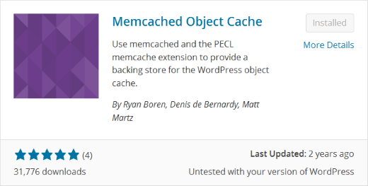
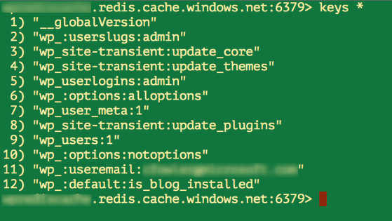

<properties
    pageTitle="連線至 Redis 快取的 web app 中 Azure 應用程式服務，透過 Memcache 通訊協定 |Microsoft Azure"
    description="Azure 應用程式服務中的 web 應用程式連線至 Redis 使用 Memcache 通訊協定的快取"
    services="app-service\web"
    documentationCenter="php"
    authors="SyntaxC4"
    manager="wpickett"
    editor="riande"/>

<tags
    ms.service="app-service-web"
    ms.devlang="php"
    ms.topic="get-started-article"
    ms.tgt_pltfrm="windows"
    ms.workload="na"
    ms.date="02/29/2016"
    ms.author="cfowler"/>

# <a name="connect-a-web-app-in-azure-app-service-to-redis-cache-via-the-memcache-protocol"></a>連線至 Redis 快取的 web app 中 Azure 應用程式服務，透過 Memcache 通訊協定

本文中，您會學習如何[Azure 應用程式服務](http://go.microsoft.com/fwlink/?LinkId=529714)中的 WordPress web 應用程式連線至[Azure Redis 快取][12]使用[Memcache] [13]通訊協定。 如果您有現有的 web 應用程式的快取記憶體內的使用 Memcached 伺服器時，您可以移轉 Azure 應用程式服務，並使用第一方快取解決方案 Microsoft Azure 中幾乎不變更您的應用程式碼。 此外，您可以使用您現有的 Memcache 專業，以建立彈性，記憶體內快取，使用常用的應用程式架構，例如.NET、 PHP、 Node.js、 Java 及 Python 時的分散式應用程式中使用 Azure Redis 快取 Azure 應用程式服務。  

應用程式服務 Web 應用程式可讓 Web 應用程式 Memcache shim，也就是本機快取的來電至 Azure Redis 快取的作為 Memcache proxy Memcached 伺服器此應用程式案例。 這可讓通訊快取資料的 Memcache 通訊協定使用 Redis 快取的任何應用程式。 此 Memcache shim 運作層級通訊協定，讓它可讓任何應用程式或應用程式架構，只要使用 Memcache 通訊協定通訊。

[AZURE.INCLUDE [app-service-web-to-api-and-mobile](../../includes/app-service-web-to-api-and-mobile.md)] 

## <a name="prerequisites"></a>必要條件

Web 應用程式 Memcache shim 可以使用任何應用程式中提供使用 Memcache 通訊協定通訊。 本範例中的參照應用程式是可以從 Azure Marketplace 佈建後，可調整 WordPress 網站。

請遵循這些文件中所述的步驟︰

* [佈建 Azure Redis 快取服務的執行個體][0]
* [部署 Azure 中的可調整 WordPress 網站][1]

您有部署可調整 WordPress 網站] 及 [佈建 Redis 快取執行個體後就可以準備繼續進行啟用 Memcache shim Azure 應用程式服務 Web 應用程式中。

## <a name="enable-the-web-apps-memcache-shim"></a>啟用 Web 應用程式 Memcache shim

若要設定 Memcache shim，您必須建立三個應用程式設定。 這可以使用各種不同的方法包括[Azure 入口網站](http://go.microsoft.com/fwlink/?LinkId=529715)，[傳統入口網站][3]， [Azure PowerShell Cmdlet] [5]或[Azure 命令列介面][5]。 為了此文章，我要使用[Azure 入口網站][4]若要設定的應用程式。 可以從**設定**刀 Redis 快取執行個體中擷取下列的值。


### <a name="add-redishost-app-setting"></a>新增 REDIS_HOST 應用程式設定

建立所需的第一個應用程式設定，則**REDIS\_主機**應用程式設定。 此設定，設定要 shim 轉寄快取資訊的目的地。 可從您 Redis 快取執行個體的**屬性**刀擷取 REDIS_HOST 應用程式設定所需的值。


設定應用程式設定的鍵**REDIS\_主機**和 Redis 快取執行個體的**主機名稱**的應用程式設定的值。


### <a name="add-rediskey-app-setting"></a>新增 REDIS_KEY 應用程式設定

建立所需的第二個應用程式設定，則**REDIS\_鍵**應用程式設定。 此設定會提供的 「 驗證 」 token 所需安全地存取 Redis 快取執行個體。 您可以擷取 Redis 快取執行個體的**便捷鍵**刀 REDIS_KEY 應用程式設定所需的值。


設定應用程式設定的鍵**REDIS\_鍵**和 Redis 快取執行個體的**主索引鍵**的應用程式設定的值。


### <a name="add-memcacheshimredisenable-app-setting"></a>新增 MEMCACHESHIM_REDIS_ENABLE 應用程式設定

最後的應用程式設定用來啟用 Memcache Shim Web 應用程式，使用 REDIS_HOST 和 REDIS_KEY 連線至 Azure Redis 快取及轉寄快取中的來電。 設定應用程式設定的鍵**MEMCACHESHIM\_REDIS\_啟用**以及為**true**的值。


在您完成新增三個 （3） 應用程式設定] 中，按一下 [**儲存]**。

## <a name="enable-memcache-extension-for-php"></a>啟用 PHP Memcache 副檔名

為了讓好說話 Memcache 通訊協定的應用程式，就必須安裝 PHP-WordPress 網站的語言架構 Memcache 副檔名。

### <a name="download-the-phpmemcache-extension"></a>下載 php_memcache 副檔名

瀏覽至[PECL][6]。 按一下 [快取] 類別] 底下的 [ [memcache][7]。 [下載] 欄中，按一下 DLL 連結。


下載 PHP 啟用 Web 應用程式中的版本的非執行緒安全 (NTS) x86 連結。 （預設為 PHP 5.4）


### <a name="enable-the-phpmemcache-extension"></a>啟用 php_memcache 副檔名

下載檔案之後，將它解壓縮。 然後上傳**php\_memcache.dll**到**d\\家用\\網站\\wwwroot\\回收筒\\分機\\**目錄。 Php_memcache.dll 上傳到 web 應用程式之後，必須先啟用延伸到 PHP 執行階段。 若要啟用 Memcache 副檔名 Azure 入口網站中的，開啟**應用程式設定**刀 web 應用程式，然後新增新的應用程式設定與索引鍵的**PHP\_副檔名**及值**筒\\分機\\php_memcache.dll**。


> [AZURE.NOTE] 如果需要載入多個 PHP 擴充 web 應用程式，PHP_EXTENSIONS 的值應該要 DLL 檔案的相對路徑以逗號分隔清單。


完成之後，請按一下 [**儲存**]。

## <a name="install-memcache-wordpress-plugin"></a>安裝 Memcache WordPress 外掛程式

> [AZURE.NOTE] 您也可以從 WordPress.org 下載[Memcached 物件快取外掛程式](https://wordpress.org/plugins/memcached/)。

在 WordPress 外掛程式] 頁面上，按一下 [**新增**]。


在 [搜尋] 方塊中輸入**memcached** ，然後按**Enter**。


在清單中，尋找**Memcached 物件快取**，然後按一下 [**立即安裝**]。



### <a name="enable-the-memcache-wordpress-plugin"></a>啟用 Memcache WordPress 外掛程式

>[AZURE.NOTE] 遵循如何[啟用網站延伸 Web 應用程式中]的 [此部落格中的指示[8]安裝 Visual Studio 小組服務。

在 [`wp-config.php`檔案中加入下列程式碼上方停止編輯檔案的結尾處的註解。

```php
$memcached_servers = array(
    'default' => array('localhost:' . getenv("MEMCACHESHIM_PORT"))
);
```

一旦將此程式碼具有貼上，摩洛哥會自動儲存文件。

下一步是啟用物件快取外掛程式。 這是藉由拖放**wp-內容/外掛程式/memcached**資料夾中的**物件 cache.php** **wp 內容**資料夾，以啟用 [Memcache 物件快取功能。


現在，**物件 cache.php**檔案**wp 內容**資料夾中，會立即啟用 Memcached 物件快取。


## <a name="verify-the-memcache-object-cache-plugin-is-functioning"></a>請確認運作 Memcache 物件快取外掛程式

若要啟用 Web 應用程式 Memcache shim 步驟就大功告成了。 驗證資料已填入您 Redis 快取的執行個體可唯一左邊。

### <a name="enable-the-non-ssl-port-support-in-azure-redis-cache"></a>啟用 Azure Redis 快取中的非 SSL 連接埠支援

>[AZURE.NOTE] 在撰寫這份文件時，Redis CLI 不支援 SSL 連線，因此下列步驟所需。

在 [Azure 入口網站中，瀏覽至您為此 web 應用程式建立的 Redis 快取執行個體。 開啟快取的刀後，按一下 [**設定**] 圖示。

![Azure Redis 快取設定] 按鈕](./media/web-sites-connect-to-redis-using-memcache-protocol/15-azure-redis-cache-settings-button.png)

從清單中選取**存取連接埠**。


按一下 [**僅透過 SSL 允許**存取 [**否**]。


您會看到現在已設定的非 SSL 連接埠。 按一下 [**儲存**]。


### <a name="connect-to-azure-redis-cache-from-redis-cli"></a>從意指 cli 連線至 Azure Redis 快取

>[AZURE.NOTE] 此步驟假設您開發的電腦上安裝該意指本機。 [安裝至本機使用這些指示意指][9]。

開啟您所選擇的命令列主控台，並輸入以下命令︰

```shell
redis-cli –h <hostname-for-redis-cache> –a <primary-key-for-redis-cache> –p 6379
```

取代**&lt;主機名稱的-意指-快取&gt;**與實際 xxxxx.redis.cache.windows.net 主機名稱和**&lt;主索引鍵-為-意指-快取&gt;**與快取便捷鍵，然後按**enter 鍵**。 一旦 CLI 連線到 Redis 快取執行個體，發佈任何意指命令。 在以下的螢幕擷取畫面，我選擇清單按鍵。



通話清單按鍵應傳回的值。 如果不是，請嘗試瀏覽至 web 應用程式，然後再試一次。

## <a name="conclusion"></a>結束時

恭喜您 ！ WordPress 應用程式現在有集中的記憶體內快取，協助您增加處理量。 請記住，無論程式設計語言或應用程式架構任何 Memcache 用戶端可以使用 Web 應用程式 Memcache Shim。 若要提供意見反應，或詢問問題 Web 應用程式 Memcache shim，張貼至[MSDN 論壇][10]或[Stackoverflow][11]。

>[AZURE.NOTE] 如果您想要開始使用 Azure 應用程式服務註冊 Azure 帳戶之前，請移至[嘗試應用程式服務](http://go.microsoft.com/fwlink/?LinkId=523751)，可以讓您立即建立短暫入門 web 應用程式在應用程式服務。 必要; 沒有信用卡沒有承諾。

## <a name="whats-changed"></a>變更的項目
* 若要變更的指南，從網站應用程式服務請參閱︰ [Azure 應用程式服務與對現有 Azure 服務的影響](http://go.microsoft.com/fwlink/?LinkId=529714)


[0]: ../redis-cache/cache-dotnet-how-to-use-azure-redis-cache.md#create-a-cache
[1]: http://bit.ly/1t0KxBQ
[2]: http://manage.windowsazure.com
[3]: http://portal.azure.com
[4]: ../powershell-install-configure.md
[5]: /downloads
[6]: http://pecl.php.net
[7]: http://pecl.php.net/package/memcache
[8]: http://blog.syntaxc4.net/post/2015/02/05/how-to-enable-a-site-extension-in-azure-websites.aspx
[9]: http://redis.io/download#installation
[10]: https://social.msdn.microsoft.com/Forums/home?forum=windowsazurewebsitespreview
[11]: http://stackoverflow.com/questions/tagged/azure-web-sites
[12]: /services/cache/
[13]: http://memcached.org
