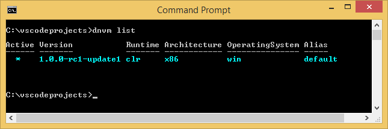
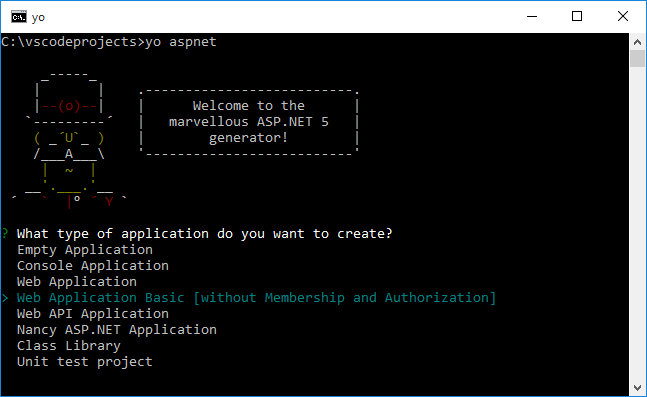
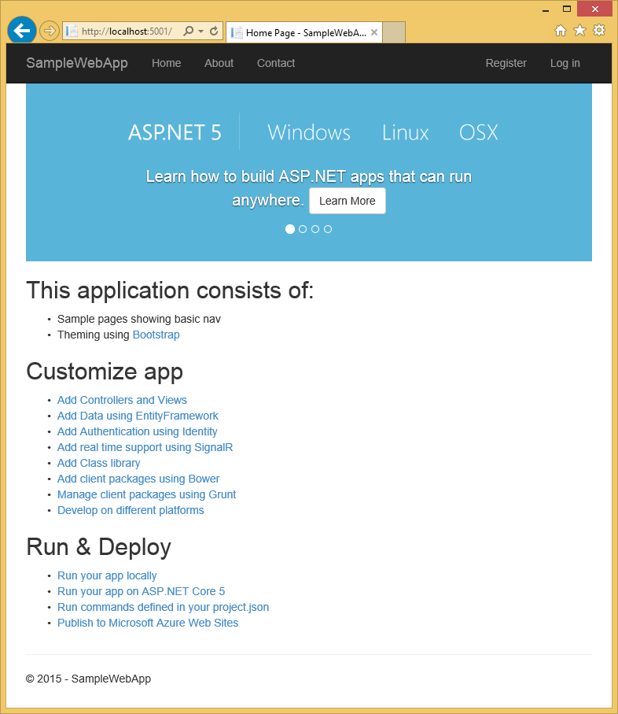
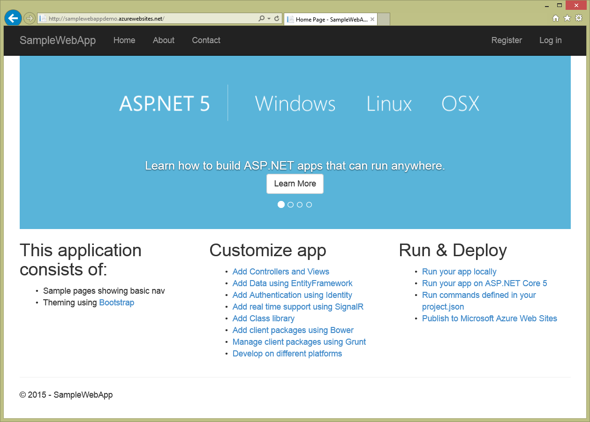

<properties
   pageTitle="在 Visual Studio 程式碼中建立 ASP.NET 5 web 應用程式"
   description="本教學課程說明如何建立使用 Visual Studio 代碼 ASP.NET 5 web 應用程式。"
   services="app-service\web"
   documentationCenter=".net"
   authors="erikre"
   manager="wpickett"
   editor="jimbe"/>

<tags
    ms.service="app-service-web" 
    ms.workload="web" 
    ms.tgt_pltfrm="dotnet" 
    ms.devlang="na" 
    ms.topic="article" 
    ms.date="02/26/2016" 
    ms.author="cephalin"/>

# 在 Visual Studio 程式碼中建立 ASP.NET 5 web 應用程式

## 概觀

本教學課程教您如何建立使用[Visual Studio 代碼 （與程式碼）](http://code.visualstudio.com//Docs/whyvscode) ASP.NET 5 web 應用程式，並將其部署至[Azure 應用程式服務](../app-service/app-service-value-prop-what-is.md)。 

> [AZURE.NOTE] 雖然這份文件指的是 web 應用程式，但也適用於 API 應用程式與行動應用程式。 

ASP.NET 5 是有效的 ASP.NET 重新設計。 ASP.NET 5 是新開啟來源和跨平台建立架構使用.NET 的現代化的雲端式 web 應用程式。 如需詳細資訊，請參閱[簡介 ASP.NET 5](http://docs.asp.net/en/latest/conceptual-overview/aspnet.html)。 Azure 應用程式服務 web 應用程式的相關資訊，請參閱[Web 應用程式概觀](app-service-web-overview.md)。

[AZURE.INCLUDE [app-service-web-try-app-service.md](../../includes/app-service-web-try-app-service.md)]

## 必要條件  

* 安裝[與程式碼](http://code.visualstudio.com/Docs/setup)。
* 安裝[Node.js](http://nodejs.org) -Node.js 是建置快速且可調整伺服器應用程式使用 JavaScript 平台。 節點執行階段 （節點），而[npm](http://www.npmjs.com/)會節點模組的封裝管理員。 若要在本教學課程 scaffold ASP.NET 5 web 應用程式，您會使用 npm。
* 安裝給-您可以從下列位置其中一項進行安裝︰ [Chocolatey](https://chocolatey.org/packages/git)或[給 scm.com](http://git-scm.com/downloads)。 如果您是要給新項目，請選擇[給 scm.com](http://git-scm.com/downloads) ，然後選取 [**使用給從 Windows 命令提示字元中**的選項。 安裝之後就可以給，您也需要設定給使用者名稱和電子郵件時 （時執行的認可與程式碼），稍後的教學課程所需。  

## 安裝 ASP.NET 5 和 DNX
ASP.NET 5/DNX （.NET 執行環境） 是建立新的雲端與 OS X、 Linux 和 Windows 執行的 web 應用程式的精簡.NET 堆疊。 已建置從頭提供最佳化的開發架構的是 [部署至雲端] 或 [執行內部部署的應用程式。 包含模組元件到最低，以便您建構方案時保留彈性。

本教學課程被為了幫助您開始使用最新開發版本的 ASP.NET 5 和 DNX 建置應用程式。 下列指示是針對 Windows。 如需更詳細的 OS X 的安裝指示，Linux 及 Windows，請參閱[安裝 ASP.NET 5 和 DNX](https://code.visualstudio.com/Docs/ASPnet5#_installing-aspnet-5-and-dnx)。 

1. 若要在 Windows 中安裝.NET 版本管理員 (DNVM)，開啟命令提示字元中，然後執行下列命令。

        @powershell -NoProfile -ExecutionPolicy unrestricted -Command "&{$Branch='dev';iex ((new-object net.webclient).DownloadString('https://raw.githubusercontent.com/aspnet/Home/dev/dnvminstall.ps1'))}"

    將下載 DNVM 指令碼，並將其放在您的使用者設定檔目錄。 

2. 若要完成 DNVM 安裝**重新啟動 Windows** 。 

    重新啟動 Windows 之後，您可以開啟命令提示字元中，以檢查 DNVM 的位置輸入下列動作︰

        where dnvm

    命令提示字元中會顯示類似下列路徑。

    

3. 有 DNVM 之後，您必須下載 DNX 執行應用程式中使用它。 在命令提示字元中執行下列動作︰

        dnvm upgrade

    請確認您 DNVM，並檢視作用中執行階段輸入以下命令提示字元︰

        dnvm list

    命令提示字元中會顯示使用中執行階段的詳細資料。

    

    如果列出一個以上的 DNX 執行階段，您可以選擇輸入下列 （或更新版本） 在命令提示字元中，若要設定的作用中的 DNX 執行階段。 設定該公用網站，稍後在本教學課程中建立 web 應用程式時，會將 ASP.NET 5 器所使用的相同版本。 *您可能不需要變更作用中執行階段，如果它設為最新可用。*

        dnvm use 1.0.0-update1 –p

> [AZURE.NOTE] 如需更詳細的 OS X 的安裝指示，Linux 及 Windows，請參閱[安裝 ASP.NET 5 和 DNX](https://code.visualstudio.com/Docs/ASPnet5#_installing-aspnet-5-and-dnx)。 

## 建立 web 應用程式 

本節說明如何 scaffold 新的應用程式 ASP.NET web 應用程式。 您會使用節點封裝管理員 (npm) 來安裝[Yeoman](http://yeoman.io/) (應用程式臨時平台工具與程式碼的同等方式 Visual Studio**檔案 > 新專案**作業)，[步兵](http://gruntjs.com/)（JavaScript 任務執行程式，） 及[Bower](http://bower.io/) （用戶端側封裝管理員）。 

1. 以系統管理員權限開啟命令提示字元，然後瀏覽至您想要用來建立 ASP.NET 專案的位置。 例如，在 c︰ 的根目錄建立*vscodeprojects*目錄\.

2. 輸入下列命令提示字元安裝 Yeoman 和支援的工具。

        npm install -g yo grunt-cli generator-aspnet bower

    > [AZURE.NOTE] 您可能會收到警告，建議您 npm 版本已過期。 此警告不會影響此教學課程。

3. 輸入下列項目在命令提示字元中建立專案資料夾和 scaffold 應用程式。

        yo aspnet

4. 使用方向鍵選取的**Web 應用程式基本**類型從 ASP.NET 5 產生器] 功能表，然後按下**&lt;Enter >**。

    

5. 您可以將新的 ASP.NET web 應用程式的名稱為**SampleWebApp**。 為這個名稱會使用整個教學課程中，如果您選取不同的名稱，您必須針對每個**SampleWebApp**取代。 當您按下**&lt;Enter >**，Yeoman 將會建立一個名為**SampleWebApp**和新的應用程式所需檔案的新資料夾。

6. 在命令提示字元中，將目錄變更為新的專案資料夾︰

        cd SampleWebApp

7. 也在命令提示字元中，若要安裝必要的 NuGet 封裝執行應用程式，請輸入以下命令︰

        dnu restore

8. 開啟與程式碼，輸入以下命令提示字元︰

        code .

## 在本機上執行的 web 應用程式

現在，您建立 web 應用程式並擷取的應用程式的所有 NuGet 封包後，您可以在本機執行 web 應用程式。

1. 從**命令調色盤**與程式碼中，輸入下列顯示可執行的命令選項︰

        dnx: Run Command

    > [AZURE.NOTE] 如果目前沒有執行 Omnisharp 伺服器，則會啟動。 重新輸入上方的命令。

    接下來，請選取下列命令以執行您的 web 應用程式︰
        
        dnx web - (SampleWebApp)

    [命令] 視窗會顯示已啟動應用程式。 如果 [命令] 視窗不會顯示這則訊息，請核取較低左 corning 與程式碼的專案中的錯誤。
    
    > [AZURE.NOTE]從**命令調色盤**發行命令需要**>**的命令列開頭的字元。 您可以檢視相關*project.json*檔案中的 [**網頁**] 命令的詳細資料。   
    > 如果] 命令沒有出現，或無法使用，您可能需要安裝 C# 副檔名。 執行`>Extensions: Install Extension`和`ext install c#`安裝 C# 副檔名。

2. 開啟瀏覽器，然後瀏覽至下列 URL。

    **http://localhost:5000**

    Web 應用程式的預設頁面會顯示，如下所示。

    

3. 關閉瀏覽器。 在**命令] 視窗**中，按下**Ctrl + C**即可關閉應用程式，並關閉**命令] 視窗**。 

## Azure 入口網站中建立 web 應用程式

下列步驟會引導您完成 Azure 入口網站中建立 web 應用程式。

1. [Azure 入口網站](https://portal.azure.com)登入。

2. 按一下 [**新增**]，請按一下頂端的入口網站。

3. 按一下 [ **Web 應用程式 > Web 應用程式**。

    

4. 輸入**名稱**，例如**SampleWebAppDemo**的值。 請注意，此名稱必須是唯一的及入口網站會的強制執行，當您嘗試輸入名稱。 因此，如果您選取 [輸入不同的值，您必須在替代**SampleWebAppDemo**您看到此教學課程中的每一個搜尋結果的值。 

5. 選取 [**應用程式服務方案**現有或建立新的範本。 如果您建立新的方案，請選取價格層、 位置及其他選項。 應用程式服務方案的詳細資訊，請參閱文件， [Azure 應用程式服務方案在您採取進階的概觀](../app-service/azure-web-sites-web-hosting-plans-in-depth-overview.md)。

    

6. 按一下 [**建立**]。

    

## 啟用給發佈新的 web 應用程式

給是部署您 Azure 應用程式服務 web 應用程式，您可以使用的分散式的版本控制項系統。 您會儲存於本機給存放庫，web 應用程式撰寫程式碼，您會將您的程式碼部署至 Azure 推入到遠端儲存機制。   

1. 登入[Azure 入口網站](https://portal.azure.com)。

2. 按一下 [**瀏覽**]。

3. 按一下 [ **Web 應用程式**檢視與您 Azure 訂閱相關聯的 web 應用程式的清單。

4. 選取您在本教學課程中建立 web 應用程式。

5. 在 web 應用程式刀中，按一下 [**設定** > **連續部署**。 

    

6. 按一下 [**選擇來源 > 本機給存放庫**。

7. 按一下**[確定]**。

    

8. 如果您有不先前設定的發佈 web app 或其他應用程式服務應用程式的部署認證，將其設定現在︰

    * 按一下 [**設定** > **部署認證**。 **設定部署認證**刀隨即出現。

    * 建立使用者名稱和密碼。  稍後設定給時，您將需要密碼。

    * 按一下 [**儲存**]。

9. 在您的 web 應用程式刀按一下**設定 > 屬性**。 您會部署至遠端給存放庫的 URL 會顯示**給 URL**] 下。

10. 教學課程中複製**給 URL**的值，以供日後使用。

    

## 將您的 web 應用程式發佈到 Azure 應用程式服務

在此區段中，您會建立本機給存放庫和推入從該存放庫若要將您的 web 應用程式部署至 Azure Azure 要。

1. 與程式碼中，選取左側的導覽列中的 [**給**] 選項。

    ![與程式碼中的 [給] 圖示](./media/web-sites-create-web-app-using-vscode/git-icon.png)

2. 選取 [**初始化給存放庫**，請確定您的工作區是給來源控制]。 

    

3. 開啟 [命令] 視窗，然後變更 web 應用程式目錄的目錄。 然後，輸入下列命令︰

        git config core.autocrlf false

    這個命令可防止涉及 CRLF 尾與 LF 尾的文字的相關問題。

4. 與程式碼中，新增認可訊息，然後按一下 [**認可所有**的核取圖示。

    

5. 給完成處理之後，您會看到沒有在 [**修訂**的給] 視窗中列出的檔案。 

    

6. 變更回 [命令] 視窗的命令提示字元會指向目錄 web 應用程式的所在位置。

7. 建立並更新推入至您的 web 應用程式來使用您先前複製給 URL （結尾為在 「.git 」） 的遠端參考。

        git remote add azure [URL for remote repository]

8. 設定給以便會自動從與程式碼產生您推入命令附加在本機上儲存您的認證。

        git config credential.helper store

9. 輸入下列命令以將您的變更推入 Azure。 之後 Azure 此初始推入，您可以從與程式碼中執行所有推入命令。 

        git push -u azure master

    系統會提示您之前在 Azure 中建立的密碼。 **注意︰ 您的密碼不會顯示。**

    上述命令的輸出結束部署已成功的訊息。

        remote: Deployment successful.
        To https://user@testsite.scm.azurewebsites.net/testsite.git
        [new branch]      master -> master

> [AZURE.NOTE] 如果您變更您的應用程式時，您可以直接在與程式碼，使用內建給功能來選取 [**所有認可**] 選項，後面接著**推入**] 選項中重新發佈。 您會發現**推播**可用的選項中**所有認可**並**重新整理**] 按鈕旁的下拉式功能表。

如果您需要在專案上共同作業，您應該考慮之間發送至 Azure 推入至 GitHub。

## Azure 中執行應用程式
現在，您已經部署 web 應用程式，讓我們來執行應用程式時裝載於 Azure。 

這可以完成兩種方法︰

* 開啟瀏覽器，然後輸入您的 web 應用程式的名稱，如下所示。   

        http://SampleWebAppDemo.azurewebsites.net
 
* Azure 入口網站中找出 web 應用程式刀 web 應用程式，並按一下 [若要檢視您的應用程式的 [**瀏覽** 
* 在您的預設瀏覽器。

## 摘要
在本教學課程中，您學到如何建立 web 應用程式中與程式碼，並將其部署到 Azure。 如需與程式碼的詳細資訊，請參閱文章，[為什麼 Visual Studio 程式碼？](https://code.visualstudio.com/Docs/) 應用程式服務 web 應用程式的相關資訊，請參閱[Web 應用程式概觀](app-service-web-overview.md)。 
