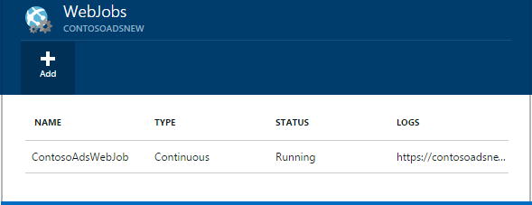
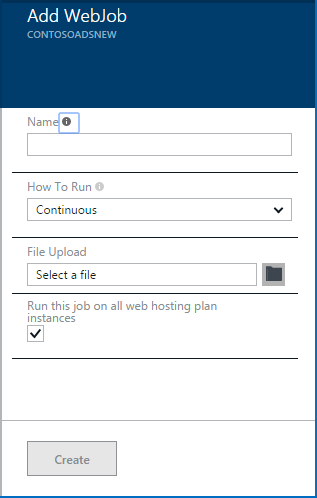
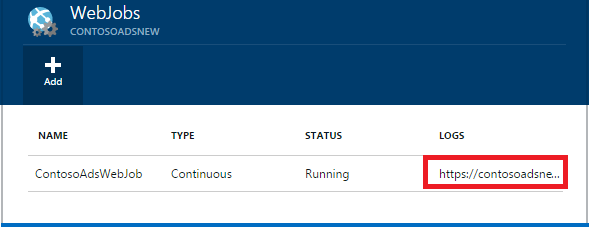

<properties 
    pageTitle="執行 WebJobs 背景的工作" 
    description="了解如何執行 Azure web 應用程式中的背景的工作。" 
    services="app-service" 
    documentationCenter="" 
    authors="tdykstra" 
    manager="wpickett" 
    editor="jimbe"/>

<tags 
    ms.service="app-service" 
    ms.workload="na" 
    ms.tgt_pltfrm="na" 
    ms.devlang="na" 
    ms.topic="article" 
    ms.date="04/27/2016" 
    ms.author="tdykstra"/>

# <a name="run-background-tasks-with-webjobs"></a>執行 WebJobs 背景的工作

## <a name="overview"></a>概觀

您可以在 WebJobs 執行程式或指令碼，在您的[應用程式服務](http://go.microsoft.com/fwlink/?LinkId=529714)web 應用程式中的三種方式︰ 持續，視需要或排程。 有任何其他成本] 以使用 WebJobs。

本文將示範如何部署 WebJobs 使用[Azure 入口網站](https://portal.azure.com)。 有關如何使用 Visual Studio 或連續傳遞程序部署，請參閱[如何 Web 應用程式部署 Azure WebJobs](websites-dotnet-deploy-webjobs.md)。

Azure WebJobs SDK 簡化了許多 WebJobs 程式設計工作。 如需詳細資訊，請參閱[什麼是 WebJobs SDK](websites-dotnet-webjobs-sdk.md)。

 Azure 功能 （目前預覽版本） 是另一種執行 [Azure 應用程式服務中的 [程式和指令碼。 如需詳細資訊，請參閱[Azure 函數概觀](../azure-functions/functions-overview.md)。

[AZURE.INCLUDE [app-service-web-to-api-and-mobile](../../includes/app-service-web-to-api-and-mobile.md)] 

## <a name="acceptablefiles"></a>指令碼或程式的可接受的檔案類型

接受下列檔案類型︰

* .cmd.bat、.exe （使用 windows cmd）
* .ps1 （使用 powershell）
* .sh （使用艦隊）
* php （使用 php）
* .py （使用 python）
* .js （使用節點）
* .jar （使用 java）

## <a name="CreateOnDemand"></a>在管理入口網站建立點播 WebJob

1. 在[Azure 入口網站](https://portal.azure.com)的**Web 應用程式**刀，按一下 [**所有設定 > WebJobs**顯示**WebJobs**刀。
    
    
    
5. 按一下 [**新增**]。 **新增 WebJob** ] 對話方塊隨即出現。
    
    
    
2. 在 [**名稱**] 底下，提供 WebJob 的名稱。 名稱必須以字母或數字開頭，而且不能包含任何特殊字元以外 「-」 與 「 _ 」。
    
4. **如何執行**在方塊中，選擇 [**依需求執行**]。
    
3. 在 [**上傳檔案**] 方塊中，按一下資料夾圖示，然後瀏覽至包含您的指令碼的 zip 檔案。 Zip 檔案包含您可執行檔 (.exe.cmd.bat.sh php.py.js) 以及所需執行的程式或指令碼任何支援的檔案。
    
5. 核取 [**建立**]，將指令碼至您的 web 應用程式上傳]。 
    
    您指定的 WebJob 的名稱會出現在**WebJobs**刀上的清單。
    
6. 若要執行 WebJob，請以滑鼠右鍵按一下其名稱，在清單中的，按一下 [**執行**]。
    
    
    
## <a name="CreateContinuous"></a>建立連續執行 WebJob

1. 若要建立持續執行 WebJob，請遵循建立，就會執行一次，但在**執行方式**] 方塊中，選擇 [**接續本頁**WebJob 相同的步驟。

2. 若要啟動或停止連續的 WebJob，以滑鼠右鍵按一下清單中的 WebJob，然後按一下 [**啟動**或**停止**。
    
> [AZURE.NOTE] 如果您的 web 應用程式執行多個執行個體上，在您的執行個體的所有連續執行 WebJob 都能夠執行。 視需要和排程 WebJobs 執行負載平衡 Microsoft Azure 選取單一例項。
    
> 連續可靠的方式，以及所有執行個體上執行 WebJobs，啟用 [永遠上 * 設定 web 應用程式的其他方式他們可以停止執行已經閒置太久 SCM 主機網站上的設定。

## <a name="CreateScheduledCRON"></a>建立使用 CRON 運算式排程的 WebJob

這項技巧提供基本、 標準或進階模式中執行的 Web 應用程式，需要**一律]**設定在應用程式上啟用。

若要轉換排程的 WebJob 上視需要 WebJob，只包含`settings.job`根目錄 WebJob zip 檔案的檔案。 此 JSON 檔案應該包含`schedule` [CRON 運算式](https://en.wikipedia.org/wiki/Cron)，每個面的範例中的屬性。

CRON 運算式組成 6 個欄位︰ `{second} {minute} {hour} {day} {month} {day of the week}`。

例如，若要觸發您 WebJob 每 15 分鐘，您`settings.job`有︰

```json
{
    "schedule": "0 */15 * * * *"
}
``` 

其他 CRON 排程範例中︰

- 每小時 （亦即每當的分鐘數為 0）︰`0 0 * * * *` 
- 每個小時 9 AM 至 5 PM:`0 0 9-17 * * *` 
- 在 9:30 AM 每日︰`0 30 9 * * *`
- 在 9:30 AM 每週日︰`0 30 9 * * 1-5`

**附註**︰ 在部署從 Visual Studio WebJob 時，請務必標示您`settings.job`'才複製 」 作為檔案屬性。


## <a name="CreateScheduled"></a>建立使用 Azure 排程器排程的 WebJob

以下的替代技術會用到的 Azure 排程器。 在此情況下，您 WebJob 沒有任何直接的知識的排程。 不過，Azure 排程器會設定為觸發您 WebJob 排程。 

Azure 入口網站還沒有能力建立排程的 WebJob，但直到的功能會新增您可以使用[傳統的入口網站](http://manage.windowsazure.com)中執行。

1. [傳統入口網站](http://manage.windowsazure.com)中移至 [WebJob 頁面，然後按一下 [**新增**]。

1. **如何執行**在方塊中，選擇 [**排程執行**]。
    
    ![新的排程的工作][NewScheduledJob]
    
2. 選擇您的工作**排程器區域**，然後按一下 [上] 對話方塊的右下方，繼續進行下一個畫面中的箭號。

3. 在 [**建立的工作**] 對話方塊中，選擇您想要的**週期**類型︰**一次性工作**] 或 [**週期性工作**。
    
    ![排程週期性][SchdRecurrence]
    
4. 也選擇 [**開始**時間︰**立即**或**在特定時間**。
    
    ![排程開始時間][SchdStart]
    
5. 如果您要開始在特定時間，請選擇 [**開始對象**] 底下您開始時間值。
    
    ![在特定時間的排程開始時間][SchdStartOn]
    
6. 如果您選擇的週期性工作，您有**Recur 每個**指定的項目和**結束的**選項，指定結束時間的頻率的選項。
    
    ![排程週期性][SchdRecurEvery]
    
7. 如果您選擇 [**週**] 時，您可以選取**特定預定時程**] 方塊，然後指定您想要執行的工作週的日子。
    
    ![每週排程日期][SchdWeeksOnParticular]
    
8. 如果您選擇**月份**，並選取 [**在特定排程**] 方塊中，您可以設定工作月執行編號的特定**天數**。 
    
    ![排程月份中的特定日期][SchdMonthsOnPartDays]
    
9. 如果您選擇**的週日**，您可以選取您想要在上執行的作業月份中的哪些日或週的日子。
    
    ![排程月份中的特定週日期][SchdMonthsOnPartWeekDays]
    
10. 您也可以選擇的週月份中使用 [**項目**] 選項的最後，(第一次，第二個第三個等) 您想要在您指定的週日上執行的工作。
    
    ![排程月份中的特定週的特定星期][SchdMonthsOnPartWeekDaysOccurences]
    
11. 在您建立一或多個工作，他們的名稱會出現在他們的狀態，[WebJobs] 索引標籤上之後排程類型及其他資訊。 維護的最後一個 30 WebJobs 記錄資訊。
    
    ![工作清單][WebJobsListWithSeveralJobs]
    
### <a name="Scheduler"></a>已排程的工作和 Azure 排程器

在[傳統的入口網站](http://manage.windowsazure.com)的 Azure 排程器頁面中都可以設定進一步的已排程的工作。

1.  WebJobs 在頁面上，按一下 [瀏覽至 Azure 排程器入口網站頁面的工作**排程**連結。 
    
    ![連結至 Azure 排程器][LinkToScheduler]
    
2. 在 [排程] 頁面上，按一下 [工作]。
    
    ![在排程器入口網站頁面上的工作][SchedulerPortal]
    
3. **工作動作**頁面隨即開啟，讓您進一步可以設定工作。 
    
    ![工作動作 PageInScheduler][JobActionPageInScheduler]
    
## <a name="ViewJobHistory"></a>檢視工作歷程記錄

1. 若要檢視執行的工作，包括使用 WebJobs sdk，您可以建立的工作歷程記錄，請 WebJobs 刀的**記錄**欄位按一下其對應的連結。 （您可以複製到剪貼簿的記錄檔的 [檔案] 頁面的 URL，如果您想要使用 [剪貼簿] 圖示）。
    
    
        
2. 按一下連結的 WebJob 開啟詳細資料] 頁面。 這個頁面會顯示 [執行，請執行的最後一個時間] 命令和成功或失敗的名稱。 在**新的工作會執行**，按一下時間以進一步查看詳細資料。
    
    ![WebJobDetails][WebJobDetails]
    
3. [ **WebJob 執行詳細資料**] 頁面隨即出現。 按一下 [**切換輸出**若要查看的記錄檔目錄的文字。 輸出記錄的文字格式。 
    
    ![執行 [詳細資料的 web 工作][WebJobRunDetails]
    
4. 若要查看輸出文字在另一個瀏覽器視窗中的，按一下 [**下載**] 連結。 若要下載本身的文字，請以滑鼠右鍵按一下連結並使用您的瀏覽器選項來儲存檔案的內容。
    
    ![下載記錄輸出][DownloadLogOutput]
    
5. 在頁面頂端的 [ **WebJobs** ] 連結提供方便，移至歷程記錄儀表板的 WebJobs 的清單。
    
    ![連結至 WebJobs 清單][WebJobsLinkToDashboardList]
    
    ![WebJobs 的歷程記錄儀表板中的清單][WebJobsListInJobsDashboard]
    
    按一下其中一個連結會帶您到您所選取之工作的 WebJob 詳細資料頁面。


## <a name="WHPNotes"></a>備忘稿
    
- 免費模式中的 web 應用程式可以逾時後 20 分鐘，如果有任何要求 scm （部署） 網站與 web 應用程式的入口網站無法在 Azure 中開啟。 要求的實際網站不會重設此。
- 連續工作的程式碼需要寫入無限迴圈中執行。
- 連續工作持續時才執行 web 應用程式設定。
- 基本一直在標準模式提供的功能，並啟用時，防止 web 應用程式變成閒置。
- 您可以只偵錯持續執行 WebJobs。 不支援偵錯排程或視 WebJobs。

## <a name="NextSteps"></a>後續步驟
 
如需詳細資訊，請參閱[Azure WebJobs 建議資源][WebJobsRecommendedResources]。

[PSonWebJobs]:http://blogs.msdn.com/b/nicktrog/archive/2014/01/22/running-powershell-web-jobs-on-azure-websites.aspx
[WebJobsRecommendedResources]:http://go.microsoft.com/fwlink/?LinkId=390226

[OnDemandWebJob]: ./media/web-sites-create-web-jobs/01aOnDemandWebJob.png
[WebJobsList]: ./media/web-sites-create-web-jobs/02aWebJobsList.png
[NewContinuousJob]: ./media/web-sites-create-web-jobs/03aNewContinuousJob.png
[NewScheduledJob]: ./media/web-sites-create-web-jobs/04aNewScheduledJob.png
[SchdRecurrence]: ./media/web-sites-create-web-jobs/05SchdRecurrence.png
[SchdStart]: ./media/web-sites-create-web-jobs/06SchdStart.png
[SchdStartOn]: ./media/web-sites-create-web-jobs/07SchdStartOn.png
[SchdRecurEvery]: ./media/web-sites-create-web-jobs/08SchdRecurEvery.png
[SchdWeeksOnParticular]: ./media/web-sites-create-web-jobs/09SchdWeeksOnParticular.png
[SchdMonthsOnPartDays]: ./media/web-sites-create-web-jobs/10SchdMonthsOnPartDays.png
[SchdMonthsOnPartWeekDays]: ./media/web-sites-create-web-jobs/11SchdMonthsOnPartWeekDays.png
[SchdMonthsOnPartWeekDaysOccurences]: ./media/web-sites-create-web-jobs/12SchdMonthsOnPartWeekDaysOccurences.png
[RunOnce]: ./media/web-sites-create-web-jobs/13RunOnce.png
[WebJobsListWithSeveralJobs]: ./media/web-sites-create-web-jobs/13WebJobsListWithSeveralJobs.png
[WebJobLogs]: ./media/web-sites-create-web-jobs/14WebJobLogs.png
[WebJobDetails]: ./media/web-sites-create-web-jobs/15WebJobDetails.png
[WebJobRunDetails]: ./media/web-sites-create-web-jobs/16WebJobRunDetails.png
[DownloadLogOutput]: ./media/web-sites-create-web-jobs/17DownloadLogOutput.png
[WebJobsLinkToDashboardList]: ./media/web-sites-create-web-jobs/18WebJobsLinkToDashboardList.png
[WebJobsListInJobsDashboard]: ./media/web-sites-create-web-jobs/19WebJobsListInJobsDashboard.png
[LinkToScheduler]: ./media/web-sites-create-web-jobs/31LinkToScheduler.png
[SchedulerPortal]: ./media/web-sites-create-web-jobs/32SchedulerPortal.png
[JobActionPageInScheduler]: ./media/web-sites-create-web-jobs/33JobActionPageInScheduler.png
 
