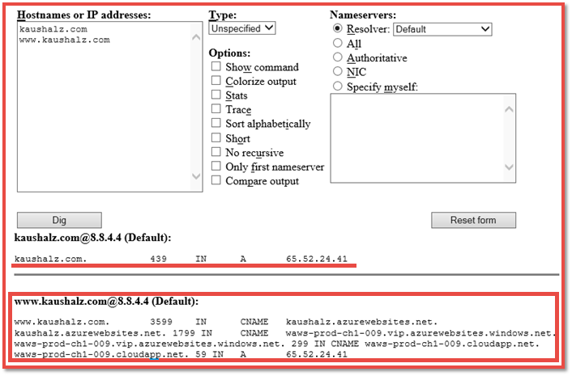

<properties
    pageTitle="將自訂網域名稱對應至 Azure 應用程式"
    description="瞭解如何將自訂網域名稱 （vanity 網域） 對應到您的應用程式中 Azure 應用程式服務。"
    services="app-service"
    documentationCenter=""
    authors="cephalin"
    manager="wpickett"
    editor="jimbe"
    tags="top-support-issue"/>

<tags
    ms.service="app-service"
    ms.workload="na"
    ms.tgt_pltfrm="na"
    ms.devlang="na"
    ms.topic="article"
    ms.date="07/27/2016"
    ms.author="cephalin"/>

# 將自訂網域名稱對應至 Azure 應用程式

[AZURE.INCLUDE [web-selector](../../includes/websites-custom-domain-selector.md)]

本文將示範如何手動對應到 web 應用程式、 行動應用程式後端或在[Azure 應用程式服務](../app-service/app-service-value-prop-what-is.md)的 API 應用程式的自訂網域名稱。 

您的應用程式中已經有唯一的 azurewebsites.net 子網域。 例如，如果**contoso**應用程式的名稱，然後網域名稱就會是**contoso.azurewebsites.net**。 不過，您可以將對應的自訂網域名稱至應用程式，因此其 URL，例如`www.contoso.com`，會反映您的品牌。

>[AZURE.NOTE] 從 Azure 專家[Azure 論壇](https://azure.microsoft.com/support/forums/)上取得協助。 更高等級的支援，請移至[Azure 支援網站](https://azure.microsoft.com/support/options/)，然後按一下 [**取得支援**。

[AZURE.INCLUDE [introfooter](../../includes/custom-dns-web-site-intro-notes.md)]

## 購買新的自訂網域中 Azure 入口網站

如果您還沒有購買的自訂網域名稱，您可以購買網域，並管理其直接在您的應用程式設定在[Azure 入口網站](https://portal.azure.com)中。 這個選項，方便您將對應的自訂網域用於您的應用程式，是否應用程式或不是使用[Azure 流量管理員](web-sites-traffic-manager-custom-domain-name.md)。 

如需相關指示，請參閱[購買應用程式服務的自訂網域名稱](custom-dns-web-site-buydomains-web-app.md)。

## 對應您購買外部的自訂網域

如果您已購買的自訂網域從[Azure DNS](https://azure.microsoft.com/services/dns/)或協力廠商提供者，有三個主要的步驟，將自訂網域對應到您的應用程式︰

1. [應用程式*（僅限記錄）*取得 IP 位址](#vip)。
2. [建立的對應您的應用程式至您網域的 DNS 記錄](#createdns)。 
    - **位置**︰ 您的網域註冊機構自己的管理] 工具 （例如 Azure DNS、 GoDaddy 等）。
    - **原因**︰ 讓知道會解析 Azure 應用程式至您要的自訂網域的網域註冊機構。
1. [啟用 Azure 應用程式的自訂網域名稱](#enable)。
    - **位置**︰ [Azure 入口網站](https://portal.azure.com)。
    - **原因**︰ 讓您的應用程式知道回應做為自訂網域名稱的要求。
3. [確認 DNS 傳播](#verify)。

### 您可以將對應的網域的類型

Azure 應用程式服務可讓您將自訂網域的下列類別對應到您的應用程式。

- **根網域**您保留網域註冊機構的網域名稱 (以表示`@`通常主機記錄)。 例如， **contoso.com**。
- **子網域**-下根網域的任何網域。 例如**www.contoso.com** (表示`www`主機記錄)。  您可以將相同的根網域不同的子網域對應至 Azure 中的其他應用程式。
- **萬用字元網域** - [其最左邊的 DNS 標籤任何子網域`*`](https://en.wikipedia.org/wiki/Wildcard_DNS_record)(例如主控記錄`*`和`*.blogs`)。 例如， ** \*。 contoso.com**。

### 您可以使用的 DNS 記錄類型

根據您的需求，您可以使用兩種不同的標準的 DNS 記錄，將您的自訂網域︰ 

- [A](https://en.wikipedia.org/wiki/List_of_DNS_record_types#A)的自訂網域名稱至 Azure 應用程式虛擬 IP 位址直接的地圖。 
- [CNAME](https://en.wikipedia.org/wiki/CNAME_record) -將您的自訂網域名稱對應到您的應用程式 Azure 的網域名稱，**&lt;*應用程式名稱*>。 azurewebsites.net**。 

CNAME 的優點在於，仍然存在跨 IP 位址變更。 如果您刪除和重新建立您的應用程式，或變更從較高的價格層回**共用**層時，可能會變更您的應用程式虛擬 IP 位址。 進行變更，而 A 記錄需要的更新，則仍然有效，CNAME 記錄。 

教學課程中會顯示使用 A 記錄，也使用 CNAME 記錄的步驟。

>[AZURE.IMPORTANT] 無法建立根網域 （例如 「 根記錄 」） 的 CNAME 記錄。 如需詳細資訊，請參閱[為什麼一筆 CNAME 記錄無法在根網域](http://serverfault.com/questions/613829/why-cant-a-cname-record-be-used-at-the-apex-aka-root-of-a-domain)。
若要對應至 Azure 應用程式的根網域，請改用 [A 記錄。

## 步驟 1。 *（僅限 a 記錄））*取得應用程式的 IP 位址
若要對應使用 A 記錄的自訂網域名稱，您需要 Azure 應用程式的 IP 位址。 如果您將會對應改為使用一筆 CNAME 記錄，請略過此步驟，然後移至下一節。

1.  [Azure 入口網站](https://portal.azure.com)登入。

2.  按一下左側功能表的 [**應用程式服務**]。

4.  按一下您的應用程式，然後按一下 [**自訂網域**。

6.  記下 Hostname 區段的上方的 IP 位址。

    

7.  請在此入口網站刀保持開啟。 您會回到它一旦您在建立 DNS 記錄。

## 步驟 2。 建立 DNS 記錄

登入您的網域註冊機構，並使用其工具來新增 A 記錄或 CNAME 記錄。 每個註冊機構的使用者介面是稍有不同，請洽詢您的提供者的文件。 不過，以下是一些的一般指導方針。

1.  尋找管理 DNS 記錄的頁面。 尋找連結或標示**的網域名稱**、 **DNS**或**名稱伺服器管理**網站的區域。 通常，您可以尋找連結以檢視您的帳戶資訊，然後尋找的連結，例如 [**我的網域**。
2.  尋找連結，可讓您新增或編輯 DNS 記錄。 這可能是**區域檔案**或**DNS 記錄**] 連結或**進階**設定] 連結。
3.  記錄建立完成並儲存您所做的變更。
    - [A 記錄的指示，請在此處](#a)。
    - [以下的 CNAME 記錄的指示](#cname)。

### 建立 A 記錄

若要使用對應至 Azure 應用程式的 IP 位址的 A 記錄，您實際上需要建立 A 記錄，以及 TXT 記錄。 A 記錄適用於 DNS 解析本身，以及的 TXT 記錄以驗證您擁有自訂的網域名稱的 Azure。 

設定您的 A 記錄，如下所示(@通常表示根網域):
 
<table cellspacing="0" border="1">
  <tr>
    <th>FQDN 範例</th>
    <th>Host （主機)</th>
    <th>值</th>
  </tr>
  <tr>
    <td>contoso.com （根）</td>
    <td>@</td>
    <td>從 IP 位址<a href="#vip">步驟 1</a></td>
  </tr>
  <tr>
    <td>www.contoso.com (sub)</td>
    <td>www</td>
    <td>從 IP 位址<a href="#vip">步驟 1</a></td>
  </tr>
  <tr>
    <td>*。 contoso.com （萬用字元）</td>
    <td>*</td>
    <td>從 IP 位址<a href="#vip">步驟 1</a></td>
  </tr>
</table>

從對應的慣例會採用您其他的 TXT 記錄&lt;*子網域*>。&lt; *rootdomain*> 至&lt;*應用程式名稱*>。 azurewebsites.net。 設定您的 TXT 記錄如下所示︰

<table cellspacing="0" border="1">
  <tr>
    <th>FQDN 範例</th>
    <th>TXT host （主機)</th>
    <th>TXT 值</th>
  </tr>
  <tr>
    <td>contoso.com （根）</td>
    <td>@</td>
    <td>&lt;<i>應用程式名稱</i>>。 azurewebsites.net</td>
  </tr>
  <tr>
    <td>www.contoso.com (sub)</td>
    <td>www</td>
    <td>&lt;<i>應用程式名稱</i>>。 azurewebsites.net</td>
  </tr>
  <tr>
    <td>*。 contoso.com （萬用字元）</td>
    <td>*</td>
    <td>&lt;<i>應用程式名稱</i>>。 azurewebsites.net</td>
  </tr>
</table>

###建立一筆 CNAME 記錄

如果您使用一筆 CNAME 記錄對應至 Azure 應用程式的預設網域名稱，則不需要的額外的 TXT 記錄所做的 A 記錄等。 

>[AZURE.IMPORTANT] 無法建立根網域 （例如 「 根記錄 」） 的 CNAME 記錄。 如需詳細資訊，請參閱[為什麼一筆 CNAME 記錄無法在根網域](http://serverfault.com/questions/613829/why-cant-a-cname-record-be-used-at-the-apex-aka-root-of-a-domain)。
若要對應至 Azure 應用程式的根網域，請改用 [ [A 記錄](#a)。

設定您的 CNAME 記錄，如下所示(@通常表示根網域):

<table cellspacing="0" border="1">
  <tr>
    <th>FQDN 範例</th>
    <th>CNAME host （主機)</th>
    <th>CNAME 值</th>
  </tr>
  <tr>
    <td>www.contoso.com (sub)</td>
    <td>www</td>
    <td>&lt;<i>應用程式名稱</i>>。 azurewebsites.net</td>
  </tr>
  <tr>
    <td>*。 contoso.com （萬用字元）</td>
    <td>*</td>
    <td>&lt;<i>應用程式名稱</i>>。 azurewebsites.net</td>
  </tr>
</table>

##步驟 3。 啟用您的應用程式的自訂網域名稱

回 Azure 入口網站中**的自訂網域**刀 （請參閱[步驟 1](#vip)），您需要將您的自訂網域的完整網域名稱 (FQDN) 新增至清單。

1.  如果您尚未這麼做， [Azure 入口網站](https://portal.azure.com)登入。

2.  在 Azure 入口網站中，按一下 [在左功能表上的 [**應用程式服務**]。

3.  按一下您的應用程式，然後按一下 [**自訂網域** > **新增主機名稱**。

4.  將您的自訂網域的 FQDN 新增至清單 (例如**www.contoso.com**)。

    

    >[AZURE.NOTE] Azure 會以驗證您在這裡使用的網域名稱。 請確定它是相同的網域名稱，您必須建立 DNS 記錄在 [[步驟 2](#createdns)。 

5.  按一下 [**驗證**]。

6.  在 [**驗證**Azure 會開始進行網域驗證工作流程。 這會檢查網域擁有權，以及 Hostname 可用性和報表成功或使用規定 guidence 如何修正錯誤詳細的錯誤。    

7.  在 [驗證成功**新增主機名稱**] 按鈕會變成作用中，您將能夠指派主機名稱。 

8.  一旦 Azure 完成設定您的新的自訂網域名稱，瀏覽至您的自訂網域名稱，在瀏覽器中。 在瀏覽器應該開啟 Azure 應用程式，這表示您的自訂網域名稱設定正確無誤。

> [AZURE.NOTE] 如果這筆 DNS 記錄已在使用 （作用中的網域服務流量案例），您需要主動繫結 web 應用程式進行網域驗證，則只要建立 TXT 記錄做為下表所示的範例。 從對應的慣例會採用您其他的 TXT 記錄&lt;*子網域*>。&lt; *rootdomain*> 至&lt;*應用程式名稱*>。 azurewebsites.net。 
> <table cellspacing="0" border="1">
  <tr>
    <th>FQDN 範例</th>
    <th>TXT host （主機)</th>
    <th>TXT 值</th>
  </tr>
  <tr>
    <td>contoso.com （根）</td>
    <td>awverify.contoso.com</td>
    <td>&lt;<i>應用程式名稱</i>>。 azurewebsites.net</td>
  </tr>
  <tr>
    <td>www.contoso.com (sub)</td>
    <td>awverify.www.contoso.com</td>
    <td>&lt;<i>應用程式名稱</i>>。 azurewebsites.net</td>
  </tr>
    <tr>
    <td>*。 contoso.com (sub)</td>
    <td>awverify.*.contoso.com</td>
    <td>&lt;<i>應用程式名稱</i>>。 azurewebsites.net</td>
  </tr>
</table>
一旦建立此 DNS 記錄，請返回 Azure 入口網站，並將您的自訂網域名稱新增至您的 web 應用程式。
 

##確認 DNS 傳播

完成設定步驟之後，可以花一些時間，才會傳播，根據您的 DNS 提供者的變更。 您可以驗證 DNS 傳播正在如預期般使用[http://digwebinterface.com/](http://digwebinterface.com/)。 您瀏覽至網站之後，請在文字方塊中指定主機名稱，然後按一下 [**挖掘**。 驗證]，確認 [最新變更是否已經生效的結果。  

> [AZURE.NOTE] 傳播 DNS 項目可能需要長達 48 小時 （有時再）。 如果您已正確設定所有項目，您仍需要傳播成功，請等候。

## 後續步驟
瞭解如何保護您的自訂網域名稱與 HTTPS[購買 Azure 中的 SSL 憑證](web-sites-purchase-ssl-web-site.md)或[使用 SSL 憑證從其他位置](web-sites-configure-ssl-certificate.md)。

>[AZURE.NOTE] 如果您想要開始使用 Azure 應用程式服務註冊 Azure 帳戶之前，請移至[嘗試應用程式服務](http://go.microsoft.com/fwlink/?LinkId=523751)，可以讓您立即建立短暫入門 web 應用程式在應用程式服務。 必要; 沒有信用卡沒有承諾。

[Azure DNS 快速入門](../dns/dns-getstarted-create-dnszone.md)  
[建立的自訂網域的 DNS 記錄的 web 應用程式](../dns/dns-web-sites-custom-domain.md)  
[Azure dns 委派網域](../dns/dns-domain-delegation.md)

<!-- Images -->
[subdomain]: media/web-sites-custom-domain-name/azurewebsites-subdomain.png
