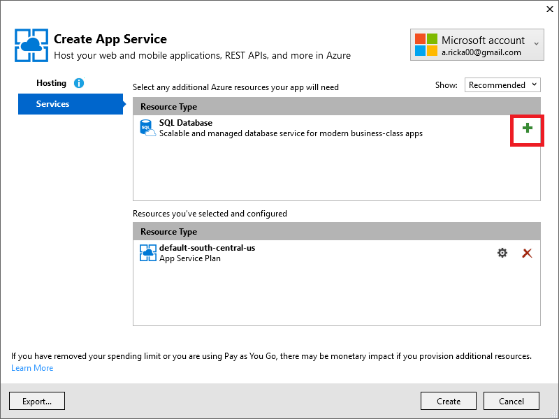
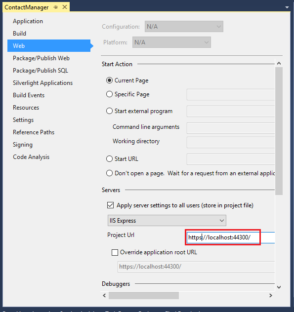
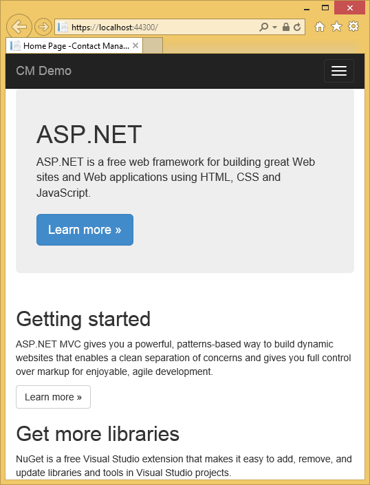
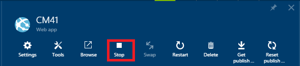
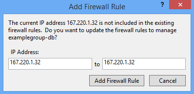

<properties 
    pageTitle="建立 ASP.NET MVC 應用程式授權與 SQL 資料庫並部署至 Azure 應用程式服務" 
    description="瞭解如何開發 ASP.NET MVC 5 應用程式與 SQL 資料庫後端、 新增驗證與授權，並將其部署到 Azure。" 
    services="app-service\web" 
    documentationCenter=".net" 
    authors="Rick-Anderson" 
    writer="Rick-Anderson" 
    manager="wpickett" 
    editor=""/>

<tags 
    ms.service="app-service-web" 
    ms.workload="web" 
    ms.tgt_pltfrm="na" 
    ms.devlang="dotnet" 
    ms.topic="article" 
    ms.date="03/21/2016" 
    ms.author="riande"/> 

# 建立 ASP.NET MVC 應用程式授權與 SQL 資料庫並部署至 Azure 應用程式服務

本教學課程中會顯示如何建立安全的 ASP.NET MVC 5 web 應用程式可讓使用者登入認證，從 Facebook 或 Google。 應用程式是用於資料庫存取 ADO.NET 實體架構的簡單的連絡人清單。 您會將應用程式部署到[Azure 應用程式服務](http://go.microsoft.com/fwlink/?LinkId=529714)。 

完成本教學課程，您必須設定安全資料導向的 web 應用程式在雲端並執行使用雲端資料庫。 下圖顯示已完成的應用程式的登入頁面。

![登入頁面][rxb]

您將學習︰

* 如何在 Visual Studio 建立安全 ASP.NET MVC 5 web 專案。
* 如何驗證和授權使用者使用從 Google 或 Facebook 帳戶 （使用[OAuth 2.0](http://oauth.net/2 "http://oauth.net/2")社交提供者驗證） 的認證登入。
* 如何驗證和授權註冊管理應用程式 （使用[ASP.NET 身分識別](http://asp.net/identity/)的本機驗證） 的資料庫中的使用者。
* 如何使用 ADO.NET 實體架構 6 程式碼第一個讀取和寫入 SQL 資料庫中的資料。
* 如何使用實體架構的程式碼的第一個移轉部署資料庫。
* 如何使用 Azure SQL 資料庫儲存在雲端的關聯式資料。
* 如何部署 Azure 應用程式服務中使用的資料庫， [web 應用程式](http://go.microsoft.com/fwlink/?LinkId=529714)的 web 專案。

>[AZURE.NOTE] 這是長教學課程。 如果您想 Azure 應用程式服務與 Visual Studio web 專案的快速簡介，請參閱[建立 ASP.NET web 應用程式中 Azure 應用程式服務](web-sites-dotnet-get-started.md)。 如需疑難排解資訊，請參閱[疑難排解](#troubleshooting)一節。
>
>或是如果您想要開始使用 Azure 應用程式服務註冊 Azure 帳戶之前，請移至[嘗試應用程式服務](http://go.microsoft.com/fwlink/?LinkId=523751)，可以讓您立即建立短暫入門 web 應用程式在應用程式服務。 必要; 沒有信用卡沒有承諾。

## 必要條件

若要完成此教學課程中，您需要 Microsoft Azure 帳戶。 如果您沒有帳戶，您可以[啟動您的 Visual Studio 訂閱權益](/pricing/member-offers/msdn-benefits-details/?WT.mc_id=A261C142F)或[註冊免費試用版](/pricing/free-trial/?WT.mc_id=A261C142F)。

若要設定您的開發環境，您必須安裝[Visual Studio 2013 更新 5](http://go.microsoft.com/fwlink/?LinkId=390521)或更新版本，和[.NET Azure SDK](http://go.microsoft.com/fwlink/?linkid=324322&clcid=0x409)的最新版本。 本文針對 Visual Studio 更新 4 及 SDK 2.8.1 寫。 相同的步驟適用於 Visual Studio 2015 使用最新[的.NET Azure SDK](http://go.microsoft.com/fwlink/?linkid=518003&clcid=0x409)安裝，但某些畫面看起來不同的圖例。

## 建立 ASP.NET MVC 5 應用程式

### 建立專案

1. 從 [**檔案**] 功能表中，按一下 [**新專案**]。

    ![在 [檔案] 功能表中的新專案](./media/web-sites-dotnet-deploy-aspnet-mvc-app-membership-oauth-sql-database/gs13newproj.png)

1. 在 [**新專案**] 對話方塊中，展開**C#**並選取**安裝的範本**] 下的**網頁**，然後選取**ASP.NET Web 應用程式**。 命名**ContactManager**，應用程式，然後再按一下**[確定**]。

    ![新增專案] 對話方塊](./media/web-sites-dotnet-deploy-aspnet-mvc-app-membership-oauth-sql-database/GS13newprojdb.png)
 
    **附註︰**請確認您輸入 「 ContactManager 」。 您可以稍後再將它複製的程式碼區塊假設 ContactManager 專案名稱。 

1. 在 [**新的 ASP.NET 專案**] 對話方塊中，選取**MVC**範本。 **驗證**設定**個別使用者**帳戶，核取 [**在雲端的主機**]，並且**應用程式服務**已驗證。

    ![新增 ASP.NET 專案] 對話方塊](./media/web-sites-dotnet-deploy-aspnet-mvc-app-membership-oauth-sql-database/newproject.png)

1. 按一下**[確定]**。

1. **設定 Microsoft Azure Web 應用程式設定**] 對話方塊隨即出現。 您可能需要登入，如果您有不這麼做，或如果您的登入已過期，請重新輸入您的認證。

1. 選用-變更**Web 應用程式名稱**中的值] 方塊 （請參閱下方圖像）。

    Web 應用程式的 URL 會 {名稱}.azurewebsites.net，因此 azurewebsites.net 網域中都是唯一的名稱。 設定精靈建議唯一的名稱，將數字的專案名稱 「 ContactManager 」，並很好在本教學課程。

5. 在 [**資源群組**] 下拉式清單選取現有的群組或**建立新的資源群組**（請參閱下方圖像）。 

    如果您想要的話，您可以選取您已擁有的資源群組。 但如果您建立新的資源群組，只能用於本教學課程中，會刪除所有 Azure 的資源，當您完成的教學課程中建立更容易。 資源群組的相關資訊，請參閱[Azure 資源管理員的概觀](../azure-resource-manager/resource-group-overview.md)。 

5. 在**應用程式服務方案**下拉式清單選取 [選取現有的計劃或**建立新的應用程式服務方案**（請參閱下方圖像）。

    如果您想要的話，您可以選取您已擁有的是應用程式服務方案。 應用程式服務方案的相關資訊，請參閱[Azure 應用程式服務方案在您採取進階的概觀](../app-service/azure-web-sites-web-hosting-plans-in-depth-overview.md)。 

1. 點選 [**瀏覽其他 Azure 服務**將 SQL 資料庫]。

    

1. 點選 [**+**將 SQL 資料庫] 圖示。

    

1. 點選 [**設定 SQL 資料庫**] 對話方塊**新增**下列資訊︰

    

1. 輸入名稱，以系統管理員和強式密碼。

    

    伺服器名稱必須是唯一的。 它可以包含英文小寫字母、 數字，然後連字號。 它不能包含尾端連字號。 使用者名稱和密碼是新增您要建立新的伺服器的認證。 

    如果您已經有資料庫伺服器，您可以而不是建立一個選取的。 資料庫伺服器是寶貴的資源，您通常要在相同的伺服器的測試和開發而建立的每個資料庫的資料庫伺服器上建立多個資料庫。 不過，在此教學課程您只需要伺服器暫時，並建立伺服器與網站相同的 [資源] 群組中，您輕鬆地刪除資源群組，當您完成教學課程以刪除這兩個 web 應用程式和資料庫資源。 

    如果您選取現有的資料庫伺服器，請確定您的 web 應用程式及資料庫有相同的區域。

    

4. 點選 [**建立**]。

    Visual Studio 建立 ContactManager web 專案、 建立資源群組和您所指定的應用程式服務方案，並在 Azure 應用程式服務建立 web 應用程式，您所指定的名稱。

### 設定的頁首及頁尾

1. 在**方案總管**中開啟*Layout.cshtml*檔案*Views\Shared*資料夾中。

    ![在方案總管中 _Layout.cshtml][newapp004]

1. 下列程式碼取代 ActionLink *Layout.cshtml*檔案中。

    @Html.ActionLink("CM示範 」、 「 索引 」、 「 連絡人 」，新 {區域 = 」 「}、 新增 { @class = 」 瀏覽列品牌 」})
                   

    請確定您變更 [連絡人] 的第三個參數從 「 住家 」。 上述標記會建立索引方法連絡人控制站的每個頁面上的 [連絡人] 連結。 變更 「 連絡管理員 」 和 「 公分示範 」 應用程式的名稱，在 [頁首及頁尾從 「 我的 ASP.NET 應用程式 」 和 「 應用程式名稱 」。 
 
### 在本機上執行應用程式

1. 按下 CTRL + F5 執行應用程式。

    應用程式的 [首頁] 頁面會顯示在預設瀏覽器。

    

這是您只需要建立的應用程式，您會部署至 Azure 現在。 

## 部署至 Azure 應用程式

1. 在 Visual Studio 中，以滑鼠右鍵按一下 [專案**總管**] 中的，然後從操作功能表選取 [**發佈]** 。

    
    
    **發佈網站**精靈 」 隨即會開啟。

1. 在**發佈網站**] 對話方塊中，按一下 [**發佈**]。

    

    在雲端立即執行您所建立的應用程式。 下次您部署應用程式中，將部署只變更 （或新） 檔案。

    

## 啟用 SSL 專案 ##

1. 在**方案總管]**中，按一下 [ **ContactManager**專案，然後按一下 [F4 以開啟 [**屬性**] 視窗。

3. 將**SSL 啟用**變更為**True**。 

4. 複製**SSL URL**。

    SSL URL 會 https://localhost:44300 / 除非您先前已建立 SSL web 應用程式。

    ![啟用 SSL][rxSSL]
 
1. 在**方案總管]**中，以滑鼠右鍵按一下**連絡人管理員**專案，然後按一下 [**內容**。

1. 按一下 [**網站**] 索引標籤。

1. 變更**專案的 Url** ，以使用**SSL URL** ，然後儲存頁面 (控制項 S)。

    
 
1. 確認 Internet Explorer 瀏覽器的 Visual Studio 啟動時下, 圖所示︰

    

    在瀏覽器選擇器可讓您指定啟動 [Visual Studio 瀏覽器。 您可以選取多個瀏覽器並 Visual Studio 更新每一個瀏覽器，當您進行變更。 如需詳細資訊，請參閱[在 Visual Studio 2013 中使用瀏覽器連結](http://www.asp.net/visual-studio/overview/2013/using-browser-link)。

    

1. 按下 CTRL + F5 執行應用程式。 按一下 [ **]**開始的信任自我簽署的憑證 IIS Express 產生的程序。

     

1. 閱讀 [**安全性警告**] 對話方塊，然後在如果您想要安裝代表**本機**的憑證，按一下 [**是]** 。

    

1. IE 會顯示 [*首頁*] 頁面，並沒有 SSL 警告。

     

     當您使用的 SSL，因為它接受憑證，並會顯示 HTTPS 內容不會發出警告時，Internet Explorer 是很不錯的選擇。 Microsoft Edge 及 Google Chrome 也接受憑證。 Firefox 會使用自己的憑證存放區，讓它顯示警告。

     

## 將資料庫新增至應用程式

接下來，您將會更新功能新增以顯示及更新連絡人儲存資料庫中的資料的應用程式。 應用程式會使用實體架構 (EF)，建立資料庫，以讀取和更新資料。

### 新增連絡人的資料模型類別

您開始建立簡單的資料模型中的程式碼。

1. 在**方案總管**] 中，以滑鼠右鍵按一下 [模型] 資料夾，按一下 [**新增**]，然後按一下 [**課程**。

    

2. 在 [**新增項目**] 對話方塊中命名新的類別檔案*Contact.cs*，，然後再按一下 [**新增**]。

    ![新增新的項目] 對話方塊][adddb002]

3. 下列程式碼取代 Contact.cs 檔案的內容。

        using System.ComponentModel.DataAnnotations;
        using System.Globalization;
        namespace ContactManager.Models
        {
            public class Contact
            {
                public int ContactId { get; set; }
                public string Name { get; set; }
                public string Address { get; set; }
                public string City { get; set; }
                public string State { get; set; }
                public string Zip { get; set; }
                [DataType(DataType.EmailAddress)]
                public string Email { get; set; }
            }
        }
**連絡**類別定義的資料，您將會儲存每一位連絡人，以及主索引鍵， *ContactID*，所需的資料庫。

### 建立網頁，可讓應用程式使用者使用連絡人

ASP.NET MVC 臨時平台功能可以自動產生執行的程式碼建立、 讀取、 更新及刪除 (CRUD) 動作。 

1. 建立專案**(Ctrl + Shift + B)**。 （您必須先使用臨時平台機制建置專案）。
 
1. 在**方案總管]**中，控制站資料夾按一下滑鼠右鍵並按一下 [**新增**]，然後按一下**控制器**。

    ![控制站資料夾快顯功能表中新增控制器][addcode001]

5. 在**新增 Scaffold** ] 對話方塊中，選取 [**使用檢視，使用 EF MVC 5 控制站**，然後按一下 [**新增**。
    
    

1. 在**模型類別**] 下拉式清單方塊中，選取**連絡人 (ContactManager.Models)**。 （請參閱下方圖像）。

1. 在**資料內容類別**中，選取 [ **ApplicationDbContext (ContactManager.Models)**]。 **ApplicationDbContext**會用於 DB 成員資格和我們連絡人的資料。

    

1. 按一下 [**新增**]。

   Visual Studio 建立控制器方法和**連絡人**物件的 CRUD 資料庫作業的檢視。

## 啟用移轉、 建立資料庫、 新增範例資料與資料初始設定 ##

下一步是啟用[程式碼的第一個移轉](http://msdn.microsoft.com/library/hh770484.aspx)功能以建立您所建立的資料模型為基礎的資料庫資料表。

1. 在 [**工具**] 功能表中，選取**NuGet 封裝管理員**]，然後按一下 [**封裝管理員主控台**。

    ![在 [工具] 功能表中的封裝管理員主控台](./media/web-sites-dotnet-deploy-aspnet-mvc-app-membership-oauth-sql-database/SS6.png)

2. 在 [**封裝管理員主控台**] 視窗中，輸入下列命令︰

        enable-migrations

    **啟用移轉**命令建立*移轉*資料夾，並將其置於該資料夾*Configuration.cs*檔案，您可以編輯植入資料庫，並設定移轉。 

2. 在 [**封裝管理員主控台**] 視窗中，輸入下列命令︰

        add-migration Initial

    **新增移轉初始**] 命令會產生一個名為檔案**&lt;date_stamp&gt;初始**[*移轉*] 資料夾中。 此檔案中的程式碼會建立資料庫資料表。 （**初始**） 的第一個參數用來建立檔案的名稱。 您可以看到新的類別檔案**總管**] 中。

    在**初始**類別中，**設定**方法會建立 [連絡人] 資料表，並**向下**方法 （使用您想要回到先前的狀態） 放置至。

3. 開啟*Migrations\Configuration.cs*檔案。 

4. 新增下列`using`陳述式。 

         using ContactManager.Models;

5. 下列程式碼取代*種子*方法︰

        protected override void Seed(ContactManager.Models.ApplicationDbContext context)
        {
            context.Contacts.AddOrUpdate(p => p.Name,
               new Contact
               {
                   Name = "Debra Garcia",
                   Address = "1234 Main St",
                   City = "Redmond",
                   State = "WA",
                   Zip = "10999",
                   Email = "debra@example.com",
               },
                new Contact
                {
                    Name = "Thorsten Weinrich",
                    Address = "5678 1st Ave W",
                    City = "Redmond",
                    State = "WA",
                    Zip = "10999",
                    Email = "thorsten@example.com",
                },
                new Contact
                {
                    Name = "Yuhong Li",
                    Address = "9012 State st",
                    City = "Redmond",
                    State = "WA",
                    Zip = "10999",
                    Email = "yuhong@example.com",
                },
                new Contact
                {
                    Name = "Jon Orton",
                    Address = "3456 Maple St",
                    City = "Redmond",
                    State = "WA",
                    Zip = "10999",
                    Email = "jon@example.com",
                },
                new Contact
                {
                    Name = "Diliana Alexieva-Bosseva",
                    Address = "7890 2nd Ave E",
                    City = "Redmond",
                    State = "WA",
                    Zip = "10999",
                    Email = "diliana@example.com",
                }
                );
        }

    將此程式碼初始化 （種子） 與連絡人資訊的資料庫。 如需有關種子資料庫的詳細資訊，請參閱[種子和偵錯實體架構 (EF) 好處](http://blogs.msdn.com/b/rickandy/archive/2013/02/12/seeding-and-debugging-entity-framework-ef-dbs.aspx)。 建立專案，請確認沒有任何編譯錯誤。

6. 在**封裝管理員主控台**輸入的命令︰

        update-database

    ![封裝管理員主控台] 指令][addcode009]

    **更新資料庫**執行第一個移轉建立資料庫。 根據預設，為 SQL Server Express LocalDB 資料庫建立資料庫。 

7. 按下 CTRL + F5 執行應用程式，然後按一下**公分示範**連結;或瀏覽至 https://localhost:(port#)/公分。 

    應用程式顯示種子資料，並提供 [編輯]、 [詳細資料和 [刪除] 連結。 您可以建立、 編輯、 刪除及檢視資料。

    ![MVC 資料檢視][rx2]

## 新增 OAuth2 提供者

>[AZURE.NOTE] 如需如何使用 Google 或 facebook 的連絡人開發人員入口網站上的 ASP.NET 網站教學課程此教學課程的連結的詳細說明。 不過，Google 或 facebook 的連絡人變更其網站更頻繁地更新這些教學課程，而且現在已過期。 如果您遇到下列指示，請參閱主要的 Disqus 註解，在本教學課程中的什麼資料已變更清單結尾處。 

[OAuth](http://oauth.net/ "http://oauth.net/")是開啟的通訊協定，讓 [簡單和標準方法從網路手機和桌面應用程式中的 [安全的授權。 ASP.NET MVC 網際網路範本會使用 OAuth，以驗證提供者的方式公開 Facebook、 Twitter、 Google 和 Microsoft。 雖然在此教學課程使用只 Google 做為驗證提供者，您都可以輕鬆修改程式碼，使用任何這些提供者。 若要執行其他提供者的步驟，兩者十分相似您在本教學課程中看到的步驟。 若要使用的驗證提供者 Facebook，請參閱[MVC 5 應用程式 Facebook、 Twitter、 LinkedIn 和 Google OAuth2 登入](http://www.asp.net/mvc/tutorials/mvc-5/create-an-aspnet-mvc-5-app-with-facebook-and-google-oauth2-and-openid-sign-on)。

除了 [驗證]，此教學課程中會使用角色實作授權。 只有您新增至*︰ canEdit*角色這些使用者能夠變更資料 （也就是建立、 編輯或刪除連絡人）。

1. 請依照下**建立 Google 應用程式的 OAuth 2，以設定 OAuth2 Google 應用程式**[與 Facebook、 Twitter、 LinkedIn 和 Google OAuth2 登入 MVC 5 應用程式](http://www.asp.net/mvc/tutorials/mvc-5/create-an-aspnet-mvc-5-app-with-facebook-and-google-oauth2-and-openid-sign-on#goog)中的指示進行。

3. 執行並測試驗證，您可以使用驗證登入 Google 應用程式。

2. 如果您想要建立具有特定提供者圖示的社交登入按鈕，請參閱[ASP.NET MVC 5 的精美社交登入按鈕](http://www.jerriepelser.com/blog/pretty-social-login-buttons-for-asp-net-mvc-5)

## 使用 API 的成員資格

此區段中會新增本機使用者與*︰ canEdit*角色的成員資格資料庫。 只有這些*︰ canEdit*角色的使用者無法編輯資料。 以便上方稱為*管理員*角色*︰ canEdit*慣用的最佳作法是名稱角色，可以執行的動作。 當您的應用程式發展時，您可以新增新的角色，例如*canDeleteMembers* ，而不是較少描述性*superAdmin*。

1. 開啟*migrations\configuration.cs*檔案，並將以下`using`陳述式︰

        using Microsoft.AspNet.Identity;
        using Microsoft.AspNet.Identity.EntityFramework;

1. 新增下列**AddUserAndRole**方法類別︰

        bool AddUserAndRole(ContactManager.Models.ApplicationDbContext context)
        {
            IdentityResult ir;
            var rm = new RoleManager<IdentityRole>
                (new RoleStore<IdentityRole>(context));
            ir = rm.Create(new IdentityRole("canEdit"));
            var um = new UserManager<ApplicationUser>(
                new UserStore<ApplicationUser>(context));
            var user = new ApplicationUser()
            {
                UserName = "user1@contoso.com",
            };
            ir = um.Create(user, "P_assw0rd1");
            if (ir.Succeeded == false)
                return ir.Succeeded;
            ir = um.AddToRole(user.Id, "canEdit");
            return ir.Succeeded;
        }

1. 從**種子**方法呼叫新的方法︰

        protected override void Seed(ContactManager.Models.ApplicationDbContext context)
        {
            AddUserAndRole(context);
            context.Contacts.AddOrUpdate(p => p.Name,
                // Code removed for brevity
        }

    下列圖像顯示*種子*方法所做的變更︰

    

    將此程式碼會建立一個新角色稱為*︰ canEdit*、 建立新的本機使用者*user1@contoso.com*，並新增*user1@contoso.com* *: canEdit*角色。 如需詳細資訊，請參閱 ASP.NET 網站上的[ASP.NET 識別教學課程](http://www.asp.net/identity/overview/features-api)。

## 使用暫時新增新社交登入使用者的程式碼，: canEdit 角色  ##

此區段中，您會暫時修改中新增新註冊與 OAuth 提供者*︰ canEdit*角色的使用者帳戶控制站的**ExternalLoginConfirmation**方法。 我們希望提供的工具類似[WSAT](http://msdn.microsoft.com/library/ms228053.aspx)未來可讓您建立及編輯使用者帳戶和角色。 之前，您可以使用暫存的程式碼達成相同的功能。

1. 開啟**Controllers\AccountController.cs**檔案，並瀏覽至**ExternalLoginConfirmation**方法。

1. 新增下列通話**AddToRoleAsync**之前**SignInAsync**通話。

        await UserManager.AddToRoleAsync(user.Id, "canEdit");

   上述的程式碼會將新註冊的使用者加入 「: canEdit 」 的角色，讓他們存取巨集指令的方法，變更 （編輯） 資料。 下列程式碼片段會顯示新的一行程式碼中的內容。

          // POST: /Account/ExternalLoginConfirmation
          [HttpPost]
          [AllowAnonymous]
          [ValidateAntiForgeryToken]
          public async Task ExternalLoginConfirmation(ExternalLoginConfirmationViewModel model, string returnUrl)
          {
             if (User.Identity.IsAuthenticated)
             {
                return RedirectToAction("Index", "Manage");
             }
             if (ModelState.IsValid)
             {
                // Get the information about the user from the external login provider
                var info = await AuthenticationManager.GetExternalLoginInfoAsync();
                if (info == null)
                {
                   return View("ExternalLoginFailure");
                }
                var user = new ApplicationUser { UserName = model.Email, Email = model.Email };
                var result = await UserManager.CreateAsync(user);
                if (result.Succeeded)
                {
                   result = await UserManager.AddLoginAsync(user.Id, info.Login);
                   if (result.Succeeded)
                   {
                      await UserManager.AddToRoleAsync(user.Id, "canEdit");
                      await SignInManager.SignInAsync(user, isPersistent: false, rememberBrowser: false);
                      return RedirectToLocal(returnUrl);
                   }
                }
                AddErrors(result);
             }
             ViewBag.ReturnUrl = returnUrl;
             return View(model);
          }

稍後在教學課程中，您會部署的 Azure，在您將登入 Google 或其他協力廠商驗證提供者的應用程式。 這會將您的註冊新帳戶新增至*︰ canEdit*角色。 尋找您的 web 應用程式的 URL 和 Google 識別碼的人然後註冊和更新您的資料庫。 若要防止執行的其他人，您可以停止網站。 您就可以驗證誰是*︰ canEdit*角色中檢查資料庫。

在**封裝管理員主控台**叫用向上鍵以顯示下列命令︰

        Update-Database

**更新資料庫**命令執行**種子**的方法，並執行您先前新增的**AddUserAndRole**方法。 **AddUserAndRole**方法建立使用者*user1@contoso.com*並將其新增到*︰ canEdit*角色。

## 保護 SSL 與授權屬性的應用程式 ##

本節中套用[授權](http://msdn.microsoft.com/library/system.web.mvc.authorizeattribute.aspx)屬性時，若要限制存取動作方法。 匿名使用者將能夠檢視只有常用控制器**索引**動作方法。 註冊的使用者將無法看到連絡人的資料 （ **Index**和**詳細資料**頁面的公分控制器） 與 [關於] 頁面中，[連絡人] 頁面。 只有*︰ canEdit*角色的使用者，才能夠變更資料的存取動作方法。

1. 開啟*App_Start\FilterConfig.cs*檔案，並以下列 （會增加兩個篩選） 取代*RegisterGlobalFilters*方法︰

        public static void RegisterGlobalFilters(GlobalFilterCollection filters)
        {
            filters.Add(new HandleErrorAttribute());
            filters.Add(new System.Web.Mvc.AuthorizeAttribute());
            filters.Add(new RequireHttpsAttribute());
        }
        
    將此程式碼新增至應用程式的[授權](http://msdn.microsoft.com/library/system.web.mvc.authorizeattribute.aspx)篩選器和[RequireHttps](http://msdn.microsoft.com/library/system.web.mvc.requirehttpsattribute.aspx)篩選。 [授權](http://msdn.microsoft.com/library/system.web.mvc.authorizeattribute.aspx)篩選器可防止匿名使用者存取應用程式中的任何方法。 您會使用[允許匿名](http://blogs.msdn.com/b/rickandy/archive/2012/03/23/securing-your-asp-net-mvc-4-app-and-the-new-allowanonymous-attribute.aspx)屬性退出授權需求的幾個方法，讓匿名使用者可以登入，並可以檢視 [首頁] 頁面。 [RequireHttps](http://msdn.microsoft.com/library/system.web.mvc.requirehttpsattribute.aspx)需要所有的 access web app 會透過 HTTPS。

    另一個方法是將[授權](http://msdn.microsoft.com/library/system.web.mvc.authorizeattribute.aspx)屬性及[RequireHttps](http://msdn.microsoft.com/library/system.web.mvc.requirehttpsattribute.aspx)屬性新增至每個控制站，但它有安全性最佳作法套用到整個應用程式。 藉由新增它們全域，您新增每個新控制器和動作方法自動受保護--您不必記住以將其套用。 如需詳細資訊請參閱[保護 ASP.NET MVC 應用程式和新允許匿名屬性](http://blogs.msdn.com/b/rickandy/archive/2012/03/23/securing-your-asp-net-mvc-4-app-and-the-new-allowanonymous-attribute.aspx)。 

1. 新增**索引**的方法常用控制器[允許匿名](http://blogs.msdn.com/b/rickandy/archive/2012/03/23/securing-your-asp-net-mvc-4-app-and-the-new-allowanonymous-attribute.aspx)屬性。 [允許匿名](http://blogs.msdn.com/b/rickandy/archive/2012/03/23/securing-your-asp-net-mvc-4-app-and-the-new-allowanonymous-attribute.aspx)屬性可讓您白色清單以您想要退出授權的方法。 

        public class HomeController : Controller
        {
          [AllowAnonymous]
          public ActionResult Index()
          {
             return View();
          }

    如果您*允許匿名*全域搜尋，您會看到它用在帳戶控制站的登入和註冊方法。

1. 在*CmController.cs*，新增`[Authorize(Roles = "canEdit")]`HttpGet 和 HttpPost 之方法的變更*公分*控制器中的資料 （建立、 編輯、 刪除，每個動作方法除了索引和詳細資料）。 完成的程式碼的部分如下所示︰ 

        // GET: Cm/Create
        [Authorize(Roles = "canEdit")]
        public ActionResult Create()
        {
           return View(new Contact { Address = "123 N 456 W",
            City="Great Falls", Email = "ab@cd.com", Name="Joe Smith", State="MT",
           Zip = "59405"});
        }
        // POST: Cm/Create
        // To protect from overposting attacks, please enable the specific properties you want to bind to, for 
        // more details see http://go.microsoft.com/fwlink/?LinkId=317598.
        [HttpPost]
        [ValidateAntiForgeryToken]
         [Authorize(Roles = "canEdit")]
        public ActionResult Create([Bind(Include = "ContactId,Name,Address,City,State,Zip,Email")] Contact contact)
        {
            if (ModelState.IsValid)
            {
                db.Contacts.Add(contact);
                db.SaveChanges();
                return RedirectToAction("Index");
            }
            return View(contact);
        }
        // GET: Cm/Edit/5
        [Authorize(Roles = "canEdit")]
        public ActionResult Edit(int? id)
        {
            if (id == null)
            {
                return new HttpStatusCodeResult(HttpStatusCode.BadRequest);
            }
            Contact contact = db.Contacts.Find(id);
            if (contact == null)
            {
                return HttpNotFound();
            }
            return View(contact);
        }
        
1. 按下 CTRL + F5 執行應用程式。

1. 如果您仍可從先前的工作階段的身分登入，請按下 [**登出**] 連結。

1. 按一下連結的**相關**或**連絡人**。 您會重新導向至登入頁面因為匿名使用者無法檢視這些頁面。

1. 按一下 [**以新的使用者註冊**] 連結，並新增電子郵件的本機使用者*joe@contoso.com*。 請確認*王*可以關於檢視 [常用]，並連絡頁面。 

    

1. 按一下 [*公分示範*連結並確認您看到的資料。

1. 按一下頁面上的 [編輯] 連結，您會被重新導向至 [登入] 頁面 （因為新的本機使用者不會加入至*︰ canEdit*角色）。

1. 登入為*user1@contoso.com*以 「 P_assw0rd1 」 的密碼 （「 0 」 在 「 word 」 為零）。 您會重新導向至您先前已選取編輯頁面。 
2. 

    如果您無法登入該帳戶及密碼，請嘗試複製的程式碼的密碼，並將其貼。 如果您仍然無法登入，查看**使用者名稱**] 欄中的**AspNetUsers**表格，以確認*user1@contoso.com*已新增。 

1. 請確認您可以變更資料。

## 將應用程式部署到 Azure

1. 在 Visual Studio 中，以滑鼠右鍵按一下 [專案**總管**] 中的，然後從操作功能表選取 [**發佈]** 。

    ![發佈專案內容功能表][firsdeploy003]

    **發佈網站**精靈 」 隨即會開啟。

1. 按一下左側的**發佈網站**] 對話方塊上的 [**設定**] 索引標籤。 

2. 在 [ **ApplicationDbContext**中，選取您建立專案時所建立的資料庫。
   

1. 在**ContactManagerContext**，選取 [**執行程式碼第一個移轉**。

    

1. 按一下 [**發佈**]。

1. 登入為*user1@contoso.com*（含 「 P_assw0rd1 「 密碼），並確認您可以編輯資料。

1. 登出。

1. 移至[Google 開發人員主控台](https://console.developers.google.com/)**認證**] 索引標籤更新重新導向 URI 和 JavaScript Orgins 使用 Azure 的 URL。

1. 使用 Google 或 Facebook 登入。 會將 Google 或 Facebook 帳戶新增至**︰ canEdit**角色。 如果您看到的 HTTP 400 錯誤訊息*在邀請中的重新導向 URI: https://contactmanager {我 version}.azurewebsites.net/signin-google 不符合註冊的重新導向 URI。*，您必須等到您所做的變更會傳播。 如果您收到此錯誤，多個分鐘後，請確認 Uri 正確無誤。

### 停止註冊時，防止其他人的 web 應用程式  

1. 在 [**伺服器總管]**中，瀏覽至**Azure > 應用程式服務 > {資源群組} > {web 應用程式}**。

4. 以滑鼠右鍵按一下 web 應用程式，然後選取 [**停止**。 

    或者，從[Azure 入口網站](https://portal.azure.com/)，您可以移至 web 應用程式的刀，然後按一下刀頂端的 [**停止**] 圖示。

    

### 移除 AddToRoleAsync，發佈並測試

1. 註解，或從**ExternalLoginConfirmation**方法帳戶控制器中移除下列程式碼︰

        await UserManager.AddToRoleAsync(user.Id, "canEdit");

1. 建立專案 （由儲存檔案的變更，並確認您沒有安裝任何編譯錯誤）。

5. 以滑鼠右鍵按一下 [專案**總管**] 中的，選取 [**發佈]**。

       
    
4. 按一下 [**開始預覽**] 按鈕。 部署只需要更新的檔案。

5. 從 Visual Studio 或入口網站，請啟動 web 應用程式。 **您將無法發佈 web 應用程式停止時**。

    

5. 回到 Visual Studio，然後按一下 [**發佈**]。

3. Azure 應用程式開啟預設瀏覽器中。 如果您已經登入，先登出，讓您可以檢視 [首頁] 頁面以匿名使用者身分。  

4. 按一下 [**關於**] 連結。 您會被重新導向至登入頁面。

5. 按一下 [登入] 頁面上的 [**註冊**] 連結，並建立本機帳戶。 我們會使用此本機帳戶以確認您可以存取讀取只頁面，但您無法存取變更資料 （受到*︰ canEdit*角色） 的頁面。 稍後教學課程中，您將會移除本機帳戶進行存取。 

    

1. 請確認您可以瀏覽至 [*關於*] 和 [*連絡人*頁面。

    

1. 按一下 [瀏覽至**公分**控制器**公分示範**連結]。 或者，您可以新增*公分*的 url。 

    
 
1. 按一下 [編輯連結]。 

    您會重新導向至 [登入] 頁面。 

2. 在 [**使用另一個登入服務**、 按一下 [Google 或 Facebook 和記錄檔以先前註冊，讓您的帳戶。 （如果您快速使用您的工作階段 cookie 不逾時，您會自動登入的 Google 或 Facebook 帳戶您先前使用。）

2. 請確認您可以編輯並將該帳戶登入的資料。

    **附註︰**您無法登出 Google 此應用程式與記錄至不同的 google 帳戶與相同瀏覽器。 如果您使用的一種瀏覽器，您就必須瀏覽至 [Google 和登出。 您可以登入使用相同的協力廠商驗證者 （例如 Google) 從其他帳戶使用不同的瀏覽器。

    如果您不具有填寫您的 Google 帳戶資訊的第一個和最後一個名稱，會發生 NullReferenceException。

## 檢查 SQL Azure 資料庫 ##

1. 在 [**伺服器總管]**中，瀏覽至**Azure > SQL 資料庫 > {資料庫}**

2. 以滑鼠右鍵按一下您的資料庫，然後選取 [ **SQL Server 物件檔案總管中開啟**。
 
    
 
3. 如果您還沒有先前連線到這個資料庫，您可能會提示您加入防火牆規則，以啟用存取您目前的 IP 位址。 會預先填滿的 IP 位址。 只要按一下 [**新增防火牆規則**啟用存取]。

    

3. 登入資料庫與使用者名稱和密碼，您指定在您建立的資料庫伺服器。 
 
1. 以滑鼠右鍵按一下**AspNetUsers**資料表，然後選取 [**檢視資料**。

    
 
1. 請注意，從 Google 帳戶登錄的是**︰ canEdit**角色時，[識別碼] 和 [的識別碼*user1@contoso.com*。 這些應該**︰ canEdit**角色中唯一的使用者。 （您會驗證的下一個步驟。）

    
 
2. 在**SQL Server 物件總管**] 中，以滑鼠右鍵按一下**AspNetUserRoles**並選取**檢視資料**。

    
 
3. 確認**使用者識別碼**是從*user1@contoso.com*和註冊您的 Google 帳戶。 

## 疑難排解

如果您遇到問題時，以下是一些建議的該怎麼辦。

* 錯誤佈建 SQL 資料庫-請確定您有目前 SDK 安裝。 2.8.1 之前的版本有一個錯誤，在某些情況下與嘗試建立的資料庫伺服器或資料庫時，會造成錯誤。
* 錯誤訊息 「 作業不支援您的訂閱優惠類型 」 時建立 Azure 資源-上述相同。
* 部署-時的錯誤，請考慮進行[基本 ASP.NET 部署](web-sites-dotnet-get-started.md)文章。 部署案例更為簡單，而且如果您有相同的問題，可能會更容易隔離。 例如在某些企業版環境中公司防火牆可能會防止部署網頁的連線類型，它所需要的 Azure。
* 沒有任何選取的連接字串精靈中的發佈網站當您部署-如果您使用不同的方法來建立 Azure 資源的選項 （例如，您嘗試要部署至此的 web 應用程式並入口網站中建立 SQL 資料庫），可能無法使用 web 應用程式相關聯的 SQL 資料庫。 最簡單的方法是使用與，如下圖所示教學課程中建立新 web 應用程式並資料庫。 您不需要從頭開始教學課程--發佈網頁精靈中，您可以選擇建立新 web 應用程式，取得您建立專案時，您收到相同 Azure 資源建立] 對話方塊。
* Google 或 Facebook 的開發人員入口網站的說明已過期，請參閱主要的 Disqus 註解在本教學課程結尾處。

## 後續步驟

您已建立基本的 ASP.NET MVC web 應用程式授權的使用者。 如需有關驗證的一般工作，以及如何保護機密資料的詳細資訊，請參閱下列教學課程。

- [建立安全的 ASP.NET MVC 5 web 應用程式的登入電子郵件確認和密碼重設](http://www.asp.net/mvc/overview/getting-started/create-an-aspnet-mvc-5-web-app-with-email-confirmation-and-password-reset)
- [ASP.NET MVC 5 應用程式簡訊和電子郵件雙因素驗證](http://www.asp.net/mvc/overview/getting-started/aspnet-mvc-5-app-with-sms-and-email-two-factor-authentication)
- [ASP.NET 和 Azure 部署密碼及其他機密資料的最佳作法](http://www.asp.net/identity/overview/features-api/best-practices-for-deploying-passwords-and-other-sensitive-data-to-aspnet-and-azure) 
- [建立與 Facebook 和 Google OAuth2 ASP.NET MVC 5 應用程式](http://www.asp.net/mvc/tutorials/mvc-5/create-an-aspnet-mvc-5-app-with-facebook-and-google-oauth2-and-openid-sign-on )這包含指示使用者註冊 DB 以及為驗證提供者使用 Facebook 的詳細指示，請新增設定檔資料的方式。
- [ASP.NET MVC 5 快速入門](http://www.asp.net/mvc/tutorials/mvc-5/introduction/getting-started)

瞭解如何使用實體架構的更多進階教學課程，請參閱[EF 與 MVC 快速入門](http://www.asp.net/mvc/tutorials/getting-started-with-ef-using-mvc/creating-an-entity-framework-data-model-for-an-asp-net-mvc-application)。

本教學課程所撰寫的[Rtf Anderson](http://blogs.msdn.com/b/rickandy/) (Twitter [@RickAndMSFT](https://twitter.com/RickAndMSFT)) 明揚 Dykstra 和 Barry Dorrans 的協助 (Twitter [@blowdart](https://twitter.com/blowdart))。 

在您按讚，或您想要查看上的 [***請將意見反應***改良，而不只是本身教學課程的相關的產品，它會示範。 您的意見反應可協助我們排列優先順序的改良功能。 您也可以要求及投票新的主題，在 [[顯示我如何使用程式碼](http://aspnet.uservoice.com/forums/228522-show-me-how-with-code)。

## 變更的項目

* 若要變更的指南，從網站應用程式服務請參閱︰ [Azure 應用程式服務與程式影響現有 Azure 服務](http://go.microsoft.com/fwlink/?LinkId=529714)

<!-- bookmarks -->
[Add an OAuth Provider]: #addOauth
[Using the Membership API]:#mbrDB
[Create a Data Deployment Script]:#ppd
[Update the Membership Database]:#ppd2

[setupwindowsazureenv]: #bkmk_setupwindowsazure
[createapplication]: #bkmk_createmvc4app
[deployapp1]: #bkmk_deploytowindowsazure1
[deployapp11]: #bkmk_deploytowindowsazure11
[adddb]: #bkmk_addadatabase

<!-- images-->
[rx2]: ./media/web-sites-dotnet-deploy-aspnet-mvc-app-membership-oauth-sql-database/rx2.png

[rx5]: ./media/web-sites-dotnet-deploy-aspnet-mvc-app-membership-oauth-sql-database-vs2013/rx5.png
[rx6]: ./media/web-sites-dotnet-deploy-aspnet-mvc-app-membership-oauth-sql-database-vs2013/rx6.png
[rx7]: ./media/web-sites-dotnet-deploy-aspnet-mvc-app-membership-oauth-sql-database-vs2013/rx7.png
[rx8]: ./media/web-sites-dotnet-deploy-aspnet-mvc-app-membership-oauth-sql-database-vs2013/rx8.png
[rx9]: ./media/web-sites-dotnet-deploy-aspnet-mvc-app-membership-oauth-sql-database-vs2013/rx9.png

[rxb]: ./media/web-sites-dotnet-deploy-aspnet-mvc-app-membership-oauth-sql-database/rxb.png

[rxSSL]: ./media/web-sites-dotnet-deploy-aspnet-mvc-app-membership-oauth-sql-database/rxSSL.png

[rxNOT]: ./media/web-sites-dotnet-deploy-aspnet-mvc-app-membership-oauth-sql-database-vs2013/rxNOT.png
[rxNOT2]: ./media/web-sites-dotnet-deploy-aspnet-mvc-app-membership-oauth-sql-database-vs2013/rxNOT2.png

[rxNOT]: ./media/web-sites-dotnet-deploy-aspnet-mvc-app-membership-oauth-sql-database-vs2013/rxNOT.png
[rxNOT]: ./media/web-sites-dotnet-deploy-aspnet-mvc-app-membership-oauth-sql-database-vs2013/rxNOT.png
[rxNOT]: ./media/web-sites-dotnet-deploy-aspnet-mvc-app-membership-oauth-sql-database-vs2013/rxNOT.png
[rr1]: ./media/web-sites-dotnet-deploy-aspnet-mvc-app-membership-oauth-sql-database-vs2013/rr1.png

[rxPrevDB]: ./media/web-sites-dotnet-deploy-aspnet-mvc-app-membership-oauth-sql-database-vs2013/rxPrevDB.png

[rxWSnew]: ./media/web-sites-dotnet-deploy-aspnet-mvc-app-membership-oauth-sql-database-vs2013/rxWSnew2.png
[rxCreateWSwithDB]: ./media/web-sites-dotnet-deploy-aspnet-mvc-app-membership-oauth-sql-database-vs2013/rxCreateWSwithDB.png

[setup007]: ./media/web-sites-dotnet-deploy-aspnet-mvc-app-membership-oauth-sql-database-vs2013/dntutmobile-setup-azure-site-004.png

[newapp004]: ./media/web-sites-dotnet-deploy-aspnet-mvc-app-membership-oauth-sql-database/dntutmobile-createapp-004.png

[firsdeploy003]: ./media/web-sites-dotnet-deploy-aspnet-mvc-app-membership-oauth-sql-database/dntutmobile-deploy1-publish-001.png

[adddb002]: ./media/web-sites-dotnet-deploy-aspnet-mvc-app-membership-oauth-sql-database/dntutmobile-adddatabase-002.png
[addcode001]: ./media/web-sites-dotnet-deploy-aspnet-mvc-app-membership-oauth-sql-database/dntutmobile-controller-add-context-menu.png

[addcode008]: ./media/web-sites-dotnet-deploy-aspnet-mvc-app-membership-oauth-sql-database-vs2013/dntutmobile-migrations-package-manager-menu.png
[addcode009]: ./media/web-sites-dotnet-deploy-aspnet-mvc-app-membership-oauth-sql-database/dntutmobile-migrations-package-manager-console.png

[Important information about ASP.NET in Azure web apps]: #aspnetwindowsazureinfo
[Next steps]: #nextsteps

[ImportPublishSettings]: ./media/web-sites-dotnet-deploy-aspnet-mvc-app-membership-oauth-sql-database-vs2013/ImportPublishSettings.png
 
