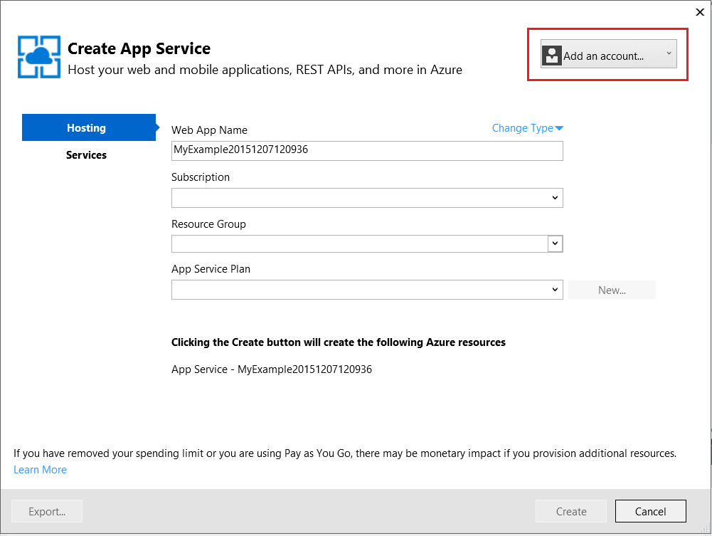

<properties
    pageTitle="Azure 應用程式服務使用 Visual Studio 中部署 ASP.NET 應用程式 |Microsoft Azure"
    description="瞭解如何將新的 web 應用程式 Azure 應用程式服務，使用 Visual Studio 中部署 ASP.NET web 專案。"
    services="app-service\web"
    documentationCenter=".net"
    authors="tdykstra"
    manager="wpickett"
    editor=""/>

<tags
    ms.service="app-service-web"
    ms.workload="web"
    ms.tgt_pltfrm="na"
    ms.devlang="dotnet"
    ms.topic="get-started-article"
    ms.date="07/22/2016"
    ms.author="rachelap"/>

# Azure 應用程式服務中，使用 Visual Studio 中部署 ASP.NET web 應用程式

[AZURE.INCLUDE [tabs](../../includes/app-service-web-get-started-nav-tabs.md)]

## 概觀

本教學課程中會顯示如何使用 Visual Studio 2015 部署 ASP.NET web 應用程式[中 Azure 應用程式服務的 web 應用程式](app-service-web-overview.md)。

教學課程，假設您已有使用 Azure 之前沒有經驗 ASP.NET 開發人員。 完成後，您必須設定簡單的 web 應用程式並在雲端中執行。

您將學習︰

* 如何建立新的應用程式服務 web 應用程式，而您在 Visual Studio 中建立新 web 專案。
* 如何使用 Visual Studio 部署至應用程式服務 web 應用程式的 web 專案。

圖表會說明您在本教學課程中執行的動作。

教學課程結尾[疑難排解](#troubleshooting)區段所提供的處理方式如果項目無法使用，及[後續步驟](#next-steps)節提供的連結，深入瞭解如何使用 Azure 應用程式服務到其他教學課程的想法。

這是快速入門的教學課程，其會顯示如何部署 web 專案是簡單的項目，不會使用資料庫並不會進行驗證或授權。 更多進階的部署主題的連結，請參閱[如何部署 Azure web 應用程式](web-sites-deploy.md)。

除了.net 安裝 Azure SDK 所需的時間，本教學課程中會需要關於 10 15 分鐘，才能完成。

## 必要條件

* 教學課程假設 ASP.NET MVC 與 Visual Studio 的處理。 如果您需要簡介資訊，請參閱[快速入門 ASP.NET MVC 5](http://www.asp.net/mvc/overview/getting-started/introduction/getting-started)。

* 您必須使用 Azure 帳戶。 您可以[開啟免費 Azure 帳戶](/pricing/free-trial/?WT.mc_id=A261C142F)或[啟動 Visual Studio 訂閱者優點](/pricing/member-offers/msdn-benefits-details/?WT.mc_id=A261C142F)。 

    如果您想要快速入門 Azure 應用程式服務註冊 Azure 帳戶之前，請移至[嘗試應用程式服務](http://go.microsoft.com/fwlink/?LinkId=523751)。 您可以在那里應用程式服務中建立短暫入門應用程式，必要時，沒有信用卡和沒有承諾。

## 設定的開發環境

使用[.NET Azure SDK](../dotnet-sdk.md) 2.9 或更新版本的 Visual Studio 2015 寫入教學課程。 

* [下載最新 Azure SDK Visual Studio 2015](http://go.microsoft.com/fwlink/?linkid=518003)。 如果您沒有 SDK 的安裝 Visual Studio 2015。

    >[AZURE.NOTE] 根據幾 SDK 相依性您已經在電腦上，請安裝 SDK 花很長的時間，從幾分鐘在半小時或更多的時間。

如果您有 Visual Studio 2013，並想要使用的您可以[下載最新 Azure SDK Visual Studio 2013](http://go.microsoft.com/fwlink/?LinkID=324322)。 某些畫面看起來可能不同的圖例。

## 設定新的 web 專案

下一步是在 Visual Studio 和 Azure 應用程式服務中的 web 應用程式中建立網頁的專案。 您可以在本教學課程此節中設定新的 web 專案。 

1. 開啟 Visual Studio 2015。

2. 按一下 [**檔案 > 新增 > 專案**。

3. 在 [**新專案**] 對話方塊中，按一下 [ **Visual C# > Web > ASP.NET Web 應用程式**。

3. 請確定已選取為目標架構的**.NET Framework 4.5.2** 。

4.  [Azure 應用程式的深入見解](../application-insights/app-insights-overview.md)監視 web 應用程式的可用性、 效能及使用方式。 預設第一次安裝 Visual Studio 後建立 web 專案會選取**新增到專案的應用程式深入資訊**] 核取方塊。 如果已選取，但您不想要嘗試應用程式深入資訊，請清除核取方塊。

4. 命名**MyExample**，應用程式，然後再按一下**[確定**]。

    ![新增專案] 對話方塊](./media/web-sites-dotnet-get-started/GS13newprojdb.png)

5. 在 [**新的 ASP.NET 專案**] 對話方塊中，選取**MVC**範本，然後再按一下 [**變更驗證**。

    在此教學課程中，您部署 ASP.NET MVC web 專案。 如果您想要瞭解如何部署 ASP.NET Web API 專案，請參閱[後續步驟](#next-steps)。 

    ![新增 ASP.NET 專案] 對話方塊](./media/web-sites-dotnet-get-started/GS13changeauth.png)

6. 在**變更驗證**] 對話方塊中，按一下 [**無驗證**]，然後按一下**[確定]**。

    

    此快速入門教學課程中，您部署簡單的應用程式的使用者登入並不會執行。

5. 在 [**新的 ASP.NET 專案**] 對話方塊的 [ **Microsoft Azure** ] 區段中，請確認已選取 [**主控在雲端**，然後在下拉式清單中，會選取**應用程式服務**。

    ![新增 ASP.NET 專案] 對話方塊](./media/web-sites-dotnet-get-started/GS13newaspnetprojdb.png)

    這些設定會直接 Visual Studio 建立您的 web 專案的 Azure web 應用程式。

6. 按一下**[確定]**

## 設定新的 web 應用程式的 Azure 資源

現在您告訴您要建立的 Azure 資源 Visual Studio。

5. 在 [**建立應用程式服務**] 對話方塊中，按一下 [**新增帳戶**]，然後登入至 Azure 識別碼與您用來管理您的 Azure 訂閱的帳戶的密碼。

    

    如果您已經登入之前在同一部電腦上，您可能無法看到 [**新增帳戶**] 按鈕。 在此情況下，您可以略過此步驟，或者您可能需要重新輸入您的認證。
 
3. 輸入*azurewebsites.net*網域中是唯一的**Web 應用程式的名稱**。 例如，您可以將其命名 MyExample 向右移以使其具唯一性，例如 MyExample810 的數字。 如果您建立的預設網站名稱時，將會是唯一，然後您可以使用的。

    如果其他人已經使用您所輸入的名稱，您會看到紅色驚嘆號，而不是綠色的核取記號，向右，您必須輸入不同的名稱。

    應用程式的 URL 是此名稱加上*。 azurewebsites.net*。 例如，如果名稱`MyExample810`，URL 是`myexample810.azurewebsites.net`。

    您也可以使用自訂網域使用 Azure web 應用程式。 如需詳細資訊，請參閱[設定 Azure 應用程式服務中的自訂網域名稱](web-sites-custom-domain-name.md)。

6. 按一下 [**資源群組**] 方塊旁的 [**新增**] 按鈕，如果您想要的話，然後輸入 「 MyExample 「 」 或 「 另一個名稱。 

    ![建立應用程式服務] 對話方塊](./media/web-sites-dotnet-get-started/rgcreate.png)

    資源群組是 Azure 的資源，例如 web 應用程式、 資料庫及 Vm 的集合。 教學課程，最好通常要建立新的資源群組，因為，方便您將一個步驟中刪除您建立的教學課程 Azure 資源。 如需詳細資訊，請參閱[Azure 資源管理員的概觀](../azure-resource-manager/resource-group-overview.md)。

4. 按一下 [**應用程式服務方案**的下拉式清單旁的 [**新增**] 按鈕。

    ![建立應用程式服務] 對話方塊](./media/web-sites-dotnet-get-started/createasplan.png)

    **設定應用程式服務方案**] 對話方塊隨即出現。

    ![設定應用程式服務] 對話方塊](./media/web-sites-dotnet-get-started/configasp.png)

    在下列步驟，您可以設定新的資源群組的應用程式服務方案。 應用程式服務方案指定 web 應用程式會在執行計算資源。 例如，如果您選擇的免費層，API 應用程式上執行共用 Vm，某些付費層執行專用 Vm 上時。 如需詳細資訊，請參閱[應用程式服務方案概觀](../app-service/azure-web-sites-web-hosting-plans-in-depth-overview.md)。

5. **設定應用程式服務方案**在對話方塊中，輸入 「 MyExamplePlan 」 或另一個名稱，如果您想要。

5. 在 [**位置**] 下拉式清單中，選擇您最接近的位置。

    此設定可以指定您的應用程式會以執行哪些 Azure 資料中心。 在此教學課程中，您可以選取任何區域，而且它顯著差異。 但生產應用程式，您想要盡可能接近用戶端存取其最小化[延遲](http://www.bing.com/search?q=web%20latency%20introduction&qs=n&form=QBRE&pq=web%20latency%20introduction&sc=1-24&sp=-1&sk=&cvid=eefff99dfc864d25a75a83740f1e0090)伺服器。

5. 在 [**大小**] 下拉式清單，按一下 [**免費**]。

    在此教學課程，免費的價格層會提供好足夠的效能。

6. 在 [**設定應用程式服務方案**] 對話方塊中，按一下**[確定]**。

7. 在 [**建立應用程式服務**] 對話方塊中，按一下 [**建立**。

## Visual Studio 建立專案和 web 應用程式

在一段時間，通常不到一分鐘，Visual Studio 會建立 web 專案和 web 應用程式。  

**方案總管]**視窗會顯示新的專案中的檔案和資料夾。

**Azure 應用程式服務活動**視窗會顯示的 web 應用程式所建立。

**雲端 internet Explorer**視窗，可讓您檢視及管理 Azure 資源，包括您剛剛建立的新 web 應用程式。

    
## Azure web 應用程式部署 web 專案

在此區段中，您可以部署 web 專案 web 應用程式。

1. 在**方案總管]**中，以滑鼠右鍵按一下專案，並選擇 [**發佈**。

    ![在 Visual Studio] 功能表中選擇 [發佈](./media/web-sites-dotnet-get-started/choosepublish.png)

    幾秒數，會出現 [**發佈**精靈。 在開啟要*發佈的設定檔*含有設定的 web 專案部署新的 web 應用程式精靈]。

    發佈設定檔包含使用者名稱和密碼，以供部署。  這些認證，產生，且您未輸入它們。 隱藏的特定使用者的檔案中已加密的密碼`Properties\PublishProfiles`資料夾。
 
8. [**發佈**精靈] 的 [**連線**] 索引標籤中，按一下 [**下一筆**。

    ![按一下 [發佈精靈] 的 [連線] 索引標籤上的 [下一步]](./media/web-sites-dotnet-get-started/GS13ValidateConnection.png)

    下一步是 [**設定**] 索引標籤。 這裡，您可以變更部署偵錯組建[遠端](../app-service-web/web-sites-dotnet-troubleshoot-visual-studio.md#remotedebug)偵錯組建設定。 [] 索引標籤也會提供多個[檔案發佈選項](https://msdn.microsoft.com/library/dd465337.aspx#Anchor_2)。

10. 在 [**設定**] 索引標籤上按一下 [**下一筆**。

    ![發佈網站精靈] 的 [設定] 索引標籤](./media/web-sites-dotnet-get-started/GS13SettingsTab.png)

    下一步是 [**預覽**] 索引標籤。 這裡您可以查看檔案會移至從您的專案複製到 API 應用程式。 當您要部署您已經部署較舊版本的 API 應用程式的專案時，會複製已變更的檔案。 如果您想要查看的複製內容清單中，您可以按一下 [**開始預覽**] 按鈕。

11. 在 [**預覽**] 索引標籤上 [**發佈**]。

    ![發佈網站精靈] 的 [預覽] 索引標籤](./media/web-sites-dotnet-get-started/GS13previewoutput.png)

    當您按一下 [**發佈**] 時，Visual Studio 開始將檔案複製到 Azure 伺服器的程序。 這可能需要一或兩分鐘。

    [**輸出**和**Azure 應用程式服務活動**視窗顯示哪些部署動作是，與報表的部署順利完成。

    

    成功部署時，預設的瀏覽器會自動開啟的部署的 web 應用程式的 url，您建立的應用程式現在執行雲端中。 在瀏覽器網址列中的 URL 會顯示的 web 應用程式會載入從網際網路。

    

    > [AZURE.TIP]您可以啟用**網頁一個按一下 [發佈**] 工具列快速部署。 按一下 [**檢視 > 工具列**，然後選取 [ **Web 一個按一下發佈**。 若要選取設定檔、 按一下按鈕，即可發佈，或按一下按鈕以開啟 [**發佈**精靈，您可以使用工具列。
    > ![Web 項目按一下 [發佈] 工具列](./media/web-sites-dotnet-get-started/weboneclickpublish.png)

## 疑難排解

如果您會遇到問題，當您進行本教學課程，請確定您正在使用最新版 Azure SDK 的.net。 若要執行這項作業的最簡單方法是[下載 Azure SDK Visual Studio 2015](http://go.microsoft.com/fwlink/?linkid=518003)。 如果您有安裝最新版本，網頁的平台安裝程式可讓您沒有安裝，需要。

如果您的公司網路，嘗試透過防火牆部署至 Azure 應用程式服務，請確認連接埠 443 和 8172 開啟 Web 部署。 如果您無法開啟這些連接埠，請參閱下列下一個步驟的其他部署選項。

Azure 應用程式服務中執行 ASP.NET web 應用程式之後，您可能會想要深入瞭解簡化疑難排解的 Visual Studio 功能。 如記錄的相關資訊，遠端偵錯，及詳細資訊，請參閱[疑難排解 Azure web 應用程式，在 Visual Studio 中](web-sites-dotnet-troubleshoot-visual-studio.md)。

## 後續步驟

在本教學課程中，您已經看到如何建立簡單的 web 應用程式，並將其部署至 Azure web 應用程式。 以下是一些相關的主題和資源，進一步瞭解 Azure 應用程式服務︰

* 監控和管理您的 web 應用程式，在[Azure 入口網站](https://portal.azure.com/)。 

    如需詳細資訊，請參閱[Azure 入口網站的概觀](/services/management-portal/)與[Azure 應用程式服務中的 [設定 web 應用程式](web-sites-configure.md)。

* 新的 web 應用程式，使用 Visual Studio 中部署現有 web 專案

    以滑鼠右鍵按一下 [專案**總管**] 中的，然後按一下 [**發佈]**。 選擇發佈目標， **Microsoft Azure 應用程式服務**，然後按一下 [**新增]**。 對話方塊然後是您已在本教學課程中看見的內容相同。

* 部署 web 專案從來源控制項

    [自動化部署](http://www.asp.net/aspnet/overview/developing-apps-with-windows-azure/building-real-world-cloud-apps-with-windows-azure/continuous-integration-and-continuous-delivery)從[來源控制系統](http://www.asp.net/aspnet/overview/developing-apps-with-windows-azure/building-real-world-cloud-apps-with-windows-azure/source-control)的相關資訊，請參閱[開始使用 Azure 應用程式服務中的 web 應用程式](app-service-web-get-started.md)，以及[如何部署 Azure web 應用程式](web-sites-deploy.md)。

* ASP.NET Web API 部署至 API 應用程式中 Azure 應用程式服務

    您已經看到如何建立 Azure 的主要目的是裝載網站的應用程式服務的執行個體。 裝載網站的 Api，例如 CORS 支援的功能和用戶端程式碼產生的 API 中繼資料支援，也會提供應用程式服務。 您可以使用 API 功能在 web 應用程式，但如果您主要要主控 API 的應用程式服務的執行個體， **API 應用程式**會是較佳的選擇。 如需詳細資訊，請參閱[開始使用 API 應用程式和 Azure 應用程式服務中的 ASP.NET](../app-service-api/app-service-api-dotnet-get-started.md)。 

* 新增自訂網域名稱] 和 [SSL

    有關如何使用 SSL 和您自己的網域 (例如，而不是 contoso.azurewebsites.net www.contoso.com)，請參閱下列資源︰

    * [Azure 應用程式服務中設定自訂網域名稱](web-sites-custom-domain-name.md)
    * [Azure 網站啟用 HTTPS](web-sites-configure-ssl-certificate.md)

* 刪除包含您的 web 應用程式，以及任何相關的 Azure 資源，當您完成的資源群組。

    如需如何使用 Azure 入口網站中的 [資源群組的資訊，請參閱[使用資源管理員範本和 Azure 入口網站的部署資源](../resource-group-template-deploy-portal.md)。   

*   更多範例服務應用程式中建立 ASP.NET Web 應用程式的詳細資訊，請參閱[建立並部署 ASP.NET web 應用程式中 Azure 應用程式服務](https://github.com/Microsoft/HealthClinic.biz/wiki/Create-and-deploy-an-ASP.NET-web-app-in-Azure-App-Service)和[建立並部署行動應用程式中 Azure 應用程式服務](https://github.com/Microsoft/HealthClinic.biz/wiki/Create-and-deploy-a-mobile-app-in-Azure-App-Service)從[HealthClinic.biz](https://github.com/Microsoft/HealthClinic.biz) 2015 連線[示範](https://blogs.msdn.microsoft.com/visualstudio/2015/12/08/connectdemos-2015-healthclinic-biz/)。 從 HealthClinic.biz 示範更多的快速入門，請參閱[Azure 開發人員工具快速入門](https://github.com/Microsoft/HealthClinic.biz/wiki/Azure-Developer-Tools-Quickstarts)。
